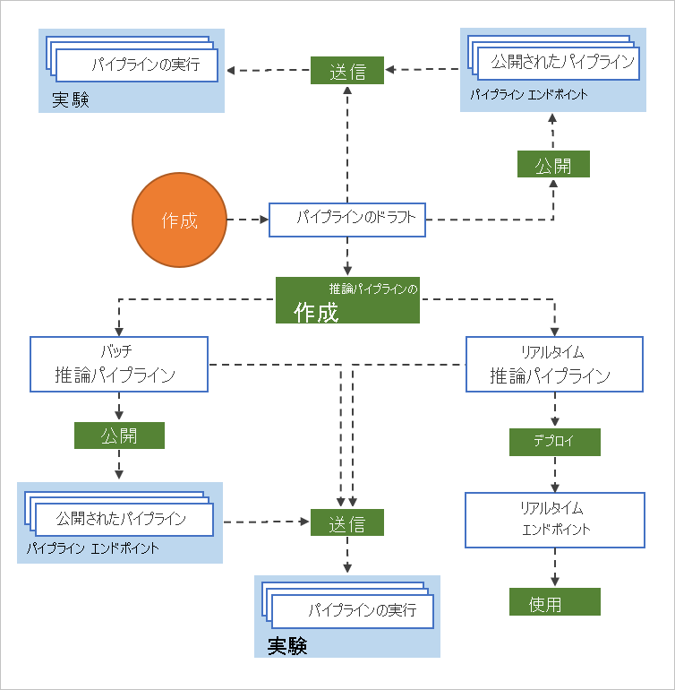
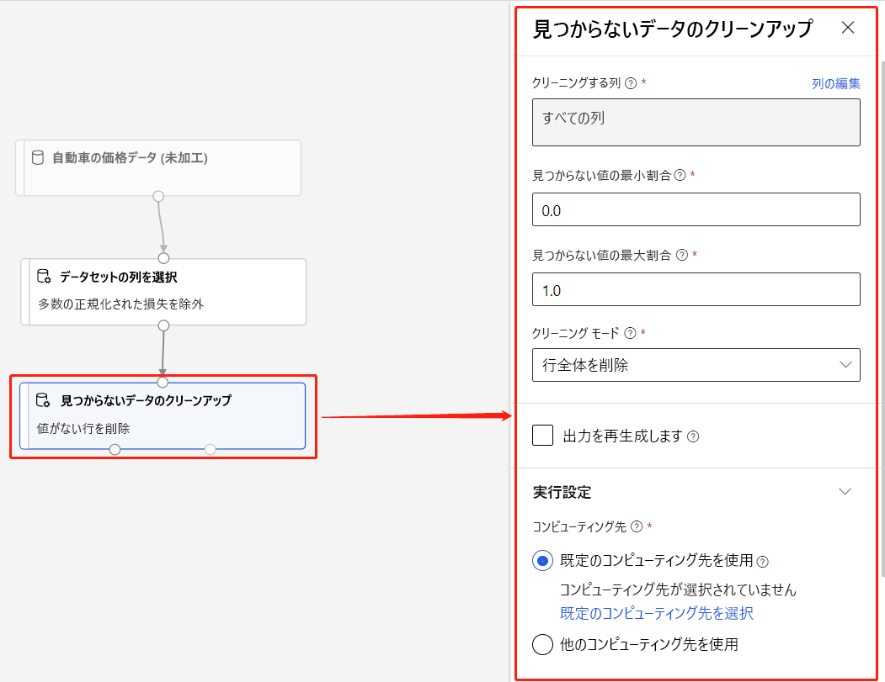

# Azure Machine Learning デザイナーとは 
[!INCLUDE [applies-to-skus](../../includes/aml-applies-to-enterprise-sku.md)]

Azure Machine Learning デザイナーを使用すると、対話型キャンバスで[データセット](#datasets)と[モジュール](#module)を視覚的に接続することにより、機械学習モデルを作成できます。 デザイナーの使用を開始する方法については、「[チュートリアル: デザイナーを使用して自動車の価格を予測する](tutorial-designer-automobile-price-train-score.md)

デザイナーでは、Azure Machine Learning の[ワークスペース](concept-workspace.md)を使用して、次のような共有リソースが整理されます。

+ [パイプライン](#pipeline)
+ [データセット](#datasets)
+ [コンピューティング リソース](#compute)
+ [登録済みモデル](concept-azure-machine-learning-architecture.md#models)
+ [公開済みパイプライン](#publish)
+ [リアルタイム エンドポイント](#deploy)

## モデルのトレーニングとデプロイ

デザイナーには、機械学習モデルを構築、テスト、デプロイするためのビジュアルキャンバスが用意されています。 デザイナーを使用すると、次のことができます。

+ [データセット](#datasets)と[モジュール](#module)をキャンバスにドラッグ アンド ドロップします。
+ 複数のモジュールを接続して[パイプラインのドラフト](#pipeline-draft)を作成します。
+ Azure Machine Learning ワークスペースのコンピューティング リソースを使用して、[パイプラインの実行](#pipeline-run)を送信します。
+ **トレーニング パイプライン**を**推論パイプライン**に変換します。
+ パイプラインを REST **パイプライン エンドポイント**に[発行](#publish)し、異なるパラメーターとデータセットを使用して新しいパイプラインの実行を送信します。
    + **トレーニング パイプライン**を発行し、1 つのパイプラインを再利用して、パラメーターとデータセットを変更しながら、複数のモデルをトレーニングします。
    + **バッチ推論パイプライン**を発行し、以前にトレーニングしたモデルを使用して、新しいデータで予測を行います。
+ **リアルタイム推論パイプライン**をリアルタイム エンドポイントに[デプロイ](#deploy)して、新しいデータの予測をリアルタイムで行います。

## パイプライン

[パイプライン](concept-azure-machine-learning-architecture.md#ml-pipelines)は、ユーザーによって相互に接続されたデータセットと分析モジュールで構成されます。 パイプラインには多くの用途があります。1 つのモデルをトレーニングするパイプラインや、複数のモデルをトレーニングするパイプラインを作成できます。 リアルタイムまたはバッチで予測を行うパイプラインや、データをクリーンアップするだけのパイプラインを作成できます。 パイプラインを使用して、作業を再利用し、プロジェクトを整理することができます。

### パイプラインのドラフト

デザイナーでパイプラインを編集している間、進捗は**パイプラインのドラフト**として保存されます。 いつでも、モジュールの追加または削除、コンピューティング先の構成、パラメーターの作成などを行って、パイプラインのドラフトを編集することができます。

有効なパイプラインには、次のような特徴があります。

* データセットは、モジュールにのみ接続できる。
* モジュールは、データセットまたは別のモジュールにのみ接続できる。
* モジュールのすべての入力ポートに、データ フローへの何らかの接続がある
* 各モジュールの必須パラメーターがすべて設定されている

パイプラインのドラフトを実行する準備ができたら、パイプラインの実行を送信します。

### パイプラインの実行

パイプラインを実行するたびに、パイプラインの構成とその結果が、**パイプラインの実行**としてワークスペースに格納されます。 任意のパイプラインの実行に戻り、トラブルシューティングや監査のために検査することができます。 パイプラインの実行を**複製**し、編集用に新しいパイプラインのドラフトを作成します。

実行の履歴を整理するために、パイプラインの実行は[実験](concept-azure-machine-learning-architecture.md#experiments)にグループ化されます。 すべてのパイプラインの実行に対して、実験を設定できます。 

## データセット

機械学習データセットによって、データへのアクセスと操作がより容易になります。 デザイナーには、実験に利用できる多数のサンプル データセットが含まれています。 必要に応じて、データセットをさらに[登録](how-to-create-register-datasets.md)することができます。

## Module

モジュールとは、データに対して実行できるアルゴリズムのことです。 デザイナーには、データのイングレス機能や、プロセスのトレーニング、スコアリング、検証などのさまざまなモジュールが用意されています。

モジュールに一連のパラメーターが含まれている場合、これらを使用してモジュールの内部アルゴリズムを構成することができます。 キャンバスでモジュールを選択すると、モジュールのパラメーターは、キャンバス右側の [プロパティ] ウィンドウに表示されます。 このウィンドウでパラメーターを変更することにより、モデルを微調整できます。 デザイナーでは、個々のモジュールに対してコンピューティング リソースを設定できます。 

利用できる機械学習アルゴリズムのライブラリ内の移動に関するヘルプについては、「[アルゴリズムとモジュールのリファレンスの概要](algorithm-module-reference/module-reference.md)」を参照してください。

##  コンピューティング リソース

自分のワークスペースからコンピューティング リソースを使用して、パイプラインを実行し、デプロイ済みのモデルをリアルタイム エンドポイントまたはパイプライン エンドポイント (バッチ推論用) としてホストします。 サポートされているコンピューティング ターゲットを次に示します。

| コンピューティング ターゲット | トレーニング | デプロイ |
| ---- |:----:|:----:|
| Azure Machine Learning コンピューティング | ✓ | |
| Azure Kubernetes Service | | ✓ |

コンピューティング先は、自分の [Azure Machine Learning ワークスペース](concept-workspace.md)に接続されています。 [Azure Machine Learning Studio (クラシック)](https://ml.azure.com) で自分のワークスペースのコンピューティング先を管理します。

## 配置

リアルタイムの推論を実行するには、**リアルタイム エンドポイント**としてパイプラインをデプロイする必要があります。 リアルタイム エンドポイントでは、外部アプリケーションと自分のスコアリング モデルの間のインターフェイスが作成されます。 リアルタイム エンドポイントを呼び出すと、予測結果がリアルタイムでアプリケーションに返されます。 リアルタイム エンドポイントを呼び出すには、エンドポイントのデプロイ時に作成された API キーを渡します。 エンドポイントは、Web プログラミング プロジェクトで広く使われているアーキテクチャの REST に基づいています。

リアルタイム エンドポイントは、Azure Kubernetes Service クラスターにデプロイする必要があります。

モデルのデプロイ方法の詳細については、「[チュートリアル: デザイナーで機械学習モデルをデプロイする](tutorial-designer-automobile-price-deploy.md)」を参照してください。

## 発行

**パイプライン エンドポイント**にパイプラインを発行することもできます。 リアルタイム エンドポイントと同様に、パイプライン エンドポイントでは、REST 呼び出しを使用して、外部アプリケーションから新しいパイプラインの実行を送信することができます。 ただし、パイプライン エンドポイントを使用してリアルタイムでデータを送受信することはできません。

発行されたパイプラインは柔軟性があり、モデルのトレーニングや再トレーニング、[バッチ推論の実行](how-to-run-batch-predictions-designer.md)、新しいデータの処理などに使用できます。 複数のパイプラインを 1 つのパイプライン エンドポイントに発行し、実行するパイプラインのバージョンを指定できます。

発行されたパイプラインは、各モジュールのパイプライン ドラフトで定義されているコンピューティング リソース上で実行されます。

デザイナーでは、SDK と同じ [PublishedPipeline](https://docs.microsoft.com/python/api/azureml-pipeline-core/azureml.pipeline.core.graph.publishedpipeline?view=azure-ml-py) オブジェクトが作成されます。

## ビジュアル インターフェイスからデザイナーへの移行

ビジュアル インターフェイス (プレビュー) は更新されて、Azure Machine Learning デザイナーになりました。 デザイナーは、Azure Machine Learning の他の機能と完全に統合された、パイプラインベースのバックエンドを使用するように再設計されています。 

これらの更新の結果として、ビジュアル インターフェイスのいくつかの概念と用語が変更されたり、名前が変更されたりしています。 最も重要な概念の変更については、次の表を参照してください。 

| デザイナーの概念 | ビジュアル インターフェイスでの従来の概念 |
| ---- |:----:|
| パイプラインのドラフト | 実験 |
| リアルタイム エンドポイント | Web サービス |

### デザイナーへの移行

デザイナーでは、既存のビジュアル インターフェイス実験と Web サービスをパイプラインとリアルタイム エンドポイントに変換することができます。 ビジュアル インターフェイスのアセットを移行するには、次の手順を使用します。

[!INCLUDE [migrate from the visual interface](../../includes/aml-vi-designer-migration.md)]

## 次のステップ

* 予測分析と機械学習の基本について学習する: [チュートリアル: デザイナーを使用して自動車の価格を予測する](tutorial-designer-automobile-price-train-score.md)
* いずれかのサンプルを使用して、ニーズに合わせて変更します。

- [サンプル 1 - 回帰: 自動車の価格を予測する](how-to-designer-sample-regression-automobile-price-basic.md)
- [サンプル 2 - 回帰: 自動車の価格予測のためのアルゴリズムを比較する](how-to-designer-sample-regression-automobile-price-compare-algorithms.md)
- [サンプル 3 -特徴選択による分類:収入予測](how-to-designer-sample-classification-predict-income.md)
- [サンプル 4 - 分類: 信用リスクを予測する (費用重視)](how-to-designer-sample-classification-credit-risk-cost-sensitive.md)
- [サンプル 5 - 分類:顧客離れを予測する](how-to-designer-sample-classification-churn.md)
- [サンプル 6 - 分類:フライトの遅延を予測する](how-to-designer-sample-classification-flight-delay.md)
- [サンプル 7 - テキスト分類:Wikipedia SP 500 データセット](how-to-designer-sample-text-classification.md)

