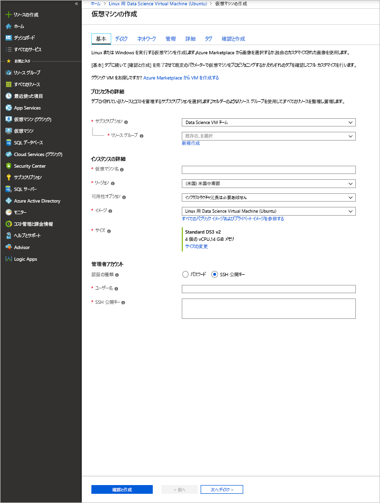

# <a name="provision-the-data-science-virtual-machine-for-linux-ubuntu"></a>Linux (Ubuntu) データ サイエンス仮想マシンのプロビジョニング

Linux データ サイエンス仮想マシンは Ubuntu ベースの仮想マシン イメージであり、Azure 上でディープ ラーニングなどの機械学習を簡単に開始できます。 ディープ ラーニング ツールには以下が含まれます。

  * [Caffe](http://caffe.berkeleyvision.org/): 速度、表現、モジュール性を念頭に置いて構築されたディープ ラーニング フレームワーク
  * [Caffe2](https://github.com/caffe2/caffe2): Caffe のクロス プラットフォーム バージョン
  * [Microsoft Cognitive Toolkit](https://github.com/Microsoft/CNTK): Microsoft Research のディープ ラーニング ソフトウェア ツールキット
  * [H2O](https://www.h2o.ai/): オープン ソースのビッグ データ プラットフォームとグラフィカル ユーザー インターフェイス
  * [Keras](https://keras.io/): Python で書かれた Theano と TensorFlow 用の高度なニュートラル ネットワーク API
  * [MXNet](http://mxnet.io/): 多くの言語バインディングを含む、柔軟で効率的なディープ ラーニング ライブラリ
  * [NVIDIA DIGITS](https://developer.nvidia.com/digits): 一般的なディープ ラーニング タスクを簡略化するグラフィカル システム
  * [PyTorch](http://pytorch.org/): 動的ネットワークをサポートする高度な Python ライブラリ
  * [TensorFlow](https://www.tensorflow.org/): Google が提供する、マシン インテリジェンス用のオープンソース ライブラリ
  * [Theano](http://deeplearning.net/software/theano/): 多次元配列を含む数式の定義、最適化、効率的な評価ができる Python 用ライブラリ
  * [Torch](http://torch.ch/): 機械学習アルゴリズムを幅広くサポートする科学コンピューティング フレームワーク
  * CUDA、cuDNN、NVIDIA ドライバー
  * 多くのサンプル Jupyter Notebook

すべてのライブラリは GPU バージョンですが、CPU 上でも実行できます。

Linux データ サイエンス仮想マシンには、データ サイエンスと開発作業用の、次のような人気ツールも含まれています。

* Microsoft R Server Developer エディションと Microsoft R Open
* 一般的なデータ分析ライブラリを含む Anaconda Python ディストリビューション (バージョン 2.7 および 3.5)
* JuliaPro - 一般的な科学的およびデータ分析ライブラリを含む Julia 言語の管理されたディストリビューション
* スタンドアロン Spark インスタンスと単一ノードの Hadoop (HDFS、Yarn)
* JupyterHub - R、Python、PySpark、Julia カーネルをサポートするマルチユーザー Jupyter Notebook サーバー
* Azure ストレージ エクスプローラー
* Azure リソースを管理するための Azure コマンド ライン インターフェイス (CLI)
* 機械学習ツール
  * [Vowpal Wabbit](https://github.com/JohnLangford/vowpal_wabbit): オンライン、ハッシュ、allreduce、リダクション、learning2search、アクティブ、対話型学習などの手法をサポートする高速機械学習システム
  * [XGBoost](https://xgboost.readthedocs.org/en/latest/): 迅速かつ正確なブースト ツリー実装を提供するツール
  * [Rattle](https://togaware.com/rattle/): R でデータ分析と機械学習を簡単に開始できるグラフィカル ツール
  * [LightGBM](https://github.com/Microsoft/LightGBM): 高速、分散、高パフォーマンスの勾配ブースティング フレームワーク
* Java、Python、node.js、Ruby、PHP の Azure SDK
* Azure Machine Learning などの Azure サービスで使用する R と Python のライブラリ
* 開発ツールとエディター (RStudio、PyCharm、IntelliJ、Emacs、vim)


データ サイエンスでは、次の一連のタスクを反復処理します。

1. データの検索、読み込み、前処理
1. モデルの作成とテスト
1. インテリジェント アプリケーションで使用するためのモデルのデプロイ

データ サイエンティストは、こうしたタスクを行うためにさまざまなツールを使用します。 適切なバージョンのソフトウェアを見つけ、ダウンロードし、コンパイルして、インストールするには、非常に時間がかかる場合があります。

Linux データ サイエンス仮想マシンはそうした問題の大部分を解決します。 この仮想マシンを使うと、分析プロジェクトをすぐに開始し、 R、Python、SQL、Java、C++ など、さまざまな言語でタスクを処理できます。 VM に含まれている Azure SDK を使用すると、Microsoft クラウド プラットフォームのさまざまなサービスを Linux で使用してアプリケーションを構築できます。 また、プレインストールされた Ruby、Perl、PHP、node.js などの他の言語も利用できます。

このデータ サイエンス VM イメージにソフトウェア課金はありません。 支払うのは、プロビジョニングした仮想マシンのサイズを基に評価された Azure のハードウェアの利用料金のみです。 コンピューティング料金の詳細については、[Azure Marketplace の VM リスト](https://azure.microsoft.com/marketplace/partners/microsoft-ads/linux-data-science-vm/)に関するページをご覧ください。

## <a name="other-versions-of-the-data-science-virtual-machine"></a>データ サイエンス仮想マシンのその他のバージョン
Ubuntu イメージと同じツールが多数含まれている、[CentOS](linux-dsvm-intro.md) イメージも利用できます。 また、[Windows](provision-vm.md) イメージも利用できます。

## <a name="prerequisites"></a>前提条件
Linux データ サイエンス仮想マシンを作成するには、Azure サブスクリプションが必要です。 これを取得するには、[Azure 無料試用版の取得](https://azure.microsoft.com/free/)に関するページをご覧ください。

## <a name="create-your-data-science-virtual-machine-for-linux"></a>Linux データ サイエンス仮想マシンの作成
Linux データ サイエンス仮想マシンのインスタンスを作成する手順は以下の通りです。

1. [Azure ポータル](https://portal.azure.com/#create/microsoft-ads.linux-data-science-vm-ubuntulinuxdsvmubuntu)に一覧表示されている仮想マシンに移動します。
1. 下部にある **[作成]** をクリックして、ウィザードを起動します。
1. 以下のセクションでは、Microsoft データ サイエンス仮想マシンの作成に使用されるウィザードの各ステップ (上の図の右側に列挙) での入力について説明します。 以下は、これらの各ステップを構成するために必要な入力項目です。
   
   a. **[基本]**:
   
   * **名前**: 作成するデータ サイエンス サーバーの名前です。
   * **ユーザー名**: 最初のアカウントのサインイン ID。
   * **パスワード**: 最初のアカウントのパスワード (パスワードの代わりに SSH 公開キーを使用できます)。
   * **サブスクリプション**: 複数のサブスクリプションがある場合は、マシンが作成されて課金されるサブスクリプションを選択します。 そのサブスクリプションに対するリソース作成権限が必要です。
   * **リソース グループ**: 新しいリソース グループを作成するか、既存のグループを使用します。
   * **場所**: 最適なデータ センターを選択します。 通常は、データの大半が存在するデータ センターか、ネットワーク アクセスを最速にするために物理的に最も近いデータ センターを選びます。
   
   b. **[サイズ]**:
   
   * 機能の要件とコストの制約を満たしている、いずれかのサーバーの種類を選択します。 **[すべて表示]** を選択すると、VM サイズのさらに多くの選択肢が表示されます。 GPU トレーニング用に NC クラスまたは ND クラスの VM を選択します。 「[リージョン別の利用可能な製品](https://azure.microsoft.com/global-infrastructure/services/)」ページには、GPU のあるリージョンが一覧表示されます。
   
   c. **設定**:
   
   * **ディスクの種類**: ソリッドステート ドライブ (SSD) を使用する場合は、**[Premium]** を選択します。 それ以外の場合は、 **[Standard]** を選択します。 GPU VM では、Standard ディスクが必要です。
   * **ストレージ アカウント**: サブスクリプションに新しい Azure ストレージ アカウントを作成することも、ウィザードの **[基本]** ステップで選択した場所にある既存のストレージ アカウントを使用することもできます。
   * **他のパラメーター**: 通常は既定値を使用します。 既定値以外の値を検討する場合は、情報リンクにポインターを合わせて、該当するフィールドのヘルプを表示します。
   
   d. **概要**:
   
   * 入力したすべての情報が正しいことを確認します。
   
   e. **[購入]**:
   
   * プロビジョニングを開始するには、 **[購入]** をクリックします。 取引条件へのリンクが用意されています。 **[サイズ]** ステップで選択したサーバー サイズのコンピューティングを超える追加の課金が VM によって発生することはありません。

プロビジョニングには、5 ～ 10 分くらいかかります。 プロビジョニングの状態は、Azure ポータルに表示されます。

## <a name="how-to-access-the-data-science-virtual-machine-for-linux"></a>Linux データ サイエンス仮想マシンにアクセスする方法

3 つの方法を使って、Ubuntu DSVM にアクセスすることができます。
1. ターミナル セッションの場合の SSH
1. グラフィカル セッションの場合の X2Go
1. Jupyter Notebook の場合の JupyterHub と JupyterLab

### <a name="ssh"></a>SSH

VM を作成したら、SSH を使用してサインインできます。 テキスト シェル インターフェイスで、手順 3. の **[基本]** セクションで作成したアカウントの資格情報を使用します。 Windows では、[Putty](http://www.putty.org) などの SSH クライアント ツールをダウンロードできます。 グラフィカル デスクトップ (X Windows System) を使用する場合は、Putty で X11 転送を使用するか、X2Go クライアントをインストールすることができます。

> [!NOTE]
> テストでは、パフォーマンスは、X11 転送よりも、X2Go クライアントの方が優れていました。 グラフィカル デスクトップ インターフェイスでは、X2Go クライアントを使用することをお勧めします。
> 
> 

### <a name="x2go"></a>X2Go
Linux VM は、既に X2Go サーバーでプロビジョニングされており、クライアント接続を受け入れる準備ができています。 Linux VM のグラフィカル デスクトップに接続するには、クライアントで次の手順を実行します。

1. [X2Go](http://wiki.x2go.org/doku.php/doc:installation:x2goclient)のページから、お使いのクライアント プラットフォーム向けの X2Go クライアントをダウンロードしてインストールします。    
1. X2Go クライアントを実行し、 **[New Session (新しいセッション)]** を選択します。 複数のタブがある構成ウィンドウが開きます。 次の構成パラメーターを入力します。
   * **[Session] \(セッション) タブ**:
     * **[Host (ホスト)]**: Linux データ サイエンス VM のホスト名または IP アドレス。
     * **[Login (ログイン)]**: Linux VM のユーザー名。
     * **[SSH Port] \(SSH ポート)**: 既定値の 22 のままにします。
     * **[Session Type] \(セッションの種類)**: 値を XFCE に変更します。 現在、Linux VM では XFCE デスクトップのみをサポートしています。
   * **[Media] \(メディア) タブ**: 音声のサポートとクライアントの印刷を使用しない場合は、それらをオフにできます。
   * **[Shared folders] \(共有フォルダー)**: クライアント コンピューターのディレクトリを Linux VM にマウントする場合は、このタブで VM と共有するクライアント コンピューターのディレクトリを追加します。

SSH クライアントを使用するか、X2Go クライアントから XFCE グラフィカル デスクトップを使用して VM にサインインしたら、VM にインストールされ、構成されているツールをすぐに使い始めることができます。 XFCE では、アプリケーション メニューのショートカットとさまざまなツールのデスクトップ アイコンが表示されます。

### <a name="jupyterhub-and-jupyterlab"></a>JupyterHub と JupyterLab

Ubuntu DSVM は、マルチユーザーの Jupyter サーバーである [JupyterHub](https://github.com/jupyterhub/jupyterhub) を実行します。 接続するには、ノート PC またはデスクトップで https://your-vm-ip:8000 を参照し、VM を作成するときに使ったユーザー名とパスワードを入力して、ログインします。 多くのサンプル ノートブックを参照して試してみることができます。

次世代の Jupyter Notebook と JupyterHub である JupyterLab も利用できます。 JupyterLab にアクセスするには、JupyterHub にログインし、URL https://your-vm-ip:8000/user/your-username/lab を参照します。 次の行を /etc/jupyterhub/jupyterhub_config.py に追加することにより、JupyterLab を既定のノートブック サーバーとして設定できます。

    c.Spawner.default_url = '/lab'

## <a name="tools-installed-on-the-data-science-virtual-machine-for-linux"></a>Linux データ サイエンス仮想マシンにインストールされているツール
### <a name="deep-learning-libraries"></a>ディープ ラーニング ライブラリ

#### <a name="cntk"></a>CNTK
Microsoft Cognitive Toolkit は、オープン ソースのディープ ラーニング ツールキットです。 Python バインディングは、ルートと py35 の Conda 環境で使用できます。 コマンド ライン ツール (cntk) も既に PATH 内にあります。

サンプルの Python Notebook は、JupyterHub で利用できます。 基本的なサンプルをコマンド ラインで実行するには、シェルで次のコマンドを実行します。

    cd /home/[USERNAME]/notebooks/CNTK/HelloWorld-LogisticRegression
    cntk configFile=lr_bs.cntk makeMode=false command=Train

詳細については、[GitHub](https://github.com/Microsoft/CNTK) の CNTK セクションと [CNTK の Wiki](https://github.com/Microsoft/CNTK/wiki) をご覧ください。

#### <a name="caffe"></a>Caffe
Caffe は、Berkeley Vision and Learning Center が開発したディープ ラーニング フレームワークです。 /opt/caffe で入手できます。 サンプルは、/opt/caffe/examples にあります。

#### <a name="caffe2"></a>Caffe2
Caffe2 は、Caffe に基づいて構築された Facebook のディープ ラーニング フレームワークです。 Conda ルート環境の Python 2.7 で使用できます。 Python 2.7 をアクティブにするには、シェルから次のコマンドを実行します。

    source /anaconda/bin/activate root

JupyterHub でいくつかの Notebook サンプルを入手できます。

#### <a name="h2o"></a>H2O
H2O は、高速でインメモリの分散型機械学習と予測分析のプラットフォームです。 Python パッケージは、ルートと py35 両方の Anaconda 環境にインストールされます。 また、R パッケージもインストールされます。 コマンド ラインから H2O を起動するには、`java -jar /dsvm/tools/h2o/current/h2o.jar` を実行します。多様な[コマンド ライン オプション](http://docs.h2o.ai/h2o/latest-stable/h2o-docs/starting-h2o.html#from-the-command-line)があり、必要に応じて構成できます。 Flow Web UI にアクセスするには、まず http://localhost:54321 にアクセスします。 サンプルの Notebook は、JupyterHub でも利用できます。

#### <a name="keras"></a>Keras
Keras は、TensorFlow または Theano で実行可能であり、Python で記述された高度なニュートラル ネットワーク API です。 ルートと py35 の Python 環境で使用できます。 

#### <a name="mxnet"></a>MXNet
MXNet は、効率性と柔軟性の両方のために設計されたディープ ラーニング フレームワークです。 また MXNet には、DSVM に含まれている R バインディングと Python バインディングもあります。 サンプル Notebook は JupyterHub に含まれており、サンプル コードは /dsvm/samples/mxnet で入手できます。

#### <a name="nvidia-digits"></a>NVIDIA DIGITS
DIGITS として知られる NVIDIA ディープ ラーニング GPU トレーニング システムは、高度な視覚化により、一般的なディープ ラーニング タスク (データの管理、GPU システム上でのニュートラル ネットワークの設計とトレーニング、リアル タイムでのパフォーマンスの監視など) を簡略化するシステムです。 

DIGITS は、"digits (ディジッツ)" というサービスとして利用できます。 サービスを開始するには、http://localhost:5000 を参照します。

また DIGITS は、Conda root 環境に Python モジュールとしてインストールされます。

#### <a name="tensorflow"></a>TensorFlow
TensorFlow は Google のディープ ラーニング ライブラリです。 データ フロー グラフを使用した数値計算用のオープン ソース ソフトウェア ライブラリです。 TensorFlow は py35 の Python 環境で使用でき、いくつかのサンプル Notebook が JupyterHub に含まれています。

#### <a name="theano"></a>Theano
Theano は、Python のための効率的な数値計算用ライブラリです。 ルートと py35 の Python 環境で使用できます。 

#### <a name="torch"></a>Torch
Torch は、機械学習アルゴリズムを幅広くサポートする科学コンピューティング フレームワークです。 /dsvm/tools/torch で入手でき、対話型セッションと LuaRocks パッケージ マネージャーはコマンド ラインで利用できます。 サンプルは、/dsvm/samples/torch で入手できます。

また PyTorch も ルート Anaconda 環境で使用できます。 サンプルは、/dsvm/samples/pytorch にあります。

### <a name="microsoft-r-server"></a>Microsoft R Server
R は、データ分析と機械学習に最もよく使われる言語の 1 つです。 分析に R を使用する場合は、VM に Microsoft R Server (MRS)、Microsoft R Open (MRO)、および Math Kernel Library (MKL) が用意されています。 MKL は、分析アルゴリズムの一般的な算術演算を最適化します。 MRO は CRAN-R と完全に互換性があり、CRAN で公開されているすべての R ライブラリを MRO にインストールできます。 MRS は R モデルのスケーリングと運用化を Web サービスにもたらします。 R プログラムは、RStudio、vi、Emacs などの既定のエディターのいずれかで編集できます。 Emacs エディターを使用する場合、これはプレインストールされています。 Emacs パッケージ ESS (Emacs Speaks Statistics) は、Emacs エディター内での R ファイルに対する作業を簡略化します。

R コンソールを起動するには、シェルで「**R**」と入力します。 入力すると、対話型環境に移動します。 R プログラムを開発するには、通常、Emacs や vi などのエディターを使用し、R 内でスクリプトを実行します。RStudio をインストールすると、完全なグラフィカル IDE 環境で R プログラムを開発できます。

必要な場合に備えて、 [上位 20 の R パッケージ](http://www.kdnuggets.com/2015/06/top-20-r-packages.html) をインストールするための R スクリプトも用意されています。 このスクリプトを実行するには、前述のとおり、シェルで「 **R** 」と入力して R の対話型インターフェイスに入る必要があります。  

### <a name="python"></a>Python
Anaconda Python は、Python 2.7 および 3.5 の環境でインストールされます。 2.7 環境は _root_ と呼ばれ、3.5 環境は _py35_ と呼ばれます。 このディストリビューションには、基本 Python と、約 300 の最も一般的な数学、エンジニアリング、およびデータ分析パッケージが含まれています。 

Py35 が既定の環境です。 root (2.7) 環境をアクティブ化するには:

    source activate root

py35 環境を再度アクティブ化するには:

    source activate py35

シェルで「 **python** 」と入力するだけで、Python の対話型セッションを呼び出すことができます。 

```conda``` または ````pip```` を使って追加の Python ライブラリをインストールします。 PIP の場合、既定値が必要ないときは、最初に正しい環境をアクティブ化します。

    source activate root
    pip install <package>

または PIP への完全なパスを指定します。

    /anaconda/bin/pip install <package>
    
Conda の場合は、常に環境名 (_py35_ または _root_) を指定する必要があります。

    conda install <package> -n py35

グラフィカル インターフェイスを使用している場合や X11 転送を設定している場合は、「**pycharm**」と入力して PyCharm Python IDE を起動します。 既定のテキスト エディターを使用できます。 また、Anaconda Python ディストリビューションにバンドルされている Spyder (Python IDE) を使用することもできます。 Spyder を使用するには、グラフィカル デスクトップまたは X11 転送が必要です。 Spyder へのショートカットは、グラフィカル デスクトップに用意されています。

### <a name="jupyter-notebook"></a>Jupyter Notebook
Anaconda ディストリビューションは、コードと分析を共有するための環境である Jupyter Notebook にも付属しています。 Jupyter Notebook には JupyterHub からアクセスします。 ローカルの Linux ユーザー名とパスワードを使用してサインインします。

Jupyter Notebook サーバーは、Python 2、Python 3、R カーネルであらかじめ構成されています。 Notebook サーバーにアクセスするためのブラウザーを起動する "Jupyter Notebook" という名前のデスクトップ アイコンがあります。 SSH または X2Go クライアント経由で VM を使用している場合は、 [https://localhost:8000/](https://localhost:8000/) で Jupyter Notebook サーバーにアクセスすることもできます。

> [!NOTE]
> 証明書の警告が表示されても続行してください。
> 
> 

Jupyter Notebook サーバーは、どのホストからでもアクセスできます。 「*https://\<VM DNS 名または IP アドレス\>:8000/*」と入力するだけです。

> [!NOTE]
> ポート 8000 は、VM がプロビジョニングされるときに、ファイアウォールの既定で開けてあります。
> 
> 

サンプルの Notebook がパッケージ化されています (Python と R にそれぞれ 1 つずつ)。ローカルの Linux ユーザー名とパスワードを使用して Jupyter Notebook の認証を受けると、Notebook のホーム ページにサンプルへのリンクを表示できます。 **[新規]** を選択し、適切な言語カーネルを選択して、新しい Notebook を作成できます。 **[新規]** ボタンが表示されない場合は、左上にある **Jupyter** アイコンをクリックして、Notebook サーバーのホーム ページに移動します。

### <a name="apache-spark-standalone"></a>Apache Spark スタンドアロン 
Apache Spark のスタンドアロン インスタンスが Linux DSVM にプレインストールされているため、Spark アプリケーションをテストして大規模なクラスターにデプロイする前に、まずローカルで開発することができます。 Jupyter カーネルを使用して PySpark プログラムを実行できます。 Jupyter を開いて **[New] \(新規)** ボタンをクリックすると、利用可能なカーネルの一覧が表示されます。 "Spark-Python" は、Python 言語を使用して Spark アプリケーションを構築するのに便利な PySpark カーネルです。 また PyCharm や Spyder などの Python IDE を使用して Spark プログラムを作成することもできます。 スタンドアロン インスタンスであるため、Spark スタックは呼び出し元のクライアント プログラム内で実行します。 これにより、Spark クラスターでの開発に比べて、問題のトラブルシューティングが高速かつ容易になります。 

サンプルの PySpark Notebook は、Jupyter のホーム ディレクトリ下の "SparkML" ディレクトリ ($HOME/notebooks/SparkML/pySpark) で提供されます。 

R で Spark のプログラミングをする場合は、Microsoft R Server、SparkR、sparklyr を使用できます。 

Microsoft R Server で Spark コンテキストで実行する前に、1 回限りのセットアップ手順を実行して、単一ノードのローカル Hadoop (HDFS と Yarn) インスタンスを有効にする必要があります。 Hadoop サービスはインストールされていますが、既定では DSVM で無効になっています。 これを有効にするには、最初に次のコマンドを root 権限で実行する必要があります。

    echo -e 'y\n' | ssh-keygen -t rsa -P '' -f ~hadoop/.ssh/id_rsa
    cat ~hadoop/.ssh/id_rsa.pub >> ~hadoop/.ssh/authorized_keys
    chmod 0600 ~hadoop/.ssh/authorized_keys
    chown hadoop:hadoop ~hadoop/.ssh/id_rsa
    chown hadoop:hadoop ~hadoop/.ssh/id_rsa.pub
    chown hadoop:hadoop ~hadoop/.ssh/authorized_keys
    systemctl start hadoop-namenode hadoop-datanode hadoop-yarn

Hadoop 関連サービスが不要な場合は、````systemctl stop hadoop-namenode hadoop-datanode hadoop-yarn```` を実行してサービスを停止することができます。MRS をリモート Spark コンテキスト (つまり DSVM 上のスタンドアロン Spark インスタンス) で開発およびテストする方法を示したサンプルは、`/dsvm/samples/MRS` ディレクトリで入手して使用することができます。 

### <a name="ides-and-editors"></a>IDE とエディター
コード エディターには、いくつかの選択肢があります。 これには vi/VIM、Emacs、PyCharm、RStudio、IntelliJ が含まれます。 IntelliJ、RStudio、PyCharm はグラフィカル エディターであり、使用するにはグラフィカル デスクトップにサインインする必要があります。 これらのエディターには、起動するためのデスクトップとアプリケーションのメニューのショートカットが用意されています。

**VIM** と **Emacs** はテキスト ベースのエディターです。 Emacs に関しては、Emacs エディター内で R を簡単に利用できるようにする Emacs Speaks Statistics (ESS) というアドオン パッケージがインストールされています。 詳細については、 [ESS](http://ess.r-project.org/)に関するページをご覧ください。

**LaTex** は、texlive パッケージによって、Emacs アドオンである [auctex](https://www.gnu.org/software/auctex/manual/auctex/auctex.html) パッケージと共にインストールされます。auctex を使用すると、Emacs 内での LaTex ドキュメント作成が容易になります。  

### <a name="databases"></a>データベース

#### <a name="graphical-sql-client"></a>グラフィカル SQL クライアント
グラフィカルな SQL クライアントである **SQuirrel SQL** は、さまざまなデータベース (Microsoft SQL Server、MySQL など) に接続し、SQL クエリを実行することができます。 SQuirrel SQL は、グラフィカル デスクトップ セッションから (たとえば X2Go クライアントを使用して) 実行できます。 SQuirrel SQL を起動するには、デスクトップのアイコンから起動するか、シェルで次のコマンドを実行します。

    /usr/local/squirrel-sql-3.7/squirrel-sql.sh

初めて使用する場合は、先にドライバーとデータベースのエイリアスを設定しておく必要があります。 JDBC ドライバーは次の場所にあります。

*/usr/share/java/jdbcdrivers*

詳細については、「 [SQuirrel SQL](http://squirrel-sql.sourceforge.net/index.php?page=screenshots)」をご覧ください。

#### <a name="command-line-tools-for-accessing-microsoft-sql-server"></a>Microsoft SQL Server にアクセスするためのコマンド ライン ツール
SQL Server の ODBC ドライバー パッケージには、次の 2 つのコマンド ライン ツールも付属しています。

**bcp**- bcp ユーティリティでは、Microsoft SQL Server のインスタンスと、ユーザーが指定した形式のデータ ファイルとの間でデータを一括コピーします。 bcp ユーティリティを使用して、SQL Server テーブルに多数の新しい行をインポートしたり、テーブルからデータ ファイルにデータをエクスポートしたりできます。 テーブルにデータをインポートするには、そのテーブル用に作成されたフォーマット ファイルを使用するか、テーブルの構造と列の有効なデータの種類を把握する必要があります。

詳細については、「 [bcp による接続](https://msdn.microsoft.com/library/hh568446.aspx)」をご覧ください。

**sqlcmd**: sqlcmd ユーティリティを使用して、Transact-SQL ステートメントを入力したり、コマンド プロンプトでシステム プロシージャやスクリプト ファイルを入力したりできます。 このユーティリティでは、ODBC を使用して、Transact-SQL バッチを実行します。

詳細については、「 [sqlcmd による接続](https://msdn.microsoft.com/library/hh568447.aspx)」をご覧ください。

> [!NOTE]
> このユーティリティには、Linux プラットフォームと Windows プラットフォームでいくつか違いがあります。 詳細については、 に関するドキュメントを参照してください。
> 
> 

#### <a name="database-access-libraries"></a>データベース アクセス ライブラリ
R と Python には、データベースにアクセスするためのライブラリが用意されています。

* R では、**RODBC** パッケージまたは **dplyr** パッケージを使用して、データベース サーバーに対してクエリまたは SQL ステートメントを実行することができます。
* Python では、 **pyodbc** ライブラリを使用して、基盤となるレイヤーとして ODBC でデータベースにアクセスできます。  

### <a name="azure-tools"></a>Azure ツール
VM には、次の Azure ツールがインストールされています。

* **Azure コマンド ライン インターフェイス**: Azure CLI では、シェル コマンドを使用して Azure リソースを作成および管理できます。 Azure ツールを起動するには、「 **azure help**」と入力します。 詳細については、 [Azure CLI ドキュメント ページ](https://docs.microsoft.com/cli/azure/get-started-with-az-cli2)をご覧ください。
* **Microsoft Azure ストレージ エクスプローラー**: Microsoft Azure ストレージ エクスプローラーは、Azure ストレージ アカウントに保存されているオブジェクトを参照したり、Azure BLOB との間でデータをアップロード/ダウンロードしたりする際に使用するグラフィカル ツールです。 ストレージ エクスプローラーには、デスクトップのショートカット アイコンからアクセスできます。 シェル プロンプトから「 **StorageExplorer**」と入力して起動することもできます。 X2Go クライアントからサインインしているか、X11 転送を設定済みである必要があります。
* **Azure Libraries**: 次のライブラリがプレインストールされています。
  
  * **Python**: Python のインストール済みの Azure 関連ライブラリには、**azure**、**azureml**、**pydocumentdb**、**pyodbc** があります。 最初の 3 つのライブラリを使用すると、Azure Storage サービス、Azure Machine Learning、Azure Cosmos DB (Azure の NoSQL データベース) にアクセスできます。 4 番目のライブラリの pyodbc を (Microsoft ODBC Driver for SQL Server と共に) 使用すると、Python から ODBC インターフェイスを使用して SQL Server、Azure SQL Database、Azure SQL Data Warehouse にアクセスできます。 すべてのライブラリを一覧表示するには、「 **pip list** 」と入力します。 このコマンドは、必ず Python 2.7 と 3.5 の両方の環境で実行してください。
  * **R**: R のインストール済みの Azure 関連ライブラリは、**AzureML** と **RODBC** です。
  * **Java**: Azure Java ライブラリのリストは、VM の **/dsvm/sdk/AzureSDKJava** ディレクトリにあります。 主要なライブラリは、Azure Storage と管理 API、Azure Cosmos DB、SQL Server の JDBC ドライバーです。  

[Azure ポータル](https://portal.azure.com) には、プレインストールされている Firefox ブラウザーからアクセスできます。 Azure ポータルでは、Azure リソースを作成、管理、監視できます。

### <a name="azure-machine-learning"></a>Azure Machine Learning
Azure Machine Learning は、予測分析ソリューションを構築、デプロイ、共有できる、フル マネージドのクラウド サービスです。 実験やモデルは、Azure Machine Learning Studio で作成します。 Azure Machine Learning Studio にアクセスするには、データ サイエンス仮想マシン上の Web ブラウザーから [Microsoft Azure Machine Learning](https://studio.azureml.net)にアクセスします。

Azure Machine Learning Studio にサインインすると、実験キャンバスにアクセスできるようになります。実験キャンバスでは、機械学習アルゴリズムの論理フローを作成できます。 また、Azure Machine Learning でホストされている Jupyter Notebook にアクセスし、Machine Learning Studio 内の実験をシームレスに操作することもできます。 作成した機械学習モデルを Web サービス インターフェイスにラップすることで、モデルを運用可能な状態にすることができます。 これにより、任意の言語で記述されたクライアントで、機械学習モデルから予測を呼び出すことができます。 詳細については、[Machine Learning のドキュメント](https://azure.microsoft.com/documentation/services/machine-learning/)をご覧ください。

VM で R または Python を使ってモデルを作成し、Azure Machine Learning の運用環境にデプロイすることもできます。 この機能を有効にするために、R (**AzureML**) と Python (**azureml**) にライブラリがインストールされています。

R と Python のモデルを Azure Machine Learning にデプロイする方法については、「 [データ サイエンス仮想マシンでできる 10 のこと](vm-do-ten-things.md) 」の「R または Python を使ってモデルを構築し、Azure Machine Learning を使って運用可能な状態にする」をご覧ください。

> [!NOTE]
> これらの手順は、Windows バージョンのデータ サイエンス VM 向けに書かれたものです。 ただし、これらに記載されている Azure Machine Learning へのモデルのデプロイに関する情報は Linux VM にも適用されます。
> 
> 

### <a name="machine-learning-tools"></a>機械学習ツール
VM には、いくつかの機械学習ツールとアルゴリズムがプリコンパイルされ、ローカルにプレインストールされています。 チェックの内容は次のとおりです

* **Vowpal Wabbit**: 高速オンライン学習アルゴリズム。
* **xgboost**: 最適化されたブースト ツリー アルゴリズムを提供するツール。
* **Rattle**: データ探索とモデリングに役立つ R ベースのグラフィカル ツール。
* **Python**: Anaconda Python には、Scikit-learn などのライブラリと機械学習アルゴリズムがバンドルされています。 その他のライブラリは、 `pip install` を使用してインストールできます。
* **LightGBM**: デシジョン ツリー アルゴリズムに基づく、高速で分散型の高パフォーマンスな勾配ブースティング フレームワーク。
* **R**: R 向けに、機械学習関数の豊富なライブラリが用意されています。プレインストールされているライブラリには、lm、glm、randomForest、rpart などがあります。 その他のライブラリは、次のコマンドを実行してインストールできます。
  
        install.packages(<lib name>)

上記の最初の 3 つの機械学習ツールに関する追加情報を次に示します。

#### <a name="vowpal-wabbit"></a>Vowpal Wabbit
Vowpal Wabbit は、オンライン、ハッシュ、allreduce、リダクション、learning2search、アクティブ、対話型学習などの手法を使用する機械学習システムです。

基本的な例でこのツールを実行するには、次のコマンドを実行します。

    cp -r /dsvm/tools/VowpalWabbit/demo vwdemo
    cd vwdemo
    vw house_dataset

このディレクトリには、ほかにも多数のデモが用意されています。 VW の詳細については、[GitHub のこちらのセクション](https://github.com/JohnLangford/vowpal_wabbit)と [Vowpal Wabbit の Wiki](https://github.com/JohnLangford/vowpal_wabbit/wiki) をご覧ください。

#### <a name="xgboost"></a>XGBoost
これは、ブースト (ツリー) アルゴリズム向けに設計および最適化されたライブラリです。 このライブラリの目的は、コンピューターの計算能力の限界を超えて、スケーラブルで移植できる正確で大規模なツリー ブーストを提供することです。

コマンド ラインだけでなく、R ライブラリも用意されています。

R でこのライブラリを使用するには、(シェルで「 **R** 」と入力して) 対話型の R セッションを開始し、ライブラリを読み込みます。

R プロンプトで実行できる簡単な例を次に示します。

    library(xgboost)

    data(agaricus.train, package='xgboost')
    data(agaricus.test, package='xgboost')
    train <- agaricus.train
    test <- agaricus.test
    bst <- xgboost(data = train$data, label = train$label, max.depth = 2,
                    eta = 1, nthread = 2, nround = 2, objective = "binary:logistic")
    pred <- predict(bst, test$data)

xgboost コマンド ラインを実行するには、シェルで次のコマンドを実行します。

    cp -r /dsvm/tools/xgboost/demo/binary_classification/ xgboostdemo
    cd xgboostdemo
    xgboost mushroom.conf


.model ファイルは、指定したディレクトリに書き込まれます。 このデモの例については、 [GitHub](https://github.com/dmlc/xgboost/tree/master/demo/binary_classification)をご覧ください。

xgboost の詳細については、[xgboost ドキュメント ページ](https://xgboost.readthedocs.org/en/latest/)および xgboost の [GitHub リポジトリ](https://github.com/dmlc/xgboost)をご覧ください。

#### <a name="rattle"></a>Rattle
Rattle (**R** **A**nalytical **T**ool **T**o **L**earn **E**asily) では、GUI ベースのデータ探索とモデリングを使用します。 Rattle では、データの統計の概要を視覚的に表示し、簡単にモデル化できるようにデータを変換します。データから教師なしと教師ありの両方のモデルを作成し、モデルのパフォーマンスをグラフィカルに表示して、新しいデータセットをスコア付けします。 また、UI での操作をレプリケートする R コードを生成することもできます。生成したコードは、R で直接実行することや、詳細な分析の開始点として使用することができます。

Rattle を実行するには、グラフィカル デスクトップのサインイン セッションに入っている必要があります。 ターミナルで、「 ```R``` 」と入力して、R 環境に入ります。 R プロンプトで、次のコマンドを入力します。

    library(rattle)
    rattle()

これで、グラフィカル インターフェイスが開き、一連のタブが表示されます。 Rattle でサンプルの天候データセットを使用して、モデルを作成するクイック スタート手順を次に示します。 以下の手順の一部では、必要な R パッケージのうち、システム上にないものを自動的にインストールして読み込むことを確認するメッセージが表示されます。

> [!NOTE]
> システム ディレクトリ (既定) にパッケージをインストールするためのアクセス許可がない場合、R コンソール ウィンドウに、個人用ライブラリにパッケージをインストールするように求めるメッセージが表示されます。 そのメッセージが表示された場合は、 *y* で回答します。
> 
> 

1. **[実行]** をクリックします。
1. サンプルの天候データセットを使用するかどうかをたずねるダイアログが表示されます。 **[Yes (はい)]** をクリックして、サンプルを読み込みます。
1. **[Model (モデル)]** タブをクリックします。
1. **[Execute (実行)]** をクリックして、デシジョン ツリーを作成します。
1. **[Draw (表示)]** をクリックして、デシジョン ツリーを表示します。
1. **[Forest (フォレスト)]** ラジオ ボタンをクリックし、**[Execute (実行)]** をクリックして、ランダム フォレストを作成します。
1. **[Evaluate (評価)]** タブをクリックします。
1. **[Risk (リスク)]** ラジオ ボタンをクリックし、**[Execute (実行)]** をクリックして、2 つのリスク (累積) パフォーマンス プロットを表示します。
1. **[Log (ログ)]** タブをクリックして、これまでの操作の生成済み R コードを表示します 
   (Rattle の現在のリリースにはバグがあるため、ログのテキストの *Export this log ...* の前に *#* 文字を挿入する必要があります)。
1. **[Export (エクスポート)]** ボタンをクリックして、R スクリプト ファイルを *weather_script.R* という名前でホーム フォルダーに保存します。

Rattle と R を終了できます。これで、生成された R スクリプトを変更することも、そのまま使用することもできます。スクリプトは、いつでも実行して、Rattle UI 内で実行されたすべての操作を繰り返すことができます。 これは、特に R の初心者にとって簡単な方法です。この方法では、シンプルなグラフィカル インターフェイスで分析と機械学習をすばやく実行することができ、変更または学習する R のコードを自動的に生成できます。

## <a name="next-steps"></a>次の手順
学習と調査をどのように続ければよいかを以下に示します。

* チュートリアル「[Data science on the Data Science Virtual Machine for Linux](linux-dsvm-walkthrough.md)」(Linux データ サイエンス仮想マシンでのデータ サイエンス) では、ここでプロビジョニングされた Linux データ サイエンス VM を使用して、一般的なデータ サイエンス タスクをいくつか実行する方法を示します。 
* この記事で説明しているツールを試して、データ サイエンス VM 上のさまざまなデータ サイエンス ツールを確認します。 VM にインストールされているツールの基本的な概要と詳細情報を入手できる場所は、仮想マシン内のシェルで *dsvm-more-info* を実行して確認することもできます。  
* [Team Data Science Process](https://azure.microsoft.com/documentation/learning-paths/cortana-analytics-process/)を使用して、エンド ツー エンドの分析ソリューションを体系的に構築する方法を確認します。
* [Cortana Analytics Gallery](http://gallery.cortanaanalytics.com) では、Cortana Analytics Suite を使用して機械学習やデータ分析のサンプルを入手できます。

