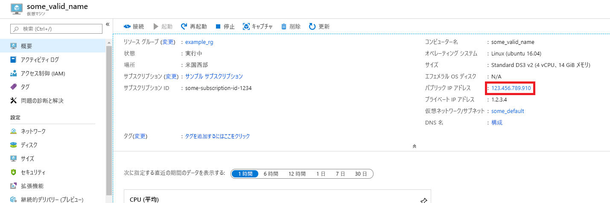
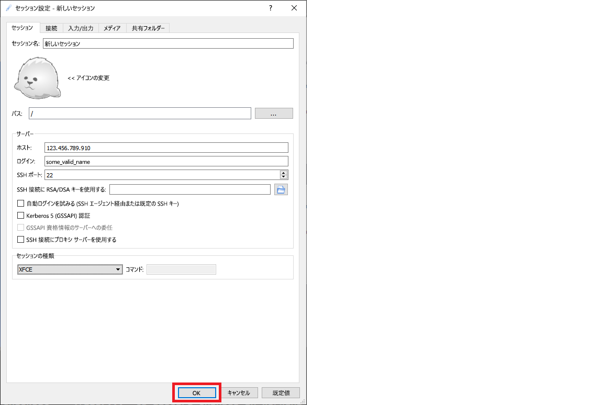

# <a name="quickstart-set-up-the-data-science-virtual-machine-for-linux-ubuntu"></a>クイック スタート:Linux (Ubuntu) Data Science Virtual Machine を設定する

Ubuntu 18.04 Data Science Virtual Machine を起動して実行します。

## <a name="prerequisites"></a>前提条件

Ubuntu 18.04 Data Science Virtual Machine を作成するには、Azure サブスクリプションが必要です。 [Azure を無料で試す](https://azure.com/free)。
Azure 無料アカウントでは、GPU 対応の仮想マシン SKU がサポートされないので注意してください。

## <a name="create-your-data-science-virtual-machine-for-linux"></a>Linux データ サイエンス仮想マシンの作成

Data Science Virtual Machine Ubuntu 18.04 のインスタンスを作成する手順は以下のとおりです。

1. [Azure portal](https://portal.azure.com) にアクセスします。まだサインインしていない場合は、Azure アカウントへのサインインを求めるメッセージが表示される可能性があります。
1. 「data science virtual machine」と入力して仮想マシンの一覧を検索し、[Data Science Virtual Machine - Ubuntu 18.04 Preview]\(Data Science Virtual Machine - Ubuntu 18.04 プレビュー\) を選択します。

1. 次のウィンドウで **[作成]** を選択します。

1. [仮想マシンの作成] ブレードにリダイレクトされます。
   
1. ウィザードの各手順を構成するために、次の情報を入力します。

    1. **[基本]** :
    
       * **サブスクリプション**:複数のサブスクリプションがある場合は、マシンが作成されて課金されるサブスクリプションを選択します。 そのサブスクリプションに対するリソース作成権限が必要です。
       * **[リソース グループ]** :新しいグループを作成するか、既存のグループを使用します。
       * **[仮想マシン名]** : 仮想マシンの名前を入力します。 これは Azure portal に表示される名前です。
       * **[リージョン]** :最適なデータ センターを選択します。 ネットワーク アクセスを最速にするために、データの大半が存在するデータセンターか、物理的に最も近くにあるデータセンターを選びます。 詳細については、[Azure リージョン](https://azure.microsoft.com/global-infrastructure/regions/)に関する記事を参照してください。
       * **イメージ**:既定値をそのまま使用します。
       * **Size**:これには、一般的なワークロードに適したサイズが自動的に設定されます。 詳細については、[Azure の Linux VM のサイズ](../../virtual-machines/linux/sizes.md)に関する記事を参照してください。
       * **[認証の種類]** : 設定を迅速に行うには、[パスワード] を選択します。 
         
         > [!NOTE]
         > JupyterHub を使用する場合は、JupyterHub は SSH 公開キーを使用するように構成されて "*いない*" ため、必ず [パスワード] を選択します。

       * **[ユーザー名]** : 管理者のユーザー名を入力します。 これは、仮想マシンへのログインに使用するユーザー名であり、Azure ユーザー名と同じにする必要はありません。 大文字は使用 "*しない*" でください。
         
         > [!NOTE]
         > ユーザー名に大文字を使用すると、JupyterHub が機能しなくなり、500 内部サーバー エラーが発生します。

       * **パスワード**:仮想マシンへのログインに使用するパスワードを入力します。    
    
   1. **[Review + create]\(レビュー + 作成\)** を選択します。
   1. **[レビュー + 作成]**
      * 入力したすべての情報が正しいことを確認します。 
      * **作成** を選択します。
    
    プロビジョニングには 5 分くらいかかります。 この状態は Azure portal に表示されます。

## <a name="how-to-access-the-ubuntu-data-science-virtual-machine"></a>Ubuntu Data Science Virtual Machine にアクセスする方法

Ubuntu DSVM には、次の 3 つの方法のいずれかでアクセスできます。

  * ターミナル セッションの場合の SSH
  * グラフィカル セッションの場合の X2Go
  * Jupyter Notebook の場合の JupyterHub と JupyterLab

また、Data Science Virtual Machine を Azure Notebooks に接続して、VM で Jupyter Notebook を実行し、無料のサービス レベルの制限をバイパスすることもできます。 詳細については、[Azure Notebooks プロジェクトの管理と構成](../../notebooks/configure-manage-azure-notebooks-projects.md#compute-tier)に関するページを参照してください。

### <a name="ssh"></a>SSH

VM が作成された後、SSH アクセスを使用して構成されている場合は、SSH を使用してサインインできます。 テキスト シェル インターフェイスで、手順 3. の **[基本]** セクションで作成したアカウントの資格情報を使用します。 Windows では、[PuTTY](https://www.putty.org) などの SSH クライアント ツールをダウンロードできます。 グラフィカル デスクトップ (X ウィンドウ システム) を使用する場合は、PuTTY で X11 転送を使用できます。

> [!NOTE]
> テストでは、パフォーマンスは、X11 転送よりも、X2Go クライアントの方が優れていました。 グラフィカル デスクトップ インターフェイスでは、X2Go クライアントを使用することをお勧めします。

### <a name="x2go"></a>X2Go

Linux VM は、既に X2Go サーバーでプロビジョニングされており、クライアント接続を受け入れる準備ができています。 Linux VM のグラフィカル デスクトップに接続するには、クライアントで次の手順を実行します。

1. [X2Go](https://wiki.x2go.org/doku.php/doc:installation:x2goclient)のページから、お使いのクライアント プラットフォーム向けの X2Go クライアントをダウンロードしてインストールします。
1. 仮想マシンのパブリック IP アドレスをメモしておきます。これは、先ほど作成した仮想マシンを開いて Azure portal で確認できます。

   

1. X2Go クライアントを実行します。 [新しいセッション] ウィンドウが自動的にポップアップ表示されない場合は、[セッション] > [新しいセッション] に移動します。

1. 結果の構成ウィンドウで、次の構成パラメーターを入力します。
   * **[Session] \(セッション) タブ**:
     * **[Host]\(ホスト\)** : 前にメモした VM の IP アドレスを入力します。
     * **[Login]\(ログイン\)** : Linux VM 上のユーザー名を入力します。
     * **[SSH Port]\(SSH ポート\)** : 既定値の 22 のままにします。
     * **[Session Type]\(セッションの種類\)** : 値を **XFCE** に変更します。 現在、Linux VM でサポートされるのは XFCE デスクトップのみです。
   * **[Media]\(メディア\) タブ**: 音声のサポートとクライアントの印刷を使用しない場合は、それらをオフにできます。
   * **[Shared folders]\(共有フォルダー\)** : クライアント コンピューターのディレクトリを Linux VM にマウントする場合は、このタブで VM と共有するクライアント コンピューターのディレクトリを追加します。

   
1. **[OK]** を選択します。
1. VM のログイン画面を表示するには、X2Go ウィンドウの右側のウィンドウにあるボックスをクリックします。
1. VM のパスワードを入力します。
1. **[OK]** を選択します。
1. 接続を完了するには、必要に応じてファイアウォールをバイパスする X2Go アクセス許可を付与します。
1. これで、Ubuntu DSVM のグラフィカル インターフェイスが表示されます。 


### <a name="jupyterhub-and-jupyterlab"></a>JupyterHub と JupyterLab

Ubuntu DSVM は、マルチユーザーの Jupyter サーバーである [JupyterHub](https://github.com/jupyterhub/jupyterhub) を実行します。 接続するには、次の手順を実行します。

   1. Azure portal で VM を検索して選択し、VM のパブリック IP アドレスをメモしておきます。
      

   1. ローカル コンピューターから Web ブラウザーを開き、https:\//your-vm-ip:8000 に移動します。"your-vm-ip" は、前にメモした IP アドレスに置き換えます。
   1. VM を作成するときに使ったユーザー名とパスワードを入力してサインインしてください。 

      

   1. 入手できる多くのサンプル ノートブックを参照します。

次世代の Jupyter Notebook と JupyterHub である JupyterLab も利用できます。 これにアクセスするには、JupyterHub にサインインし、URL https:\//your-vm-ip:8000/user/your-username/lab を参照します。"your-username" は VM の構成時に選択したユーザー名に置き換えます。

次の行を `/etc/jupyterhub/jupyterhub_config.py` に追加すれば、JupyterLab を既定のノートブック サーバーとして設定できます。

```python
c.Spawner.default_url = '/lab'
```

## <a name="next-steps"></a>次のステップ

学習と調査をどのように続ければよいかを以下に示します。

* [Linux Data Science Virtual Machine でのデータ サイエンス](linux-dsvm-walkthrough.md)に関するチュートリアルでは、ここでプロビジョニングされた Linux DSVM を使用して、一般的なデータ サイエンス タスクをいくつか実行する方法を示します。 
* この記事で説明しているツールを試して、DSVM 上のさまざまなデータ サイエンス ツールを確認します。 VM にインストールされているツールの基本的な概要と詳細情報を入手できる場所は、仮想マシン内のシェルで `dsvm-more-info` を実行して確認することもできます。  
* [Team Data Science Process](https://aka.ms/tdsp)を使用して、エンド ツー エンドの分析ソリューションを体系的に構築する方法を確認します。
* Azure AI サービスを使用する機械学習とデータ分析のサンプルについては、[Azure AI Gallery](https://gallery.azure.ai/) を参照してください。
* この仮想マシンに適した[リファレンス ドキュメント](./reference-ubuntu-vm.md)を参照してください。
