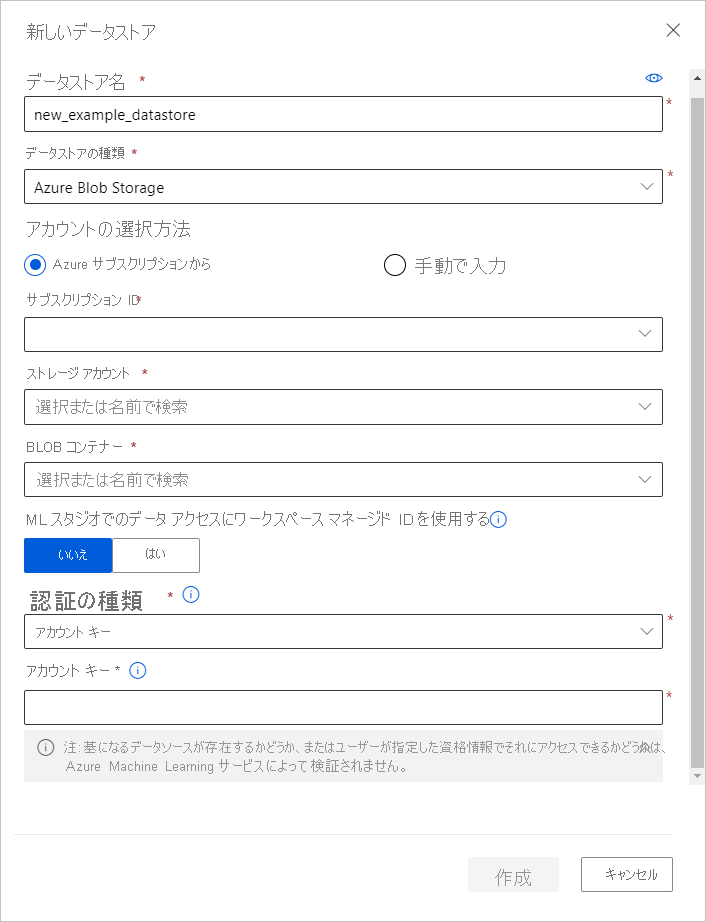

# <a name="access-data-in-azure-storage-services"></a>Azure ストレージ サービスのデータにアクセスする
[!INCLUDE [aml-applies-to-basic-enterprise-sku](../../includes/aml-applies-to-basic-enterprise-sku.md)]

この記事では、Azure Machine Learning データストアを使用して Azure Storage サービスのデータに簡単にアクセスする方法について説明します。 データストアは、サブスクリプション ID やトークン承認など接続情報を格納する目的で使用されます。 データストアを使用するときには、スクリプト内に接続情報をハードコーディングする必要なしに、ストレージにアクセスできます。 

データストアは、[これらの Azure Storage ソリューション](#matrix)から作成できます。 サポートされていないストレージ ソリューションの場合、機械学習実験中のデータ エグレス コストを節約するため、サポートされている Azure Storage ソリューションに[データを移行する](#move)ことをお勧めします。 

## <a name="prerequisites"></a>前提条件
必要なものは次のとおりです。
- Azure サブスクリプション。 Azure サブスクリプションをお持ちでない場合は、開始する前に無料アカウントを作成してください。 [無料版または有料版の Azure Machine Learning](https://aka.ms/AMLFree) をお試しください。

- [Azure BLOB コンテナー](https://docs.microsoft.com/azure/storage/blobs/storage-blobs-overview)または [Azure ファイル共有](https://docs.microsoft.com/azure/storage/files/storage-files-introduction)がある Azure ストレージ アカウント。

- [Azure Machine Learning SDK for Python](https://docs.microsoft.com/python/api/overview/azure/ml/intro?view=azure-ml-py)、または [Azure Machine Learning Studio](https://ml.azure.com/) へのアクセス。

- Azure Machine Learning ワークスペース。
  
  [Azure Machine Learning ワークスペースを作成](how-to-manage-workspace.md)するか、Python SDK を介して既存のワークスペースを使用します。

   ```Python
   import azureml.core
   from azureml.core import Workspace, Datastore
        
   ws = Workspace.from_config()
   ```
<a name="matrix"></a>

## <a name="supported-data-storage-service-types"></a>サポートされているデータ ストレージ サービスの種類

現在、データストアは、次のマトリックスに示すストレージ サービスに対する接続情報の格納をサポートしています。 現時点では、Azure データ ウェアハウスはサポートされていません。 

| Storage&nbsp;type | Authentication&nbsp;type | [Azure&nbsp;Machine&nbsp;Learning studio](https://ml.azure.com/) | [Azure&nbsp;Machine&nbsp;Learning&nbsp; Python SDK](https://docs.microsoft.com/python/api/overview/azure/ml/intro?view=azure-ml-py) |  [Azure&nbsp;Machine&nbsp;Learning CLI](reference-azure-machine-learning-cli.md) | [Azure&nbsp;Machine&nbsp;Learning&nbsp; Rest API](https://docs.microsoft.com/rest/api/azureml/)
---|---|---|---|---|---
[Azure&nbsp;Blob&nbsp;Storage](https://docs.microsoft.com/azure/storage/blobs/storage-blobs-overview)| アカウント キー <br> SAS トークン | ✓ | ✓ | ✓ |✓
[Azure&nbsp;File&nbsp;Share](https://docs.microsoft.com/azure/storage/files/storage-files-introduction)| アカウント キー <br> SAS トークン | ✓ | ✓ | ✓ |✓
[Azure&nbsp;Data Lake&nbsp;Storage Gen&nbsp;1](https://docs.microsoft.com/azure/data-lake-store/)| サービス プリンシパル| ✓ | ✓ | ✓ |✓
[Azure&nbsp;Data Lake&nbsp;Storage Gen&nbsp;2](https://docs.microsoft.com/azure/storage/blobs/data-lake-storage-introduction)| サービス プリンシパル| ✓ | ✓ | ✓ |✓
Azure&nbsp;SQL&nbsp;Database| SQL 認証 <br>サービス プリンシパル| ✓ | ✓ | ✓ |✓
Azure&nbsp;PostgreSQL | SQL 認証| ✓ | ✓ | ✓ |✓
Azure&nbsp;Database&nbsp;for&nbsp;MySQL | SQL 認証|  | ✓ | ✓ |✓
Databricks&nbsp;File&nbsp;System| 認証なし | | ✓* | ✓ * |✓* 

\* ローカル コンピューティング先のシナリオでのみサポートされます

### <a name="storage-guidance"></a>ストレージのガイダンス

Azure BLOB コンテナーのデータストアを作成することをお勧めします。  
BLOB では Standard ストレージと Premium ストレージの両方を使用できます。 Premium ストレージはより高価ですが、スループットの速度が上がるため、特に大規模なデータセットに対するトレーニングでは、トレーニングの実行速度が向上する可能性があります。 ストレージ アカウントの費用については、[Azure 料金計算ツール](https://azure.microsoft.com/pricing/calculator/?service=machine-learning-service)に関するページを参照してください。

ワークスペースを作成すると、ワークスペースに Azure BLOB コンテナーと Azure ファイル共有が自動的に登録されます。 これらの名前は、それぞれ `workspaceblobstore` および `workspacefilestore` となります。 これらには、ワークスペースにアタッチされているストレージ アカウントでプロビジョニングされた BLOB コンテナーとファイル共有の接続情報が格納されます。 `workspaceblobstore` コンテナーは、既定のデータストアとして設定されます。

<a name="access"></a>

## <a name="create-and-register-datastores"></a>データストアの作成と登録

Azure Storage ソリューションをデータストアとして登録すると、特定のワークスペースにそのデータストアが自動的に作成および登録されます。 Python SDK または Azure Machine Learning Studio を使用することで、データストアを作成し、ワークスペースに登録することができます。

>[!IMPORTANT]
> 現在のデータストアの作成と登録のプロセスの一部として、Azure Machine Learning は、ユーザーが指定したプリンシパル (ユーザー名、サービス プリンシパル、または SAS トークン) が基になるストレージ サービスにアクセスできることを検証します。 
<br>
ただし、Azure Data Lake Storage Gen 1 および 2 データストアの場合、この検証は、[`from_files()`](https://docs.microsoft.com/python/api/azureml-core/azureml.data.dataset_factory.filedatasetfactory?view=azure-ml-py) や [`from_delimited_files()`](https://docs.microsoft.com/python/api/azureml-core/azureml.data.dataset_factory.tabulardatasetfactory?view=azure-ml-py#from-parquet-files-path--validate-true--include-path-false--set-column-types-none--partition-format-none-) などのデータ アクセス メソッドが呼び出されるときに後で行われます。 

### <a name="python-sdk"></a>Python SDK

すべての登録メソッドは [`Datastore`](https://docs.microsoft.com/python/api/azureml-core/azureml.core.datastore(class)?view=azure-ml-py) クラスにあり、`register_azure_*` という形式になっています。

`register()` メソッドを指定するために必要な情報は、[Azure portal](https://portal.azure.com)を使用して見つけることができます。

1. 左側のウィンドウで **[ストレージ アカウント]** を選択し、登録するストレージ アカウントを選択します。 
2. アカウント名、コンテナー、ファイル共有名などの情報については、 **[概要]** ページに移動してください。 アカウント キーや SAS トークンなどの認証情報については、 **[設定]** ウィンドウの **[アクセス キー]** に移動します。 

> [!IMPORTANT]
> お使いのストレージ アカウントが仮想ネットワーク内にある場合は、Azure BLOB データストアの作成のみがサポートされます。 お使いのワークスペースにストレージ アカウントへのアクセス権を付与するには、パラメーター `grant_workspace_access` を `True` に設定します。

次の例は、Azure BLOB コンテナー、Azure ファイル共有、および Azure Data Lake Storage Generation 2 をデータストアとして登録する方法を示しています。 その他のストレージ サービスについては、[`register_azure_*` メソッドに関する参照ドキュメント](https://docs.microsoft.com/python/api/azureml-core/azureml.core.datastore.datastore?view=azure-ml-py#methods)を参照してください。

#### <a name="blob-container"></a>BLOB コンテナー

Azure BLOB コンテナーをデータストアとして登録するには、[`register_azure_blob-container()`](https://docs.microsoft.com/python/api/azureml-core/azureml.core.datastore(class)?view=azure-ml-py#register-azure-blob-container-workspace--datastore-name--container-name--account-name--sas-token-none--account-key-none--protocol-none--endpoint-none--overwrite-false--create-if-not-exists-false--skip-validation-false--blob-cache-timeout-none--grant-workspace-access-false--subscription-id-none--resource-group-none-) を使用します。

次のコードでは、データストア `blob_datastore_name` を作成し、ワークスペース `ws` に登録しています。 このデータストアは、指定されたアカウント キーを使用して、Azure ストレージ アカウント `my-account-name` の BLOB コンテナー `my-container-name` にアクセスします。

```Python
blob_datastore_name='azblobsdk' # Name of the datastore to workspace
container_name=os.getenv("BLOB_CONTAINER", "<my-container-name>") # Name of Azure blob container
account_name=os.getenv("BLOB_ACCOUNTNAME", "<my-account-name>") # Storage account name
account_key=os.getenv("BLOB_ACCOUNT_KEY", "<my-account-key>") # Storage account key

blob_datastore = Datastore.register_azure_blob_container(workspace=ws, 
                                                         datastore_name=blob_datastore_name, 
                                                         container_name=container_name, 
                                                         account_name=account_name,
                                                         account_key=account_key)
```

#### <a name="file-share"></a>ファイル共有

Azure ファイル共有をデータストアとして登録するには、[`register_azure_file_share()`](https://docs.microsoft.com/python/api/azureml-core/azureml.core.datastore(class)?view=azure-ml-py#register-azure-file-share-workspace--datastore-name--file-share-name--account-name--sas-token-none--account-key-none--protocol-none--endpoint-none--overwrite-false--create-if-not-exists-false--skip-validation-false-) を使用します。 

次のコードでは、データストア `file_datastore_name` を作成し、ワークスペース `ws` に登録しています。 このデータストアは、指定されたアカウント キーを使用して、ストレージ アカウント `my-account-name` のファイル共有 `my-fileshare-name` にアクセスします。

```Python
file_datastore_name='azfilesharesdk' # Name of the datastore to workspace
file_share_name=os.getenv("FILE_SHARE_CONTAINER", "<my-fileshare-name>") # Name of Azure file share container
account_name=os.getenv("FILE_SHARE_ACCOUNTNAME", "<my-account-name>") # Storage account name
account_key=os.getenv("FILE_SHARE_ACCOUNT_KEY", "<my-account-key>") # Storage account key

file_datastore = Datastore.register_azure_file_share(workspace=ws,
                                                     datastore_name=file_datastore_name, 
                                                     file_share_name=file_share_name, 
                                                     account_name=account_name,
                                                     account_key=account_key)
```

#### <a name="azure-data-lake-storage-generation-2"></a>Azure Data Lake Storage Generation 2

Azure Data Lake Storage Generation 2 (ADLS Gen 2) データストアの場合、[register_azure_data_lake_gen2 ()](https://docs.microsoft.com/python/api/azureml-core/azureml.core.datastore.datastore?view=azure-ml-py#register-azure-data-lake-gen2-workspace--datastore-name--filesystem--account-name--tenant-id--client-id--client-secret--resource-url-none--authority-url-none--protocol-none--endpoint-none--overwrite-false-) を使用して、サービス プリンシパルのアクセス許可を持つ Azure DataLake Gen 2 ストレージに接続されている資格情報データストアを登録します。 詳細については、「[Azure Data Lake Storage Gen2 のアクセス制御](https://docs.microsoft.com/azure/storage/blobs/data-lake-storage-access-control)」をご覧ください。 

次のコードでは、データストア `adlsgen2_datastore_name` を作成し、ワークスペース `ws` に登録しています。 このデータストアは、指定されたサービス プリンシパルの資格情報を使用して、`account_name` ストレージ アカウントのファイル システム `test` にアクセスします。

```python 
adlsgen2_datastore_name = 'adlsgen2datastore'

subscription_id=os.getenv("ADL_SUBSCRIPTION", "<my_subscription_id>") # subscription id of ADLS account
resource_group=os.getenv("ADL_RESOURCE_GROUP", "<my_resource_group>") # resource group of ADLS account

account_name=os.getenv("ADLSGEN2_ACCOUNTNAME", "<my_account_name>") # ADLS Gen2 account name
tenant_id=os.getenv("ADLSGEN2_TENANT", "<my_tenant_id>") # tenant id of service principal
client_id=os.getenv("ADLSGEN2_CLIENTID", "<my_client_id>") # client id of service principal
client_secret=os.getenv("ADLSGEN2_CLIENT_SECRET", "<my_client_secret>") # the secret of service principal

adlsgen2_datastore = Datastore.register_azure_data_lake_gen2(workspace=ws,
                                                             datastore_name=adlsgen2_datastore_name,
                                                             account_name=account_name, # ADLS Gen2 account name
                                                             filesystem='test', # ADLS Gen2 filesystem
                                                             tenant_id=tenant_id, # tenant id of service principal
                                                             client_id=client_id, # client id of service principal
                                                             client_secret=client_secret) # the secret of service principal
```

### <a name="azure-machine-learning-studio"></a>Azure Machine Learning Studio 

Azure Machine Learning Studio のいくつかの手順で、新しいデータストアを作成します。

1. [Azure Machine Learning Studio](https://ml.azure.com/) にサインインします。
1. 左側のウィンドウの **[管理]** で、 **[データストア]** を選択します。
1. **[+ 新しいデータストア]** を選択します。
1. 新しいデータストアのフォームに入力します。 このフォームは、選択した Azure Storage の種類と認証の種類に基づいて、インテリジェントに自動更新されます。
  
フォームを入力するのに必要な情報は、[Azure portal](https://portal.azure.com) で見つけられます。 左側のウィンドウで **[ストレージ アカウント]** を選択し、登録するストレージ アカウントを選択します。 **[概要]** ページには、アカウント名、コンテナー、ファイル共有名などの情報が表示されます。 アカウント キーや SAS トークンなどの認証項目については、 **[設定]** ウィンドウの **[アクセス キー]** に移動します。

次の例は、Azure BLOB データストアを作成するときにフォームがどのように表示されるかを示しています。 
    



<a name="get"></a>

## <a name="get-datastores-from-your-workspace"></a>ワークスペースからデータストアを取得する

現在のワークスペースに登録されている特定のデータストアを取得するには、`Datastore` クラスの静的メソッド [`get()`](https://docs.microsoft.com/python/api/azureml-core/azureml.core.datastore(class)?view=azure-ml-py#get-workspace--datastore-name-) を使用します。

```Python
# Get a named datastore from the current workspace
datastore = Datastore.get(ws, datastore_name='your datastore name')
```
特定のワークスペースに登録されているデータストアの一覧を取得するには、ワークスペース オブジェクトに対して [`datastores`](https://docs.microsoft.com/python/api/azureml-core/azureml.core.workspace%28class%29?view=azure-ml-py#datastores) プロパティを使用します。

```Python
# List all datastores registered in the current workspace
datastores = ws.datastores
for name, datastore in datastores.items():
    print(name, datastore.datastore_type)
```

ワークスペースの既定のデータストアを取得するには、次の行を使用します。

```Python
datastore = ws.get_default_datastore()
```

現在のワークスペースのために、異なる既定のデータストアを定義するには、ワークスペース オブジェクトに対して [`set_default_datastore()`](https://docs.microsoft.com/python/api/azureml-core/azureml.core.workspace(class)?view=azure-ml-py#set-default-datastore-name-) メソッドを使用します。

```Python
# Define the default datastore for the current workspace
ws.set_default_datastore('your datastore name')
```

<a name="up-and-down"></a>
## <a name="upload-and-download-data"></a>データのアップロードとダウンロード

次の例に示されている [`upload()`](https://docs.microsoft.com/python/api/azureml-core/azureml.data.azure_storage_datastore.azureblobdatastore?view=azure-ml-py#upload-src-dir--target-path-none--overwrite-false--show-progress-true-) メソッドと [`download()`](https://docs.microsoft.com/python/api/azureml-core/azureml.data.azure_storage_datastore.azureblobdatastore?view=azure-ml-py#download-target-path--prefix-none--overwrite-false--show-progress-true-) メソッドは、[AzureBlobDatastore](https://docs.microsoft.com/python/api/azureml-core/azureml.data.azure_storage_datastore.azureblobdatastore?view=azure-ml-py) クラスと [AzureFileDatastore](https://docs.microsoft.com/python/api/azureml-core/azureml.data.azure_storage_datastore.azurefiledatastore?view=azure-ml-py) クラスに固有のもので、これらのクラスに対して同様に動作します。

### <a name="upload"></a>アップロード

Python SDK を使用し、データストアにディレクトリまたは個々のファイルをアップロードします。

```Python
datastore.upload(src_dir='your source directory',
                 target_path='your target path',
                 overwrite=True,
                 show_progress=True)
```

`target_path` パラメーターでは、アップロードするファイル共有 (または BLOB コンテナー) 内の場所が指定されます。 既定では `None` になるため、データはルートにアップロードされます。 `overwrite=True` の場合、`target_path` にある既存のデータはすべて上書きされます。

`upload_files()` メソッドを使用して、データストアに個々のファイルの一覧をアップロードすることもできます。

### <a name="download"></a>ダウンロード

データストアからローカル ファイル システムにデータをダウンロードします。

```Python
datastore.download(target_path='your target path',
                   prefix='your prefix',
                   show_progress=True)
```

`target_path` パラメーターは、データのダウンロード先となるローカル ディレクトリの場所です。 ダウンロードするファイル共有 (または BLOB コンテナー) 内のフォルダーのパスを指定するには、`prefix` にそのパスを指定します。 `prefix` が `None` である場合は、ファイル共有 (または BLOB コンテナー) の内容がすべてダウンロードされます。

<a name="train"></a>

## <a name="access-your-data-during-training"></a>トレーニング中にデータにアクセスする

データストア内のデータと交信するか、トレーニングなどの機械学習タスク用の使用可能なオブジェクトとしてデータをパッケージ化するために、[Azure Machine Learning データセットを作成します](how-to-create-register-datasets.md)。 データセットには、Pandas または Spark のデータフレームに表形式のデータを読み込む関数が用意されています。 データセットには、Azure BLOB ストレージ、Azure Files、Azure Data Lake Storage Gen1、Azure Data Lake Storage Gen2、Azure SQL Database、および Azure Database for PostgreSQL から任意の形式のファイルをダウンロードしたりマウントしたりする機能も用意されています。 [データセットを使ってトレーニングする方法の詳細をご覧ください](how-to-train-with-datasets.md)。

### <a name="accessing-source-code-during-training"></a>トレーニング中のソース コードへのアクセス

Azure BLOB ストレージは、スループット速度が Azure ファイル共有よりも高く、並列で開始される多数のジョブに対応します。 このため、ソース コード ファイルの転送については、BLOB ストレージを使用するように実行を構成することをお勧めします。

次のコード例では、実行の構成で、ソース コード転送に使用する BLOB データストアを指定しています。

```python 
# workspaceblobstore is the default blob storage
run_config.source_directory_data_store = "workspaceblobstore" 
```

## <a name="access-data-during-scoring"></a>スコアリング中にデータにアクセスする

Azure Machine Learning には、スコアリングにモデルを使用する方法が複数用意されています。 これらの方法の一部では、データストアへのアクセスが提供されていません。 次の表を使用して、スコアリング中にデータストアへのアクセスが許可されるのはどの方法かを理解します。

| 方法 | データストア アクセス | 説明 |
| ----- | :-----: | ----- |
| [バッチ予測](how-to-use-parallel-run-step.md) | ✔ | 大量のデータの予測を非同期的に行います。 |
| [Web サービス](how-to-deploy-and-where.md) | &nbsp; | モデルを Web サービスとしてデプロイします。 |
| [Azure IoT Edge モジュール](how-to-deploy-and-where.md) | &nbsp; | モデルを IoT Edge デバイスにデプロイします。 |

SDK でデータストアへのアクセスが提供されない場合は、関連する Azure SDK を使用してデータにアクセスするカスタム コードを作成できる場合があります。 たとえば、BLOB またはファイルに格納されたデータには、[Azure Storage SDK for Python](https://github.com/Azure/azure-storage-python) というクライアント ライブラリを使用してアクセスすることができます。

<a name="move"></a>

## <a name="move-data-to-supported-azure-storage-solutions"></a>サポートされている Azure Storage ソリューションにデータを移動する

Azure Machine Learning では、Azure BLOB ストレージ、Azure Files、Azure Data Lake Storage Gen1、Azure Data Lake Storage Gen2、Azure SQL Database、および Azure Database for PostgreSQL からのデータ アクセスがサポートされています。 サポートされていないストレージを使用する場合は、[Azure Data Factory およびこれらの手順](https://docs.microsoft.com/azure/data-factory/quickstart-create-data-factory-copy-data-tool)を使用して、サポートされている Azure Storage ソリューションにデータを移動することをお勧めします。 サポートされているストレージにデータを移動すると、機械学習実験中のデータ エグレス コストを節約する助けとなります。 

Azure Data Factory では、80 を超える構築済みのコネクタによって、追加コストなしで効率的かつ回復性があるデータ転送が提供されます。 これには、Azure のデータ サービス、オンプレミスのデータ ソース、Amazon S3 および Redshift、Google BigQuery などのコネクタが含まれます。

## <a name="next-steps"></a>次のステップ

* [Azure Machine Learning データセットを作成する](how-to-create-register-datasets.md)
* [モデルをトレーニングする](how-to-train-ml-models.md)
* [モデルのデプロイ](how-to-deploy-and-where.md)
