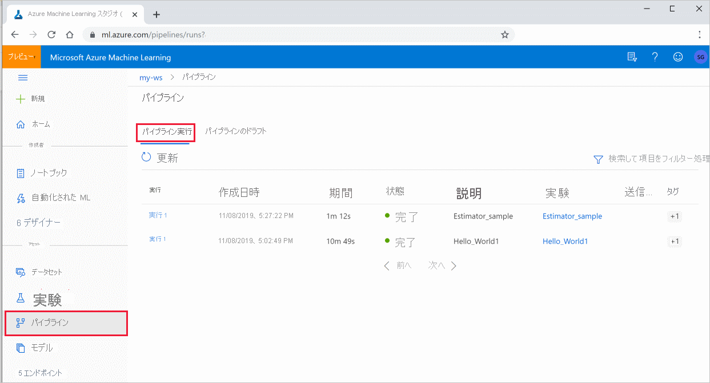

# <a name="create-and-run-machine-learning-pipelines-with-azure-machine-learning-sdk"></a>Azure Machine Learning SDK で機械学習パイプラインを作成して管理する

[!INCLUDE [applies-to-skus](../../includes/aml-applies-to-basic-enterprise-sku.md)]

この記事では、[Azure Machine Learning SDK](https://docs.microsoft.com/python/api/overview/azure/ml/intro?view=azure-ml-py) を使用して、[機械学習パイプライン](concept-ml-pipelines.md)を作成して実行する方法について説明します。 **ML パイプライン**を使用して、さまざまな ML フェーズをつなぎ合わせるするワークフローを作成します。 その後、後でアクセスしたり、他のユーザーと共有したりするために、パイプラインを公開します。 ML パイプラインを追跡して、実際にモデルがどのように実行されているかを確認し、データ ドリフトを検出します。 ML パイプラインは、さまざまなコンピューティングを使用し、ステップを再実行する代わりに再利用し、ML ワークフローを他のユーザーと共有する、バッチ スコアリングのシナリオに最適です。

ML タスクの CI/CD オートメーションには [Azure パイプライン](https://docs.microsoft.com/azure/devops/pipelines/targets/azure-machine-learning?context=azure%2Fmachine-learning%2Fservice%2Fcontext%2Fml-context&view=azure-devops&tabs=yaml)と呼ばれる別の種類のパイプラインを使用できますが、その種類のパイプラインはワークスペース内には格納されません。 [これらの異なるパイプラインを比較してください](concept-ml-pipelines.md#which-azure-pipeline-technology-should-i-use)。

作成した ML パイプラインは、Azure Machine Learning [ワークスペース](how-to-manage-workspace.md)のメンバーであれば見ることができます。 

ML パイプラインはコンピューティング先で実行します (「[Azure Machine Learning でのコンピューティング先とは](https://docs.microsoft.com/azure/machine-learning/concept-compute-target)」を参照)。 パイプラインでは、サポートされている [Azure Storage](https://docs.microsoft.com/azure/storage/) の場所に対してデータを読み取ったり書き込んだりすることができます。

Azure サブスクリプションをお持ちでない場合は、開始する前に無料アカウントを作成してください。 [無料版または有料版の Azure Machine Learning](https://aka.ms/AMLFree) をお試しください。

## <a name="prerequisites"></a>前提条件

* すべてのパイプライン リソースを保持するための [Azure Machine Learning ワークスペース](how-to-manage-workspace.md)を作成します。

* [開発環境を構成](how-to-configure-environment.md)して Azure Machine Learning SDK をインストールするか、SDK が既にインストールされている [Azure Machine Learning コンピューティング インスタンス](concept-compute-instance.md)を使用します。

まず、ワークスペースをアタッチします。

```Python
import azureml.core
from azureml.core import Workspace, Datastore

ws = Workspace.from_config()
```

## <a name="set-up-machine-learning-resources"></a>機械学習リソースをセットアップする

ML パイプラインの実行に必要なリソースを作成します。

* パイプラインの手順で必要なデータへのアクセスに使用されるデータストアを設定します。

* データストアに存在する永続データまたはデータストアでアクセス可能な永続データを指し示すように、`Dataset` オブジェクトを構成します。 パイプライン ステップ間で渡される、または出力を作成する一時データの `OutputFileDatasetConfig` オブジェクトを構成します。     * データストアに存在する永続データまたはデータストアでアクセス可能な永続データを指し示すように、`Dataset` オブジェクトを構成します。 パイプライン ステップ間で渡される一時データの `PipelineData` オブジェクトを構成します。 
> [!NOTE]   
>`OutputFileDatasetConfig` クラスは試験段階のプレビュー機能であり、いつでも変更される可能性があります。    
>   
>詳細については、「https://aka.ms/azuremlexperimental」を参照してください。

* パイプラインの手順が実行される[コンピューティング先](concept-azure-machine-learning-architecture.md#compute-targets)を設定します。

### <a name="set-up-a-datastore"></a>データストアをセットアップする

データストアには、パイプラインでアクセスするデータが格納されます。 各ワークスペースに既定のデータストアがあります。 データストアを追加登録できます。 

ワークスペースを作成すると、[Azure Files](https://docs.microsoft.com/azure/storage/files/storage-files-introduction) と [Azure Blob Storage](https://docs.microsoft.com/azure/storage/blobs/storage-blobs-introduction) がワークスペースに接続されます。 既定のデータストアが、Azure Blob Storage に接続するために登録されています。 詳細については、[Azure Files、Azure BLOB、Azure ディスクの使い分け](https://docs.microsoft.com/azure/storage/common/storage-decide-blobs-files-disks)に関するページを参照してください。 

```python
# Default datastore 
def_data_store = ws.get_default_datastore()

# Get the blob storage associated with the workspace
def_blob_store = Datastore(ws, "workspaceblobstore")

# Get file storage associated with the workspace
def_file_store = Datastore(ws, "workspacefilestore")

```

通常、ステップではデータが消費され、出力データが生成されます。 ステップでは、モデルなどのデータ、モデル ファイルと依存ファイルを含むディレクトリ、一時データが作成されることがあります。 このデータは、パイプラインの後続の他のステップで使用できます。 パイプラインをデータに接続する方法の詳細については、[データへのアクセス方法](how-to-access-data.md)および[データセットの登録方法](how-to-create-register-datasets.md)に関する記事を参照してください。 

### <a name="configure-data-using-dataset-and-outputfiledatasetconfig-objects"></a>`Dataset` オブジェクトと `OutputFileDatasetConfig` オブジェクトを使用してデータを構成する

パイプラインにデータを提供する方法には、[データセット](https://docs.microsoft.com/python/api/azureml-core/azureml.core.dataset.Dataset) オブジェクトを使用することをお勧めします。 `Dataset` オブジェクトでは、データストアに存在するデータ、データストアからアクセス可能なデータ、または Web URL でアクセス可能なデータが指し示されています。 `Dataset` クラスは抽象クラスであるため、`FileDataset` (1 つ以上のファイルを参照)、または区切られたデータ列を含む 1 つ以上のファイルによって作成された `TabularDataset` のいずれかのインスタンスを作成します。


`Dataset` は、[from_file](https://docs.microsoft.com/python/api/azureml-core/azureml.data.dataset_factory.filedatasetfactory?view=azure-ml-py#from-files-path--validate-true-) や [from_delimited_files](https://docs.microsoft.com/python/api/azureml-core/azureml.data.dataset_factory.tabulardatasetfactory?view=azure-ml-py#from-delimited-files-path--validate-true--include-path-false--infer-column-types-true--set-column-types-none--separator------header-true--partition-format-none--support-multi-line-false-) などのメソッドを使用して作成します。

```python
from azureml.core import Dataset

my_dataset = Dataset.File.from_files([(def_blob_store, 'train-images/')])
```

中間データ (またはステップの出力) は、[OutputFileDatasetConfig](https://docs.microsoft.com/python/api/azureml-core/azureml.data.outputfiledatasetconfig?view=azure-ml-py) オブジェクトによって表されます。 `output_data1` は、ステップの出力として生成され、後続の 1 つまたは複数のステップの入力として使われます。 `OutputFileDatasetConfig` では、ステップの間にデータの依存関係が導入され、パイプライン内に暗黙的な実行順序が作成されます。 このオブジェクトは、後でパイプラインのステップを作成するときに使用されます。 中間データ (またはステップの出力) は、[PipelineData](https://docs.microsoft.com/python/api/azureml-pipeline-core/azureml.pipeline.core.pipelinedata?view=azure-ml-py) オブジェクトによって表されます。 `output_data1` は、ステップの出力として生成され、後続の 1 つまたは複数のステップの入力として使われます。 `PipelineData` では、ステップの間にデータの依存関係が導入され、パイプライン内に暗黙的な実行順序が作成されます。 このオブジェクトは、後でパイプラインのステップを作成するときに使用されます。

`OutputFileDatasetConfig` オブジェクトはディレクトリを返し、既定では、ワークスペースの既定のデータストアに出力を書き込みます。

```python
from azureml.pipeline.core import OutputFileDatasetConfig

output_data1 = OutputFileDatasetConfig()
```

データセットと OutputFileConfig オブジェクトを操作するための詳細とサンプル コードについては、「[ML パイプラインのステップ間でのデータの移動 (Python)](how-to-move-data-in-out-of-pipelines.md)」を参照してください。

## <a name="set-up-a-compute-target"></a>コンピューティング ターゲットを設定する

Azure Machine Learning での "__コンピューティング__" (または "__コンピューティング先__") という用語は、機械学習パイプラインで計算ステップを実行するマシンまたはクラスターのことです。 コンピューティング先の完全な一覧、およびコンピューティング先を作成してワークスペースにアタッチする方法については、「[モデル トレーニング用のコンピューティング先を設定して使用する](how-to-set-up-training-targets.md)」をご覧ください。 コンピューティング先を作成またはアタッチするプロセスは、モデルをトレーニングするときも、パイプラインのステップを実行するときも同じです。 コンピューティング先を作成してアタッチした後、[パイプラインのステップ](#steps)では `ComputeTarget` オブジェクトを使用します。

> [!IMPORTANT]
> コンピューティング先での管理操作の実行は、リモート ジョブの内部からはサポートされていません。 機械学習パイプラインはリモート ジョブとして送信されるため、パイプラインの内部からはコンピューティング先での管理操作を使用しないでください。

### <a name="azure-machine-learning-compute"></a>Azure Machine Learning コンピューティング

ステップを実行するための Azure Machine Learning コンピューティングを作成できます。 他のコンピューティング先のコードは、非常に似ていますが、種類に応じてパラメーターが多少異なります。 

```python
from azureml.core.compute import ComputeTarget, AmlCompute

compute_name = "aml-compute"
vm_size = "STANDARD_NC6"
if compute_name in ws.compute_targets:
    compute_target = ws.compute_targets[compute_name]
    if compute_target and type(compute_target) is AmlCompute:
        print('Found compute target: ' + compute_name)
else:
    print('Creating a new compute target...')
    provisioning_config = AmlCompute.provisioning_configuration(vm_size=vm_size,  # STANDARD_NC6 is GPU-enabled
                                                                min_nodes=0,
                                                                max_nodes=4)
    # create the compute target
    compute_target = ComputeTarget.create(
        ws, compute_name, provisioning_config)

    # Can poll for a minimum number of nodes and for a specific timeout.
    # If no min node count is provided it will use the scale settings for the cluster
    compute_target.wait_for_completion(
        show_output=True, min_node_count=None, timeout_in_minutes=20)

    # For a more detailed view of current cluster status, use the 'status' property
    print(compute_target.status.serialize())
```

## <a name="configure-the-training-runs-environment"></a>トレーニングの実行環境を構成する

次のステップでは、リモート トレーニングの実行に、トレーニング ステップで必要なすべての依存関係があることを確認します。 依存関係とランタイム コンテキストは、`RunConfiguration` オブジェクトを作成して構成することによって設定されます。 

```python
from azureml.core.runconfig import RunConfiguration
from azureml.core.conda_dependencies import CondaDependencies
from azureml.core import Environment 

aml_run_config = RunConfiguration()
# `compute_target` as defined in "Azure Machine Learning compute" section above
aml_run_config.target = compute_target

USE_CURATED_ENV = True
if USE_CURATED_ENV :
    curated_environment = Environment.get(workspace=ws, name="AzureML-Tutorial")
    aml_run_config.environment = curated_environment
else:
    aml_run_config.environment.python.user_managed_dependencies = False
    
    # Add some packages relied on by data prep step
    aml_run_config.environment.python.conda_dependencies = CondaDependencies.create(
        conda_packages=['pandas','scikit-learn'], 
        pip_packages=['azureml-sdk', 'azureml-dataprep[fuse,pandas]'], 
        pin_sdk_version=False)
```

上記のコードは、依存関係を処理するための 2 つのオプションを示しています。 表示されているとおり、`USE_CURATED_ENV = True` の場合、その構成はキュレートされた環境に基づいています。 キュレートされた環境は、共通の相互依存ライブラリを使用して "あらかじめベイク" されており、オンラインになるまでにかかる時間が大幅に短縮されます。 キュレートされた環境には、[Microsoft Container Registry](https://hub.docker.com/publishers/microsoftowner) にあらかじめビルドされた Docker イメージが用意されています。 詳細については、「[Azure Machine Learning のキュレーションされた環境](resource-curated-environments.md)」を参照してください。

`USE_CURATED_ENV` を `False` に変更した場合にたどるパスは、依存関係を明示的に設定するためのパターンを示します。 このシナリオでは、新しいカスタム Docker イメージが作成され、リソース グループ内の Azure Container Registry に登録されます (「[Azure のプライベート Docker コンテナー レジストリの概要](https://docs.microsoft.com/azure/container-registry/container-registry-intro)」を参照してください)。 このイメージのビルドと登録には数分かかることがあります。

## <a name="construct-your-pipeline-steps"></a><a id="steps"></a>パイプラインのステップを構築する

コンピューティング リソースと環境を作成したら、パイプラインのステップを定義する準備は完了です。 Azure Machine Learning SDK を介して使用できる組み込みの手順は多数あります。[`azureml.pipeline.steps` パッケージのリファレンス ドキュメント](https://docs.microsoft.com/python/api/azureml-pipeline-steps/azureml.pipeline.steps?view=azure-ml-py)を参照してください。 最も柔軟性の高いクラスは、Python スクリプトを実行する [PythonScriptStep](https://docs.microsoft.com/python/api/azureml-pipeline-steps/azureml.pipeline.steps.python_script_step.pythonscriptstep?view=azure-ml-py) です。

```python
from azureml.pipeline.steps import PythonScriptStep

dataprep_source_dir = "./dataprep_src"
entry_point = "prepare.py"

# `my_dataset` as defined above
ds_input = my_dataset.as_named_input('input1')

# `output_data1`, `compute_target`, `aml_run_config` as defined above
data_prep_step = PythonScriptStep(
    script_name=entry_point,
    source_directory=dataprep_source_dir,
    arguments=["--input", ds_input.as_download(), "--output", output_data1],
    compute_target=compute_target,
    runconfig=aml_run_config,
    allow_reuse=True
)
```

上記のコードには、一般的な初期パイプライン ステップが表示されます。 データ準備コードはサブディレクトリにあります (この例では、ディレクトリ `"./dataprep.src"` にある `"prepare.py"`)。 パイプライン作成プロセスの一環として、このディレクトリが圧縮され、`compute_target` にアップロードされ、`script_name`の値として指定されたスクリプトがステップによって実行されます。

`arguments` の値によって、ステップの入力と出力が指定されます。 上の例で、ベースライン データは `my_dataset` データセットです。 対応するデータはコードにより `as_download()` と指定されているので、コンピューティング リソースにダウンロードされます。 スクリプト `prepare.py` により、目下のタスクに適したデータ変換タスクが行われ、データが `OutputFileDatasetConfig` 型の `output_data1` に出力されます。 詳細については、「[ML パイプラインのステップ間でのデータの移動 (Python)](how-to-move-data-in-out-of-pipelines.md)」を参照してください。 

このステップは、構成 `aml_run_config` を使用して `compute_target` によって定義されたコンピューターで実行されます。 

共同環境でパイプラインを使用する際は、前の結果 (`allow_reuse`) の再利用が鍵となります。不要な再実行を除去することで機敏性が提供されるからです。 ステップの script_name、inputs、およびパラメーターが同じままのときは、再利用が既定の動作になります。 再利用が許可された場合、前回の実行の結果はすぐに次のステップに送信されます。 `allow_reuse` が `False` に設定されている場合は、パイプライン実行中、このステップの新規実行が常に生成されます。

1 つのステップでパイプラインを作成することも可能ですが、ほとんどの場合は、プロセス全体をいくつかのステップに分割することを選択します。 たとえば、データの準備、トレーニング、モデルの比較、およびデプロイ用のステップを用意します。 たとえば、上記で `data_prep_step` を指定したら、次のステップはトレーニングとなることが想定できます。

```python
train_source_dir = "./train_src"
train_entry_point = "train.py"

training_results = OutputFileDatasetConfig(name = "training_results", 
                                           destination=def_blob_store)

train_step = PythonScriptStep(
    script_name=train_entry_point,
    source_directory=train_source_dir,
    arguments=["--prepped_data", output_data1.as_input(), "--training_results", training_results],
    compute_target=compute_target,
    runconfig=aml_run_config,
    allow_reuse=True
)
```

上記のコードは、データの準備のステップの場合とよく似ています。 トレーニングのコードは、データの準備のコードとは別のディレクトリにあります。 データの準備のステップの `OutputFileDatasetConfig` 出力である `output_data1` は、トレーニング ステップへの "_入力_" として使用されます。 新しい `OutputFileDatasetConfig` オブジェクトである `training_results` が作成され、これによって、その後の比較またはデプロイのステップの結果が保持されます。 

ステップを定義した後は、それらのステップの一部またはすべてを使用してパイプラインをビルドします。

> [!NOTE]
> ステップを定義するとき、またはパイプラインを構築するときに、ファイルまたはデータが Azure Machine Learning にアップロードされることはありません。 ファイルは、[Experiment.submit()](https://docs.microsoft.com/python/api/azureml-core/azureml.core.experiment.experiment?view=azure-ml-py#submit-config--tags-none----kwargs-) を呼び出すときにアップロードされます。

```python
# list of steps to run (`compare_step` definition not shown)
compare_models = [data_prep_step, train_step, compare_step]

from azureml.pipeline.core import Pipeline

# Build the pipeline
pipeline1 = Pipeline(workspace=ws, steps=[compare_models])
```

### <a name="use-a-dataset"></a>データセットを使用する 

Azure Blob storage、Azure Files、Azure Data Lake Storage Gen1、Azure Data Lake Storage Gen2、Azure SQL Database、および Azure Database for PostgreSQL から作成されたデータセットは、任意のパイプライン ステップへの入力として使用できます。 [DataTransferStep](https://docs.microsoft.com/python/api/azureml-pipeline-steps/azureml.pipeline.steps.datatransferstep?view=azure-ml-py) または [DatabricksStep](https://docs.microsoft.com/python/api/azureml-pipeline-steps/azureml.pipeline.steps.databricks_step.databricksstep?view=azure-ml-py) に出力を書き込むことができます。また、特定のデータストアにデータを書き込む場合は、[OutputFileDatasetConfig](https://docs.microsoft.com/python/api/azureml-pipeline-core/azureml.data.outputfiledatasetconfig?view=azure-ml-py) を使用します。 

> [!IMPORTANT]
> `OutputFileDatasetConfig` を使用してデータストアに出力データを書き戻すことができるのは、Azure BLOB、Azure ファイル共有、ADLS Gen 1、および ADLS Gen 2 データストアだけです。 現時点では、この機能は [ADLS Gen 2 データストア](https://docs.microsoft.com/python/api/azureml-core/azureml.data.azure_data_lake_datastore.azuredatalakegen2datastore?view=azure-ml-py)ではサポートされていません。

```python
dataset_consuming_step = PythonScriptStep(
    script_name="iris_train.py",
    inputs=[iris_tabular_dataset.as_named_input("iris_data")],
    compute_target=compute_target,
    source_directory=project_folder
)
```

その後、[Run.input_datasets](https://docs.microsoft.com/python/api/azureml-core/azureml.core.run.run?view=azure-ml-py#input-datasets) ディクショナリを使用して、パイプライン内のデータセットを取得します。

```python
# iris_train.py
from azureml.core import Run, Dataset

run_context = Run.get_context()
iris_dataset = run_context.input_datasets['iris_data']
dataframe = iris_dataset.to_pandas_dataframe()
```

`Run.get_context()` の行を強調表示します。 この関数では、進行中の実験用の実行を表す `Run` を取得します。 上記のサンプルでは、登録されたデータセットを取得するために使用しています。 `Run` オブジェクトのもう 1 つの一般的な用途は、実験自体と実験が存在するワークスペースの両方を取得することです。 

```python
# Within a PythonScriptStep

ws = Run.get_context().experiment.workspace
```

データを渡したり、データにアクセスしたりするための別の方法などの詳細については、「[ML パイプラインのステップ間でのデータの移動 (Python)](how-to-move-data-in-out-of-pipelines.md)」を参照してください。

## <a name="caching--reuse"></a>キャッシュと再利用  

パイプラインの動作を最適化およびカスタマイズするためには、キャッシュと再利用に関連するいくつかのことを実行できます。 たとえば、次のようなことを選択できます。
+ [ステップ定義](https://docs.microsoft.com/python/api/azureml-pipeline-steps/?view=azure-ml-py)中に `allow_reuse=False` を設定して、**既定のステップ実行出力の再利用をオフにします**。 共同環境でパイプラインを使用する際は再利用が鍵となります。不要な再実行を除去することで機敏性が提供されるからです。 ただし、再利用しないことも選択できます。
+ `pipeline_run = exp.submit(pipeline, regenerate_outputs=False)` を使用して、**1 回の実行で全ステップの出力の再生成を強制します**。

既定では、ステップの `allow_reuse` が有効になり、ステップの定義に指定されている `source_directory` がハッシュ化されます。 したがって、ある特定のステップのスクリプトが同じ場合 (`script_name`、inputs、およびパラメーター)、` source_directory` では他に何か変更されることはなく、前のステップ実行の出力が再利用されて、ジョブはコンピューティングに送信されず、代わりに、前の実行の結果が次のステップで即時使用可能になります。

```python
step = PythonScriptStep(name="Hello World",
                        script_name="hello_world.py",
                        compute_target=aml_compute,
                        source_directory=source_directory,
                        allow_reuse=False,
                        hash_paths=['hello_world.ipynb'])
```

## <a name="submit-the-pipeline"></a>パイプラインを送信する

パイプラインを送信すると、Azure Machine Learning によって各ステップの依存関係がチェックされ、指定したソース ディレクトリのスナップショットがアップロードされます。 ソース ディレクトリを指定していない場合は、現在のローカル ディレクトリがアップロードされます。 スナップショットは、ご利用のワークスペースにも実験の一部として保存されます。

> [!IMPORTANT]
> [!INCLUDE [amlinclude-info](../../includes/machine-learning-amlignore-gitignore.md)]
>
> 詳細については、「[スナップショット](concept-azure-machine-learning-architecture.md#snapshots)」を参照してください。

```python
from azureml.core import Experiment

# Submit the pipeline to be run
pipeline_run1 = Experiment(ws, 'Compare_Models_Exp').submit(pipeline1)
pipeline_run1.wait_for_completion()
```

初めてパイプラインを実行すると、Azure Machine Learning で次のことが行われます。

* ワークスペースに関連付けられた BLOB ストレージからコンピューティング先に、プロジェクトのスナップショットをダウンロードします。
* パイプラインの各ステップに対応した Docker イメージをビルドします。
* 各ステップの Docker イメージをコンテナー レジストリからコンピューティング先にダウンロードします。
* `Dataset` オブジェクトと `OutputFileDatasetConfig` オブジェクトへのアクセスを構成します。 `as_mount()` アクセス モードでは、FUSE は仮想アクセスを提供するために使用されます。 マウントがサポートされていない場合、またはユーザーがアクセスを `as_download()` として指定した場合は、代わりにデータがコンピューティング先にコピーされます。
* ステップの定義で指定されているコンピューティング先で、ステップを実行します。 
* ログ、stdout と stderr、メトリック、ステップによって指定されている出力などの成果物を作成します。 その後、これらの成果物がアップロードされて、ユーザーの既定のデータストアに保持されます。


詳細については、「[Experiment class](https://docs.microsoft.com/python/api/azureml-core/azureml.core.experiment.experiment?view=azure-ml-py)」リファレンスを参照してください。

## <a name="view-results-of-a-pipeline"></a>パイプラインの結果を表示する

すべてのパイプラインとその実行の詳細の一覧を、Studio で表示します。

1. [Azure Machine Learning Studio](https://ml.azure.com) にサインインします。

1. [ワークスペースを表示します](how-to-manage-workspace.md#view)。

1. 左側で **[パイプライン]** を選択し、すべてのパイプラインの実行を表示します。
 
 
1. 実行結果を表示する特定のパイプラインを選択します。

### <a name="git-tracking-and-integration"></a>Git の追跡と統合

ソース ディレクトリがローカル Git リポジトリであるトレーニング実行を開始すると、リポジトリに関する情報が実行履歴に格納されます。 詳細については、「[Azure Machine Learning との Git 統合](concept-train-model-git-integration.md)」を参照してください。

## <a name="next-steps"></a>次のステップ

- パイプラインを仕事仲間や顧客と共有するには、[機械学習パイプラインの発行](how-to-deploy-pipelines.md)に関する記事をご覧ください
- [GitHub 上のこれらの Jupyter notebook](https://aka.ms/aml-pipeline-readme) を使用して、機械学習パイプラインをさらに調べます
- [azureml-pipelines-core](https://docs.microsoft.com/python/api/azureml-pipeline-core/?view=azure-ml-py) パッケージおよび [azureml-pipelines-steps](https://docs.microsoft.com/python/api/azureml-pipeline-steps/?view=azure-ml-py) パッケージの SDK リファレンス ヘルプを参照します
- パイプラインのデバッグとトラブルシューティングに関するヒントについては、[ハウツー](how-to-debug-pipelines.md)記事を参照してください
- ノートブックの実行方法については、[Jupyter Notebook を使用してこのサービスを探索する方法](samples-notebooks.md)に関するページを参照してください。
