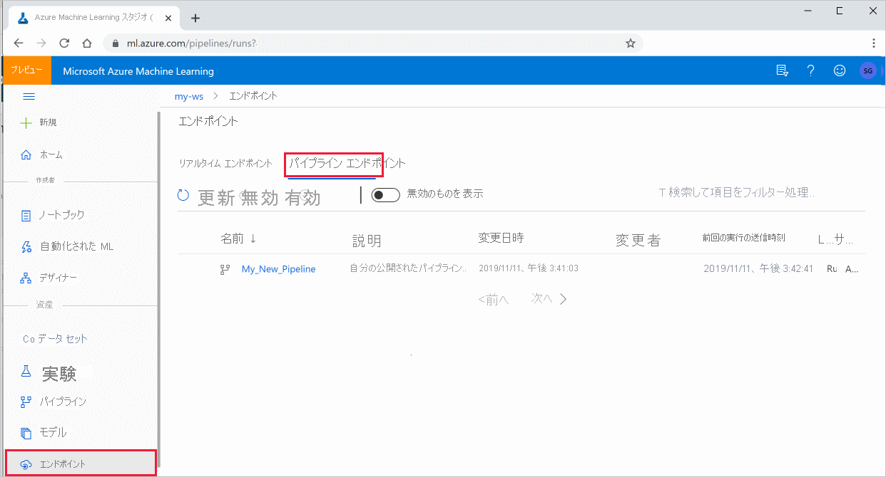

# <a name="publish-and-track-machine-learning-pipelines"></a>機械学習パイプラインを発行して追跡する


この記事では、機械学習パイプラインを同僚や顧客と共有する方法について説明します。

機械学習パイプラインは、機械学習タスクの再利用可能なワークフローです。 パイプラインの利点の 1 つは、コラボレーションの強化です。 パイプラインのバージョン管理を行うこともできます。これにより、新しいバージョンで作業しているときに、現在のモデルを使用することができます。 

## <a name="prerequisites"></a>前提条件

* すべてのパイプライン リソースを保持するために、[Azure Machine Learning ワークスペース](how-to-manage-workspace.md)を作成します

* [開発環境を構成](how-to-configure-environment.md)して Azure Machine Learning SDK をインストールするか、SDK が既にインストールされている [Azure Machine Learning コンピューティング インスタンス](concept-compute-instance.md)を使用します

* 機械学習パイプラインを作成して実行します。その際は、「[チュートリアル: バッチ スコアリング用の Azure Machine Learning パイプラインを作成する](tutorial-pipeline-batch-scoring-classification.md)」に従います。 その他のオプションについては、「[Azure Machine Learning SDK で機械学習パイプラインを作成して管理する](./how-to-create-machine-learning-pipelines.md)」を参照してください

## <a name="publish-a-pipeline"></a>パイプラインを発行する

パイプラインを起動して実行すると、パイプラインを発行することができるため、さまざまな入力で実行されます。 パラメータを受け入れるように既に発行されているパイプラインの REST エンドポイントの場合は、さまざまな引数に `PipelineParameter` オブジェクトを使用するようにパイプラインを構成する必要があります。

1. パイプライン パラメーターを作成するには、既定の値で [PipelineParameter](/python/api/azureml-pipeline-core/azureml.pipeline.core.graph.pipelineparameter) オブジェクトを使用します。

   ```python
   from azureml.pipeline.core.graph import PipelineParameter
   
   pipeline_param = PipelineParameter(
     name="pipeline_arg",
     default_value=10)
   ```

2. 次のように、パイプラインのいずれかのステップにパラメーターとしてこの `PipelineParameter` オブジェクトを追加します。

   ```python
   compareStep = PythonScriptStep(
     script_name="compare.py",
     arguments=["--comp_data1", comp_data1, "--comp_data2", comp_data2, "--output_data", out_data3, "--param1", pipeline_param],
     inputs=[ comp_data1, comp_data2],
     outputs=[out_data3],
     compute_target=compute_target,
     source_directory=project_folder)
   ```

3. 呼び出されるときにパラメーターを受け取るこのパイプラインを発行します。

   ```python
   published_pipeline1 = pipeline_run1.publish_pipeline(
        name="My_Published_Pipeline",
        description="My Published Pipeline Description",
        version="1.0")
   ```

## <a name="run-a-published-pipeline"></a>発行されたパイプラインを実行する

発行されたすべてのパイプラインに REST エンドポイントがあります。 パイプライン エンドポイントを使用すると、Python 以外のクライアントを含む任意の外部システムからパイプラインの実行をトリガーできます。 このエンドポイントでは、バッチ スコアリングと再トレーニングのシナリオでの "管理された再現性" が有効になります。

> [!IMPORTANT]
> Azure ロールベースのアクセス制御 (Azure RBAC) を使用してパイプラインへのアクセスを管理している場合は、[パイプライン シナリオ (トレーニングまたはスコアリング) のアクセス許可を設定](how-to-assign-roles.md#common-scenarios)します。

前のパイプラインの実行を呼び出すには、Azure Active Directory 認証ヘッダー トークンが必要です。 このようなトークンの取得については、[AzureCliAuthentication クラス](/python/api/azureml-core/azureml.core.authentication.azurecliauthentication)に関するリファレンスと[Authentication in Azure Machine Learning](https://aka.ms/pl-restep-auth) (Azure Machine Learning での認証) に関するノートブックで説明されています。

```python
from azureml.pipeline.core import PublishedPipeline
import requests

response = requests.post(published_pipeline1.endpoint,
                         headers=aad_token,
                         json={"ExperimentName": "My_Pipeline",
                               "ParameterAssignments": {"pipeline_arg": 20}})
```

POST 要求の `json` 引数には、`ParameterAssignments` キーの場合、パイプライン パラメーターとその値を含むディクショナリが含まれている必要があります。 また、`json` 引数には、次のキーを含めることができます。

| Key | 説明 |
| --- | --- | 
| `ExperimentName` | このエンドポイントに関連付けられている実験の名前 |
| `Description` | エンドポイントを説明する自由形式のテキスト | 
| `Tags` | 要求のラベル付けと注釈付けに使用できる自由形式のキーと値のペア  |
| `DataSetDefinitionValueAssignments` | 再トレーニングせずにデータセットを変更するために使用されるディクショナリ (以下の説明を参照) | 
| `DataPathAssignments` | 再トレーニングせずにデータパスを変更するために使用されるディクショナリ (以下の説明を参照) | 

### <a name="run-a-published-pipeline-using-c"></a>C# を使用して発行されたパイプラインを実行する 

次のコードでは、C# からパイプラインを非同期的に呼び出す方法を示します。 部分的なコード スニペットで示されているのは、呼び出しの構造だけであり、Microsoft のサンプルの一部ではありません。 完全なクラスやエラー処理は示されていません。 

```csharp
[DataContract]
public class SubmitPipelineRunRequest
{
    [DataMember]
    public string ExperimentName { get; set; }

    [DataMember]
    public string Description { get; set; }

    [DataMember(IsRequired = false)]
    public IDictionary<string, string> ParameterAssignments { get; set; }
}

// ... in its own class and method ... 
const string RestEndpoint = "your-pipeline-endpoint";

using (HttpClient client = new HttpClient())
{
    var submitPipelineRunRequest = new SubmitPipelineRunRequest()
    {
        ExperimentName = "YourExperimentName", 
        Description = "Asynchronous C# REST api call", 
        ParameterAssignments = new Dictionary<string, string>
        {
            {
                // Replace with your pipeline parameter keys and values
                "your-pipeline-parameter", "default-value"
            }
        }
    };

    string auth_key = "your-auth-key"; 
    client.DefaultRequestHeaders.Authorization = new AuthenticationHeaderValue("Bearer", auth_key);

    // submit the job
    var requestPayload = JsonConvert.SerializeObject(submitPipelineRunRequest);
    var httpContent = new StringContent(requestPayload, Encoding.UTF8, "application/json");
    var submitResponse = await client.PostAsync(RestEndpoint, httpContent).ConfigureAwait(false);
    if (!submitResponse.IsSuccessStatusCode)
    {
        await WriteFailedResponse(submitResponse); // ... method not shown ...
        return;
    }

    var result = await submitResponse.Content.ReadAsStringAsync().ConfigureAwait(false);
    var obj = JObject.Parse(result);
    // ... use `obj` dictionary to access results
}
```

### <a name="run-a-published-pipeline-using-java"></a>Java を使用して発行されたパイプラインを実行する

次のコードでは、認証を必要とするパイプラインの呼び出しを示します (「[Azure Machine Learning のリソースとワークフローの認証を設定する](how-to-setup-authentication.md)」を参照してください)。 パイプラインがパブリックにデプロイされている場合は、`authKey` を生成する呼び出しは必要ありません。 部分的なコード スニペットには、Java クラスと例外処理の定型コードは示されていません。 コードでは、空の `Optional` を返す可能性のある関数を連結するために `Optional.flatMap` が使用されています。 `flatMap` を使用すると、コードが短縮され、明確になりますが、`getRequestBody()` により例外が受け入れられることに注意してください。

```java
import java.net.URI;
import java.net.http.HttpClient;
import java.net.http.HttpRequest;
import java.net.http.HttpResponse;
import java.util.Optional;
// JSON library
import com.google.gson.Gson;

String scoringUri = "scoring-endpoint";
String tenantId = "your-tenant-id";
String clientId = "your-client-id";
String clientSecret = "your-client-secret";
String resourceManagerUrl = "https://management.azure.com";
String dataToBeScored = "{ \"ExperimentName\" : \"My_Pipeline\", \"ParameterAssignments\" : { \"pipeline_arg\" : \"20\" }}";

HttpClient client = HttpClient.newBuilder().build();
Gson gson = new Gson();

HttpRequest tokenAuthenticationRequest = tokenAuthenticationRequest(tenantId, clientId, clientSecret, resourceManagerUrl);
Optional<String> authBody = getRequestBody(client, tokenAuthenticationRequest);
Optional<String> authKey = authBody.flatMap(body -> Optional.of(gson.fromJson(body, AuthenticationBody.class).access_token);;
Optional<HttpRequest> scoringRequest = authKey.flatMap(key -> Optional.of(scoringRequest(key, scoringUri, dataToBeScored)));
Optional<String> scoringResult = scoringRequest.flatMap(req -> getRequestBody(client, req));
// ... etc (`scoringResult.orElse()`) ... 

static HttpRequest tokenAuthenticationRequest(String tenantId, String clientId, String clientSecret, String resourceManagerUrl)
{
    String authUrl = String.format("https://login.microsoftonline.com/%s/oauth2/token", tenantId);
    String clientIdParam = String.format("client_id=%s", clientId);
    String resourceParam = String.format("resource=%s", resourceManagerUrl);
    String clientSecretParam = String.format("client_secret=%s", clientSecret);

    String bodyString = String.format("grant_type=client_credentials&%s&%s&%s", clientIdParam, resourceParam, clientSecretParam);

    HttpRequest request = HttpRequest.newBuilder()
        .uri(URI.create(authUrl))
        .POST(HttpRequest.BodyPublishers.ofString(bodyString))
        .build();
    return request;
}

static HttpRequest scoringRequest(String authKey, String scoringUri, String dataToBeScored)
{
    HttpRequest request = HttpRequest.newBuilder()
        .uri(URI.create(scoringUri))
        .header("Authorization", String.format("Token %s", authKey))
        .POST(HttpRequest.BodyPublishers.ofString(dataToBeScored))
        .build();
    return request;

}

static Optional<String> getRequestBody(HttpClient client, HttpRequest request) {
    try {
        HttpResponse<String> response = client.send(request, HttpResponse.BodyHandlers.ofString());
        if (response.statusCode() != 200) {
            System.out.println(String.format("Unexpected server response %d", response.statusCode()));
            return Optional.empty();
        }
        return Optional.of(response.body());
    }catch(Exception x)
    {
        System.out.println(x.toString());
        return Optional.empty();
    }
}

class AuthenticationBody {
    String access_token;
    String token_type;
    int expires_in;
    String scope;
    String refresh_token;
    String id_token;
    
    AuthenticationBody() {}
}
```

### <a name="changing-datasets-and-datapaths-without-retraining"></a>再トレーニングせずにデータセットとデータパスを変更する

さまざまなデータセットとデータパスでトレーニングと推論を行うことができます。 たとえば、トレーニングは小さいデータセットで行い、推論は完全なデータセットで行うことができます。 データセットは、要求の `json` 引数で `DataSetDefinitionValueAssignments` キーを使用して切り替えることができます。 `DataPathAssignments` を使用してデータパスを切り替えます。 どちらの手法も似ています。

1. パイプライン定義スクリプトで、データセットの `PipelineParameter` を作成します。 `PipelineParameter` から `DatasetConsumptionConfig` または `DataPath` を作成します。

    ```python
    tabular_dataset = Dataset.Tabular.from_delimited_files('https://dprepdata.blob.core.windows.net/demo/Titanic.csv')
    tabular_pipeline_param = PipelineParameter(name="tabular_ds_param", default_value=tabular_dataset)
    tabular_ds_consumption = DatasetConsumptionConfig("tabular_dataset", tabular_pipeline_param)
    ```

1. ML スクリプトで、`Run.get_context().input_datasets` を使用して、動的に指定されたデータセットにアクセスします。

    ```python
    from azureml.core import Run
    
    input_tabular_ds = Run.get_context().input_datasets['tabular_dataset']
    dataframe = input_tabular_ds.to_pandas_dataframe()
    # ... etc ...
    ```

    ML スクリプトが、`PipelineParameter` (`tabular_ds_param`) の値ではなく `DatasetConsumptionConfig` (`tabular_dataset`) に指定された値にアクセスすることにご注意ください。

1. パイプライン定義スクリプトで、`PipelineScriptStep` のパラメーターとして `DatasetConsumptionConfig` を設定します。

    ```python
    train_step = PythonScriptStep(
        name="train_step",
        script_name="train_with_dataset.py",
        arguments=["--param1", tabular_ds_consumption],
        inputs=[tabular_ds_consumption],
        compute_target=compute_target,
        source_directory=source_directory)
    
    pipeline = Pipeline(workspace=ws, steps=[train_step])
    ```

1. 推論 REST 呼び出しでデータセットを動的に切り替えるには、`DataSetDefinitionValueAssignments` を使用します。
    
    ```python
    tabular_ds1 = Dataset.Tabular.from_delimited_files('path_to_training_dataset')
    tabular_ds2 = Dataset.Tabular.from_delimited_files('path_to_inference_dataset')
    ds1_id = tabular_ds1.id
    d22_id = tabular_ds2.id
    
    response = requests.post(rest_endpoint, 
                             headers=aad_token, 
                             json={
                                "ExperimentName": "MyRestPipeline",
                               "DataSetDefinitionValueAssignments": {
                                    "tabular_ds_param": {
                                        "SavedDataSetReference": {"Id": ds1_id #or ds2_id
                                    }}}})
    ```

この手法の完全な例は、「[データセットと PipelineParameter の紹介](https://github.com/Azure/MachineLearningNotebooks/blob/master/how-to-use-azureml/machine-learning-pipelines/intro-to-pipelines/aml-pipelines-showcasing-dataset-and-pipelineparameter.ipynb)」と「[データパスと PipelineParameter の紹介](https://github.com/Azure/MachineLearningNotebooks/blob/master/how-to-use-azureml/machine-learning-pipelines/intro-to-pipelines/aml-pipelines-showcasing-datapath-and-pipelineparameter.ipynb)」のノートブックにあります。

## <a name="create-a-versioned-pipeline-endpoint"></a>バージョン管理されたパイプライン エンドポイントを作成する

パイプライン エンドポイントは、背後にある発行された複数のパイプラインを使用して作成できます。 この手法を使用すると、反復処理を行って ML パイプラインを更新するときに、固定の REST エンドポイントを使用できます。

```python
from azureml.pipeline.core import PipelineEndpoint

published_pipeline = PipelineEndpoint.get(workspace=ws, name="My_Published_Pipeline")
pipeline_endpoint = PipelineEndpoint.publish(workspace=ws, name="PipelineEndpointTest",
                                            pipeline=published_pipeline, description="Test description Notebook")
```

## <a name="submit-a-job-to-a-pipeline-endpoint"></a>パイプライン エンドポイントにジョブを送信する

パイプライン エンドポイントの既定のバージョンにジョブを送信できます。

```python
pipeline_endpoint_by_name = PipelineEndpoint.get(workspace=ws, name="PipelineEndpointTest")
run_id = pipeline_endpoint_by_name.submit("PipelineEndpointExperiment")
print(run_id)
```

また、特定のバージョンにジョブを送信することもできます。

```python
run_id = pipeline_endpoint_by_name.submit("PipelineEndpointExperiment", pipeline_version="0")
print(run_id)
```

同じ操作は、REST API を使用して実行できます。

```python
rest_endpoint = pipeline_endpoint_by_name.endpoint
response = requests.post(rest_endpoint, 
                         headers=aad_token, 
                         json={"ExperimentName": "PipelineEndpointExperiment",
                               "RunSource": "API",
                               "ParameterAssignments": {"1": "united", "2":"city"}})
```

## <a name="use-published-pipelines-in-the-studio"></a>Studio で発行されたパイプラインを使用する

Studio から発行されたパイプラインを実行することもできます。

1. [Azure Machine Learning Studio](https://ml.azure.com) にサインインします。

1. [ワークスペースを表示します](how-to-manage-workspace.md#view)。

1. 左側で、 **[エンドポイント]** を選択します。

1. 上部で、 **[Pipeline endpoints]\(パイプライン エンドポイント\)** を選択します。
 

1. 実行または使用する、またはパイプライン エンドポイントの以前の実行の結果を確認する、特定のパイプラインを選択します。

## <a name="disable-a-published-pipeline"></a>発行されたパイプラインを無効にする

発行済みパイプラインの一覧にパイプラインが表示されないようにするには、Studio または SDK でそれを無効にします。

```python
# Get the pipeline by using its ID from Azure Machine Learning studio
p = PublishedPipeline.get(ws, id="068f4885-7088-424b-8ce2-eeb9ba5381a6")
p.disable()
```

`p.enable()` で再び有効にすることができます。 詳しくは、[PublishedPipeline クラス](/python/api/azureml-pipeline-core/azureml.pipeline.core.publishedpipeline)のリファレンスを参照してください。

## <a name="next-steps"></a>次のステップ

- [GitHub 上のこれらの Jupyter notebook](https://aka.ms/aml-pipeline-readme) を使用して、機械学習パイプラインをさらに調べます。
- [azureml-pipelines-core](/python/api/azureml-pipeline-core/) パッケージおよび [azureml-pipelines-steps](/python/api/azureml-pipeline-steps/) パッケージの SDK リファレンス ヘルプを参照します。
- パイプラインのデバッグとトラブルシューティングに関するヒントについては、[ハウツー](how-to-debug-pipelines.md)記事を参照してください。