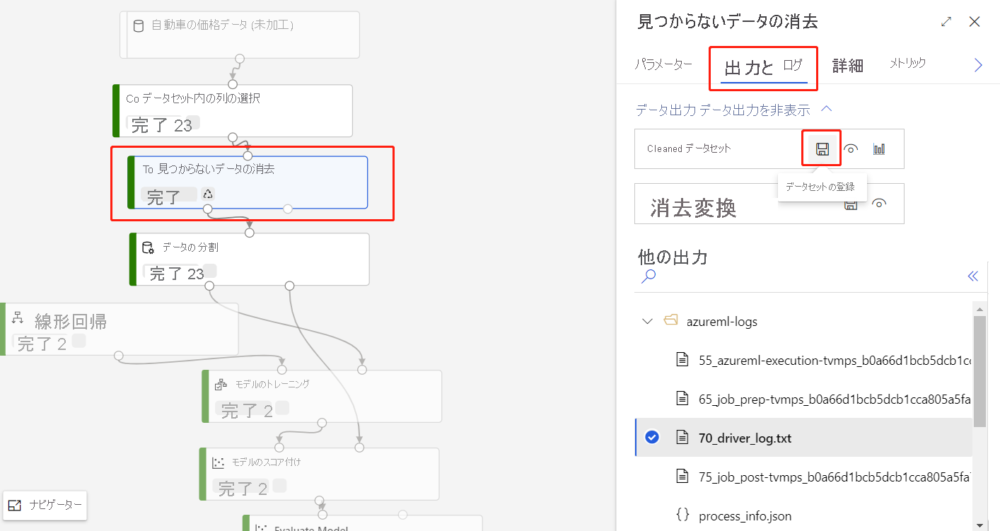
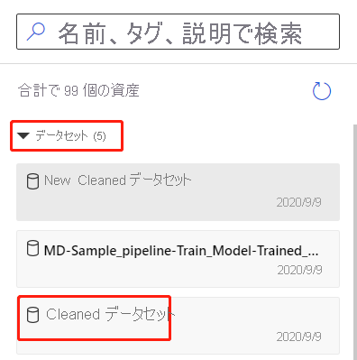

# Azure Machine Learning デザイナー (プレビュー) へデータをインポートする

この記事では、デザイナーに独自のデータをインポートして、カスタム ソリューションを作成する方法について説明します。 デザイナーにデータをインポートするには、次の 2 つの方法があります。 

* **Azure Machine Learning データセット** - Azure Machine Learning に[データセット](concept-data.md#datasets)を登録して、データを管理するのに役立つ高度な機能を有効にします。
* **データのインポート モジュール** - [データのインポート](algorithm-module-reference/import-data.md) モジュールを使用して、オンライン データ ソースから直接データにアクセスします。

## Azure Machine Learning データセットを使用する

Microsoft では、[データセット](concept-data.md#datasets) 使用して、デザイナーにデータをインポートすることをお勧めします。 データセットを登録すると、[バージョン管理と追跡](how-to-version-track-datasets.md)や[データ監視](how-to-monitor-datasets.md)などの高度なデータ機能を最大限に活用できます。

### データセットを登録する

既存のデータセットは、[SDK を使用してプログラム](how-to-create-register-datasets.md#use-the-sdk)で登録することも、[Azure Machine Learning studio で視覚的](how-to-create-register-datasets.md#use-the-ui)に登録することもできます。

また、任意のデザイナー モジュールの出力をデータセットとして登録することもできます。

1. 登録するデータを出力するモジュールを選択します。

1. [プロパティ] ウィンドウで、 **[出力]**  >  **[データセットの登録]** の順に選択します。

    

### データセットを使用する

登録したデータセットは、 **[データセット]**  >  **[マイ データセット]** にあるモジュール パレットからアクセスできます。 データセットを使用するには、パイプライン キャンバスにドラッグ アンド ドロップします。 次に、データセットの出力ポートをパレット内の他のモジュールに接続します。

> [!NOTE]
> 現時点では、デザイナーでは[表形式データ](how-to-create-register-datasets.md#dataset-types)の処理のみがサポートされています。 [ファイル データセット](how-to-create-register-datasets.md#dataset-types)を使用する場合は、Python および R で使用可能な Azure Machine Learning SDK を使用します。

## データのインポート モジュールを使用してデータをインポートする

データセットを使用してデータをインポートすることをお勧めしていますが、[[データのインポート]](algorithm-module-reference/import-data.md) モジュールを使用することもできます。 [データのインポート] モジュールは、Azure Machine Learning でのデータセットの登録をスキップし、[データストア](concept-data.md#datastores)または HTTP URL から直接データをインポートします。

[データのインポート] モジュールの詳しい使用方法については、[データのインポートの参照ページ](algorithm-module-reference/import-data.md)を参照してください。

> [!NOTE]
> データセットに含まれる列が多すぎる場合、次のエラーが発生することがあります。"サイズ制限のため、検証に失敗しました。" これを回避するには、[データセットを Datasets インターフェイスに登録します](how-to-create-register-datasets.md#use-the-ui)。

## サポートされているソース

このセクションでは、デザイナーでサポートされているデータ ソースの一覧を示します。 データは、データストアまたは[表形式データセット](how-to-create-register-datasets.md#dataset-types)からデザイナーにインポートされます。

### データストアのソース
サポートされているデータストア ソースの一覧については、「[Azure ストレージ サービスのデータにアクセスする](how-to-access-data.md#supported-data-storage-service-types)」を参照してください。

### 表形式データセットのソース

デザイナーは、次のソースから作成された表形式データセットをサポートしています。
 * 区切りファイル
 * JSON ファイル
 * Parquet ファイル
 * SQL クエリ

## データ型

デザイナーは、内部的に次のデータ型を認識します。

* String
* Integer
* Decimal
* Boolean
* Date

デザイナーは、内部データ型を使用してモジュール間でデータを渡します。 [データセットへの変換](algorithm-module-reference/convert-to-dataset.md)モジュールを使用して、データ テーブル形式にデータを明示的に変換できます。 内部形式以外の形式を受け取るどのモジュールでも、次のモジュールに渡す前に、サイレント モードでデータを変換します。

## データの制約

デザイナーのモジュールは、コンピューティング先のサイズによって制限されます。 大規模なデータセットの場合は、より大きな Azure Machine Learning コンピューティング リソースを使用する必要があります。 Azure Machine Learning コンピューティングの詳細については、「[Azure Machine Learning でのコンピューティング先とは](concept-compute-target.md#azure-machine-learning-compute-managed)」を参照してください。

## 次のステップ

デザイナーの基本については、「[チュートリアル:デザイナーを使用して自動車の価格を予測する](tutorial-designer-automobile-price-train-score.md)」を参照してください。
