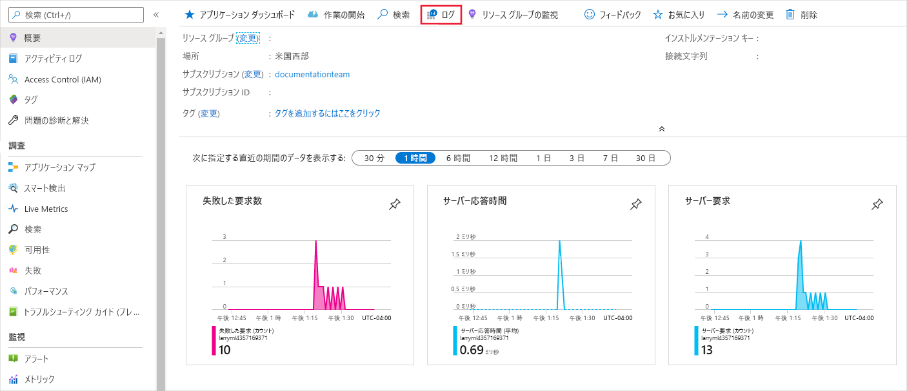
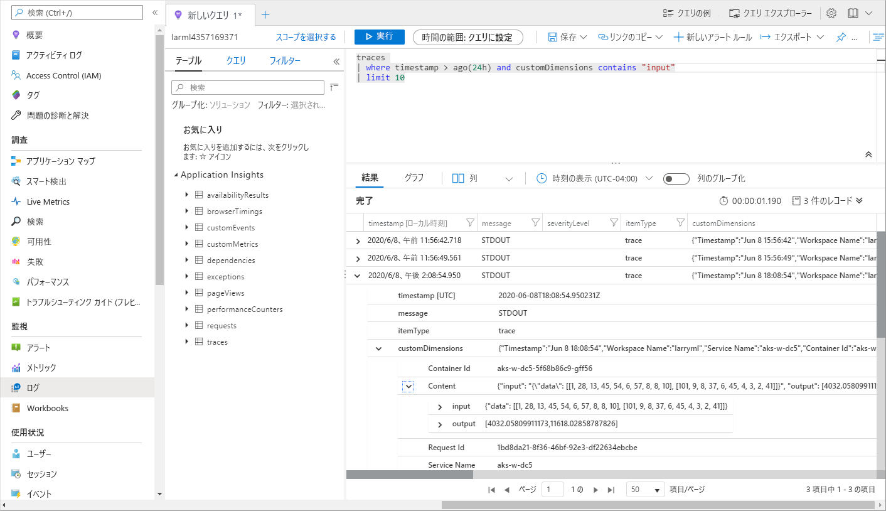

# <a name="monitor-and-collect-data-from-ml-web-service-endpoints"></a>ML Web サービス エンドポイントからのデータを監視および収集する
[!INCLUDE [applies-to-skus](../../includes/aml-applies-to-basic-enterprise-sku.md)]

この記事では、Azure Application Insights を有効にすることで、Azure Kubernetes Service (AKS) または Azure Container Instances (ACI) で Web サービス エンドポイントにデプロイされたモデルのデータを収集および監視する方法について説明します。 
* [Azure Machine Learning Python SDK](#python)
* [Azure Machine Learning Studio](#studio) (https://ml.azure.com )

エンドポイントの出力データと応答を収集するだけでなく、次の情報を監視できます。

* 要求率、応答時間、失敗率
* 依存率、応答時間、失敗率
* 例外

[Azure Application Insights の詳細を学習する](../azure-monitor/app/app-insights-overview.md)。 


## <a name="prerequisites"></a>前提条件

* Azure サブスクリプションをお持ちでない場合は、開始する前に無料アカウントを作成してください。 [無料版または有料版の Azure Machine Learning](https://aka.ms/AMLFree) を試してください

* Azure Machine Learning ワークスペース、スクリプトを保存するローカル ディレクトリ、および Azure Machine Learning SDK for Python のインストール。 これらの前提条件を満たす方法については、[開発環境を構成する方法](how-to-configure-environment.md)に関する記事を参照してください。

* Azure Kubernetes Service (AKS) または Azure コンテナー インスタンス (ACI) にデプロイするトレーニング済みの機械学習モデル。 ない場合は、[イメージ分類モデルのトレーニング](tutorial-train-models-with-aml.md)に関するチュートリアルを参照してください。

## <a name="web-service-metadata-and-response-data"></a>Web サービスのメタデータと応答データ

>[!Important]
> Azure Application Insights では、最大 64 KB のペイロードのみがログに記録されます。 この制限に達すると、その後はモデルの最新の出力のみがログに記録されます。 

サービスへのメタデータと応答は、Web サービスのメタデータとモデルの予測に対応しており、メッセージ `"model_data_collection"` で Azure Application Insights のトレースに記録されます。 Azure Application Insights に直接クエリを実行してこのデータにアクセスしたり、長期の保持やさらなる処理のためにストレージ アカウントに対する[連続エクスポート](https://docs.microsoft.com/azure/azure-monitor/app/export-telemetry)を設定したりできます。 モデル データはその後、Azure Machine Learning で、ラベル付け、再トレーニング、説明、データ分析などの用途を設定するために使用できます。 

<a name="python"></a>

## <a name="use-python-sdk-to-configure"></a>Python SDK を使用して構成する 

### <a name="update-a-deployed-service"></a>デプロイされたサービスを更新する

1. ワークスペースで、サービスを特定します。 `ws` の値はワークスペースの名前です。

    ```python
    from azureml.core.webservice import Webservice
    aks_service= Webservice(ws, "my-service-name")
    ```
2. サービスを更新し、Azure Application Insights を有効にします。

    ```python
    aks_service.update(enable_app_insights=True)
    ```

### <a name="log-custom-traces-in-your-service"></a>サービスのカスタム トレースをログに記録する

カスタム トレースをログに記録する場合は、[デプロイする方法と場所](how-to-deploy-and-where.md)のドキュメントにある AKS または ACI のための標準のデプロイ プロセスに従います。 次に、次の手順を使用します。

1. print ステートメントを追加してスコアリング ファイルを更新します。
    
    ```python
    print ("model initialized" + time.strftime("%H:%M:%S"))
    ```

2. サービスの構成を更新します。
    
    ```python
    config = Webservice.deploy_configuration(enable_app_insights=True)
    ```

3. イメージをビルドし、[AKS または ACI](how-to-deploy-and-where.md) にデプロイします。

### <a name="disable-tracking-in-python"></a>Python で追跡を無効にする

Azure Application Insights を無効にするには、次のコードを使用します。

```python 
## replace <service_name> with the name of the web service
<service_name>.update(enable_app_insights=False)
```

<a name="studio"></a>

## <a name="use-azure-machine-learning-studio-to-configure"></a>Azure Machine Learning Studio を使用して構成する

次の手順でモデルをデプロイする準備ができたときに、Azure Machine Learning Studio から Azure Application Insights を有効にすることもできます。

1. ワークスペース (https://ml.azure.com/ ) にサインインします。
1. **[モデル]** に移動し、デプロイするモデルを選択します。
1. **[+ デプロイ]** を選択します。
1. **[モデルのデプロイ]** フフォームに入力します。
1. **[詳細設定]** メニューを展開します。

    
1. **[Application Insights の診断とデータ収集を有効にする]** を選択します。

    
## <a name="evaluate-data"></a>データを評価する
サービスのデータは、Azure Machine Learning と同じリソース グループ内の Azure Application Insights アカウントに保存されます。
表示するには:

1. [Azure portal](https://ms.portal.azure.com/) で Azure Machine Learning ワークスペースに移動し、Application Insights リンクをクリックします。

    [](././media/how-to-enable-app-insights/AppInsightsLoc.png#lightbox)

1. **[概要]** タブを選択すると、サービスの基本的なメトリック セットが表示されます。

   [](././media/how-to-enable-app-insights/overview.png#lightbox)

1. Web サービス要求のメタデータと応答を確認するには、 **[ログ (Analytics)]** セクションで **[要求]** テーブルを選択し、 **[実行]** を選択して要求を表示します

   [](././media/how-to-enable-app-insights/model-data-trace.png#lightbox)


3. カスタム トレースを確認するには、 **[分析]** を選択します。
4. [スキーマ] セクションで **[トレース]** を選択します。 次に、 **[実行]** を選択してクエリを実行します。 データは表形式で表示され、スコアリング ファイルのカスタムの呼び出しにマップされます。

   [](././media/how-to-enable-app-insights/logs.png#lightbox)

Azure Application Insights の使用方法の詳細については、「[Application Insights とは何か?](../azure-monitor/app/app-insights-overview.md)」を参照してください。

## <a name="export-data-for-further-processing-and-longer-retention"></a>追加の処理と長期保持のためにデータをエクスポートする

>[!Important]
> Azure Application Insights では、BLOB ストレージへのエクスポートのみがサポートされています。 このエクスポート機能の追加の制限については「[Application Insights からのテレメトリのエクスポート](https://docs.microsoft.com/azure/azure-monitor/app/export-telemetry#continuous-export-advanced-storage-configuration)」に示されています。

Azure Application Insights の[連続エクスポート](https://docs.microsoft.com/azure/azure-monitor/app/export-telemetry)を使用して、サポートされているストレージ アカウントにメッセージを送信し、より長い保持を設定できます。 `"model_data_collection"` メッセージは JSON 形式で格納され、簡単に解析してモデル データを抽出できます。 

Azure Data Factory、Azure ML パイプライン、またはその他のデータ処理ツールを使用して、必要に応じてデータを変換できます。 データを変換したら、データセットとして Azure Machine Learning ワークスペースに登録できます。 そのためには、[データセットを作成して登録する方法](how-to-create-register-datasets.md)に関するページをご覧ください。

   [](././media/how-to-enable-app-insights/continuous-export-setup.png)


## <a name="example-notebook"></a>ノートブックの例

[enable-app-insights-in-production-service.ipynb](https://github.com/Azure/MachineLearningNotebooks/blob/master/how-to-use-azureml/deployment/enable-app-insights-in-production-service/enable-app-insights-in-production-service.ipynb) ノートブックは、この記事の概念を示しています。 
 
[!INCLUDE [aml-clone-in-azure-notebook](../../includes/aml-clone-for-examples.md)]

## <a name="next-steps"></a>次のステップ

* モデルを Web サービス エンドポイントにデプロイし、Azure Application Insights でデータの収集を利用してエンドポイントを監視できるようにするには、[Azure Kubernetes Service クラスターにモデルをデプロイする方法](https://docs.microsoft.com/azure/machine-learning/how-to-deploy-azure-kubernetes-service)または[モデルを Azure Container Instances にデプロイする方法](https://docs.microsoft.com/azure/machine-learning/how-to-deploy-azure-container-instance)に関する記事をご覧ください。
* 「[MLOps: Azure Machine Learning でモデルを管理、デプロイ、および監視する](https://docs.microsoft.com/azure/machine-learning/concept-model-management-and-deployment)」を参照して、運用環境のモデルから収集されたデータの利用の詳細について確認してください。 このようなデータは、機械学習プロセスを継続的に改善するのに役立ちます。
