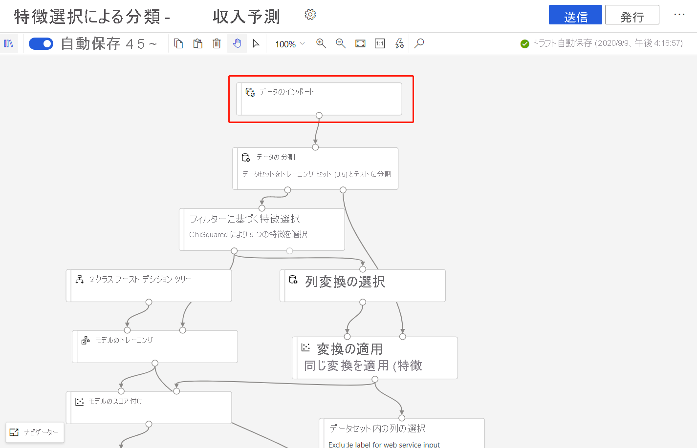

# Azure Machine Learning デザイナーを使用してモデルを再トレーニングする (プレビュー)
[!INCLUDE [applies-to-skus](../../includes/aml-applies-to-enterprise-sku.md)]

このハウツー記事では、Azure Machine Learning デザイナーを使用して機械学習モデルを再トレーニングする方法について説明します。 発行されたパイプラインを使用してワークフローを自動化し、パラメーターを設定して新しいデータに対してモデルをトレーニングします。 

この記事では、次のことについて説明します。

> [!div class="checklist"]
> * 機械学習モデルをトレーニングする。
> * パイプライン パラメーターを作成する。
> * トレーニング パイプラインを発行する。
> * 新しいパラメーターを使用してモデルを再トレーニングします。

## 前提条件

* Enterprise SKU の Azure Machine Learning ワークスペース。
* この操作方法シリーズのパート 1、[デザイナーでのデータの変換](how-to-designer-transform-data.md)に関する記事を完了してください。

また、この記事は、デザイナーでパイプラインを構築することの基本的知識を持っていることも前提としています。 ガイド付きの概要については、[チュートリアル](tutorial-designer-automobile-price-train-score.md)を完了してください。 

### サンプル パイプライン

この記事で使用されているパイプラインは、[サンプル 3: 収入予測](samples-designer.md#classification)で取り上げたパイプラインの変更されたバージョンです。 サンプル データセットではなく[データのインポート](algorithm-module-reference/import-data.md) モジュールをパイプラインに使用して、独自のデータを利用してモデルをトレーニングする方法を示します。

## パイプライン パラメーターを作成する

パイプライン パラメーターを作成して実行時に変数を動的に設定します。 この例では、トレーニング データ パスを固定値からパラメーターに変更し、別のデータに対してモデルを再トレーニングできるようにします。

1. **[データのインポート]** モジュールを選択します。

    > [!NOTE]
    > この例では、[データのインポート] モジュールを使用して、登録済みデータストアのデータにアクセスします。 ただし、代替のデータ アクセス パターンを使用する場合は、同様の手順を実行できます。

1. モジュールの詳細ペインで、キャンバスの右側にあるデータ ソースを選択します。

1. データのパスを入力します。 また、 **[パスの参照]** を選択してファイル ツリーを参照することもできます。 

1. **[パス]** フィールドにマウスを置き、表示される **[パス]** フィールドの上にある省略記号 (...) を選択します。

    

1. **[Add to pipeline parameter]\(パイプライン パラメーターに追加する\)** を選択します。

1. パラメーター名と既定値を指定します。

   > [!NOTE]
   > パイプライン ドラフトのタイトルの横にある **[設定]** の歯車アイコンを選択すると、パイプライン パラメーターを調べて編集することができます。 

1. **[保存]** を選択します。

1. パイプラインの実行を送信します。

## トレーニング済みのモデルを検索する

デザイナーでは、トレーニング済みのモデルを含むすべてのパイプライン出力が、既定のワークスペース ストレージ アカウントに保存されます。 デザイナーから直接トレーニングされたモデルにアクセスすることもできます。

1. パイプラインの実行が完了するまで待機します。
1. **Train Model** (モデルのトレーニング) モジュールを選択します。
1. キャンバスの右側にある [モジュールの詳細] ペインで **[Outputs + logs]\(出力 + ログ\)** を選択します。
1. **[その他の出力]** で実行ログと共にモデルを見つけることができます。
1. または、 **[出力の表示]** アイコンを選択します。 ここでは、ダイアログの指示に従って、データストアに直接移動できます。 

## トレーニング パイプラインを発行する

パイプラインをパイプライン エンドポイントに発行して、後で簡単にパイプラインを再利用できるようにします。 後でパイプラインを呼び出すことができるように、パイプライン エンドポイントを使用して REST エンドポイントを作成することができます。 この例では、パイプライン エンドポイントを使用して、パイプラインを再利用し、異なるデータに対してモデルを再トレーニングできます。

1. デザイナー キャンバス上の **[Publish] (発行)** を選択します。
1. パイプライン エンドポイントを選択するか作成します。

   > [!NOTE]
   > 複数のパイプラインを単一のエンドポイントに発行できます。 特定のエンドポイント内の各パイプラインにはバージョン番号が付けられます。パイプライン エンドポイントを呼び出すときに、この番号を指定できます。

1. **[発行]** を選択します。

## モデルを再トレーニングする

これでトレーニング パイプラインが発行されたので、それを利用し、新しいデータに対してモデルを再トレーニングできます。 パイプライン エンドポイントから実行を送信するには、studio ワークスペースまたはプログラムを使用します。

### デザイナーを使用して実行を送信する

以下の手順を使用して、デザイナーからパラメーター化されたパイプライン エンドポイントの実行を送信します。

1. studio ワークスペースの **[エンドポイント]** ページに移動します。
1. **[パイプライン エンドポイント]** タブを選択します。次に、パイプライン エンドポイントを選択します。
1. **[Published pipelines] (公開済みパイプライン)** タブを選択します。次に、実行するパイプラインのバージョンを選択します。
1. **[Submit]\(送信\)** をクリックします。
1. 設定ダイアログ ボックスで、実行のパラメーター値を指定できます。 この例では、データ パスを更新して、米国以外のデータセットを使用してモデルをトレーニングします。

### コードを使用して実行を送信する

概要パネルには、発行されたパイプラインの REST エンドポイントが表示されます。 エンドポイントを呼び出すことにより、発行されたパイプラインを再トレーニングできます。

REST 呼び出しを行うには、OAuth 2.0 ベアラー型認証ヘッダーが必要です。 ワークスペースへの認証を設定し、パラメーター化された REST 呼び出しを行う方法の詳細については、「[バッチ スコアリング用の Azure Machine Learning パイプラインを作成する](tutorial-pipeline-batch-scoring-classification.md#publish-and-run-from-a-rest-endpoint)」を参照してください。

## 次のステップ

この記事では、デザイナーを使用してパラメーター化されたトレーニング パイプライン エンドポイントを作成する方法について説明しました。

モデルをデプロイして予測を行う方法の詳細なチュートリアルについては、[デザイナーのチュートリアル](tutorial-designer-automobile-price-train-score.md)を参照して回帰モデルをトレーニングおよびデプロイしてください。
