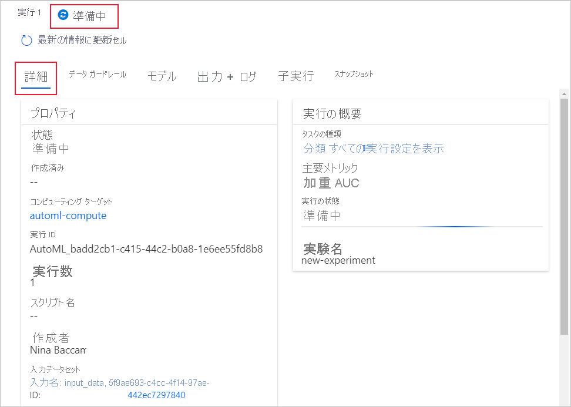

# <a name="create-review-and-deploy-automated-machine-learning-models-with-azure-machine-learning"></a>Azure Machine Learning を使用して自動機械学習モデルを作成、確認、デプロイする
[!INCLUDE [applies-to-skus](../../includes/aml-applies-to-enterprise-sku.md)]

この記事では、Azure Machine Learning の studio インターフェイスで 1 行のコードも使わずに、自動化された機械学習モデルを作成、参照、デプロイする方法について説明します。 自動機械学習は、特定のデータに使用する最適な機械学習アルゴリズムを選択するプロセスです。 このプロセスにより、機械学習モデルを迅速に生成できます。 [自動化された機械学習の詳細については、こちらを参照してください](concept-automated-ml.md)。
 
エンド ツー エンドの例については、[Azure Machine Learning の自動 ML インターフェイスでの分類モデルの作成に関するチュートリアル](tutorial-first-experiment-automated-ml.md)をお試しください。 

Python コードベースのエクスペリエンスでは、Azure Machine Learning SDK を使用して、[自動化された機械学習の実験を構成する](how-to-configure-auto-train.md)こともできます。

## <a name="prerequisites"></a>前提条件

* Azure サブスクリプション。 Azure サブスクリプションをお持ちでない場合は、開始する前に無料アカウントを作成してください。 [無料版または有料版の Azure Machine Learning](https://aka.ms/AMLFree) を今すぐお試しください。

* **Enterprise Edition** タイプの Azure Machine Learning のワークスペース [Azure Machine Learning ワークスペースを作成する](how-to-manage-workspace.md)方法に関するページを参照してください。  既存のワークスペースを Enterprise Edition にアップグレードする方法については、[Enterprise Edition へのアップグレード](how-to-manage-workspace.md#upgrade)に関する記事を参照してください。

## <a name="get-started"></a>はじめに

1. https://ml.azure.com で Azure Machine Learning にサインインします。 

1. サブスクリプションとワークスペースを選択します。 

1. 左ウィンドウに移動します。 **[作成者]** セクションで **[Automated ML]\(自動 ML\)** を選択します。

[](media/how-to-use-automated-ml-for-ml-models/nav-pane-expanded.png)

 これが初めて実行する実験である場合、空のリストとドキュメントへのリンクが表示されます。 

そうではない場合、SDK で作成された実験を含む最近の自動機械学習の実験のリストが表示されます。 

## <a name="create-and-run-experiment"></a>実験を作成して実行する

1. **[+新しい自動 ML の実行]** を選択し、フォームを設定します。

1. ストレージ コンテナーからデータセットを作成するか、新しいデータセットを作成します。 データセットは、ローカル ファイル、Web URL、データストア、または Azure Open Datasets から作成できます。 

    >[!Important]
    > トレーニング データの要件:
    >* データは表形式である必要があります。
    >* 予測する値 (ターゲット列) は、データ内に存在する必要があります。

    1. ローカル コンピューター上のファイルから新しいデータセットを作成するには、 **[参照]** を選択し、ファイルを選択します。 

    1. データセットに一意の名前を付け、必要に応じて説明を入力します。 

    1. **[次へ]** を選択して、 **[データストアとファイルの選択] フォーム**を開きます。 このフォームで、データセットのアップロード先を選択します。ワークスペースで自動的に作成される既定のストレージ コンテナーか、実験に使用するストレージ コンテナーを選択します。 

    1. **[Settings and preview]/(設定とプレビュー/)** フォームで入力が正しいか確認します。 フォームはファイルの種類に基づいてインテリジェントに設定されます。 

        フィールド| 説明
        ----|----
        ファイル形式| ファイルに格納されているデータのレイアウトと種類を定義します。
        区切り記号| プレーン テキストまたは他のデータ ストリーム内の個別の独立した領域の間の境界を指定するための 1 つ以上の文字。
        エンコード| データセットの読み取りに使用する、ビットと文字のスキーマ テーブルを識別します。
        列見出し| データセットの見出しがある場合、それがどのように処理されるかを示します。
        行のスキップ | データセット内でスキップされる行がある場合、その行数を示します。
    
        **[次へ]** を選択します。

    1. **[Settings and preview]\(設定とプレビュー\)** フォームでの選択に基づいて、 **[Schema]\(スキーマ\)** フォームがインテリジェントに設定されます。 ここでは、各列のデータ型を構成し、列名を確認し、実験に**含めない**列を選択します。 
            
        **[次へ]** を選択します。

    1. **[詳細の確認]** フォームは、 **[基本情報]** および **[設定とプレビュー]** のフォームに以前に入力された情報の概要です。 プロファイリングが有効になっているコンピューティングを使用してデータセットのデータ プロファイルを作成するオプションもあります。 [データ プロファイル](#profile)についてさらに理解を深める。

        **[次へ]** を選択します。
1. 新しく作成したデータセットが表示されたら、それを選択します。 また、データセットとサンプル統計のプレビューを表示することもできます。 

1. **[Configure run]\(構成の実行\)** フォームで、一意の実験名を入力します。

1. ターゲット列を選択します。これは、予測を実行する列です。

1. データ プロファイルとトレーニング ジョブのコンピューティングを選択します。 既存のコンピューティングの一覧は、ドロップダウン リストにあります。 新しいコンピューティングを作成するには、ステップ 7 の手順に従います。

1. **[Create a new compute]\(新しいコンピューティングの作成\)** を選択して、この実験のコンピューティング コンテキストを構成します。

    フィールド|説明
    ---|---
    コンピューティング名| コンピューティング コンテキストを識別する一意名を入力します。
    仮想マシンのサイズ| コンピューティングの仮想マシン サイズを選択します。
    最小および最大ノード ([詳細設定] 内)| データをプロファイリングするには、1 つ以上のノードを指定する必要があります。 コンピューティングの最大ノード数を入力します。 AML コンピューティングの既定は 6 ノードです。
    
    **［作成］** を選択します 新しいコンピューティングの作成には数分かかる場合があります。

    >[!NOTE]
    > コンピューティング名は、選択または作成するコンピューティングで*プロファイルが有効*になっているかどうかを示します (詳細については、[データ プロファイル](#profile)に関するセクションを参照してください)。

    **[次へ]** を選択します。

1. **[Task type and settings]\(タスクの種類と設定\)** フォームで、[classification]\(分類\)、[regression]\(回帰\)、または [forecasting]\(予測\) のタスクの種類を選択します。 詳細については、[タスクの種類の定義方法](how-to-define-task-type.md)に関するページを参照してください。

    1. 分類するため、テキストの特徴付けに使用されるディープ ラーニングを有効にすることもできます。

    1. 予測の場合:
        1. 時間列の選択:この列には、使用する時間データが含まれています。

        1. 予測期間を選択します。モデルで将来を予測できる時間単位 (分/時間/日/週/月/年) の数を示します。 モデルで将来を予測する期間が延びるほど、正確性が下がります。 [予測と予測期間の詳細については、こちらを参照してください](how-to-auto-train-forecast.md)。

1. (省略可能) 追加の構成設定の表示: トレーニング ジョブをより細かく制御するのに使用できる追加の設定です。 設定しない場合、実験の選択とデータに基づいて既定値が適用されます。 

    追加の構成|説明
    ------|------
    主要メトリック| モデルをスコアリングするために使用される主なメトリックです。 [モデルのメトリックの詳細については、こちらを参照してください](how-to-configure-auto-train.md#explore-model-metrics)。
    自動特徴付け| 自動化された機械学習によって行われる前処理を有効または無効にするように選択します。 前処理には、合成的特徴を生成するための自動データ クレンジング、準備、変換が含まれます。 時系列予測のタスクの種類ではサポートされていません。 [前処理の詳細については、こちらを参照してください](#featurization)。 
    最適なモデルの説明 | 推奨される最適なモデルの説明の表示を有効または無効にするように選択します。
    Blocked algorithm (ブロックするアルゴリズム)| トレーニング ジョブから除外するアルゴリズムを選択します。
    終了条件| これらの基準のどれかが満たされると、トレーニング ジョブが終了します。 <br> *トレーニング ジョブ時間 (時間単位)* :トレーニング ジョブを実行できる時間の長さ。 <br> *Metric score threshold* (メトリック スコアのしきい値): すべてのパイプラインの最小メトリック スコアです。 これにより、達成目標のターゲット メトリックを定義した場合には、必要以上にトレーニング ジョブに時間を費やすことはなくなります。
    検証| トレーニング ジョブで使用するクロス検証オプションをどれか選択します。 [クロス検証の詳細については、こちらを参照してください](how-to-configure-auto-train.md)。
    コンカレンシー| *コンカレント イテレーションの最大数*:トレーニング ジョブでテストするパイプライン (イテレーション) の最大数。 ジョブは、指定したイテレーションの数より多く実行されることはありません。

1. (省略可能) 特徴選択の設定の表示: **追加の構成設定**フォームで **[自動特性付け]** を有効にすることを選択した場合、このフォームでは、これらの特性付けを実行する列を指定し、欠落値の補完に使用する統計値を選択します。

<a name="profile"></a>

## <a name="data-profiling--summary-stats"></a>データ プロファイルと概要統計情報

データ セットが ML 対応であるかどうかを確認するために、データ セット全体で幅広い概要統計情報を取得できます。 数値以外の列の場合、最小、最大、エラー数などの基本的な統計情報だけが含まれます。 数値列の場合は、その統計学的モーメントと、推定される分位点も確認できます。 具体的には、データ プロファイルには以下が含まれています。

>[!NOTE]
> 無関係な型を持つ特徴には空白のエントリが表示されます。

統計|説明
------|------
機能| 集約されている列の名前。
プロファイル| 推論された型に基づくインライン視覚化。 たとえば、文字列、ブール値、日付には値の数が示される一方、10 進数 (数値) は近似されたヒストグラムが示されます。 これにより、データの分布を簡単に把握できます。
型の分布| 列内の型のインライン値カウント。 Null は独自の型であるため、この視覚化は変則値または欠損値を検出するために便利です。
Type|推論される列の型。 使用可能な値には、文字列、ブール値、日付、10 進数が含まれます。
Min| 列の最小値。 型に固有の順序 (ブール数など) がない特徴の場合、空白のエントリが表示されます。
Max| 列の最大値。 
Count| 列内の欠落しているエントリと欠落していないエントリの合計数。
Not Missing Count| 列内の欠落していないエントリの数。 空の文字列とエラーは値として扱われるため、"欠落していないカウント" には含まれません。
分位点| データの分布感を提供する、各分位点での近似値。
平均| 列の算術平均。
標準偏差| この列のデータの分散または変動の尺度。
Variance| この列のデータが平均値からどのくらい離れているかを示す尺度。 
傾斜| この列のデータが正規分布とどのくらい異なるかを示す尺度。
尖度| この列のデータが正規分布と比較してどのくらい裾の重い分布になっているかを示す尺度。

<a name="featurization"></a>

## <a name="advanced-featurization-options"></a>詳細な特徴付けオプション

自動機械学習では、[オーバーフィットや偏ったデータ](concept-manage-ml-pitfalls.md#prevent-over-fitting)など、データの潜在的な問題を特定して管理するために、前処理とデータ ガードレールが自動的に提供されます。 

### <a name="preprocessing"></a>前処理

> [!NOTE]
> 自動 ML で作成されたモデルを [ONNX モデル](concept-onnx.md) にエクスポートする予定がある場合、* で示された特徴付けオプションのみが ONNX 形式でサポートされます。 [モデルの ONNX への変換](concept-automated-ml.md#use-with-onnx)の詳細についてご確認ください。 

|前処理手順&nbsp;| 説明 |
| ------------- | ------------- |
|高カーディナリティまたは差異なしの特徴の削除* |これらをトレーニング セットおよび検証セットから削除します。まったく値が存在しない特徴、すべての行の値が同じである特徴、非常に高いカーディナリティ (ハッシュ、ID、GUID など) の特徴が含まれます。|
|欠損値の補完* |数値特徴の場合、その列の平均値で補完します。<br/><br/>カテゴリ特徴の場合、出現回数が最も多い値で補完します。|
|その他の特徴の生成* |DateTime の特徴:年、月、日、曜日、年の通算日、四半期、年の通算週、時間、分、秒。<br/><br/>テキストの特徴:ユニグラム、バイグラム、文字トライグラムに基づく期間の頻度。|
|変換とエンコード*|一意の値がほとんどない数値特徴は、カテゴリ特徴に変換されます。<br/><br/>カーディナリティの低いカテゴリ型の場合、ワンホット エンコードが実行されます。カーディナリティが高い場合は、ワンホット ハッシュ エンコードです。|
|ワードの埋め込み|事前トレーニングされたモデルを使用してテキスト トークンのベクトルをセンテンス ベクトルに変換するテキスト特性化機能です。 ドキュメント内の各ワードの埋め込みベクトルは、ドキュメント特徴ベクトルを生成するためにまとめて集約されます。|
|ターゲット エンコード|カテゴリ特徴の場合、回帰の問題について各カテゴリを平均ターゲット値にマップします。分類の問題については、各クラスのクラス確率にマップします。 マッピングの過剰適合および疎データ カテゴリによって発生するノイズを削減するために、頻度ベースの重み付けと k フォールド クロス検証が適用されます。|
|テキスト ターゲット エンコード|テキスト入力の場合、bag-of-words を使用するスタック線形モデルは、各クラスの確率を生成するために使用されます。|
|証拠の重み (WoE)|ターゲット列に対するカテゴリ列の相関関係のメジャーとして、WoE を計算します。 それは、クラス内およびクラス外の確率に対する比率の対数として計算されます。 このステップでは、クラスごとに 1 つの数値特徴列を出力し、明示的に欠損値と外れ値の処理を補完する必要がなくなります。|
|クラスターの距離|k-means クラスタリング モデルを、すべての数値列を対象にトレーニングします。  k 個の新しい特徴 (クラスターごとに 1 つの新しい数値特徴) を出力します。各クラスターの重心までの各サンプルの距離を含みます。|

### <a name="data-guardrails"></a>データ ガードレール

自動特性付けが有効になっているか、検証が自動に設定されている場合、データ ガードレールが適用されます。データ ガードレールは、データの潜在的な問題 (欠損値、クラスの不均衡など) を特定して、より優れた結果を得るための是正措置を取る上で役立ちます。 

ユーザーは、実行されている自動化 ML の **[データ ガードレイル]** タブ内で、または、Python SDK を使用して実験を送信する際に ```show_output=True``` を設定することで、Studio のデータ ガードレールをレビューできます。 

#### <a name="data-guardrail-states"></a>データ ガードレールの状態

データ　ガードレールには、3 つの状態のいずれかが表示されます。"**成功**"、"**完了**"、または "**通知済み**" です。

State| 説明
----|----
Passed| データの問題は検出されませんでした。ユーザーの操作は不要です。 
完了| データに変更が適用されました。 変更が期待どおりの結果と一致するように自動 ML が行った修正アクションをレビューするようお勧めします。 
通知済み| 修復できないデータの問題が検出されました。 改訂して問題を修正するようお勧めします。 

>[!NOTE]
> 以前のバージョンの自動 ML 実験では、4 番目の状態である "**修正済み**" が表示されていました。 新しい実験ではこの状態が表示されず、"**修正済み**" 状態が表示されていたガードレールはすべて "**完了**" と表示されるようになります。   

次の表は、現在サポートされているデータ ガードレールと、実験を送信するときにユーザーに表示される可能性がある関連ステータスを示しています。

ガードレール|Status|トリガー&nbsp;の&nbsp;条件
---|---|---
不足している機能の値の補完 |**成功** <br><br><br> **完了**| トレーニング データで、不足している機能の値が検出されませんでした。 [不足している値の補完](https://docs.microsoft.com/azure/machine-learning/how-to-use-automated-ml-for-ml-models#advanced-featurization-options)の詳細を確認してください。 <br><br> 不足している機能の値が、トレーニング データで検出され、補完されました。
高カーディナリティ機能の処理 |**成功** <br><br><br> **完了**| 入力が分析され、高カーディナリティ機能は検出されませんでした。 [高カーディナリティ機能の検出](https://docs.microsoft.com/azure/machine-learning/how-to-use-automated-ml-for-ml-models#advanced-featurization-options)の詳細を確認してください。 <br><br> 高カーディナリティ機能が入力で検出され、処理されました。
検証分割処理 |**完了**| *検証構成は「自動」に設定されており、トレーニング データに含まれているのは 20,000 行**未満**でした。* <br> トレーニング済みモデルの各イテレーションは、クロス検証によって検証されました。 [検証データ](https://docs.microsoft.com/azure/machine-learning/how-to-configure-auto-train#train-and-validation-data)の詳細を確認してください。 <br><br> *検証構成が「自動」に設定されており、トレーニング データに含まれているのは 20,000 行**超**でした。* <br> 入力データはトレーニング データセットと検証データセットに分割され、モデルが検証されます。
クラス均衡の検出 |**成功** <br><br><br><br> **通知済み** | 入力が分析され、すべてのクラスがトレーニング データ内で均衡が取られます。 サンプルの数と比率によって測定され、データセット内で各クラスに適正な表現がある場合、データセットは均衡が取れていると見なされます。 <br><br><br> 入力で、不均衡なクラスが検出されました。 モデルのバイアスを修正するには、バランスの問題を修正します。 [不均衡なデータ](https://docs.microsoft.com/azure/machine-learning/concept-manage-ml-pitfalls#identify-models-with-imbalanced-data)の詳細を確認してください。
メモリの問題の検出 |**成功** <br><br><br><br> **完了** |<br> 選択した {期間、ラグ、ローリング ウィンドウ} の値が分析され、潜在的なメモリ不足の問題は検出されませんでした。 時系列[予測構成](https://docs.microsoft.com/azure/machine-learning/how-to-auto-train-forecast#configure-and-run-experiment)の詳細を確認してください。 <br><br><br>選択した {期間、ラグ、ローリング ウィンドウ} の値が分析され、潜在的に実験がメモリ不足に陥ることがあります。 ラグまたはローリング ウィンドウの構成がオフになっています。
頻度の検出 |**成功** <br><br><br><br> **完了** |<br> 時系列が分析され、すべてのデータ ポイントが検出済みの頻度でアラインされます。 <br> <br> 時系列が分析され、検出された頻度にアラインしないデータ ポイントが検出されました。 このようなデータ ポイントはデータセットから削除されました。 [時系列予測のデータの準備](https://docs.microsoft.com/azure/machine-learning/how-to-auto-train-forecast#preparing-data)の詳細を確認してください。

## <a name="run-experiment-and-view-results"></a>実験を実行して結果を表示

**[完了]** を選択して実験を実行します。 実験の準備プロセスには最大で 10 分かかることがあります。 トレーニング ジョブで各パイプラインの実行を完了するには、さらに 2 ～ 3 分かかる場合があります。

### <a name="view-experiment-details"></a>実験の詳細の表示

**[Run Detail]\(実行の詳細\)** 画面が開き、 **[Details]\(詳細\)** タブが表示されます。この画面には、上部の実行番号の横のステータス バーを含む実験実行の概要が表示されます。 

**[Models]\(モデル\)** タブには、メトリック スコアの順で作成されたモデルの一覧が表示されます。 既定では、選択したメトリックに基づいて最高のスコアを付けたモデルが、一覧の先頭になります。 トレーニング ジョブでその他のモデルを試みると、それらが一覧に追加されます。 これを使用すると、これまでに生成されたモデルのメトリックを簡単に比較できます。

[](media/how-to-use-automated-ml-for-ml-models/run-details-expanded.png#lightbox)

### <a name="view-training-run-details"></a>トレーニング実行の詳細の表示

完成したモデルのいずれかをドリルダウンして、トレーニングの実行の詳細を表示します。たとえば、 **[Model details]\(モデルの詳細\)** タブの実行メトリック、または **[Visualizations]\(視覚化\)** タブのパフォーマンス グラフを表示します。[グラフの詳細については、こちらを参照してください](how-to-understand-automated-ml.md)。

[](media/how-to-use-automated-ml-for-ml-models/iteration-details-expanded.png)

## <a name="deploy-your-model"></a>モデルをデプロイする

最適なモデルを作成したら、Web サービスとしてデプロイして新しいデータで予測します。

自動化された ML は、コードを記述せずにモデルをデプロイするのに役立ちます。

1. デプロイ オプションはいくつかあります。 

    + オプション 1: (定義したメトリック基準に従って) 最適なモデルをデプロイするには、 **[詳細]** タブから **[Deploy best model]\(最適なモデルのデプロイ\)** ボタンを選択します。

    + オプション 2:この実験から特定のモデル イテレーションをデプロイするには、そのモデルをドリルダウンして **[モデルの詳細]** タブを開き、 **[Deploy model]\(モデルのデプロイ\)** を選択します。

1. **[Deploy model]\(モデルのデプロイ\)** ペインにデータを入力します。

    フィールド| 値
    ----|----
    名前| デプロイの一意の名前を入力します。
    説明| このデプロイの目的を識別しやすくするための説明を入力します。
    コンピューティングの種類| デプロイするエンドポイントの種類を選択します。*Azure Kubernetes Service (AKS)* または *Azure Container Instance (ACI)* です。
    コンピューティング名| *AKS にのみ適用されます。* デプロイする AKS クラスターの名前を選択します。
    認証を有効にする | トークンベースまたはキーベースの認証を許可する場合に選択します。
    カスタム デプロイ アセットを使用する| 独自のスコアリング スクリプトと環境ファイルをアップロードする場合は、この機能を有効にします。 [スコアリング スクリプトの詳細を確認](how-to-deploy-and-where.md#script)してください。

    >[!Important]
    > ファイル名の文字数は 32 文字未満にする必要があります。先頭と末尾には英数字を使用してください。 先頭と末尾以外では、ダッシュ、アンダースコア、ピリオド、および英数字を使用できます。 スペースは使用できません。

    "*詳細設定*" メニューには、[データ収集](how-to-enable-app-insights.md)やリソース使用率の設定などの既定のデプロイ機能が用意されています。 これらの既定値をオーバーライドする場合は、このメニューでオーバーライドします。

1. **[デプロイ]** を選択します。 デプロイの完了には 20 分程度かかる場合があります。

これで、予測を生成するための運用 Web サービスが作成されました。 予測をテストするには、[Power BI の組み込みの Azure Machine Learning サポート](how-to-consume-web-service.md#consume-the-service-from-power-bi)からサービスのクエリを実行します。

## <a name="next-steps"></a>次のステップ

* [Web サービスを使用する方法を学習します](https://docs.microsoft.com/azure/machine-learning/how-to-consume-web-service)。
* [自動化された機械学習の結果を解釈します](how-to-understand-automated-ml.md)。
* [自動化された機械学習の詳細](concept-automated-ml.md)と Azure Machine Learning について学習します。
