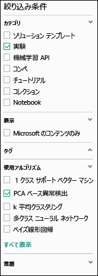
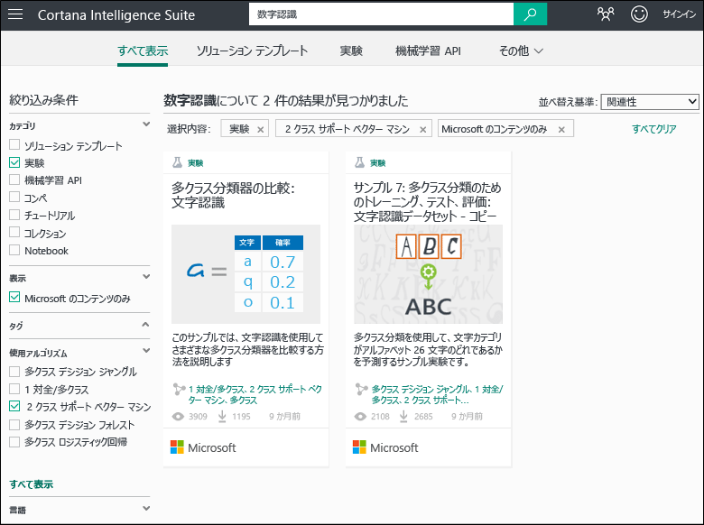
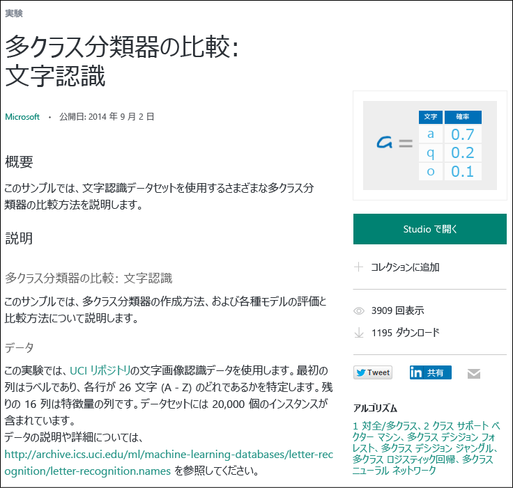

# サンプル実験をコピーして新しい機械学習実験を作成する
機械学習実験を一から作成する代わりに、[Cortana Intelligence ギャラリー](http://gallery.cortanaintelligence.com/)にあるサンプル実験をベースとして使う方法について説明します。サンプルを使って独自の機械学習ソリューションを構築することができます。

ギャラリーには、Microsoft Azure Machine Learning チームによるサンプル実験だけでなく、Machine Learning コミュニティで共有されているサンプルもあります。また、実験について質問したり、コメントを投稿したりすることができます。

ギャラリーの使用方法については、[初心者向けデータ サイエンス](machine-learning-data-science-for-beginners-the-5-questions-data-science-answers.md) シリーズの 3 分間のビデオ「[他のユーザーの成果物をコピーしてデータ サイエンスを実行する](machine-learning-data-science-for-beginners-copy-other-peoples-work-to-do-data-science.md)」をご覧ください。

[!INCLUDE [machine-learning-free-trial](../../includes/machine-learning-free-trial.md)]

## Cortana Intelligence ギャラリーでコピーする実験を探す
どのような実験を利用できるかを確認するには、[ギャラリー](http://gallery.cortanaintelligence.com/)に移動して、ページの上部の **[Experiments (実験)]** をクリックします。

### 最も新しい実験または最も人気のある実験を探す
このページでは、**最近追加された**実験を確認できます。そのほか、**人気のある実験**や、**人気のある Microsoft の実験の最新**バージョンまで下へスクロールして確認することができます。

### 特定の要件を満たす実験を探す
すべての実験を参照するには、次の手順を実行します。

1. ページの上部にある **[Browse all (すべて参照)]** をクリックします。
2. **[Refine by (絞り込み条件)]** で **[Experiment (実験)]** を選択すると、ギャラリー内のすべての実験が表示されます。
3. 自分の要件を満たす実験は、いくつかの方法で探すことができます。
   * **左側のフィルターを選択する。** たとえば、PCA ベースの異常検出アルゴリズムを使用する実験を参照するには、**[Categories (カテゴリ)]** で **[Experiment (実験)]** を選択し、**[Algorithms Used (使用されたアルゴリズム)]** で **[PCA-Based Anomaly Detection (PCA ベースの異常検出)]** を選択します(このアルゴリズムが表示されない場合は、一覧の末尾にある **[Show all (すべて表示)]** をクリックしてください)。   
   * **検索ボックスを使う。** たとえば、Microsoft によって投稿された、2 クラス サポート ベクター マシン アルゴリズムを使用する数字認識に関連する実験を検索するには、検索ボックスで「digit recognition」と入力します。次に、**[Experiment (実験)]**、**[Microsoft content only (Microsoft のコンテンツのみ)]**、および **[Two-Class Support Vector Machine (2 クラス サポート ベクター マシン)]** フィルターを選択します。
4. 実験をクリックして詳細を表示します。
5. 実験を実行したり変更したりするには、実験のページで **[Open in Studio (Studio で開く)]** をクリックします。
   
   > [!NOTE]
   > Machine Learning Studio で実験を開くには、Microsoft アカウントの資格情報でサインインする必要があります。Machine Learning ワークスペースをまだ持っていない場合は、無料評価版のワークスペースが作成されます。[Machine Learning 無料試用版に含まれる内容を確認してください。](https://azure.microsoft.com/pricing/details/machine-learning/)
   > 
   > 
   
    

## Machine Learning Studio でのテンプレートの使用
ギャラリーのサンプルをテンプレートとして、Machine Learning Studio で新しい実験を作成することもできます。

1. Microsoft アカウントの資格情報で [Studio](https://studio.azureml.net) にサインインし、**[新規]** をクリックして新しい実験を作成します。
2. サンプルのコンテンツを参照し、いずれかをクリックします。

サンプル実験をテンプレートとして、ワークスペースに新しい実験が作成されます。

## 次のステップ
* [データを準備する](machine-learning-data-science-import-data.md)
* [実験で R の使用を試す](machine-learning-r-quickstart.md)
* [サンプルの R 実験を確認する](machine-learning-r-csharp-web-service-examples.md)
* [Web サービス API を作成する](machine-learning-publish-a-machine-learning-web-service.md)
* [すぐに使用できるアプリケーションを参照する](https://datamarket.azure.com/browse?query=machine+learning)

<!---HONumber=AcomDC_0914_2016-->