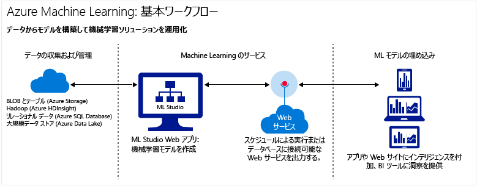

# クラウドでの Azure Machine Learning の概要
## 機械学習とは
機械学習は、将来の動き、結果、傾向を予測するためにコンピューターで既存のデータからの学習を行う、データ サイエンスの手法の&1; つ です。  

機械学習からのこうした予想や予測によってアプリやデバイスの機能性を高めることができます。 オンライン ショッピングでは、ユーザーが今までに購入した製品に基づいて他の商品をお勧めするのに機械学習が役立っています。 クレジット カードが読み取られると、機械学習は、トランザクションをトランザクションのデータベースと比較し、不正の検出を支援します。 ロボット掃除機が部屋を掃除するとき、機械学習は、作業が行われているかどうかを判断するのを支援します。

概要については、 [初心者向けデータ サイエンス](machine-learning-data-science-for-beginners-the-5-questions-data-science-answers.md)のビデオ シリーズをご覧ください。 初心者向けデータ サイエンス シリーズでは、専門用語や数式を使わずに機械学習について説明し、単純な予測モデルを紹介しています。

## Microsoft Azure クラウドにおける Machine Learning とは
Azure Machine Learning は、クラウドの予測分析サービスであり、分析ソリューションとして予測モデルを迅速に作成し、デプロイできるようにします。

そのまま使うことのできるアルゴリズムのライブラリを利用して、インターネットに接続した PC でモデルを作成し、予測ソリューションを迅速にデプロイできます。 [Cortana Intelligence ギャラリー](https://gallery.cortanaintelligence.com/)にある、すぐに利用できるサンプルとソリューションで作業を始めてください。

Azure Machine Learning は、モデルの予測分析ツールを提供するだけでなく、予測モデルをすぐに使用できる Web サービスとしてデプロイするための、完全に管理されたサービスを提供します。

## 予測分析とは
予測分析では、アルゴリズムと呼ばれる数式を使用して過去または最新のデータのパターンや傾向を分析し、将来のイベントを予測します。

## クラウドで完全な機械学習ソリューションを構築するためのツール
Azure Machine Learning には、大規模なアルゴリズム ライブラリから、モデル構築のためのスタジオや、モデルを Web サービスとしてデプロイする簡単な方法まで、クラウドで完全な予測分析ソリューションを作成するために必要なものすべてが揃っています。 予測モデルを迅速に作成、テスト、運用、管理できます。

### Machine Learning Studio: 予測モデルの作成
[Machine Learning Studio](machine-learning-what-is-ml-studio.md)では、モジュールをドラッグ アンド ドロップしたり、接続したりして予測モデルを迅速に作成できます。 さまざまな組み合わせで実験でき、[無料で試すことができます](https://studio.azureml.net/?selectAccess=true&o=2)。

* [Cortana Intelligence ギャラリー](machine-learning-gallery-how-to-use-contribute-publish.md)では、他の開発者が作成した分析ソリューションを試すことも、自分のソリューションを共有することもできます。 また、質問や実験に関するコメントをコミュニティに投稿したり、LinkedIn や Twitter などのソーシャル ネットワークで実験のリンクを共有したりすることができます。

  
* Machine Learning Studio にある [Machine Learning アルゴリズムとモジュール](https://msdn.microsoft.com/library/azure/f5c746fd-dcea-4929-ba50-2a79c4c067d7) の大規模なライブラリを使用して、予測モデルをすぐに開始します。 サンプル実験、R と Python のパッケージ、Xbox や Bing など Microsoft のビジネスで使われている最高クラスのアルゴリズムを選ぶことができます。 [R](machine-learning-r-quickstart.md) と [Python](machine-learning-execute-python-scripts.md) の独自のカスタム スクリプトで Studio モジュールを拡張できます。

  

### 独自の予測分析ソリューションを発行し、運用可能にする
次のチュートリアルでは、予測分析モデルを運用可能な状態にする方法について説明します。

 * [Web サービスをデプロイする](machine-learning-publish-a-machine-learning-web-service.md)
 * [API を通じてモデルを再トレーニングする](machine-learning-retrain-models-programmatically.md)
 * [Web サービスのエンドポイントを管理する](machine-learning-create-endpoint.md)
 * [Web サービスをスケーリングする](machine-learning-scaling-webservice.md)
 * [Web サービスを使用する](machine-learning-consume-web-services.md)

## 機械学習における主な用語と概念
機械学習の用語はわかりにくい場合があります。 ここでは、役に立つ主な用語の定義を紹介します。 これ以外にも定義をご希望の用語があれば、後のコメントを利用してお知らせください。

### データの探索、説明的な分析、予測分析

**データの探索** は、大規模で、多くの場合構造化されていないデータ セットに関する情報を収集するプロセスであり、焦点を絞った分析のための特性を見つけ出すために行われます。

**データ マイニング** は自動化されたデータの探索を参照します。

**説明的な分析** は、変更内容を要約するためにデータ セットを分析するプロセスです。 売り上げレポート、Web のメトリック、ソーシャル ネットワークの分析などほとんどのビジネス分析は、説明的な分析になります。

**予測分析** は、将来の結果を予測するために履歴データや最新データからモデルを構築するプロセスです。

### 教師あり学習と教師なし学習
 **教師あり学習**アルゴリズムはラベルが付けられたデータでのトレーニングです。つまりデータは必要な回答の例で構成されています。 たとえば、クレジットカードの不正使用を識別するモデルのトレーニングには、既知の不正な課金と問題のない課金がラベル付けされたデータ ポイントを含むデータ セットが使用されます。 ほとんどの機械学習は教師ありになります。

 **教師なし学習**は、ラベルのないデータで使用されます。その目的はデータにおけるリレーションシップを検出することです。 たとえば、似たような購入行動を持つ顧客の人口統計のグループを検索できます。

### モデルのトレーニングと評価
機械学習モデルとは、回答しようとしている質問の抽象化や、予測する結果になります。 モデルは既存のデータからトレーニングされ、評価されます。

#### トレーニング データ
データからモデルをトレーニングするときは、既知のデータ セットを使用し、データの特性に基づいてモデルの調整を行って、最も正確な答えを得られるようにします。 Azure Machine Learning では、モデルはトレーニング データを処理するアルゴリズム モジュールとスコア付けモジュールなどの機能モジュールで構成されます。

教師あり学習で不正検出モデルをトレーニングしている場合、不正と有効のどちらかでラベル付けされた一連のトランザクションを使用します。 データ セットをランダムに分割し、その一部を使用してモデルをトレーニングし、別の一部を使用してモデルをテストしたり、評価したりします。

#### 評価データ
モデルをトレーニングしたら、残りのテスト データを使用してそのモデルを評価します。 モデルが正確に予測できるかどうか確認できるように、結果がすでに分かっているデータを使用します。

## その他の一般的な機械学習用語
* **アルゴリズム**: 自己完結型の一連のルールで、データ処理、演算、自動推理を通じて問題を解決するために使用されます。
* **異常検出**: 異常なイベントや値にフラグを設定し、問題の検出を支援するモデルです。 たとえばクレジットカードの不正使用の検出では、異常な購入を検出します。
* **カテゴリ データ**: カテゴリに分類して、グループに分けることができるデータです。 たとえば自動車のカテゴリ データ セットでは、年式、製造元、モデル、価格が特定できます。
* **分類**: カテゴリのグループ化が既に分かっているデータ セットに基づいて、データ ポイントをカテゴリに整理するためのモデルです。
* **特徴エンジニアリング**: データ セットに関連する特徴を抽出、選択するプロセスで、データ セットを強化し、結果を向上させます。 たとえば、航空運賃のデータは曜日や休日で強化できます。 「 [Azure Machine Learning での特徴エンジニアリングと特徴選択](machine-learning-feature-selection-and-engineering.md)」をご覧ください。
* **モジュール**: 小規模なデータ セットを入力、編集できるデータ入力モジュールなど、Machine Learning Studio モデルの機能部分です。 Machine Learning Studio ではアルゴリズムもモジュールの種類になります。
* **モデル**: 教師あり学習モデルは、機械学習実験の産物で、トレーニング データ セット、アルゴリズム モジュール、機能モジュール (スコア モデル モジュールなど) で構成されます。
* **数値データ**: 測定値 (継続的なデータ) や数値 (不連続データ) としての意味があるデータです。 *定量的データ*とも呼ばれます。
* **パーティション**: データをサンプルに分割するメソッドです。 詳細情報は「 [パーティションとサンプル](https://msdn.microsoft.com/library/azure/dn905960.aspx) 」をご覧ください。
* **予測**: 予測とは、機械学習モデルからの値の予測になります。 "予測スコア" という用語を目にすることもあると思いますが、 予測スコアはモデルの最終出力ではありません。 モデルの評価の後にスコアが続きます。
* **回帰**: 年や製造元に基づいて自動車の価格を予測するなど、独立変数に基づいて値を予測するためのモデルです。
* **スコア**: Machine Learning Studio の [スコア モデル モジュール](https://msdn.microsoft.com/library/azure/dn905995.aspx) を使用してトレーニング済みの分類や回帰モデルから生成された予測値です。 分類モデルも、予測された値の確率のスコアを返します。 モデルからスコアを生成したら、 [モデルの評価モジュール](https://msdn.microsoft.com/library/azure/dn905915.aspx)を使用してモデルの精度を評価できます。
* **サンプル**: 全体を代表するために使用するデータ セットの一部です。 サンプルはランダムに選択したり、データ セットの特定の機能に基づいて選択したりできます。

## 次のステップ
[ステップ バイ ステップ チュートリアル](machine-learning-create-experiment.md)を使用し、また[サンプル上に構築](machine-learning-sample-experiments.md)することによって予測分析と機械学習の基礎について学習できます。  

<!-- Module References -->
[learning-with-counts]: https://msdn.microsoft.com/library/azure/81c457af-f5c0-4b2d-922c-fdef2274413c/

<!--HONumber=Feb17_HO2-->

