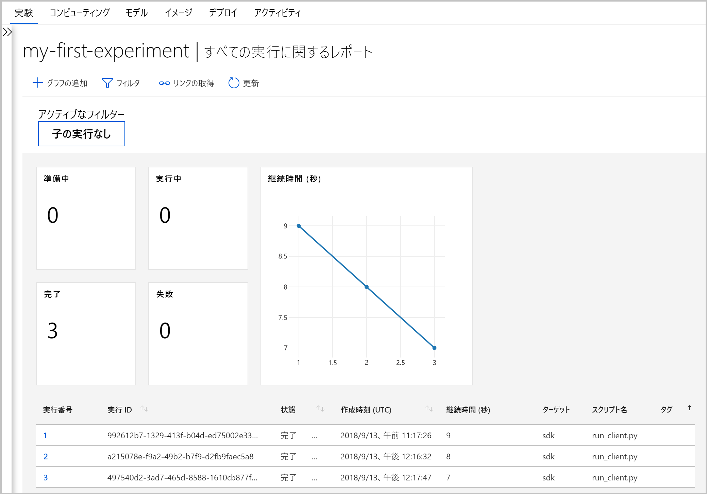

# <a name="what-happened-to-azure-machine-learning-workbench"></a>Azure Machine Learning Workbench の変更点

Azure Machine Learning Workbench アプリケーションとその他のいくつかの初期機能は、**2018 年 9 月**のリリースで非推奨とされ、改善された[アーキテクチャ](concept-azure-machine-learning-architecture.md)への移行のために置き換えられました。

エクスペリエンスの向上のため、このリリースには、お客様からのフィードバックをきっかけとする重要なアップデートが多く含まれています。 実験の実施からモデルのデプロイに至るまで、コア機能は変更されていません。 ただし、堅牢な <a href="https://docs.microsoft.com/python/api/overview/azure/ml/intro?view=azure-ml-py" target="_blank">Python SDK</a>、R SDK、[Azure CLI](reference-azure-machine-learning-cli.md) を使用して、機械学習のタスクとパイプラインを実現できるようになっています。

以前のバージョンの Azure Machine Learning で作成された成果物のほとんどは、独自のローカル ストレージやクラウド ストレージに保管されています。 これらの成果物が消失することはありません。

この記事では、Azure Machine Learning Workbench とそのAPI の変更点と、既存の作業に与える影響について説明します。

>[!Warning]
>この記事は、Azure Machine Learning Studio のユーザーを対象にはしていません。 これはワークベンチ (プレビュー) アプリケーションがインストールされているか、実験とモデルの管理プレビュー アカウントを持っている Azure Machine Learning のお客様向けです。


## <a name="what-changed"></a>変更箇所

Azure Machine Learning の最新リリースには、次の機能が含まれています。
+ [簡略化された Azure リソースのモデル](concept-azure-machine-learning-architecture.md)。
+ 実験とコンピューティング先を管理するための[新しいポータル UI](how-to-track-experiments.md)。
+ 新しく、より包括的な Python <a href="https://docs.microsoft.com/python/api/overview/azure/ml/intro?view=azure-ml-py" target="_blank">SDK</a>。
+ 機械学習のための拡張された新しい [Azure CLI 拡張機能](reference-azure-machine-learning-cli.md)。

[アーキテクチャ](concept-azure-machine-learning-architecture.md)は、使いやすいように再設計されました。 複数の Azure リソースやアカウントは不要で、必要なものは [Azure Machine Learning ワークスペース](concept-workspace.md)だけです。 ワークスペースは、[Azure portal](how-to-manage-workspace.md) ですばやく作成することができます。 ワークスペースを使用することで、複数のユーザーが、トレーニングやコンピューティングターゲットのデプロイ、モデルの実験、Docker イメージ、デプロイされたモデルなどを格納できます。

現在のリリースには新しく改善された CLI と SDK クライアントがありますが、デスクトップ ワークベンチ アプリケーション自体は廃止されました。 実験は、[Azure Machine Learning Studio の ワークスペース ダッシュボード](how-to-track-experiments.md#view-the-experiment-in-the-web-portal)で管理できます。 ダッシュボードを使用して、実験履歴の取得、ワークスペースに接続されているコンピューティング ターゲットの管理、モデルと Docker イメージの管理、さらには Web サービスのデプロイも行います。

<a name="timeline"></a>

## <a name="support-timeline"></a>サポートのタイムライン

Machine Learning Workbench、Azure Machine Learning 実験、Machine Learning モデル管理の各アカウントのサポート、およびそれらに関連する SDK と CLI のサポートは、2019 年 1 月 9 日に終了しました。

この <a href="https://docs.microsoft.com/python/api/overview/azure/ml/intro?view=azure-ml-py" target="_blank">SDK</a>、[CLI](reference-azure-machine-learning-cli.md)、[ポータル](how-to-manage-workspace.md)を使用することで利用可能です。

## <a name="what-about-run-histories"></a>実行履歴について教えてください。

最新のバージョンでお客様の実行がまだ表示されていても、以前の実行履歴にはもうアクセスできなくなっています。

実行履歴は**実験**と呼ばれるようになりました。 SDK、CLI、または Azure Machine Learning Studio を使用して、モデルの実験を収集し、それらを表示することができます。

ポータルのワークスペース ダッシュボードは、Microsoft Edge、Chrome、および Firefox ブラウザーでのみでサポートされます。

[](./media/overview-what-happened-to-workbench/image001.png#lightbox)

モデルのトレーニングと、新しい CLI と SDK を使用した実行履歴の追跡を開始します。 方法については、[チュートリアル: Azure Machine Learning を使用したモデルのトレーニング](tutorial-train-models-with-aml.md)に関するページから参照できます。

## <a name="will-projects-persist"></a>プロジェクトは保持されますか。

コードや作業が失われることはありません。 以前のバージョンでは、プロジェクトは、ローカル ディレクトリのあるクラウド エンティティです。 最新バージョンでは、ローカルの構成ファイルを使用して、ローカル ディレクトリを Azure Machine Learning ワークスペースに接続します。 [最新アーキテクチャの図](concept-azure-machine-learning-architecture.md)をご覧ください。

プロジェクトのコンテンツの多くは、ローカル コンピューター上に既にありました。 そのため、ワークスペースに接続するには、そのディレクトリ内に構成ファイルを作成し、それをコードで参照するだけで済みます。 ファイルとスクリプトを含むローカル ディレクトリを使用し続けるには、ディレクトリの名前を ['experiment.submit'](https://docs.microsoft.com/python/api/azureml-core/azureml.core.experiment.experiment?view=azure-ml-py) Python コマンドで指定するか、または `az ml project attach` CLI コマンドを使用します。  次に例を示します。
```python
run = exp.submit(source_directory=script_folder,
                 script='train.py', run_config=run_config_system_managed)
```

作業を開始するには、[ワークスペースを作成](how-to-manage-workspace.md)してください。

## <a name="what-about-my-registered-models-and-images"></a>登録されているモデルとイメージについて教えてください。

古いモデル レジストリに登録したモデルは、それらを引き続き使用したい場合は新しいワークスペースに移行する必要があります。 お客様のモデルを移行するには、新しいワークスペースでモデルをダウンロードして再登録します。

古いイメージ レジストリに作成したイメージは、新しいワークスペースに直接移行できません。 ほとんどの場合、イメージを作成することなくモデルをデプロイできます。 必要な場合は、新しいワークスペースにモデルのイメージを作成できます。 詳細については、[機械学習モデルの管理、登録、デプロイ、および監視](concept-model-management-and-deployment.md)に関する記事を参照してください。

## <a name="what-about-deployed-web-services"></a>デプロイ済み Web サービスについて教えてください。

以前の CLI のサポートが終了したので、モデルを再デプロイしたり、お客様が最初にご自分のモデル管理アカウントを使用してデプロイした Web サービスを管理したりすることはできなくなりました。 ただし、これらの Web サービスは Azure Container Service (ACS) がサポートされている限りは引き続き機能します。

最新バージョンでは、モデルは Web サービスとして Azure Container Instances (ACI) または Azure Kubernetes Service (AKS) クラスターにデプロイされます。 また、FPGA や Azure IoT Edge にデプロイすることもできます。

詳細については、次の記事を参照してください。
+ [モデルをデプロイする場所と方法](how-to-deploy-and-where.md)
+ [チュートリアル:Azure Machine Learning を使用してモデルをデプロイする](tutorial-deploy-models-with-aml.md)

## <a name="next-steps"></a>次のステップ

[Azure Machine Learning の最新のアーキテクチャ](concept-azure-machine-learning-architecture.md)について確認してください。

サービスの概要については、「[Azure Machine Learning とは](overview-what-is-azure-ml.md)」を参照してください。

任意の方法で最初の実験を作成します。
  + [Python ノートブックを使用する](tutorial-1st-experiment-sdk-setup.md)
  + [R Markdown を使用する](tutorial-1st-r-experiment.md) 
  + [自動機械学習を使用する](tutorial-designer-automobile-price-train-score.md) 
  + [デザイナーのドラッグ アンド ドロップ機能を使用する](tutorial-first-experiment-automated-ml.md) 
  + [CLI に対する ML 拡張機能を使用する](tutorial-train-deploy-model-cli.md)
