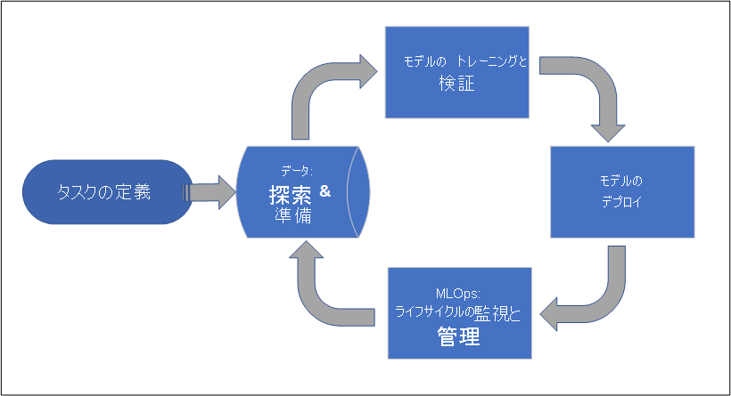
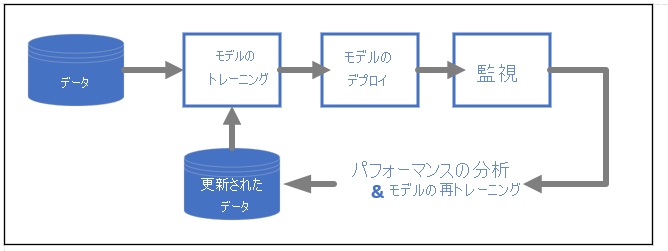

# Azure Machine Learning とは

Azure Machine Learning は、機械学習プロジェクトのライフサイクルを加速および管理するためのクラウド サービスです。 機械学習のプロフェッショナル、データ科学者、エンジニアが、このサービスを日常のワークフロー (モデルのトレーニングとデプロイ、MLOps の管理など) に利用できます。

Azure Machine Learning でモデルを作成したり、Pytorch、TensorFlow、scikit-learn などのオープンソース プラットフォームで構築されたモデルを使用したりすることができます。 MLOps ツールを使用すると、モデルの監視、再トレーニング、および再デプロイを行うことができます。 

> [!Tip]
> **無料試用版**  Azure サブスクリプションをお持ちでない場合は、開始する前に無料アカウントを作成してください。 [無料版または有料版の Azure Machine Learning をお試しください](https://azure.microsoft.com/free/machine-learning/search/)。 Azure サービスを使用するクレジットを取得できます。 このクレジットを使い切った後に、アカウントを保持して、[無料の Azure サービス](https://azure.microsoft.com/free/)を使用できます。 明示的に設定を変更して課金を了承しない限り、クレジット カードに課金されることはありません。

## Azure Machine Learning の対象ユーザー

Azure Machine Learning は、組織内で MLOps を実装し、安全で監査可能な運用環境に機械学習モデルを導入できるようにする個人やチームを対象としています。

データ科学者や ML エンジニア向けには、日常のワークフローを高速化および自動化するツールが用意されています。 アプリケーション開発者向けには、モデルをアプリケーションやサービスに統合するためのツールが用意されています。 プラットフォーム開発者向けには、高度な ML ツールを構築するための、持続性のある Azure Resource Manager API によって支えられた、堅牢なツール セットが用意されています。

Microsoft Azure クラウドを導入している企業向けには、インフラストラクチャのための使い慣れたセキュリティとロール ベースのアクセス制御 (RBAC) が用意されています。 保護されたデータおよび限定された操作へのアクセスを拒否するようにプロジェクトを設定できます。

### 機械学習チームによるコラボレーション

機械学習プロジェクトでは、多くの場合、チームがさまざまなスキルセットを構築して維持する必要があります。 Azure Machine Learning には、コラボレーションに役立つ次のようなツールがあります。

- 共有のノートブック、コンピューティング リソース、データ、環境
- 変更を行ったユーザーとその日時を示す追跡および監査機能
- 資産のバージョン管理

### 開発者向けツール

開発者は、Azure Machine Learning で次のような使い慣れたインターフェイスを使用できます。

- [Python SDK](/python/api/overview/azure/ml/)
- [Azure Resource Manager REST API (プレビュー)](/rest/api/azureml/)
- [CLI v2 (プレビュー)](/cli/azure/ml)

### スタジオ UI 

[Azure Machine Learning スタジオ](https://ml.azure.com)は、プロジェクト ワークスペース用のグラフィカル ユーザー インターフェイスです。 スタジオでは、次のことが可能です。

- 実行、メトリック、ログ、出力などを表示する。
- ノートブックとファイルを作成および編集する。
- 次のような一般的な資産を管理する。
    - データの資格情報
    - Compute
    - 環境
- 実行メトリック、結果、およびレポートを視覚化する。
- 開発者インターフェイスを通じて作成されたパイプラインを視覚化する。
- AutoML ジョブを作成する。

さらに、デザイナーには、モデルのトレーニングとデプロイを行うことができる、ドラッグ アンド ドロップ インターフェイスがあります。 

ML Studio (クラシック) ユーザーの場合は、[Studio (クラシック) の非推奨化と、Azure Machine Learning スタジオとの違いについて学習してください](overview-what-is-machine-learning-studio.md#ml-studio-classic-vs-azure-machine-learning-studio)。

## エンタープライズ対応とセキュリティ

Azure Machine Learning は、ML プロジェクトにセキュリティを追加するために、Azure クラウド プラットフォームと統合されています。 

セキュリティの統合には次が含まれます。

- ネットワーク セキュリティ グループを使用した Azure Virtual Network (VNet) 
- ストレージ アカウントのアクセス情報などの、セキュリティ シークレットを保存できる Azure Key Vault
- VNet の背後に設定された Azure Container Registry

[セキュリティで保護されたワークスペースの設定のチュートリアル](tutorial-create-secure-workspace.md)に関するページを参照してください。

## 完全なソリューションのための Azure の統合

その他の Azure サービスとの統合により、機械学習プロジェクト全体がサポートされます。 これには次のようなものがあります。

- Spark を使用してデータの処理とストリーミングを行う Azure Synapse Analytics
- Kubernetes 環境で Azure サービスを実行できる Azure Arc
- Azure SQL Database、Azure Storage Blob などのストレージとデータベースのオプション
- ML を利用したアプリをデプロイおよび管理できるようにする Azure App Service

## 機械学習プロジェクトのワークフロー

通常、モデルは、目的と目標を持つプロジェクトの一部として開発されます。 多くの場合、プロジェクトには複数の人が関与します。 データ、アルゴリズム、およびモデルを試す場合、開発は反復的になります。 

### プロジェクトのライフサイクル

プロジェクトのライフサイクルは、プロジェクトによって異なることがありますが、多くの場合、次のようになります。

ワークスペースによってプロジェクトが整理され、多くのユーザーが共通の目的に取り組むためにコラボレーションできます。 ワークスペース内のユーザーは、実験からの実行結果をスタジオ ユーザー インターフェイスで簡単に共有できます。また、環境やストレージ参照などのジョブで、バージョン管理された資産を使用することもできます。

詳細については、[Azure Machine Learning ワークスペースの管理](how-to-manage-workspace.md?tabs=python)に関するページを参照してください。

プロジェクトを運用化する準備が整ったら、ユーザーの作業を機械学習パイプラインで自動化し、スケジュールまたは HTTPS 要求でトリガーすることができます。

モデルは、リアルタイムとバッチの両方のデプロイのために、マネージド推論ソリューションに配置できます。これにより、通常モデルのデプロイに必要なインフラストラクチャ管理が取り除かれます。

## モデルをトレーニングする

Azure Machine Learning では、トレーニング スクリプトをクラウドで実行することも、モデルを最初から作成することもできます。 多くの場合、顧客はクラウドで運用化できるように、オープンソース フレームワークで構築およびトレーニングされたモデルを取り込みます。 

### オープン性と相互運用性

データ科学者は、次のような一般的な Python フレームワークで作成された Azure Machine Learning のモデルを使用できます。 

- PyTorch
- TensorFlow
- scikit-learn
- XGBoost
- LightGBM

他にも次のような言語やフレームワークがサポートされています。 
- R
- .NET

「[オープンソースと Azure Machine Learning プロジェクトとの統合](concept-open-source.md)」を参照してください。

### 特徴量化とアルゴリズムの選択の自動化 (AutoML)

古典的機械学習の反復的な時間のかかる処理では、データ科学者が過去の経験と直感を使用して、トレーニングのための適切なデータの特徴量化とアルゴリズムを選択します。 このプロセスを高速化する自動化された ML (AutoML) を、スタジオ UI または Python SDK で使用できます。

「[自動機械学習 (AutoML) とは](concept-automated-ml.md)」を参照してください。

### ハイパーパラメーターの最適化

ハイパーパラメーターの最適化 (ハイパーパラメーターの調整) は、面倒な作業になる可能性があります。 Azure Machine Learning では、ジョブ定義をほとんど変更することなく、任意のパラメーター化コマンドに対してこのタスクを自動化できます。 結果は、スタジオで視覚化されます。

[ハイパーパラメーターを調整する方法](how-to-tune-hyperparameters.md)に関するページを参照してください。

### マルチノード分散トレーニング

ディープ ラーニングと、場合によっては古典的機械学習のトレーニング ジョブに対するトレーニング効率が、マルチノード分散トレーニングで大幅に改善される可能性があります。 Azure Machine Learning コンピューティング クラスターは、最新の GPU オプションを備えています。

Azure Arc-attached Kubernetes (プレビュー) と Azure ML コンピューティング クラスターでは次がサポートされています。

- PyTorch
- TensorFlow
- MPI

MPI 分散は、Horovod またはカスタム マルチノード ロジックに使用できます。 さらに、Azure Synapse Analytics Spark のクラスター (プレビュー) を使用して Apache Spark がサポートされます。

「[Azure Machine Learning を使用した分散トレーニング](concept-distributed-training.md)」を参照してください。

### 驚異的並列トレーニング

機械学習プロジェクトのスケーリングでは、驚異的並列モデル トレーニングのスケーリングが必要になる場合があります。 このパターンは、モデルが多くの店舗に対してトレーニングされる可能性がある需要予測のようなシナリオで一般的です。

## モデルをデプロイする

モデルは、運用環境に導入するためにデプロイされます。 Azure Machine Learning のマネージド エンドポイントにより、バッチまたはリアルタイム (オンライン) の両方のモデル スコアリング (推論) に必要なインフラストラクチャが抽象化されます。

### リアルタイム スコアリングとバッチ スコアリング (推論)

"*バッチ スコアリング*" (または "*バッチ推論*") には、データの参照によるエンドポイントの呼び出しが含まれます。 バッチ エンドポイントでは、ジョブが非同期的に実行され、コンピューティング クラスターでデータを並列処理し、詳細な分析に向けてデータが格納されます。

"*リアルタイム スコアリング*" (または "*オンライン推論*") には、1 つ以上のモデル デプロイによるエンドポイントの呼び出しと、HTTP 経由のほぼリアルタイムの応答の受信が含まれます。 トラフィックは複数のデプロイに分割できるため、最初に一部のトラフィックを転送し、新しいモデルに対する信頼度が確立されたらトラフィックを増加して、新しいモデル バージョンをテストできます。    

参照トピック
 - [リアルタイム マネージド エンドポイントを使用してモデルをデプロイする](how-to-deploy-managed-online-endpoints.md)
 - [バッチ エンドポイントを使用したスコアリング](how-to-use-batch-endpoint.md) 

## MLOps: 機械学習のための DevOps 

械学習モデル用の DevOps は、通常 MLOps と呼ばれ、実稼働モデルを開発するためのプロセスです。 トレーニングからデプロイまでのモデルのライフサイクルは、再現できないとしても、監査できる必要があります。

### ML モデルのライフサイクル 

[Azure Machine Learning での MLOps](concept-model-management-and-deployment.md) に関する詳細を参照してください。

### MLOps を有効にする統合

Azure Machine Learning は、モデルのライフサイクルを考慮して構築されています。 特定のコミットと環境までモデルのライフサイクルを監査できます。 

MLOps を有効にする主な機能には、次のようなものがあります。

- `git` 統合
- MLflow の統合
- 機械学習パイプラインのスケジュール設定
- カスタムのトリガーのための Azure Event Grid の統合
- GitHub Actions や Azure DevOps などの CI/CD で簡単に使用できるツール

また、Azure Machine Learning には、監視と監査のための次の機能が含まれています。
- コード スナップショット、ログ、その他の出力などのジョブ成果物
- コンテナー、データ、コンピューティング リソースなど、ジョブと資産間のデータ系列

## 次の手順

Azure Machine Learning の使用を開始します。
- [Azure Machine Learning ワークスペースを設定する](quickstart-create-resources.md)
- [チュートリアル: 最初の機械学習プロジェクトを作成する](tutorial-1st-experiment-hello-world.md)
- [プレビュー: v2 CLI を使用してモデル トレーニング ジョブを実行する](how-to-train-cli.md)
