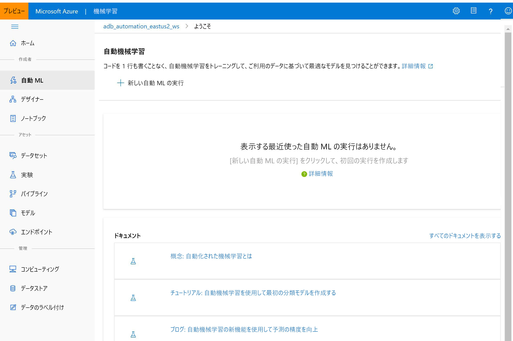

# Azure Machine Learning とは

この記事では、ML モデルのトレーニング、デプロイ、自動化、管理、追跡に使用できるクラウドベースの環境である Azure Machine Learning について説明します。 

Azure Machine Learning は、従来の ML からディープ ラーニング、教師あり学習と教師なし学習まで、あらゆる種類の機械学習に使用できます。 Python または R のコードを記述するか、または[デザイナー](tutorial-designer-automobile-price-train-score.md)などのコード不要 (またはローコード) オプションを使用するかにかかわらず、Azure Machine Learning ワークスペースできわめて正確な機械学習およびディープ ラーニング モデルを構築、トレーニング、および追跡できます。 

ローカル コンピューターでトレーニングを開始し、その後、クラウドにスケールアウトします。 

また、このサービスは、PyTorch、TensorFlow、scikit-learn などの一般的なオープン ソース ツールと連携します。

> [!VIDEO https://channel9.msdn.com/Events/Connect/Microsoft-Connect--2018/D240/player]

> [!Tip]
> **無料試用版**  Azure サブスクリプションをお持ちでない場合は、開始する前に無料アカウントを作成してください。 [無料版または有料版の Azure Machine Learning](https://aka.ms/AMLFree) を今すぐお試しください。 Azure サービスを使用するクレジットを取得できます。 このクレジットを使い切った後に、アカウントを保持して、[無料の Azure サービス](https://azure.microsoft.com/free/)を使用できます。 明示的に設定を変更して課金を了承しない限り、クレジット カードに課金されることはありません。

## 機械学習とは

機械学習は、コンピューターで既存のデータを使って、将来の動き、結果、傾向を予測できるデータ サイエンスの手法の 1 つです。 機械学習を使用することで、明示的にプログラムすることなく、コンピューターが学習します。

機械学習からの予想や予測によってアプリやデバイスの機能性を高めることができます。 たとえばオンライン ショッピングでは、利用者が欲しいと考えそうな他の商品を、過去の購入履歴に基づいてお勧めするのに機械学習が役立っています。 また、クレジット カードの読み取り時に、機械学習では、トランザクションをトランザクションのデータベースと比較することで不正の検出を支援します。 また、ロボット掃除機が部屋を掃除するとき、機械学習は、作業が行われているかどうかを判断するのを支援します。

## 各タスクに適合する機械学習ツール 

Azure Machine Learning には、次のような、開発者やデータ科学者が機械学習ワークフロー用に必要とするすべてのツールが用意されています。
+ [Azure Machine Learning デザイナー](tutorial-designer-automobile-price-train-score.md) (プレビュー): ドラッグアンドドロップ モジュールを使用して実験を構築し、パイプラインをデプロイします。

+ Jupyter Notebook: [サンプル ノートブック](https://aka.ms/aml-notebooks)を使用するか、独自のノートブックを作成して、<a href="https://docs.microsoft.com/python/api/overview/azure/ml/intro?view=azure-ml-py" target="_blank">SDK for Python</a> のサンプルを機械学習に活用します。 

+ R スクリプトまたはノートブックでは、<a href="https://azure.github.io/azureml-sdk-for-r/reference/index.html" target="_blank">SDK for R</a> を使用して独自のコードを書いたり、デザイナーで R モジュールを使用したりします。

+ [Visual Studio Code 拡張機能](tutorial-setup-vscode-extension.md)

+ [Machine Learning CLI](reference-azure-machine-learning-cli.md)

+ PyTorch、TensorFlow、scikit-learn などの、オープンソースのフレームワーク

[MLflow を使用してメトリックを追跡し、モデルをデプロイする](how-to-use-mlflow.md)ことや、Kubeflow を使用して[エンドツーエンドのワークフロー パイプラインを構築する](https://www.kubeflow.org/docs/azure/)こともできます。

## Python または R で ML モデルを構築する

Azure Machine Learning の <a href="https://docs.microsoft.com/python/api/overview/azure/ml/intro?view=azure-ml-py" target="_blank">Python SDK</a> または <a href="https://azure.github.io/azureml-sdk-for-r/reference/index.html" target="_blank">R SDK</a> を使用してローカル コンピューターでトレーニングを開始します。 その後、クラウドにスケールアウトすることができます。 

クラウドのパワーと、Azure Machine Learning コンピューティングや [Azure Databricks](/azure/azure-databricks/what-is-azure-databricks) などの利用可能な多数の[コンピューティング先](how-to-set-up-training-targets.md)と[高度なハイパーパラメーター調整サービス](how-to-tune-hyperparameters.md)を活用することで、高品質のモデルを手早く構築できます。

SDK を使用して、[モデルのトレーニングと調整を自動化](tutorial-auto-train-models.md)することもできます。

## コード不要ツールで ML モデルを構築する

コード不要またはわずかなコードしか使用しないトレーニングとデプロイを行うには、以下をお試しください。

+ **Azure Machine Learning デザイナー (プレビュー)**

  デザイナーを使用すると、コードを書かなくても、データの準備、機械学習モデルのトレーニング、テスト、デプロイ、管理、追跡を行うことができます。 プログラミングは必要ありません。データセットとモジュールを視覚的に接続してモデルを構築します。 [デザイナーのチュートリアル](tutorial-designer-automobile-price-train-score.md)をお試しください。

  詳細については、[Azure Machine Learning デザイナーの概要に関する記事](concept-designer.md)を参照してください。 

  

+ **自動化された機械学習の UI**

  使いやすいインターフェイスで[自動化された ML 実験](tutorial-first-experiment-automated-ml.md)を作成する方法を学ぶことができます。 

  

## MLOps:デプロイとライフサイクル管理
適切なモデルがあれば、Web サービス、IoT デバイス、または Power BI で簡単に使用できます。 詳細については、[デプロイする方法と場所](how-to-deploy-and-where.md)に関する記事を参照してください。

デプロイされたモデルは、[Azure Machine Learning SDK for Python](https://aka.ms/aml-sdk)、[Azure Machine Learning Studio](https://ml.azure.com)、または [Machine Learning CLI](reference-azure-machine-learning-cli.md) を使用して管理できます。

これらのモデルを使用して、[リアルタイム](how-to-consume-web-service.md)で予測を返したり、データが大量の場合は[非同期で](how-to-use-parallel-run-step.md)予測を返したりすることができます。

さらに、高度な[機械学習パイプライン](concept-ml-pipelines.md)を使用して、データの準備、モデルのトレーニングと評価、およびデプロイの各手順で共同で作業することができます。 パイプラインを使用すると、次のことができます。

* クラウドでエンドツーエンドの機械学習プロセスを自動化する
* コンポーネントを再利用し、必要なときにのみステップを再実行する
* ステップごとに異なるコンピューティング リソースを使用する
* バッチ スコアリング タスクを実行する

スクリプトを使用して機械学習ワークフローを自動化する場合、[Machine Learning CLI](reference-azure-machine-learning-cli.md) には、トレーニング実行の送信やモデルのデプロイなどの一般的なタスクを実行するコマンドライン ツールが用意されています。

Azure Machine Learning の基本的な使い方については、「[次の手順](#next-steps)」を参照してください。

## 他のサービスとの統合

Azure Machine Learning は、Azure プラットフォーム上の他のサービスとの連携に加え、Git や MLFlow といったオープン ソース ツールとの統合にも対応します。

+ コンピューティング先 (__Azure Kubernetes Service__、__Azure Container Instances__、__Azure Databricks__、__Azure Data Lake Analytics__、__Azure HDInsight__ など)。 コンピューティング先の詳細については、[コンピューティング先の概要](concept-compute-target.md)に関するページを参照してください。
+ __Azure Event Grid__。 詳細については、[Azure Machine Learning イベントを使用する方法](concept-event-grid-integration.md)に関するページを参照してください。
+ __Azure Monitor__。 詳細については、「[Azure Machine Learning の監視](monitor-azure-machine-learning.md)」を参照してください。
+ データ ストア (__Azure Storage アカウント__、__Azure Data Lake Storage__、__Azure SQL Database__、__Azure Database for PostgreSQL__、__Azure Open Datasets__ など)。 詳細については、「[Azure ストレージ サービスのデータにアクセスする](how-to-access-data.md)」および「[Azure Open Datasets を使用してデータセットを作成する](how-to-create-register-datasets.md#create-datasets-with-azure-open-datasets)」を参照してください。
+ __Azure Virtual Networks__。 詳細については、[仮想ネットワークでの実験と推論の安全な実行](how-to-enable-virtual-network.md)に関するページを参照してください。
+ __Azure Pipelines__。 詳細については、「[機械学習モデルのトレーニングとデプロイ](/azure/devops/pipelines/targets/azure-machine-learning)」を参照してください。
+ __Git リポジトリのログ__。 詳細については、「[Git 統合](concept-train-model-git-integration.md)」を参照してください。
+ __MLFlow__。 詳細については、[MLflow を使用してメトリックを追跡し、モデルをデプロイする方法](how-to-use-mlflow.md)に関するページを参照してください。 
+ __Kubeflow__。 詳細については、[エンド ツー エンドのワークフロー パイプラインを構築する方法](https://www.kubeflow.org/docs/azure/)に関するページを参照してください。

### セキュリティで保護された通信

Azure Storage アカウントやコンピューティング先などのリソースは、仮想ネットワーク内で安全に使用してモデルをトレーニングし、推論を実行することができます。 詳細については、[仮想ネットワークでの実験と推論の安全な実行](how-to-enable-virtual-network.md)に関するページを参照してください。

## Basic Edition と Enterprise Edition

Azure Machine Learning には、機械学習のニーズに合わせて調整された 2 つのエディションがあります。
+ Basic (一般公開)
+ Enterprise (プレビュー)

これらのエディションによって、開発者やデータ科学者が自分のワークスペースから利用可能な機械学習ツールはどれかが決定します。   

Basic のワークスペースでは、Azure Machine Learning を継続して使用し、機械学習プロセス中に使用した Azure リソースに対してのみ料金を支払うことができます。 Enterprise Edition のワークスペースでは、エディションがプレビュー段階にある間は、Azure の使用量に対してのみ課金されます。 Azure Machine Learning で何が利用可能かについては、[エディションの概要と価格のページ](https://azure.microsoft.com/pricing/details/machine-learning/)を参照してください。 

ワークスペースを作成するときは必ずエディションを割り当てます。 また、既存のワークスペースは自動的に Basic Edition に変換されています。 Basic Edition には、2019 年 10 月の時点で一般公開されていたすべての機能が含まれています。 それらのワークスペースで Enterprise Edition の機能を使用して構築された実験は、Enterprise にアップグレードするまで、読み取り専用で引き続き使用できます。 Basic のワークスペースを Enterprise Edition にアップグレードする方法については、[こちら](how-to-manage-workspace.md#upgrade)を参照してください。 

この期間中、コンピューティングやその他の Azure リソースで発生するコストは、お客様の負担になります。

## 次のステップ

- 任意の方法で最初の実験を作成します。
  + [Python ノートブックを使用して、ML モデルをトレーニングおよびデプロイする](tutorial-1st-experiment-sdk-setup.md)
  + [R Markdown を使用して、ML モデルをトレーニングおよびデプロイする](tutorial-1st-r-experiment.md) 
  + [自動化された機械学習を使用して、ML モデルをトレーニングおよびデプロイする](tutorial-first-experiment-automated-ml.md) 
  + [デザイナーのドラッグ アンド ドロップ機能を使用して、トレーニングおよびデプロイする](tutorial-designer-automobile-price-train-score.md) 
  + [Machine Learning CLI を使用して、モデルをトレーニングおよびデプロイする](tutorial-train-deploy-model-cli.md)

- 機械学習シナリオを構築、最適化、および管理する[機械学習パイプライン](concept-ml-pipelines.md)について学習します。

- [Azure Machine Learning のアーキテクチャと概念](concept-azure-machine-learning-architecture.md)に関する詳細な記事を読みます。
