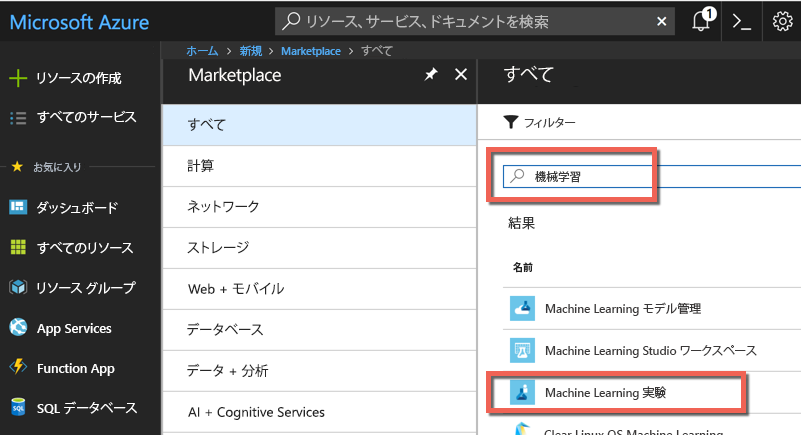
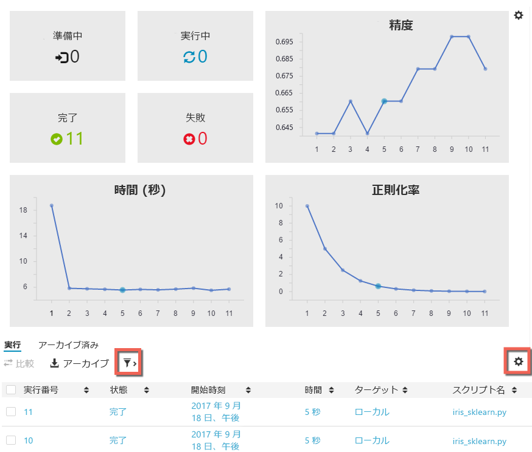

# Azure Machine Learning プレビュー アカウントの作成と Azure Machine Learning Workbench のインストール
Azure Machine Learning サービス (プレビュー) は、統合されたエンドツーエンドのデータ サイエンスおよび高度な分析ソリューションです。 プロフェッショナルなデータ サイエンティストは、これを使用してデータの準備、実験の開発、モデルのデプロイをクラウド規模で行うことができます。

このクイック スタートでは、Azure Machine Learning プレビューで実験アカウントとモデル管理アカウントを作成する方法について説明します。 また、Azure Machine Learning Workbench デスクトップ アプリケーションと CLI ツールをインストールする方法についても説明します。 次に、Azure Machine Learning プレビュー機能のクイック ツアーを開始します。[あやめのデータセット](https://en.wikipedia.org/wiki/iris_flower_data_set)を使用して、いくつかの物理的な特徴に基づいてあやめの種類を予測するモデルを構築します。  

Azure サブスクリプションをお持ちでない場合は、開始する前に [無料アカウント](https://azure.microsoft.com/free/?WT.mc_id=A261C142F) を作成してください。

## 前提条件

現在、Azure Machine Learning Workbench デスクトップ アプリは、次のオペレーティング システムにのみインストールできます。 
- Windows 10
- Windows Server 2016
- macOS Sierra
- macOS High Sierra

## Azure ポータルにサインインします。
[Azure ポータル](https://portal.azure.com/)にサインインします。

## Azure Machine Learning アカウントを作成する
Azure Portal を使用して Azure Machine Learning アカウントをプロビジョニングします。 
1. ポータルの左上隅にある **[リソースの作成]** ボタン (+) を選択します。

2. 検索バーに「**Machine Learning**」と入力します。 **[Machine Learning Experimentation (preview)]\(Machine Learning 実験 (プレビュー)\)** という検索結果を選択します。  星のアイコンをクリックすると、この選択項目は Azure Portal でのお気に入りとなります。

   

3. **[+ 追加]** を選択して、新しい Machine Learning 実験アカウントを構成します。 詳細なフォームが開きます。

   

4. Machine Learning 実験のフォームに次の情報を入力します。

   設定|推奨値|Description
   ---|---|---
   [Experimentation account name]\(実験アカウント名\) | "_一意の名前_" |アカウントを識別する一意の名前を選択します。 独自の名前を使用できるほか、実験を識別するうえで最適な部門またはプロジェクトの名前を使用できます。 この名前は 2 ～ 32 文字で指定します。 これには、英数字とダッシュ (-) 文字のみを使用してください。 
   [サブスクリプション] | _該当するサブスクリプション_ |実験に使用する Azure サブスクリプションを選択します。 複数のサブスクリプションをお持ちの場合は、リソースが課金の対象となっている適切なサブスクリプションを選択してください。
   リソース グループ | "_リソース グループ名_" | 新しいリソース グループ名を作成することも、サブスクリプションの既存のリソース グループ名を使用することもできます。
   場所 | _ユーザーに最も近いリージョン_ | ユーザーとデータ リソースに最も近い場所を選択します。
   [Number of seats]\(シート数\) | 2 | 接続クライアント数を入力します。 この選択は[料金](https://azure.microsoft.com/pricing/details/machine-learning/)に影響します。 シートは 2 つまで無料です。 このクイックスタートではシートを 2 つ使用します。 シート数は、必要に応じて後から Azure Portal で更新できます。
   ストレージ アカウント | "_一意の名前_" | **[新規作成]** を選択し、Azure ストレージ アカウントを作成するための名前を指定します。 または、**[Use existing (既存のものを使用)]** を選択し、ドロップダウン リストから既存のストレージ アカウントを選択します。 このストレージ アカウントは、プロジェクト アーティファクトと実行履歴データを保持するために必要であり、そのために使用されます。 
   [Workspace for Experimentation account]\(実験アカウントのワークスペース\) | "_一意の名前_" | 新しいワークスペースの名前を入力します。 この名前は 2 ～ 32 文字で指定します。 これには、英数字とダッシュ (-) 文字のみを使用してください。
   [Assign owner for the workspace]\(ワークスペースの所有者の割り当て\) | "_自分のアカウント_" | ご自身のアカウントをワークスペースの所有者として選択します。
   [Create Model Management account]\(モデル管理アカウントを作成する\) | *check* | 実験アカウントの作成エクスペリエンスの一環として、Machine Learning モデル管理アカウントを作成するオプションも用意されています。 このリソースは、モデルをリアルタイムの Web サービスとしてデプロイおよび管理する準備ができたときに使用されます。 モデル管理アカウントは実験アカウントと同時に作成することをお勧めします。
   アカウント名 | "_一意の名前_" | モデル管理アカウントを識別する一意の名前を選択します。 独自の名前を使用できるほか、実験を識別するうえで最適な部門またはプロジェクトの名前を使用できます。 この名前は 2 ～ 32 文字で指定します。 これには、英数字とダッシュ (-) 文字のみを使用してください。 
   [Model Management pricing tier]\(モデル管理の価格レベル\) | **DEVTEST** | **[価格レベルが選択されていません]** を選択して、新しいモデル管理アカウントの価格レベルを指定します。 コストを抑えるために、該当するサブスクリプションで利用できる場合は **DEVTEST** 価格レベルを選択してください (利用には制限があります)。 利用できない場合は、S1 価格レベルを選択してコストを抑えます。 **[選択]** をクリックして、価格レベルの選択を保存します。 
   [ダッシュボードにピン留めする] | _check_ | **[ダッシュボードにピン留めする]** チェック ボックスをオンにすると、Azure Portal のフロント ダッシュボード ページで Machine Learning 実験アカウントを簡単に追跡できます。

5. **[作成]** を選択して、作成プロセスを開始します。

6. Azure Portal のツール バーの **[通知]** (ベル アイコン) をクリックして、デプロイ プロセスを監視します。 

   この通知では "**デプロイは進行中です**" と表示されます。 完了すると、状態は "**デプロイメントに成功しました**" に変わります。 成功すると、Machine Learning 実験アカウントのページが開きます。
   
   

ここで、ローカル コンピューターで使用しているオペレーティング システムに応じて、次の 2 つのセクションのいずれかに従い Azure Machine Learning Workbench をインストールします。 

## Azure Machine Learning Workbench を Windows にインストールする
Azure Machine Learning Workbench を、Windows 10、Windows Server 2016 以降が実行されているコンピューターにインストールします。

1. 最新の Azure Machine Learning Workbench インストーラー [AmlWorkbenchSetup.msi](https://aka.ms/azureml-wb-msi) をダウンロードします。

2. エクスプローラーで、ダウンロードしたインストーラー **AmlWorkbenchSetup.msi** をダブルクリックします。

   >[!IMPORTANT]
   >インストーラーは、ディスク上に完全にダウンロードした後、そこから実行します。 ブラウザーのダウンロード ウィジェットで直接実行しないようにしてください。

3. 画面に表示される指示に従って、インストールを完了します。

   インストーラーによって、必要な依存コンポーネントがすべてダウンロードされます (Python、Miniconda、その他の関連ライブラリなど)。 すべてのコンポーネントのインストールが完了するには、約 30 分かかる場合があります。 

4. Azure Machine Learning Workbench は次のディレクトリにインストールされます。
   
   `C:\Users\<user>\AppData\Local\AmlWorkbench`

## Azure Machine Learning Workbench を macOS にインストールする
Azure Machine Learning Workbench を、macOS Sierra 以降が実行されているコンピューターにインストールします。

1. 最新の Azure Machine Learning Workbench インストーラー [AmlWorkbench.dmg](https://aka.ms/azureml-wb-dmg) をダウンロードします。

   >[!IMPORTANT]
   >インストーラーは、ディスク上に完全にダウンロードした後、そこから実行します。 ブラウザーのダウンロード ウィジェットで直接実行しないようにしてください。

2. Finder で、ダウンロードしたインストーラー **AmlWorkbench.dmg** をダブルクリックします。

3. 画面に表示される指示に従って、インストールを完了します。

   インストーラーによって、必要な依存コンポーネントがすべてダウンロードされます (Python、Miniconda、その他の関連ライブラリなど)。 すべてのコンポーネントのインストールが完了するには、約 30 分かかる場合があります。 

4. Azure Machine Learning Workbench は次のディレクトリにインストールされます。 

   `/Applications/Azure ML Workbench.app`

## Azure Machine Learning Workbench を実行して初めてサインインする
1. インストール プロセスが完了したら、インストーラーの最後の画面にある **[Launch Workbench]\(Workbench の起動\)** ボタンを選択します。 インストーラーを閉じた場合は、デスクトップ上の Machine Learning Workbench へのショートカットと **Azure Machine Learning Workbench** という名前の**スタート** メニューを探して、アプリを起動します。

2. 先ほど Azure リソースのプロビジョニングに使用したのと同じアカウントで Workbench にサインインします。 

3. サインイン プロセスが正常に完了したら、先ほど作成した Machine Learning 実験アカウントの検出が Workbench によって試行されます。 お使いの資格情報でアクセスできるすべての Azure サブスクリプションが検索されます。 実験アカウントが 1 つでも見つかると、Workbench はそのアカウントを使用して開かれます。 次に、そのアカウント内のワークスペースとプロジェクトが一覧表示されます。 

   >[!TIP]
   > 複数の実験アカウントにアクセスできる場合は、Workbench アプリの左下隅にあるアバター アイコンを選択して、別のアカウントに切り替えることができます。

Web サービスをデプロイするための環境の作成については、[デプロイ環境の設定](deployment-setup-configuration.md)に関するページを参照してください。

## 新しいプロジェクトを作成する
1. Azure Machine Learning Workbench アプリを起動し、サインインします。 

2. **[ファイル]** > **[新しいプロジェクト]** の順に選択します (または **[プロジェクト]** ウィンドウで **+** 記号を選択します)。 

3. **[プロジェクト名]** ボックスと **[プロジェクト ディレクトリ]** ボックスに入力します。 **[プロジェクトの説明]** は省略可能ですが、役に立ちます。 ここでは、**[Visualstudio.com GIT Repository URL]\(Visualstudio.com Git リポジトリ URL\)** ボックスを空白のままにしておきます。 ワークスペースを選択し、**[Classifying Iris]\(あやめの分類\)** をプロジェクト テンプレートとして選択します。

   >[!TIP]
   >必要に応じて、[Visual Studio Team Services](https://www.visualstudio.com) プロジェクトでホストされている Git リポジトリの URL を、Git リポジトリのテキスト ボックスに入力することができます。 この Git リポジトリは既に存在している必要があるほか、master ブランチがなく空である必要があります。 また、そのリポジトリに対する書き込みアクセスが必要です。 ここで Git リポジトリを追加すると、後でローミングと共有のシナリオを有効にできます。 詳細については、[こちら](using-git-ml-project.md)を参照してください。

4. **[作成]** ボタンを選択してプロジェクトを作成します。 新しいプロジェクトが作成され、自動的に開きます。 この時点で、プロジェクトのホーム ページ、データ ソース、ノートブック、ソース コード ファイルを確認できます。 

    >[!TIP]
    >また、統合開発環境 (IDE) のリンクを構成してその中から直接プロジェクトを開くだけで、Visual Studio Code やその他のエディターでプロジェクトを開くこともできます。 詳細については、[こちら](how-to-configure-your-IDE.md)を参照してください。 

## Python スクリプトを実行する
ローカル コンピューター上でスクリプトを実行してみましょう。 

1. プロジェクトはそれぞれ別個の **[プロジェクト ダッシュボード]** ページで開きます。 アプリケーションの上部付近にあるコマンド バーから、実行ターゲットとして **[ローカル]** を選択し、実行するスクリプトとして **[iris_sklearn.py]** を選択します。 このほかにも、サンプルには後で確認できるファイルが含まれています。 

   

2. **[引数]** テキスト ボックスに「**0.01**」と入力します。 この数値は、正則化率を設定するコードで使用されます。 これは、線形回帰モデルをどのように訓練するかを構成するために使用される値です。 

3. **[実行]** ボタンを選択して、コンピューター上で **iris_sklearn.py** の実行を開始します。 

   このコードでは、一般的な Python [scikit-learn](http://scikit-learn.org/stable/index.html) ライブラリの[ロジスティック回帰](https://en.wikipedia.org/wiki/logistic_regression)アルゴリズムを使用して、モデルが構築されます。

4. まだ表示されていない場合は、右側から **[ジョブ]** パネルがスライドして表示され、そのパネルに **iris_sklearn** ジョブが追加されます。 ジョブの実行が開始されると、状態が **[送信しています]** から **[実行中]** に切り替わり、数秒後に **[完了]** になります。 

   おめでとうございます。 Azure Machine Learning Workbench で Python スクリプトを正常に実行できました。

6. 手順 2. ～ 4. を数回繰り返します。 毎回、**10** から **0.001** までの範囲で異なる引数の値を使用してください。

## 実行履歴を表示する
1. **[実行]** ビューに移動し、実行の一覧にある **iris_sklearn.py** を選択します。 **iris_sklearn.py** の実行履歴ダッシュボードが開きます。 そこでは、**iris_sklearn.py** に対して実行したすべての実行が表示されます。 

   

2. 実行履歴ダッシュボードには、上位のメトリック、一連の既定のグラフ、各実行のメトリックの一覧も表示されます。 このビューは、構成の並べ替え、フィルター処理、調整によってカスタマイズできます。 構成アイコンまたはフィルター アイコンを選択するだけです。

   

3. 完了した実行を選択すると、その特定の実行の詳細ビューが表示されます。 詳細には、追加のメトリック、それによって生成されるファイルのほか、役に立つ可能性のあるログが含まれています。

## 次のステップ
これで、Azure Machine Learning 実験アカウントと Azure Machine Learning モデル管理アカウントを正常に作成できました。 また、Azure Machine Learning Workbench デスクトップ アプリとコマンド ライン インターフェイスをインストールしました。 新しいプロジェクトを作成し、スクリプトを実行してモデルを作成してから、そのスクリプトの実行履歴を確認しました。

あやめのモデルを Web サービスとしてデプロイする方法など、このワークフローをさらに深く体験したい場合は、"*あやめの分類*" のチュートリアルを最後まで進めてください。 このチュートリアルでは、[データの準備](tutorial-classifying-iris-part-1.md)、[実験](tutorial-classifying-iris-part-2.md)、[モデル管理](tutorial-classifying-iris-part-3.md)の詳細な手順を説明しています。 

> [!div class="nextstepaction"]
> [あやめの分類のチュートリアル](tutorial-classifying-iris-part-1.md)
