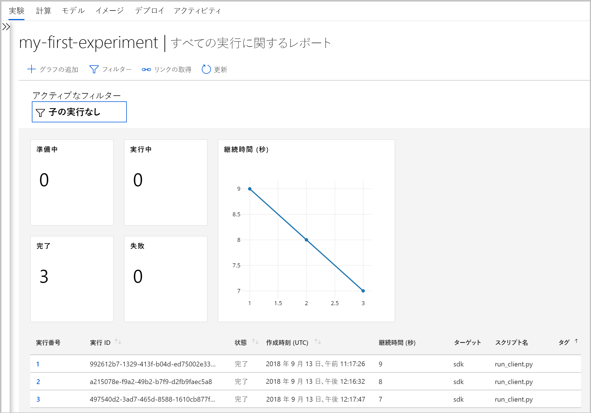
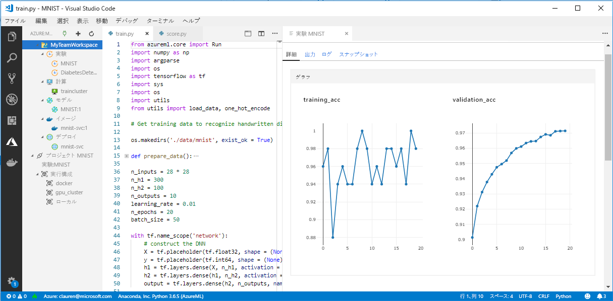

# Azure Machine Learning service での Machine Learning Workbench の変更点

Azure Machine Learning Workbench アプリケーションとその他のいくつかの初期機能は、2018 年 9 月のリリースで非推奨とされ、改善された[アーキテクチャ](concept-azure-machine-learning-architecture.md)への移行のために置き換えられました。 エクスペリエンスの向上のため、このリリースにはお客様からのフィードバックによって促進された、多くの重要な更新が含まれています。 モデル デプロイに対する実験の実行からのコア機能は変更されていません。 ただし、堅牢な <a href="https://aka.ms/aml-sdk" target="_blank">SDK</a> と [Azure CLI](reference-azure-machine-learning-cli.md) を使用して、機械学習のタスクとパイプラインを実現できるようになっています。  

この記事では、Azure Machine Learning Workbench とそのAPI の変更点と、既存の作業に与える影響について説明します。

## 変更箇所

Azure Machine Learning service の最終リリースには、次の機能が含まれています。
+ [簡略化された Azure リソースのモデル](concept-azure-machine-learning-architecture.md)。
+ 実験とコンピューティング先を管理するための[新しいポータル UI](how-to-track-experiments.md)。
+ 新しい、より包括的な Python <a href="https://aka.ms/aml-sdk" target="_blank">SDK</a>。
+ 機械学習のための拡張された新しい [Azure CLI 拡張機能](reference-azure-machine-learning-cli.md)。

[アーキテクチャ](concept-azure-machine-learning-architecture.md)は、使いやすいように再設計されました。 複数の Azure リソースやアカウントは不要で、必要なものは [Azure Machine Learning サービス ワークスペース](concept-azure-machine-learning-architecture.md#workspace)だけです。 ワークスペースは、[Azure portal](quickstart-get-started.md) ですばやく作成することができます。 ワークスペースを使用することで、複数のユーザーが、トレーニングやデプロイのコンピューティング先、モデルの実験、Docker イメージ、デプロイされたモデルなどを格納できます。

現在のリリースには新しい強化された CLI と SDK クライアントがありますが、デスクトップ ワークベンチ アプリケーション自体は非推奨です。 現在は、[Azure portal のワークスペース ダッシュボード](how-to-track-experiments.md#view-the-experiment-in-the-azure-portal)で実験を監視できるようになっています。 ダッシュボードを使用して、実験履歴の取得、ワークスペースに接続されているコンピューティング ターゲットの管理、モデルと Docker イメージの管理、さらには Web サービスのデプロイも行います。

## 移行する方法

以前のバージョンの Azure Machine Learning service で作成された成果物のほとんどは、独自のローカル ストレージやクラウド ストレージに保管されています。 これらの成果物は消失することはありません。 移行するには、成果物を、更新された Azure Machine Learning サービスに再登録する必要があります。 移行できるものとその方法については、[移行に関する記事](how-to-migrate.md)を参照してください。

## サポートのタイムライン

Machine Learning 実験とモデル管理のアカウントおよび Machine Learning Workbench アプリケーションは、2018 年 9 月を過ぎてもまだ使用できます。 そのリリースから 3 ～ 4 か月後に、次のリソースのサポートが段階的に削除されます。 目次の下にある [[リソース]](../desktop-workbench/tutorial-classifying-iris-part-1.md) セクションで、古い機能に関するドキュメントを引き続きお探しいただけます。

|廃止&nbsp;段階|以前の機能のサポート詳細|
|:---:|----------------|
|2018 年 12 月 4 日|Azure portal および CLI で Azure Machine Learning 実験アカウントとモデル管理アカウントを作成する機能は終了しています。 また、CLI から Machine Learning コンピューティング環境を作成する機能も終了となりました。 既存のアカウントをお持ちの場合、CLI とデスクトップ Machine Learning Workbench はこの段階では引き続き機能します。|
|2019 年 1 月 9 日|他のすべてのサポートが、この日をもって終了します。 たとえば、他の API やデスクトップ Machine Learning Workbench などです。|

今すぐ[移行を始めてください](how-to-migrate.md)。 最新の機能はすべて、新しい <a href="https://aka.ms/aml-sdk" target="_blank">SDK</a>、[CLI](reference-azure-machine-learning-cli.md)、[ポータル](quickstart-get-started.md)で使用できます。

## 実行履歴について教えてください。

実行履歴は、しばらくの間はアクセスできます。 更新されたバージョンの Azure Machine Learning service に移行する準備ができたら、コピーを保存しておきたい場合はこれらの実行履歴をエクスポートすることができます。

実行履歴は、現在のリリースでは**実験**と呼ばれています。 SDK、CLI、または Azure portal を使用して、モデルの実験を収集し、それらを表示することができます。

ポータルのワークスペース ダッシュボードは、Microsoft Edge、Chrome、および Firefox ブラウザーでのみでサポートされます。

## データは引き続き準備できますか。

もう Machine Learning Workbench がないため、既存のデータ準備ファイルは最新のリリースに移植されません。 ただし、引き続きモデリング用にデータを準備することができます。  

あらゆるサイズのデータセットについて、[Azure Machine Learning Data Prep SDK](http://aka.ms/data-prep-sdk) を使用し、Python コードを記述することにより、モデリングの前にデータをすばやく準備することができます。 

Azure Machine Learning Data Prep SDK の使い方について詳しくは、[こちらのチュートリアル](tutorial-data-prep.md)をご覧ください。

## プロジェクトは保持されますか。

コードや作業が失われることはありません。 以前のバージョンでは、プロジェクトは、ローカル ディレクトリのあるクラウド エンティティです。 最新バージョンでは、ローカルの構成ファイルを使用して、ローカル ディレクトリを Azure Machine Learning service ワークスペースに接続します。 [最新アーキテクチャの図](concept-azure-machine-learning-architecture.md)をご覧ください。

プロジェクトのコンテンツの多くは、ローカル コンピューター上に既にありました。 そのため、ワークスペースに接続するには、そのディレクトリ内に構成ファイルを作成し、それをコードで参照するだけで済みます。 [既存のプロジェクトを移行する](how-to-migrate.md#projects)方法を確認してください。

[Python とメインの SDK](quickstart-create-workspace-with-python.md) で、または [Azure portal](quickstart-get-started.md) を使用して、開始する方法を確認してください。

## 登録されているモデルとイメージについて教えてください。
 
古いモデル レジストリに登録したモデルは、それらを引き続き使用したい場合は新しいワークスペースに移行する必要があります。 モデルを移行するには、新しいワークスペースで[モデルをダウンロードして再登録](how-to-migrate.md)します。 

古いイメージ レジストリに作成したイメージは、引き続き使用するには新しいワークスペースに再作成する必要があります。 [イメージの構成と作成](how-to-deploy-and-where.md#configureimage)に関するセクションに従うことで、これらのイメージを再作成できます。 

## デプロイ済み Web サービスについて教えてください。

Machine Learning モデル管理アカウントを使用して Web サービスとしてデプロイしたモデルは、Azure Container Service がサポートされている限り機能します。 これらの Web サービスは、Machine Learning モデル管理アカウントのサポートが終了した後も機能します。 ただし、古い CLI のサポートが終了すると、それに合わせてそれらの Web サービスを管理する機能も終了します。

新しいバージョンでは、モデルは Web サービスとして Azure Container Instances または Azure Kubernetes Service (AKS) クラスターにデプロイされます。 また、FPGA や Azure IoT Edge にデプロイすることもできます。 詳細については、[デプロイする方法と場所](how-to-deploy-and-where.md)に関する記事を参照してください。 スコア付けファイル、依存関係、およびスキーマを変更しなくても、新しい SDK または CLI を使用してモデルを再デプロイすることができます。 

## 古い SDK と CLI はどうなりますか。

1 月まで引き続き動作します。 前の[タイムライン](#timeline)をご覧ください。 最新の SDK や CLI を使用して、新しい実験とモデルの作成を開始することをお勧めします。

最新のリリースで新しい Python SDK を使用することにより、Python 環境で Azure Machine Learning service を操作することができます。 最新の <a href="https://aka.ms/aml-sdk" target="_blank">SDK</a> のインストール方法を確認してください。 また、更新された [Azure Machine Learning CLI 拡張機能](reference-azure-machine-learning-cli.md)と充実した `az ml` コマンドのセットを使用して、Azure Cloud Shell などのコマンドライン環境でサービスを操作することもできます。

## Visual Studio Code 用の Azure Machine Learning について教えてください。

この最新のリリースでは、上記の新しい機能を使用するために、Visual Studio Code 用の Azure Machine Learning の拡張機能が展開され、強化されています。

## ドメイン パッケージについて教えてください。

[コンピューター ビジョン、テキスト分析、予測](../desktop-workbench/reference-python-package-overview.md)用のドメイン パッケージは、最新バージョンの Azure Machine Learning では使用できません。 ただし、コンピューター ビジョン、テキスト、および予測のモデルは、最新の Azure Machine Learning Python <a href="https://aka.ms/aml-sdk" target="_blank">SDK</a> を使用して引き続き構築およびトレーニングできます。 コンピューター ビジョン、テキスト分析、予測のパッケージを使用して構築された既存のモデルに移行する方法については、[AML-Packages@microsoft.com](mailto:AML-Packages@microsoft.com) までお問い合わせください。

## 次の手順

[Azure Machine Learning service の最新のアーキテクチャ](concept-azure-machine-learning-architecture.md)について確認してください。 いずれかのクイック スタートまたはチュートリアルを試してください。

* [Azure Machine Learning service の概要](overview-what-is-azure-ml.md)
* [クイック スタート: Python でワークスペースを作成する](quickstart-get-started.md)
* [チュートリアル:モデルをトレーニングする](tutorial-train-models-with-aml.md)
