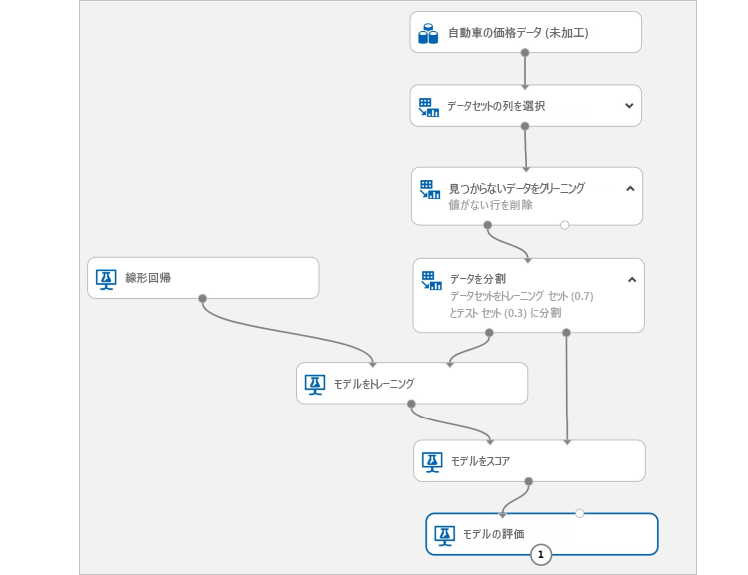

# Azure Machine Learning とは

Azure Machine Learning とは、機械学習モデルのトレーニング、デプロイ、自動化、管理を行うためのクラウド サービスであり、これらの操作のすべてをクラウドによって提供される幅広い規模で行うことができます。

## 機械学習とは

機械学習は、コンピューターで既存のデータを使って、将来の動き、結果、傾向を予測できるデータ サイエンスの手法の 1 つです。 機械学習を使用することで、明示的にプログラムすることなく、コンピューターが学習します。

機械学習からの予想や予測によってアプリやデバイスの機能性を高めることができます。 たとえばオンライン ショッピングでは、利用者が欲しいと考えそうな他の商品を、過去の購入履歴に基づいてお勧めするのに機械学習が役立っています。 また、クレジット カードの読み取り時に、機械学習では、トランザクションをトランザクションのデータベースと比較することで不正の検出を支援します。 また、ロボット掃除機が部屋を掃除するとき、機械学習は、作業が行われているかどうかを判断するのを支援します。

## Azure Machine Learning とは

Azure Machine Learning には、機械学習モデルのデータの準備、トレーニング、テスト、デプロイ、管理、追跡に使用できるクラウドベースの環境が用意されています。 ローカル コンピューターでトレーニングを開始し、その後、クラウドにスケールアウトします。 このサービスは、PyTorch、TensorFlow、scikit-learn などのオープンソース テクノロジを完全にサポートしており、古典的な ml からディープ ラーニング、教師あり学習および教師なし学習まで、あらゆる種類の機械学習に使用できます。

データの調査と準備、モデルのトレーニングとテストを行い、以下のような豊富なツールを使用してそれらをデプロイします。
+ モジュールをドラッグ アンド ドロップして実験を構築し、その後でモデルをデプロイできる[ビジュアル インターフェイス](ui-tutorial-automobile-price-train-score.md)
+ [SDK](https://docs.microsoft.com/azure/machine-learning) を使用して、[これらのサンプル ノートブック](https://aka.ms/aml-notebooks)のような独自のコードを記述する [Jupyter ノートブック](https://jupyter.org)
+ [Visual Studio Code 拡張機能](how-to-vscode-tools.md)

> [!VIDEO https://channel9.msdn.com/Events/Connect/Microsoft-Connect--2018/D240/player]

## Azure Machine Learning でできること

<a href="https://docs.microsoft.com/python/api/overview/azure/ml/intro?view=azure-ml-py" target="_blank">Azure Machine Learning Python SDK</a> とオープンソースの Python パッケージを使用するか、[ビジュアル インターフェイス (プレビュー)](ui-tutorial-automobile-price-train-score.md) を使用すると、Azure Machine Learning ワークスペースで、きわめて正確な機械学習およびディープ ラーニング モデルを自分で構築し、トレーニングすることができます。

オープンソースの Python パッケージで使用できる多くの機械学習コンポーネントの中から、いずれかを選択できます。たとえば、<a href="https://scikit-learn.org/stable/" target="_blank">Scikit-learn</a>、<a href="https://www.tensorflow.org" target="_blank">Tensorflow</a>、<a href="https://pytorch.org" target="_blank">PyTorch</a>、<a href="https://mxnet.io" target="_blank">MXNet</a> などがあります。

コードを記述する場合でも、ビジュアル インターフェイスを使用する場合でも、実験中に複数の実行を追跡して、最適なソリューションを見つけ、デプロイしたモデルを管理できます。

### コード第一のエクスペリエンス

<a href="https://docs.microsoft.com/python/api/overview/azure/ml/intro?view=azure-ml-py" target="_blank">Azure Machine Learning Python SDK</a> を使用してローカル コンピューターでトレーニングを開始してから、クラウドにスケールアウトします。 クラウドのパワーと、Azure Machine Learning コンピューティングや [Azure Databricks](/azure/azure-databricks/what-is-azure-databricks) などの利用可能な多数の[コンピューティング先](how-to-set-up-training-targets.md)と[高度なハイパーパラメーター調整サービス](how-to-tune-hyperparameters.md)を活用することで、高品質のモデルを手早く構築できます。

SDK を使用して、[モデルのトレーニングと調整を自動化](tutorial-auto-train-models.md)することもできます。

### UI ベースのローコード エクスペリエンス

コーディング不要のトレーニングの場合は、以下を試してください。

+ 使いやすいインターフェイスで[自動化された ML 実験](tutorial-first-experiment-automated-ml.md)を作成する。
+ [ビジュアル インターフェイスでのドラッグ アンド ドロップの実験](ui-tutorial-automobile-price-train-score.md)。
  

### 運用化 (MLOps)

適切なモデルがあれば、Web サービス、IoT デバイス、または Power BI で簡単に使用できます。 詳細については、[デプロイする方法と場所](how-to-deploy-and-where.md)に関する記事を参照してください。

デプロイされたモデルは、[Azure Machine Learning SDK for Python](https://aka.ms/aml-sdk)、[Azure portal](https://portal.azure.com/) または[ワークスペース ランディング ページ (プレビュー)](https://ml.azure.com) を使用して管理できます。

これらのモデルを使用して、[リアルタイム](how-to-consume-web-service.md)で予測を返したり、データが大量の場合は[非同期で](how-to-run-batch-predictions.md)予測を返したりすることができます。

さらに、高度な[機械学習パイプライン](concept-ml-pipelines.md)を使用して、データの準備、モデルのトレーニングと評価、およびデプロイの各手順で共同で作業することができます。 パイプラインを使用すると、次のことができます。

* クラウドでエンドツーエンドの機械学習プロセスを自動化する
* コンポーネントを再利用し、必要なときにのみステップを再実行する
* ステップごとに異なるコンピューティング リソースを使用する
* バッチ スコアリング タスクを実行する

Azure Machine Learning の基本的な使い方については、「[次の手順](#next-steps)」を参照してください。

## Azure Machine Learning と Studio の違い

[Machine Learning Studio](../studio/what-is-ml-studio.md) は、共同作業に対応するドラッグ アンド ドロップ式の視覚的なワークスペースです。コードを記述することなく機械学習ソリューションを構築、テスト、およびデプロイすることができます。 事前に構築および構成された機械学習アルゴリズムとデータ処理モジュールが、専用コンピューティング プラットフォームと共に使用されます。

Azure Machine Learning には、機械学習モデルのデータ準備、トレーニング、デプロイを迅速に行うための SDK とビジュアル インターフェイス (プレビュー) の**両方**が用意されています。 このビジュアル インターフェイス (プレビュー) では、Studio のドラッグ アンド ドロップに似た操作が可能です。 ただし、Studio の専用コンピューティング プラットフォームとは異なり、ビジュアル インターフェイスではユーザー独自のコンピューティング リソースが使用され、Azure Machine Learning に完全に統合されています。

以下で簡単に比較します。

|| Machine Learning Studio | Azure Machine Learning: ビジュアル インターフェイス|
|---| --- | --- |
|| 一般提供 (GA) | プレビュー段階|
|インターフェイスのモジュール| 多数 | 人気のあるモジュールの初期セット|
|コンピューティング ターゲットのトレーニング| 独自のコンピューティング ターゲット、CPU のサポートのみ| Azure Machine Learning コンピューティング、GPU または CPU をサポート。 (他のコンピューティングは、SDK でサポート)|
|デプロイのコンピューティング ターゲット| 独自の Web サービス形式 (カスタマイズ不可) | Enterprise セキュリティ オプションおよび Azure Kubernetes Service。  ([他のコンピューティング](how-to-deploy-and-where.md)は SDK でサポート) |
|自動化されたモデル トレーニングとハイパーパラメーター調整 | いいえ | ビジュアル インターフェイスではまだサポート対象外。   (SDK と Azure portal またはワークスペース ランディング ページでサポート)。 |

ビジュアル インターフェイス (プレビュー) をお試しください ([チュートリアル: ビジュアル インターフェイスで自動車価格を予測する](ui-tutorial-automobile-price-train-score.md)」を参照してください。

> [!NOTE]
> Studio で作成したモデルを Azure Machine Learning でデプロイおよび管理することはできません。 ただし、ビジュアル インターフェイスで作成およびデプロイしたモデルは、Azure Machine Learning ワークスペースから管理できます。

## 無料試用版

Azure サブスクリプションをお持ちでない場合は、開始する前に無料アカウントを作成してください。 [無料版または有料版の Azure Machine Learning](https://aka.ms/AMLFree) を今すぐお試しください。

Azure サービスを使用するクレジットを取得できます。 このクレジットを使い切った後に、アカウントを保持して、[無料の Azure サービス](https://azure.microsoft.com/free/)を使用できます。 明示的に設定を変更して課金を了承しない限り、クレジット カードに課金されることはありません。 または、[MSDN サブスクライバーの特典を有効にする](https://azure.microsoft.com/pricing/member-offers/msdn-benefits-details/?WT.mc_id=A261C142F)こともできます。これにより、有料の Azure のサービスを使用できるクレジットが毎月与えられます。

## 次の手順

- [Machine Learning service ワークスペースを作成](how-to-manage-workspace.md)します。

- 詳細なチュートリアルに従ってください。
  + [ワークスペースを作成して初めての ML モデルをトレーニングする](tutorial-1st-experiment-sdk-setup.md)
  + [Azure Machine Learning でイメージ分類モデルをトレーニングする](tutorial-train-models-with-aml.md)

- 機械学習シナリオを構築、最適化、および管理する[機械学習パイプライン](/azure/machine-learning/service/concept-ml-pipelines)について学習します。

- [Azure Machine Learning のアーキテクチャと概念](concept-azure-machine-learning-architecture.md)に関する詳細な記事を読みます。

- [Microsoft が提供する他の機械学習製品](/azure/architecture/data-guide/technology-choices/data-science-and-machine-learning)を参照して、さらに情報を入手します。
