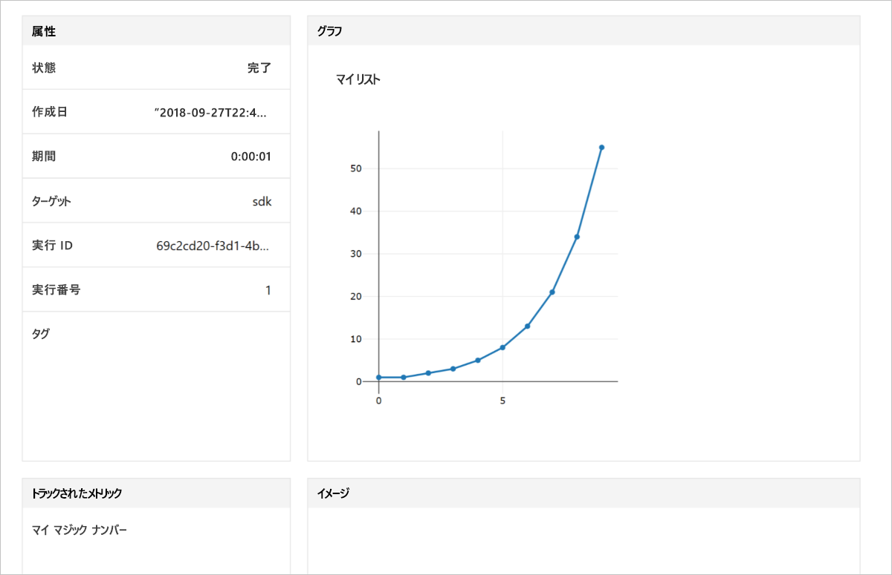

# <a name="quickstart-use-the-python-sdk-to-get-started-with-azure-machine-learning"></a>クイック スタート:Python SDK を使用して Azure Machine Learning の利用を開始する

この記事では、Azure Machine Learning SDK for Python を使用して Azure Machine Learning service の[ワークスペース](concept-azure-machine-learning-architecture.md)を作成して使用します。 ワークスペースは、Machine Learning で機械学習モデルの実験、トレーニング、およびデプロイを行うために使用する、クラウドでの基礎ブロックとなります。 

まず、独自の Python 環境と Jupyter Notebook サーバーを構成します。 インストールなしで実行するには、「[クイック スタート:Azure portal を使用した Azure Machine Learning の基本操作](quickstart-get-started.md)」を参照してください。

> [!VIDEO https://www.microsoft.com/en-us/videoplayer/embed/RE2G9N6]

この記事では、次の内容について説明します。
* Python SDK をインストールする。
* Azure サブスクリプションでワークスペースを作成します。
* 後で他のノートブックやスクリプトで使用するために、そのワークスペースの構成ファイルを作成する。
* ワークスペース内の値をログに記録するためのコードを記述する。
* ログに記録した値をワークスペースで表示する。

ワークスペースと構成ファイルを作成して、Machine Learning に関するその他のチュートリアルとハウツー記事の前提条件として使用します。 他の Azure サービスと同様に、特定の制限とクォータが Machine Learning に関連付けられています。 クォータの説明と、クォータの引き上げを要求する方法については、[こちら](how-to-manage-quotas.md)を参照してください。

以下の Azure リソースは、リージョンで利用可能になると、ワークスペースに自動的に追加されます。
 
- [Azure Container Registry](https://azure.microsoft.com/services/container-registry/)
- [Azure Storage](https://azure.microsoft.com/services/storage/)
- [Azure Application Insights](https://azure.microsoft.com/services/application-insights/) 
- [Azure Key Vault](https://azure.microsoft.com/services/key-vault/)

Azure サブスクリプションをお持ちでない場合は、開始する前に無料アカウントを作成してください。 [無料版または有料版の Azure Machine Learning service](http://aka.ms/AMLFree) を今日からお試しいただけます。

## <a name="install-the-sdk"></a>SDK のインストール

> [!IMPORTANT]
> 2018 年 9 月 27 日より後に作成されたデータ サイエンス仮想マシンを使用する場合は、このセクションをスキップします。
> この日付より後に作成されたデータ サイエンス仮想マシンには、Python SDK がプレインストールされています。

この記事のコードには、Azure Machine Learning SDK バージョン 1.0.2 以降が必要です。

SDK をインストールする前に、分離された Python 環境を作成することをお勧めします。 この記事では [Miniconda](https://conda.io/docs/user-guide/install/index.html) を使用していますが、[Anaconda](https://www.anaconda.com/) をフルインストールしたり、[Python virtualenv](https://virtualenv.pypa.io/en/stable/) を使用したりすることもできます。

### <a name="install-miniconda"></a>Miniconda のインストール

[Miniconda をダウンロードしてインストールします](https://conda.io/miniconda.html)。 Python 3.7 以降を選択します。 Python 2.x は選択しないでください。

### <a name="create-an-isolated-python-environment"></a>分離された Python 環境の作成 

1. コマンド ライン ウィンドウを開き、Python 3.6 を使用して *myenv* という名前の新しい conda 環境を作成します。

    ```shell
    conda create -n myenv -y Python=3.6
    ```

1. 環境をアクティブにします。

    ```shell
    conda activate myenv
    ```

### <a name="install-the-sdk"></a>SDK のインストール

アクティブにした conda 環境に SDK をインストールします。 このコードによって、Machine Learning SDK の主要なコンポーネントがインストールされます。 conda 環境に Jupyter Notebook サーバーもインストールされます。 お使いのマシンの構成によっては、インストールが完了するまでに数分かかります。

```sh
# Install Jupyter
conda install nb_conda

# Install the base SDK and Jupyter Notebook
pip install azureml-sdk[notebooks]
```

追加のキーワードを使用して、SDK の他のコンポーネントをインストールできます。

```sh
# Install the base SDK and auto ml components
pip install azureml-sdk[automl]

# Install the base SDK and the model explainability component
pip install azureml-sdk[explain]

# Install the base SDK and experimental components
pip install azureml-sdk[contrib]
```

Azure Databricks 環境では、代わりに次のインストール コマンドを使用します。

```
# Install the base SDK and automl components in the Azure Databricks environment.
# For more information, see https://github.com/Azure/MachineLearningNotebooks/tree/master/databricks.
pip install azureml-sdk[databricks]
```


## <a name="create-a-workspace"></a>ワークスペースの作成

1. Jupyter Notebook を起動するには、次のコマンドを入力します。

    ```shell
    jupyter notebook
    ```

1. ブラウザー ウィンドウで、既定の `Python 3` カーネルを使用して新しいノートブックを作成します。 

1. SDK のバージョンを表示するには、ノートブックのセルに次の Python コードを入力し、実行します。

   [!code-python[](~/aml-sdk-samples/ignore/doc-qa/quickstart-create-workspace-with-python/quickstart.py?name=import)]

1. [Azure portal のサブスクリプションの一覧](https://ms.portal.azure.com/#blade/Microsoft_Azure_Billing/SubscriptionsBlade)で、`<azure-subscription-id>` パラメーターの値を見つけます。 自分のロールが所有者または共同作成者になっている任意のサブスクリプションを使用します。

   ```python
   from azureml.core import Workspace
   ws = Workspace.create(name='myworkspace',
                         subscription_id='<azure-subscription-id>', 
                         resource_group='myresourcegroup',
                         create_resource_group=True,
                         location='eastus2' # Or other supported Azure region   
                        )
   ```

   コードを実行するときに、Azure アカウントへのサインインを求められることがあります。 サインインすると、認証トークンがローカルにキャッシュされます。

1. 関連付けられているストレージ、コンテナー レジストリ、キー コンテナーなど、ワークスペースの詳細を表示するには、次のコードを入力します。

    [!code-python[](~/aml-sdk-samples/ignore/doc-qa/quickstart-create-workspace-with-python/quickstart.py?name=getDetails)]


## <a name="write-a-configuration-file"></a>構成ファイルの記述

構成ファイル内のワークスペースの詳細を現在のディレクトリに保存します。 このファイルは、*aml_config\config.json* という名前です。  

このワークスペース構成ファイルを使用すると、後で同じワークスペースを簡単に読み込むことができます。 同じディレクトリまたはサブディレクトリ内の他のノートブックやスクリプトと共に読み込むことができます。 

[!code-python[](~/aml-sdk-samples/ignore/doc-qa/quickstart-create-workspace-with-python/quickstart.py?name=writeConfig)]

`write_config()` API 呼び出しでは、構成ファイルが現在のディレクトリに作成されます。 *config.json* ファイルには、以下のスクリプトが含まれています。

```json
{
    "subscription_id": "<azure-subscription-id>",
    "resource_group": "myresourcegroup",
    "workspace_name": "myworkspace"
}
```

## <a name="use-the-workspace"></a>ワークスペースの使用

実験の実行を追跡するために、SDK の基本的な API が使用されるコードを記述します。

[!code-python[](~/aml-sdk-samples/ignore/doc-qa/quickstart-create-workspace-with-python/quickstart.py?name=useWs)]

## <a name="view-logged-results"></a>ログに記録された結果の表示
実行が完了したら、Azure portal で実験の実行を表示できます。 前回の実行に関する結果に移動する URL を出力するには、次のコードを使用します。

```python
print(run.get_portal_url())
```

リンクを使用すると、ログに記録された値がブラウザーの Azure portal に表示されます。



## <a name="clean-up-resources"></a>リソースのクリーンアップ 
>[!IMPORTANT]
>作成したリソースは、Machine Learning に関連したその他のチュートリアルおよびハウツー記事の前提条件として使用できます。

この記事で作成したリソースを使用する予定がない場合は、料金の発生を避けるために削除してください。

[!code-python[](~/aml-sdk-samples/ignore/doc-qa/quickstart-create-workspace-with-python/quickstart.py?name=delete)]

## <a name="next-steps"></a>次の手順

この記事では、モデルを実験してデプロイするために必要なリソースを作成しました。 ノートブックでコードを実行し、クラウドのワークスペースでそのコードの実行履歴を確認しました。

そのコードを Machine Learning のチュートリアルで使用するには、他にもいくつかのパッケージが環境内に必要になります。

1. ブラウザーで、ノートブックを閉じます。
1. コマンド ライン ウィンドウで Ctrl+C キーを押して、Jupyter Notebook サーバーを停止します。
1. 追加パッケージをインストールします。

    ```shell
    conda install -y cython matplotlib scikit-learn pandas numpy
    pip install azureml-sdk[automl]
    ```

これらのパッケージのインストール後、モデルのトレーニングとデプロイを行うチュートリアルに進みます。 

> [!div class="nextstepaction"]
> [チュートリアル: 画像分類モデルをトレーニングする](tutorial-train-models-with-aml.md)

[GitHub でより高度な例](https://aka.ms/aml-notebooks)を確認することもできます。
