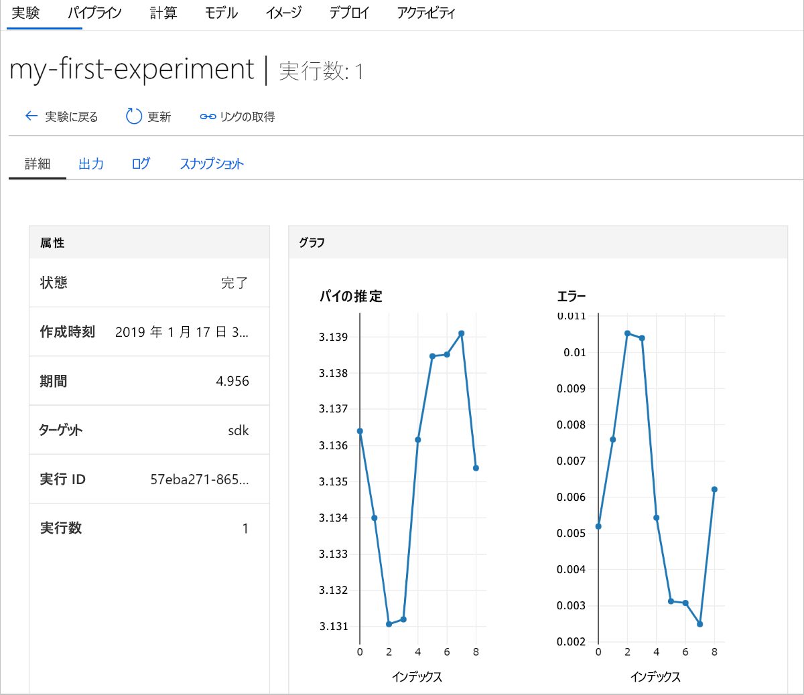

# <a name="quickstart-get-started-with-azure-machine-learning-using-the-cli-extension"></a>クイック スタート: CLI 拡張機能を使用した Azure Machine Learning の基本操作

このクイック スタートでは、Machine Learning CLI 拡張機能を使用した [Azure Machine Learning サービス](overview-what-is-azure-ml.md)の基本操作について説明します (プレビュー)。

CLI を使用して、次のことを行う方法を学習します。

1. Azure サブスクリプションでワークスペースを作成します。 ワークスペースは、ユーザーがコンピューティング リソース、モデル、デプロイ、実行履歴をクラウドに格納するために使用されます。
1. プロジェクトをワークスペースにアタッチします。   プロジェクトはローカル フォルダーで、機械学習の問題を解決するために必要なスクリプトと構成ファイルが含まれます。  
1. 複数のイテレーションでいくつかの値を記録する Python スクリプトをプロジェクトで実行します。
1. ワークスペースの実行履歴のログ値を表示します。

> [!NOTE]
> 利用者の便宜を図る目的で、リージョンによっては Azure リソースの[コンテナー レジストリ](https://azure.microsoft.com/services/container-registry/)、[ストレージ](https://azure.microsoft.com/services/storage/)、[Application Insights](https://azure.microsoft.com/services/application-insights/)、[キー コンテナー](https://azure.microsoft.com/services/key-vault/)がワークスペースに自動的に追加されます。

作成したリソースは、Azure Machine Learning に関連したその他のチュートリアルとハウツー記事の前提条件として使用できます。

この CLI は、Azure Machine Learning サービス用の Python ベースの <a href="http://aka.ms/aml-sdk" target="_blank">SDK</a> を基にして作成されました。

## <a name="prerequisites"></a>前提条件

クイック スタートの手順を始める前に、以下の前提条件を確認してください。

+ Azure サブスクリプション。 Azure サブスクリプションをお持ちでない場合は、開始する前に [無料アカウント](https://azure.microsoft.com/free/?WT.mc_id=A261C142F) を作成してください。
+ [Python 3.5 以降](https://www.python.org/)がインストールされていること
+ [Azure CLI](https://docs.microsoft.com/cli/azure/install-azure-cli?view=azure-cli-latest) がインストールされていること

## <a name="install-the-cli-extension"></a>CLI 拡張機能をインストールする

お使いのコンピューターでコマンド ライン エディターを開き、[Azure CLI に Machine Learning 拡張機能](reference-azure-machine-learning-cli.md)をインストールします。  インストールの完了には数分かかる場合があります。

```azurecli
az extension add azureml-sdk
```

## <a name="install-the-sdk"></a>SDK のインストール

[!INCLUDE [aml-install-sdk](../../../includes/aml-install-sdk.md)]

## <a name="create-a-resource-group"></a>リソース グループの作成

リソース グループは、Azure ソリューションの関連するリソースを保持するコンテナーです。 Azure CLI を使って Azure にサインインし、サブスクリプションを指定して、リソース グループを作成します。

コマンド ライン ウィンドウで、Azure CLI コマンド `az login` を使用してサインインします。 対話型ログイン画面の指示に従います。
    
   ```azurecli
   az login
   ```

使用できる Azure サブスクリプションの一覧を表示し、使用するものを指定します。
   ```azurecli
   az account list --output table
   az account set --subscription <your-subscription-id>
   az account show
   ```
   \<your-subscription-id\> は、使用するサブスクリプションの ID の値です。 かっこは含めないでください。

ワークスペースを保持するリソース グループを作成します。
このクイック スタートでは次のようにします。
   + リソース グループの名前は `docs-aml` です。
   + リージョンは `eastus2` です。 

   ```azurecli
   az group create -n docs-aml -l eastus2
   ```

## <a name="create-a-workspace-and-a-project-folder"></a>ワークスペースとプロジェクト フォルダーを作成する

コマンド ライン ウィンドウで、リソース グループの下に Azure Machine Learning サービスのワークスペースを作成します。


   このクイック スタートでは次のようにします。
   + ワークスペースの名前は `docs-ws` です。
   + リソース グループの名前は `docs-aml` です。

   ```azurecli
   az ml workspace create -n docs-ws -g docs-aml
   ```

コマンド ライン ウィンドウで、Azure Machine Learning プロジェクト用のフォルダーをローカル コンピューター上に作成します。

   ```
   mkdir docs-prj
   cd docs-prj
   ```

## <a name="create-a-python-script"></a>Python スクリプトを作成する

[!INCLUDE [aml-create-script-pi](../../../includes/aml-create-script-pi.md)]

## <a name="run-the-script"></a>スクリプトを実行する

フォルダーをプロジェクトとしてワークスペースにアタッチします。 `--history` 引数では、各実行のメトリックをキャプチャする実行履歴ファイルの名前を指定します。

   ```azurecli
   az ml project attach --history my_history -w docs-ws -g docs-aml
   ```

ローカル コンピューター上でスクリプトを実行します。

   ```azurecli
   az ml run submit -c local pi.py
   ```

   このコマンドは、コードを実行して、コンソールに Web リンクを出力します。 リンクをコピーして Web ブラウザーに貼り付けます。

Web ブラウザーで URL にアクセスします。 Web ポータルに実行の結果が表示されます。 その実行の結果や、存在する場合は以前の実行の結果を調査できます。

ポータルのダッシュボードは、Edge、Chrome、および Firefox ブラウザーでのみサポートされています。

   

## <a name="clean-up-resources"></a>リソースのクリーンアップ

[!INCLUDE [aml-delete-resource-group](../../../includes/aml-delete-resource-group.md)]

## <a name="next-steps"></a>次の手順
モデルの実験とデプロイを開始するために必要なリソースがこれで作成されました。 また、プロジェクトを作成し、スクリプトを実行した後、スクリプトの実行履歴を確認しました。

ワークフローを詳しく体験するには、Azure Machine Learning チュートリアルに従い、モデルを構築、トレーニングし、デプロイしてください。

> [!div class="nextstepaction"]
> [チュートリアル: 構築、トレーニング、デプロイする](tutorial-train-models-with-aml.md)