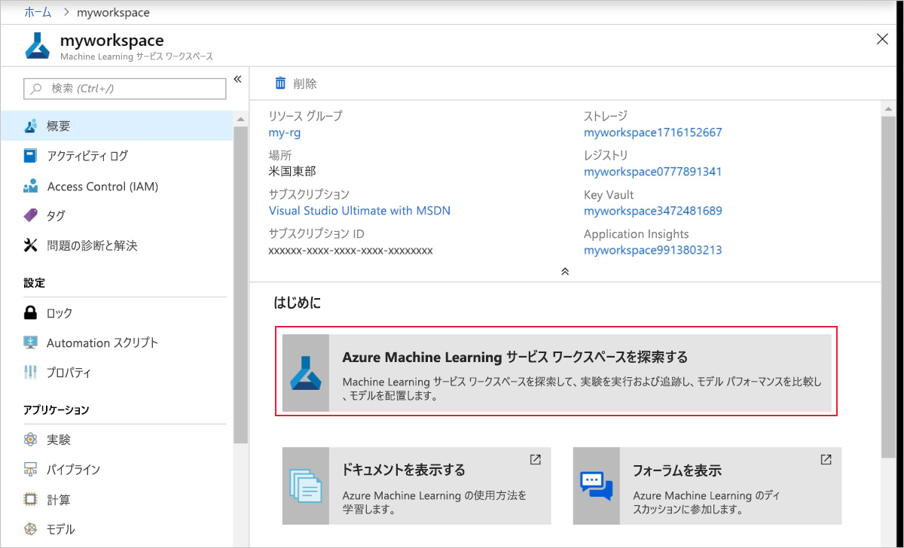
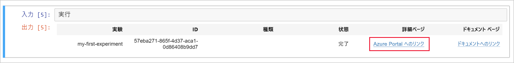
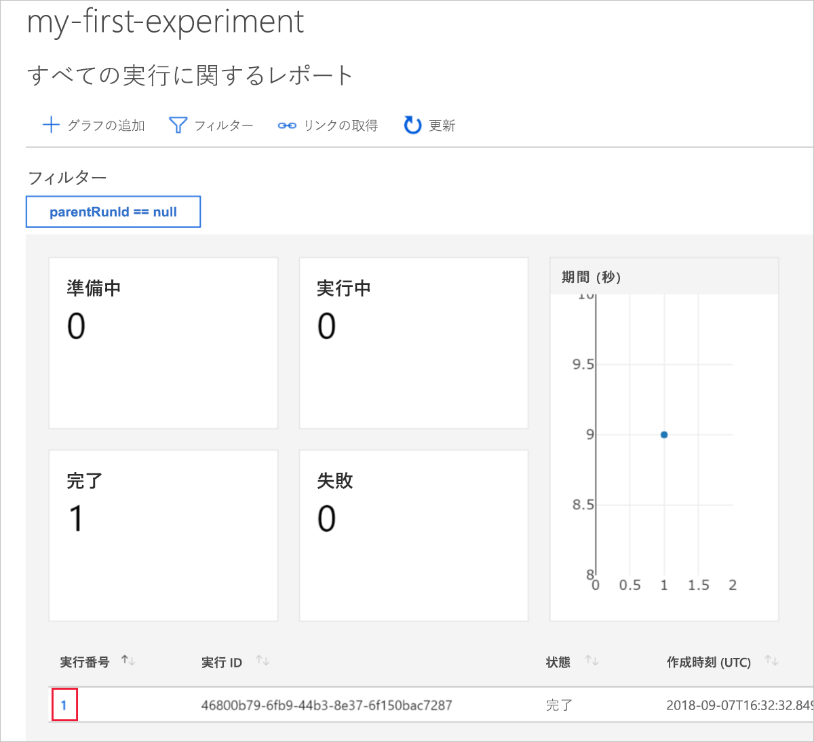
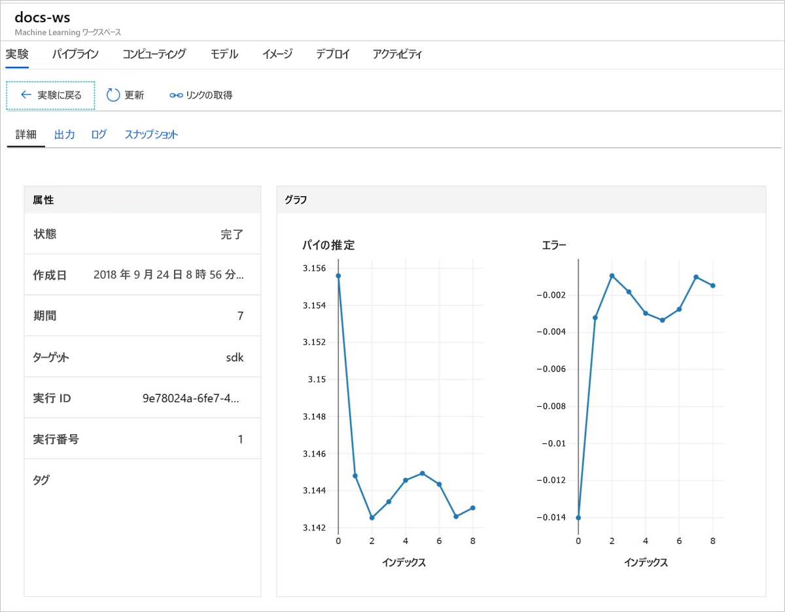

# クイック スタート:Azure portal を使用した Azure Machine Learning の基本操作

このクイック スタートでは、Azure portal を使用して Azure Machine Learning ワークスペースを作成します。 このワークスペースが、Machine Learning で機械学習モデルの実験、トレーニング、およびデプロイを行うために使用される、クラウドでの基礎ブロックとなります。 このクイック スタートではクラウド リソースを使用するため、インストールは不要です。 代わりに独自の Jupyter ノートブック サーバーを構成するには、[Python を使用した Azure Machine Learning の利用開始に関するクイック スタート](quickstart-create-workspace-with-python.md)を参照してください。  
 
> [!VIDEO https://www.microsoft.com/en-us/videoplayer/embed/RE2F9Ad]

このクイック スタートでは、以下のアクションを実行します。

* Azure サブスクリプションでワークスペースを作成します。
* Azure のノートブックで Python を試し、数回の繰り返しにわたる値をログに記録する。
* ログに記録した値をワークスペースで表示する。

以下の Azure リソースは、リージョンで利用可能になると、ワークスペースに自動的に追加されます。

  - [Azure Container Registry](https://azure.microsoft.com/services/container-registry/)
  - [Azure Storage](https://azure.microsoft.com/services/storage/)
  - [Azure Application Insights](https://azure.microsoft.com/services/application-insights/) 
  - [Azure Key Vault](https://azure.microsoft.com/services/key-vault/)

作成するリソースは、Machine Learning サービスに関連したその他のチュートリアルおよびハウツー記事の前提条件として使用できます。 他の Azure サービスと同様に、Machine Learning に関連付けられている特定のリソースにも制限があります。 たとえば、コンピューティング クラスターのサイズなどです。 詳細については、[既定の制限とクォータを増やす方法](how-to-manage-quotas.md)に関するページを参照してください。

Azure サブスクリプションをお持ちでない場合は、開始する前に無料アカウントを作成してください。 [無料版または有料版の Azure Machine Learning service](http://aka.ms/AMLFree) を今日からお試しいただけます。

## ワークスペースの作成 

[!INCLUDE [aml-create-portal](../../../includes/aml-create-in-portal.md)]

ワークスペース ページで、`Explore your Azure Machine Learning service Workspace` を選択します。

 

## ワークスペースの使用

それでは、機械学習スクリプトの管理にワークスペースがいかに役立つかご覧ください。 このセクションでは、次の手順を実行します。

* Azure Notebooks でノートブックを開く。
* ログに記録される値を作成するコードを実行する。
* ログに記録した値をワークスペースで表示する。

この例は、スクリプトで生成された情報の追跡にワークスペースがいかに役立つかを示しています。 

### ノートブックを開く 

Azure Notebooks では、Jupyter ノートブック向けの無料のクラウド プラットフォームが提供されます。Machine Learning の実行に必要なすべてのものが事前構成されています。  

初めての実験を試すには、[`Open Azure Notebooks`] を選択します。

 ![[Open Azure Notebooks]\(Azure Notebooks を開く\)](./media/quickstart-get-started/explore_ws.png)

組織によっては、サインインするには[管理者の同意](https://notebooks.azure.com/help/signing-up/work-or-school-account/admin-consent)が必要な場合があります。

Azure portal にサインインしたのと同じアカウントで Azure Notebooks にサインインします。  サインイン後、新しいタブが開き、`Clone Library` プロンプトが表示されます。 [`Clone`] を選択します。

### ノートブックを実行する

2 つのノートブックと共に `config.json` ファイルが表示されます。 この構成ファイルには、作成したワークスペースに関する情報が含まれています。  

`01.run-experiment.ipynb` を選択してノートブックを開きます。

セルを 1 つずつ実行します (Shift + Enter)。 ノートブック全体を実行するには、[`Cells`] > [`Run All`] を選択します。 セルの横にアスタリスク __*__ が表示されているときは実行中です。 そのセルのコードが完了すると、数値が表示されます。 

ノートブック内のセルをすべて実行し終えると、記録された値をワークスペースで確認できるようになります。

## ログに記録された値を表示する

ノートブックのすべてのセルを実行したら、ポータル ページに戻ります。  

[`View Experiments`] を選択します。

`Reports` ポップアップを閉じます。

[`my-first-experiment`] を選択します。

完了した実行に関する情報を確認します。 ページを下へスクロールして、実行テーブルを見つけます。 実行番号リンクを選択します。

 

ログに記録された値を基に自動的に作成されたプロットが表示されます。 同じ name パラメーターで複数の値をログに記録するときは常に、プロットが自動的に生成されます。

   

Pi を概算するコードではランダムな値が使用されるため、実際のプロットには異なる値が表示されます。  

## リソースのクリーンアップ 

[!INCLUDE [aml-delete-resource-group](../../../includes/aml-delete-resource-group.md)]

リソース グループは保持しつつ、いずれかのワークスペースを削除することもできます。 ワークスペースのプロパティを表示し、**[削除]** を選択します。

## 次の手順

実験してモデルをデプロイするために必要なリソースを作成しました。 ノートブックでいくつかのコードも実行しました。 クラウドのワークスペースで、そのコードの実行履歴を確認しました。

ワークフローを詳しく体験するには、Machine Learning チュートリアルに従って、モデルをトレーニングし、デプロイします。  

> [!div class="nextstepaction"]
> [チュートリアル: 画像分類モデルをトレーニングする](tutorial-train-models-with-aml.md)
