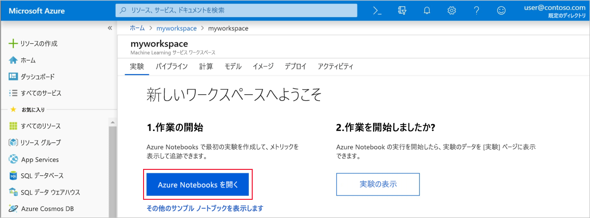

# <a name="quickstart-use-the-azure-portal-to-get-started-with-azure-machine-learning-service"></a>クイック スタート: Azure portal を使用した Azure Machine Learning サービスの基本操作

このクイック スタートでは、Azure portal を使用して Azure Machine Learning サービス ワークスペースを作成します。 Azure Machine Learning サービスで機械学習モデルの実験、トレーニング、デプロイを行うとき、このワークスペースがクラウドに置いて基礎ブロックとなります。 

このチュートリアルでは、次のことについて説明します。

* Azure サブスクリプションでワークスペースを作成する
* Azure Notebook で Python を試し、数回の繰り返しから値をログに記録する
* ログに記録した値をワークスペースで表示する

利用者の便宜を図る目的で、リージョンによっては Azure リソースの[コンテナー レジストリ](https://azure.microsoft.com/services/container-registry/)、[ストレージ](https://azure.microsoft.com/services/storage/)、[Application Insights](https://azure.microsoft.com/services/application-insights/)、[キー コンテナー](https://azure.microsoft.com/services/key-vault/)がワークスペースに自動的に追加されます。

作成するリソースは、Azure Machine Learning サービスに関連したその他のチュートリアルおよびハウツー記事の前提条件として使用できます。 他の Azure サービスと同様に、 Azure Machine Learning サービスに関連する一部のリソース (BatchAI クラスター サイズなど) には上限があります。 既定の上限とクォータの追加を要求する方法については[こちら](how-to-manage-quotas.md)の記事をお読みください。

Azure サブスクリプションがない場合は、開始する前に[無料アカウント](https://azure.microsoft.com/free/?WT.mc_id=A261C142F)を作成してください。


## <a name="create-a-workspace"></a>ワークスペースの作成 

[!INCLUDE [aml-create-portal](../../../includes/aml-create-in-portal.md)]

ワークスペース ページで、`Explore your Azure Machine Learning service workspace` をクリックします。

 


## <a name="use-the-workspace"></a>ワークスペースの使用

それでは、機械学習スクリプトの管理にワークスペースがいかに役立つかご覧ください。 このセクションでは、次の作業を行います。

* Azure Notebooks でノートブックを開く
* 値をログに記録するコードを実行する
* ログに記録した値をワークスペースで表示する

これは、スクリプトで生成された情報の追跡にワークスペースがいかに役立つかを示す 1 つの例です。 

### <a name="open-a-notebook"></a>ノートブックを開く 

Azure Notebooks では、Jupyter ノートブック向けの無料のクラウド プラットフォームが提供されます。Azure Machine Learning サービスの実行に必要なすべてが事前構成されています。  

`Open Azure Notebooks` ボタンをクリックし、最初の実験をお試しください。

 

サインイン後、新しいタブが開き、`Clone Library` プロンプトが表示されます。  [`Clone`] をクリックします。


### <a name="run-the-notebook"></a>ノートブックを実行する

2 つのノートブックと共に `config.json` ファイルが表示されます。  この構成ファイルには、作成したワークスペースに関する情報が含まれます。  

`01.run-experiment.ipynb` をクリックしてノートブックを開きます。

`Shift`+`Enter` を使用し、セルを一度に 1 つ実行できます。  あるいは、メニュー `Cells` > `Run All` を使用し、ノートブック全体を実行します。  セルの横に [*] が表示されているときは実行中です。  そのセルのコードが完了すると、数値が表示されます。

サインインを要求される場合があります。  メッセージに含まれるコードをコピーし、リンクをクリックしてコードを新しいウィンドウに貼り付けます。  コードの前後にスペースが入らないようにしてください。  サインインには、Azure portal で使用したアカウントを使用します。

 

ノートブックで、2 番目のセルが `config.json` から読み取り、ワークスペースに接続します。
```
ws = Workspace.from_config()
```

コードの 3 番目のセルが "my-first-experiment" という名前で実験を開始します。  ワークスペースに戻ったとき、この名前を使用して実行に関する情報を検索します。

```
experiment = Experiment(workspace_object=ws, name = "my-first-experiment")
```

ノートブックの最後のセルで、ログ ファイルに書き込まれる値に注意してください。

```
# Log final results
run.log("Final estimate: ",pi_estimate)
run.log("Final error: ",math.pi-pi_estimate)
```

この値はコードの実行後にワークスペースで参照できます。

## <a name="view-logged-values"></a>ログに記録された値を表示する

ノートブックのすべてのセルが完了したら、ポータル ページに戻ります。  

`View Experiments` をクリックします。


`Reports` ポップアップを閉じます。

`my-first-experiment` をクリックします。

完了した実行に関する情報を確認します。  ページを下方向にスクロールし、実行テーブルを見つけ、実行番号リンクをクリックします。

 

ログに記録された値を基に自動的に作成されたプロットが表示されます。

   

## <a name="clean-up-resources"></a>リソースのクリーンアップ 

[!INCLUDE [aml-delete-resource-group](../../../includes/aml-delete-resource-group.md)]

リソース グループは残しても構いませんが、単一ワークスペースは削除してください。ワークスペースのプロパティを表示し、[削除] ボタンを選択します。

## <a name="next-steps"></a>次の手順

モデルの実験とデプロイを開始するために必要なリソースがこれで作成されました。 また、ノートブックでいくつかのコードを実行し、クラウドのワークスペースでそのコードの実行履歴を確認しました。

ワークフローを詳しく体験するには、Azure Machine Learning チュートリアルに従い、モデルをトレーニングし、デプロイしてください。  

> [!div class="nextstepaction"]
> [チュートリアル: 画像分類モデルをトレーニングする](tutorial-train-models-with-aml.md)
