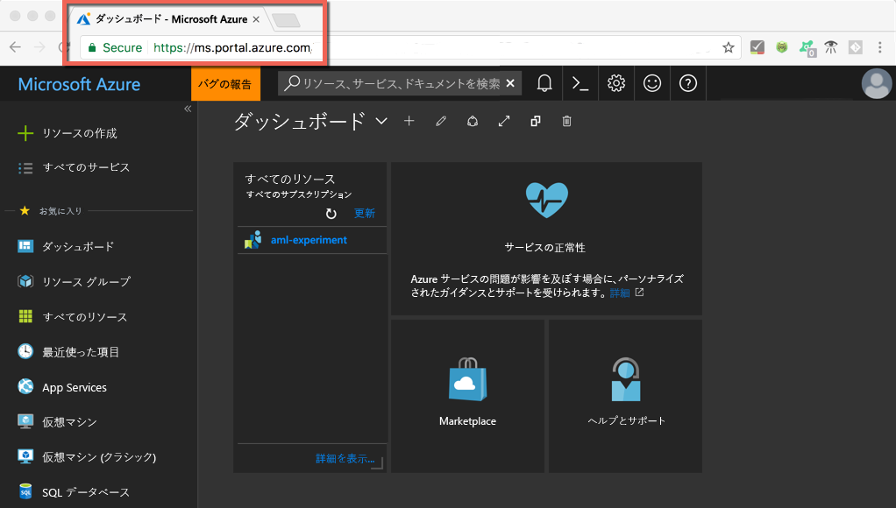
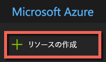
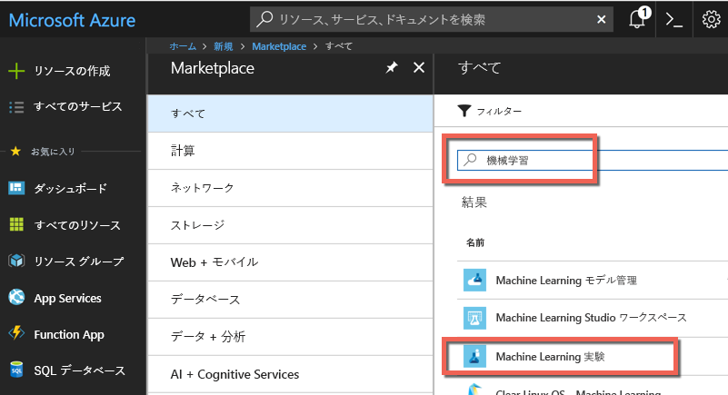
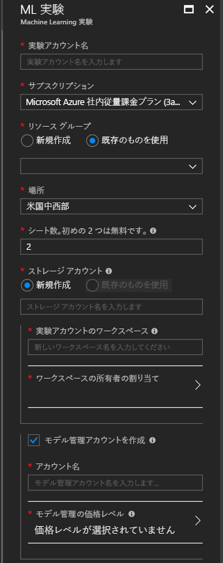
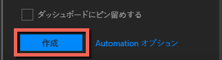
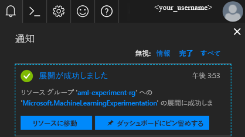
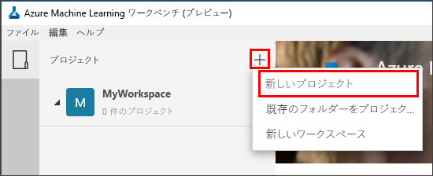
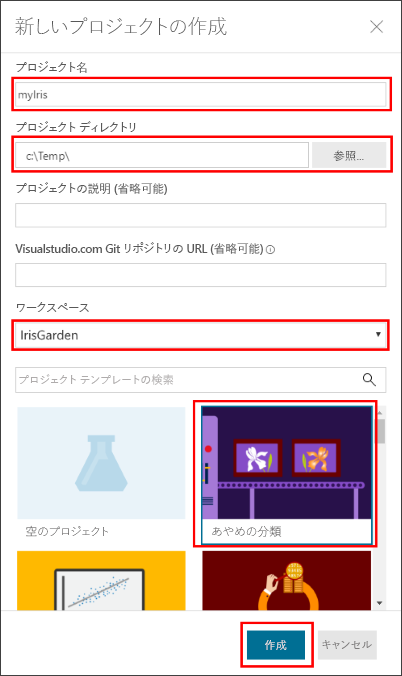
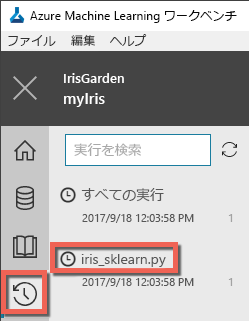

# <a name="quickstart-install-and-get-started-with-azure-machine-learning-services"></a>クイック スタート: Azure Machine Learning サービスのインストールと基本操作
Azure Machine Learning サービス (プレビュー) は、統合されたエンドツーエンドのデータ サイエンスおよび高度な分析ソリューションです。 プロフェッショナルなデータ サイエンティストは、これを使用してデータの準備、実験の開発、モデルのデプロイをクラウド規模で行うことができます。

このクイックスタートでは、次の方法について説明します。

* Azure Machine Learning サービスのサービス アカウントを作成する
* Azure Machine Learning Workbench をインストールしてログインする
* Workbench でプロジェクトを作成する
* そのプロジェクトでスクリプトを実行する  
* コマンド ライン インターフェイス (CLI) にアクセスする


Azure Machine Learning サービスは Microsoft Azure のポートフォリオの一部であるため、ご利用には Azure サブスクリプションが必要です。 Azure サブスクリプションをお持ちでない場合は、開始する前に [無料アカウント](https://azure.microsoft.com/free/?WT.mc_id=A261C142F) を作成してください。

また、リソース グループや仮想マシンなどのアセットを作成するための適切な権限も必要になります。 

<a name="prerequisites"></a>Azure Machine Learning Workbench アプリケーションは、次のオペレーティング システムにインストールできます。
- Windows 10 または Windows Server 2016
- macOS Sierra または High Sierra

## <a name="create-azure-machine-learning-services-accounts"></a>Azure Machine Learning サービス アカウントを作成する
Azure Portal を使用して Azure Machine Learning アカウントをプロビジョニングします。 
1. 使用する Azure サブスクリプションの資格情報を使用して [Azure Portal](https://portal.azure.com/) にサインインします。 Azure サブスクリプションをお持ちでない場合は、ここで[無料アカウント](https://azure.microsoft.com/free/?WT.mc_id=A261C142F)を作成してください。 

   

1. ポータルの左上隅にある **[リソースの作成]** ボタン (+) を選択します。

   

1. 検索バーに「**Machine Learning**」と入力します。 **[Machine Learning Experimentation]\(Machine Learning 実験\)** という検索結果を選択します。 

   

1. **[Machine Learning Experimentation]\(Machine Learning 実験\)** ウィンドウの一番下までスクロールし、**[作成]** を選択して、実験アカウントの定義を開始します。  

   

1. **[ML Experimentation]\(ML 実験\)** ウィンドウで、Machine Learning 実験アカウントを構成します。 

   Setting|チュートリアルの推奨値|説明
   ---|---|---
   [Experimentation account name]\(実験アカウント名\) | "_一意の名前_" |アカウントを識別する一意の名前を入力します。 独自の名前を使用できるほか、実験を識別するうえで最適な部門またはプロジェクトの名前を使用できます。 この名前は 2 ～ 32 文字で指定します。 これには、英数字とダッシュ (-) 文字のみを使用してください。 
   [サブスクリプション] | _該当するサブスクリプション_ |実験に使用する Azure サブスクリプションを選択します。 複数のサブスクリプションをお持ちの場合は、リソースが課金の対象となっている適切なサブスクリプションを選択してください。
   リソース グループ | "_リソース グループ名_" | サブスクリプションの既存のリソース グループを使用するか、任意の名前を入力してこの実験アカウント用に新しいリソース グループを作成します。 
   Location | _ユーザーに最も近いリージョン_ | ユーザーとデータ リソースに最も近い場所を選択します。
   [Number of seats]\(シート数\) | 2 | 接続クライアント数を入力します。 [シートあたりの価格](https://azure.microsoft.com/pricing/details/machine-learning/)を参照してください。<br/><br/>このクイック スタートで必要なシート数は 2 つだけです。 シートは、必要に応じて Azure Portal から追加したり削除したりすることができます。
   ストレージ アカウント | "_一意の名前_" | **[新規作成]** を選択し、[Azure Storage アカウント](https://docs.microsoft.com/azure/storage/common/storage-quickstart-create-account?tabs=portal)を作成するための名前を指定します。 名前は 3 文字以上 24 文字以下にする必要があり、英数字だけを使用することができます。 または、**[Use existing (既存のものを使用)]** を選択し、ドロップダウン リストから既存のストレージ アカウントを選択します。 このストレージ アカウントは、プロジェクト アーティファクトと実行履歴データを保持するために必要であり、そのために使用されます。 
   [Workspace for Experimentation account]\(実験アカウントのワークスペース\) | IrisGarden<br/>(チュートリアルで使用する名前) | このアカウントのワークスペースの名前を指定します。 この名前は 2 ～ 32 文字で指定します。 これには、英数字とダッシュ (-) 文字のみを使用してください。 このワークスペースには、実験を管理および公開するのに必要なツールが用意されています。
   [Assign owner for the workspace]\(ワークスペースの所有者の割り当て\) | "_自分のアカウント_" | ご自身のアカウントをワークスペースの所有者として選択します。
   [Create Model Management account]\(モデル管理アカウントを作成する\) | **check** |リアルタイム Web サービスとしてモデルをデプロイしたり管理したりする必要が生じたときにこのリソースが利用できるよう、ここでモデル管理アカウントを作成しておきます。 <br/><br/>必須ではありませんが、モデル管理アカウントは実験アカウントと同時に作成することをお勧めします。
   アカウント名 | "_一意の名前_" | モデル管理アカウントを識別する一意の名前を選択します。 独自の名前を使用できるほか、実験を識別するうえで最適な部門またはプロジェクトの名前を使用できます。 この名前は 2 ～ 32 文字で指定します。 これには、英数字とダッシュ (-) 文字のみを使用してください。 
   [Model Management pricing tier]\(モデル管理の価格レベル\) | **DEVTEST** | **[価格レベルが選択されていません]** を選択して、新しいモデル管理アカウントの価格レベルを指定します。 コストを抑えるために、該当するサブスクリプションで利用できる場合は **DEVTEST** 価格レベルを選択してください (利用には制限があります)。 利用できない場合は、S1 価格レベルを選択します。 **[選択]** をクリックして、価格レベルの選択を保存します。 
   [ダッシュボードにピン留めする] | _check_ | **[ダッシュボードにピン留めする]** チェック ボックスをオンにすると、Azure Portal のフロント ダッシュボード ページで Machine Learning 実験アカウントを簡単に追跡できます。

   

5. **[作成]** を選択して、実験アカウントとモデル管理アカウントの作成プロセスを開始します。

   

   アカウントの作成には、しばらく時間がかかる場合があります。 デプロイ プロセスの状態は、Azure Portal ツール バーの [通知] アイコン (ベル) をクリックして確認できます。
   
   


## <a name="install-and-log-in-to-workbench"></a>Workbench をインストールしてログインする

Azure Machine Learning Workbench には Windows 版と macOS 版があります。 [サポートされているプラットフォーム](#prerequisites)の一覧を参照してください。

>[!WARNING]
>インストールが完了するまでに 30 分程度かかる場合があります。 

1. 最新の Workbench インストーラーをダウンロードして起動します。 
   >[!IMPORTANT]
   >インストーラーは、ディスク上に完全にダウンロードした後、そこから実行します。 ブラウザーのダウンロード ウィジェットで直接実行しないようにしてください。

   **Windows の場合:** 

   &nbsp;&nbsp;&nbsp;&nbsp;A. [AmlWorkbenchSetup.msi](https://aka.ms/azureml-wb-msi) をダウンロードします。  <br/>
   &nbsp;&nbsp;&nbsp;&nbsp;B. エクスプローラーで、ダウンロードしたインストーラーをダブルクリックします。

   **macOS の場合:** 

   &nbsp;&nbsp;&nbsp;&nbsp;A. [AmlWorkbench.dmg](https://aka.ms/azureml-wb-dmg) をダウンロードします。 <br/>
   &nbsp;&nbsp;&nbsp;&nbsp;B. Finder で、ダウンロードしたインストーラーをダブルクリックします。<br/><br/>

1. インストーラー画面の指示に従います。 

   **インストールが完了するまでに 30 分程度かかる場合があります。**  
   
   | |Azure Machine Learning Workbench のインストール パス|
   |--------|------------------------------------------------|
   |Windows|C:\Users\\<user\>\AppData\Local\AmlWorkbench|
   |macOS|/Applications/Azure ML Workbench.app|

   必要な依存コンポーネントが、インストーラーによってすべてダウンロードされ、セットアップされます (Python、Miniconda、その他の関連ライブラリなど)。 このインストールには、Azure のクロスプラットフォーム コマンドライン ツール (Azure CLI) も含まれます。

1. インストーラーの最後の画面で **[Launch Workbench]\(Workbench の起動\)** ボタンを選択し、Workbench を起動します。 

   インストーラーを閉じた場合は、次のようにします。
   + Windows の場合は、**Machine Learning Workbench** のデスクトップ ショートカットを使用して起動します。 
   + macOS の場合は、Launchpad で **[Azure ML Workbench]** を選択します。

1. 最初の画面で **[Sign in with Microsoft]\(Microsoft にサインイン\)** を選択し、Azure Machine Learning Workbench に対する認証を行います。 Azure Portal で実験アカウントとモデル管理アカウントを作成する際に使用したものと同じ資格情報を使用してください。 

   サインインすると、Workbench によって Azure サブスクリプション内で検出された最初の実験アカウントが使用され、そのアカウントに関連付けられているワークスペースとプロジェクトがすべて表示されます。 

   >[!TIP]
   > Workbench アプリケーション ウィンドウの左下隅にあるアイコンを使用して別の実験アカウントに切り替えることができます。

## <a name="create-a-project-in-workbench"></a>Workbench でプロジェクトを作成する

Azure Machine Learning におけるプロジェクトとは、問題を解決するために実行されているすべての作業の論理コンテナーです。 プロジェクトはローカル ディスク上の 1 つのフォルダーにマップされ、ファイルやサブフォルダーをそれに追加することができます。 

ここでは、[あやめデータセット](https://en.wikipedia.org/wiki/Iris_flower_data_set)を含んだテンプレートを使用して、新しい Workbench プロジェクトを作成します。 このクイック スタートに続く一連のチュートリアルでは、あやめの種類をその物理的な特性に基づいて予測するモデルを、このデータを使って構築することになります。  

1. Azure Machine Learning Workbench を開き、**[プロジェクト]** ウィンドウの正符号 (+) を選択して **[新しいプロジェクト]** を選択します。  

   

1. フォームの各フィールドに必要事項を入力し、**[作成]** ボタンを選択すると、Workbench で新しいプロジェクトが作成されます。

   フィールド|チュートリアルの推奨値|説明
   ---|---|---
   プロジェクト名 | myIris |アカウントを識別する一意の名前を入力します。 独自の名前を使用できるほか、実験を識別するうえで最適な部門またはプロジェクトの名前を使用できます。 この名前は 2 ～ 32 文字で指定します。 これには、英数字とダッシュ (-) 文字のみを使用してください。 
   プロジェクト ディレクトリ | c:\Temp\ | プロジェクトの作成先となるディレクトリを指定します。
   プロジェクトの説明 | "_空白のまま_" | 省略可能なフィールド。プロジェクトの説明を入力することができます。
   Visualstudio.com の GIT リポジトリの URL |"_空白のまま_" | 省略可能なフィールド。 プロジェクトは、ソース管理とコラボレーションのために、必要に応じて Visual Studio Team Services で Git リポジトリに関連付けることができます。 [セットアップ方法](../desktop-workbench/using-git-ml-project.md#step-3-set-up-a-machine-learning-project-and-git-repo)に関するページを参照してください。 
   選択したワークスペース | IrisGarden (存在する場合) | Azure Portal で実験アカウント用に作成したワークスペースを選択します。 <br/>このクイック スタートの手順に従っている場合、ワークスペースの名前は IrisGarden です。 それ以外の場合は、実験アカウントの作成時に作ったワークスペースを選択してください。それ以外に使いたいワークスペースがあれば、そちらを選んでもかまいません。
   プロジェクト テンプレート | あやめの分類 | テンプレートには、製品に習熟するうえで役立つスクリプトとデータが含まれています。 このクイック スタートに必要なスクリプトとデータ、そしてこのドキュメント サイトに存在する他のチュートリアルで使用するスクリプトとデータも、このテンプレートに含まれています。 

   
 
 新しいプロジェクトが作成されて、プロジェクト ダッシュボードにそのプロジェクトが表示されます。 この時点で、プロジェクトのホーム ページ、データ ソース、ノートブック、ソース コード ファイルを確認できます。 

>[!TIP]
>Python IDE と連携するように Workbench を構成することで、データ サイエンスの開発作業を効率よく行うことができます。 IDE 内からプロジェクトを対話的に操作することが可能です。 方法については、[こちら](../desktop-workbench/how-to-configure-your-ide.md)をご覧ください。 

## <a name="run-a-python-script"></a>Python スクリプトを実行する

以上で、ローカル コンピューターから **iris_sklearn.py** スクリプトを実行する準備が整いました。 このスクリプトは、**あやめの分類**プロジェクト テンプレートに既定で同梱されています。 スクリプトは、広く使われている Python [scikit-learn](http://scikit-learn.org/stable/index.html) ライブラリを使用して[ロジスティック回帰](https://en.wikipedia.org/wiki/Logistic_regression)モデルを構築します。

1. **[プロジェクト ダッシュボード]** ページ上部のコマンド バーから、実行ターゲットとして **[ローカル]** を選択し、実行するスクリプトとして **[iris_sklearn.py]** を選択します。 既定では、これらの値があらかじめ選択されています。 

   このサンプルには、後でぜひご覧いただきたいファイルが他にも含まれていますが、このクイック スタートでは、**iris_sklearn.py** にのみ注目することにします。 

   

1. **[引数]** テキスト ボックスに「**0.01**」と入力します。 この番号は正則化項に対応しており、ロジスティック回帰モデルを構成するスクリプトで使用します。 

1. **[実行]** を選択すると、お使いのコンピューターでスクリプトの実行が開始されます。 右側の **[ジョブ]** パネルに **iris_sklearn.py** ジョブがすぐに表示されるので、スクリプトの実行を監視することができます。

   お疲れさまでした。 Azure Machine Learning Workbench で Python スクリプトを正常に実行できました。

1. 引数の値を **0.001** から **10** の範囲で変化させながら、手順 2. から手順 3. を何度か繰り返します (たとえば、10 の累乗を使用します)。 それぞれの実行が、**[ジョブ]** ウィンドウに表示されます。

1. **[実行]** ビューを選択し、実行一覧から **[iris_sklearn.py]** を選択して、実行履歴を調べます。 

   

   このビューには、**iris_sklearn.py** に対して行われたすべての実行が表示されます。 実行履歴ダッシュボードには、上位のメトリック、一連の既定のグラフ、各実行のメトリックの一覧も表示されます。 

1. このビューは、歯車アイコンやフィルター アイコンを使用してカスタマイズすることができます。並べ替えやフィルター処理を行ったり、構成を調整したりすることが可能です。

   

3. 完了した実行を [ジョブ] ウィンドウで選択すると、その特定の実行の詳細ビューが表示されます。 詳細には、追加のメトリック、それによって生成されるファイルのほか、役に立つ可能性のあるログが含まれています。

## <a name="start-the-cli"></a>CLI を起動する

Azure Machine Learning のコマンド ライン インターフェイス (CLI) もインストールされます。 CLI インターフェイスから Azure Machine Learning サービスにアクセスして対話的に操作することが可能です。エンド ツー エンドのデータ サイエンス ワークフローに必要なタスクはすべて `az` コマンドを使用して実行できます。 [詳細情報。](../desktop-workbench/tutorial-iris-azure-cli.md)

Workbench のツール バーから **[ファイル]、[コマンド プロンプトを開く]** の順に選択して、Azure Machine Learning CLI を起動することができます。

Azure Machine Learning CLI のコマンドに関するヘルプは、--help 引数を使用して表示できます。

```az ml --help```

## <a name="clean-up-resources"></a>リソースのクリーンアップ

[!INCLUDE [aml-delete-resource-group](../../../includes/aml-delete-resource-group.md)]

## <a name="next-steps"></a>次の手順
これで、必要な Azure Machine Learning アカウントの作成と Azure Machine Learning Workbench アプリケーションのインストールは終了です。 また、プロジェクトを作成し、スクリプトを実行した後、スクリプトの実行履歴を確認しました。

あやめのモデルを Web サービスとしてデプロイする方法など、このワークフローをさらに深く体験したい場合は、"*あやめの分類*" のチュートリアルを最後まで進めてください。 このチュートリアルでは、[データの準備](../desktop-workbench/tutorial-classifying-iris-part-1.md)、[実験](../desktop-workbench/tutorial-classifying-iris-part-2.md)、[モデル管理](../desktop-workbench/tutorial-classifying-iris-part-3.md)の詳細な手順を説明しています。 

> [!div class="nextstepaction"]
> [チュートリアル : あやめの分類 (パート 1)](../desktop-workbench/tutorial-classifying-iris-part-1.md)

>[!NOTE]
> モデル管理アカウントは作成しましたが、Web サービスをデプロイするために必要な環境がまだセットアップされていません。 [デプロイ環境](../desktop-workbench/deployment-setup-configuration.md)のセットアップ方法を確認してください。
