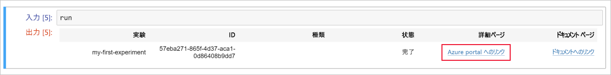
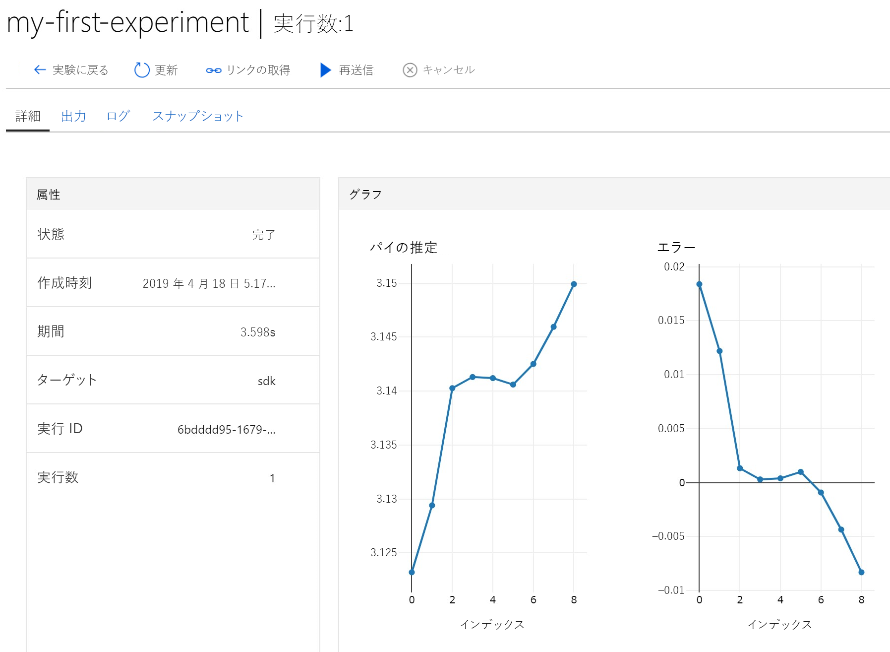

# <a name="quickstart-use-a-cloud-based-notebook-server-to-get-started-with-azure-machine-learning"></a>クイック スタート:クラウドベースのノートブック サーバーを使用して Azure Machine Learning の利用を開始する

このクイックスタートでは、クラウド内のマネージド ノートブック サーバーを利用し、Azure Machine Learning service の使用を開始する方法について説明します。 インストールは必要ありません。 代わりに SDK を独自の Python 環境にインストールする場合は、次を参照してください: 「[クイック スタート: 独自のノートブック サーバーを使用して Azure Machine Learning の利用を開始する](quickstart-run-local-notebook.md)」。

このクイックスタートでは、[Azure Machine Learning service ワークスペース](concept-azure-machine-learning-architecture.md)を使用し、機械学習 (ML) の実験を追跡する方法を紹介します。 これを行うには、[ノートブック仮想マシン (プレビュー)](how-to-configure-environment.md#notebookvm) を作成します。このマシンは、セキュリティで保護されたクラウドベースの Azure ワークステーションであり、Jupyter Notebook サーバー、JupyterLab、完全に準備された ML 環境を提供します。 次に、この仮想マシン (VM) 上で Python ノートブックを実行し、値のログをワークスペースに記録します。

これを行うには、次の操作を実行します。

* ワークスペースを作成します。
* ノートブック VM をワークスペースに作成します。
* Jupyter の Web インターフェイスを開きます。
* pi を推定するコードが含まれていて、各イテレーションでのエラーがログに記録されるノートブックを開く。
* ノートブックを実行する。
* ログに記録したエラー値をワークスペースで表示します。 次の例は、スクリプトで生成された情報の追跡にワークスペースがいかに役立つかを示しています。

Azure サブスクリプションをお持ちでない場合は、開始する前に無料アカウントを作成してください。 [無料版または有料版の Azure Machine Learning service](https://aka.ms/AMLFree) をお試しください。

## <a name="create-a-workspace"></a>ワークスペースの作成

Azure Machine Learning service ワークスペースがある場合は、[次のセクション](#create-notebook)に進みます。 ワークスペースがない場合は、ここで作成します。

[!INCLUDE [aml-create-portal](../../../includes/aml-create-in-portal.md)]

## <a name="create-notebook"></a>ノートブック VM を作成する

 ワークスペースで、Jupyter ノートブックの使用を開始するためのクラウド リソースを作成します。 このリソースは、Azure Machine Learning service を実行するために必要なすべてのものが事前構成されたクラウドベースのプラットフォームです。

1. [Azure Portal](https://portal.azure.com/) でワークスペースを開きます。 ポータルでワークスペースを見つける方法がわからない場合は、[ワークスペースを表示する](how-to-manage-workspace.md#view)方法に関するページを参照してください。

1. ワークスペース ページで、左側の **[ノートブック VM]** を選択します。

1. **[+ 新規]** を選択して、ノートブック VM を作成します。  

     

1. VM の名前を指定します。 **[作成]** を選択します。

    > [!NOTE]
    > ノートブック VM 名は 2 文字から 16 文字にする必要があります。 文字、数字、ハイフンが有効な文字です。 名前は、Azure サブスクリプション内で一意である必要があります。

    

1. 状態が **[実行中]** に変わるまで、4 から 5 分間待ちます。


## <a name="open-the-jupyter-web-interface"></a>Jupyter の Web インターフェイスを開く

VM が実行中になった後、 **[ノートブック VM]** セクションを使用して、Jupyter の Web インターフェイスを開きます。

1. VM の **[URI]** 列で、 **[Jupyter]** を選択します。  

    

    リンクから、ノートブック サーバーが起動され、新しいブラウザー タブで Jupyter ノートブックの Web ページが開かれます。このリンクは、VM を作成するユーザーに対してのみ動作します。  ワークスペースの各ユーザーは、独自の VM を作成する必要があります。

1. Jupyter ノートブックの Web ページで、最上位のフォルダー名はユーザー名です。 このフォルダーを選択します。

    > [!TIP]
    > このフォルダーは、ノートブック VM 自体ではなく、ワークスペース内の[ストレージ コンテナー](concept-workspace.md#resources)上にあります。  ノートブック VM を削除しても、すべての作業を続けることができます。  後で新しいノートブック VM を作成すると、この同じフォルダーが読み込まれます。  他のユーザーとワークスペースを共有すると、互いのフォルダーが表示されます。 

1. サンプルのフォルダー名には、バージョン番号が含まれています (例: **samples-1.0.33.1**)。 サンプル フォルダーを選択します。

1. **Quickstart** フォルダーを選択します。

## <a name="run-the-notebook"></a>ノートブックを実行する

pi を推定し、エラーをワークスペースのログに記録するノートブックを実行します。

1. **01.run-experiment.ipynb** を選択してノートブックを開きます。

1. "Kernel not found (カーネルが見つかりません)" という警告が表示された場合は、(一覧の中ほどにある) カーネル **Python 3.6 - AzureML** を選択し、カーネルを設定します。

1. 最初のコード セルを選択し、 **[実行]** を選択します。

    > [!NOTE]
    > コード セルの前には、角かっこが表示されます。 角かっこが空 ( __[  ]__ ) の場合、コードはまだ実行されていません。 コードの実行中、アスタリスク ( __[*]__ ) が表示されます。 コードが完了すると、数字 **[1]** が表示されます。  番号は、セルが実行された順番を示します。
    >
    > セルを実行するショートカットとして **Shift + Enter** キーを使用します。

    

1. 2 つ目のコード セルを実行します。 認証の手順が表示されたら、コードをコピーし、リンクに従ってサインインします。 サインインすると、ブラウザーによってこの設定が記憶されます。  

    

1. コード セルが正常に実行されると、セル番号 __[2]__ が表示されます。 サインインする必要があった場合は、認証成功の状態メッセージが表示されます。   サインインする必要がなかった場合、このセルに関しては何も出力が表示されません。 数字のみが表示されますが、それはセルが正常に実行されたことを示します。

    

1. 残りのコード セルを実行します。 各セルの実行が完了すると、そのセル番号が表示されます。 最後のセルだけで、その他の出力が表示されます。  

    最大のコード セルで、`run.log` が複数の場所に現れます。 各 `run.log` で、その値がワークスペースに追加されます。

## <a name="view-logged-values"></a>ログに記録された値を表示する

1. `run` セルからの出力には、Azure portal に戻るためのリンクが含まれています。Azure portal では、ワークスペースで実験結果を表示できます。

    

1. 実行に関する情報をワークスペースで表示するために、 **[Link to Azure portal]\(Azure portal へのリンク\)** を選択します。 このリンクにより、Azure portal のワークスペースが開きます。

1. ログに記録された値のプロットが自動的に作成された、ワークスペースに表示されます。 同じ name パラメーターで複数の値をログに記録するときは常に、プロットが自動的に生成されます。 たとえば次のようになります。

   

円周率を概算するコードではランダムな値が使用されるため、実際のプロットの表示は異なる場合があります。  

## <a name="clean-up-resources"></a>リソースのクリーンアップ

### <a name="stop-the-notebook-vm"></a>ノートブック VM を停止する

ノートブック VM を使用していないときは、コストを削減するために、ノートブック VM を停止します。  

1. ワークスペースで、 **[ノートブック VM]** を選択します。

   

1. 一覧から VM を選択します。

1. **[停止]** を選択します。

1. サーバーを再び使用する準備が整ったら、 **[開始]** を選択します。

### <a name="delete-everything"></a>すべてを削除する

[!INCLUDE [aml-delete-resource-group](../../../includes/aml-delete-resource-group.md)]

リソース グループは保持しつつ、いずれかのワークスペースを削除することもできます。 ワークスペースのプロパティを表示し、 **[削除]** を選択します。

## <a name="next-steps"></a>次の手順

これらのタスクを完了したら、Jupyter Notebook の Web ページに移動します。 **Quickstart** フォルダーで、**02.deploy-web-service.ipynb** ノートブックを開いて実行し、Web サービスをデプロイする方法を学習します。

他の Python パッケージを Jupyter 環境にインストールするとき、ノートブック内でこのコードを使用します。

```
!source activate py36 && pip install <packagename>
```

また、Jupyter Notebook の Web ページで、サンプル フォルダーにある他のノートブックを参照し、Azure Machine Learning service の詳細を確認します。

ワークフローを詳しく体験するには、Machine Learning チュートリアルに従って、モデルをトレーニングし、デプロイします。  

> [!div class="nextstepaction"]
> [チュートリアル:画像分類モデルをトレーニングする](tutorial-train-models-with-aml.md)
