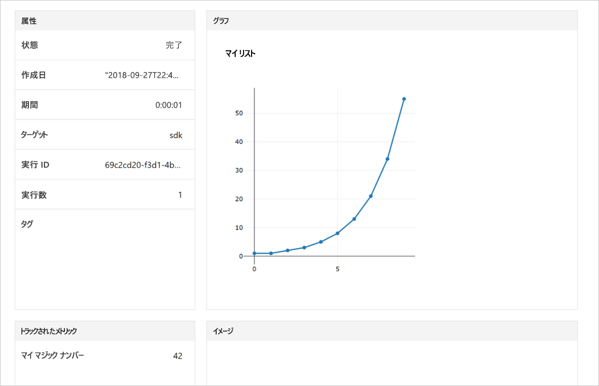

# <a name="quickstart-use-your-own-notebook-server-to-get-started-with-azure-machine-learning"></a>クイック スタート:独自のノートブック サーバーを使用して Azure Machine Learning の利用を開始する

独自のノートブック サーバーを使用して、[Azure Machine Learning service ワークスペース](concept-azure-machine-learning-architecture.md)に値を記録するコードを実行します。 ワークスペースは、Machine Learning で機械学習モデルの実験、トレーニング、およびデプロイを行うために使用する、クラウドでの基礎ブロックとなります。

このクイック スタートでは、独自の Python 環境と Jupyter Notebook サーバーを使用します。 SDK のインストールなしのクイック スタートについては、次を参照してください:「[クイック スタート: クラウドベースのノートブック サーバーを使用して Azure Machine Learning の利用を開始する](quickstart-run-cloud-notebook.md)」 

このクイック スタートの動画バージョンをご覧ください。

> [!VIDEO https://www.microsoft.com/en-us/videoplayer/embed/RE2G9N6]

Azure サブスクリプションをお持ちでない場合は、開始する前に無料アカウントを作成してください。 [無料版または有料版の Azure Machine Learning service](https://aka.ms/AMLFree) を今日からお試しいただけます。

## <a name="prerequisites"></a>前提条件

* Azure Machine Learning SDK がインストールされた Python 3.6 ノートブック サーバー
* Azure Machine Learning service ワークスペース
* ワークスペース構成ファイル (**.azureml/config.json**)。

「[Create an Azure Machine Learning service workspace (Azure Machine Learning サービスのワークスペースを作成する)](setup-create-workspace.md#portal)」の前提条件をすべて入手してください。


## <a name="use-the-workspace"></a>ワークスペースの使用

ワークスペース構成ファイルと同じディレクトリでノートブックを起動するか、スクリプトを作成します。 SDK の基本的な API を使用した次のコードを実行して、実験の実行を追跡します。

1. ワークスペースで実験を作成します。
1. 1 つの値を実験にログ記録します。
1. 値の一覧を実験にログ記録します。

[!code-python[](~/aml-sdk-samples/ignore/doc-qa/quickstart-create-workspace-with-python/quickstart.py?name=useWs)]

## <a name="view-logged-results"></a>ログに記録された結果の表示

実行が完了したら、Azure portal で実験の実行を表示できます。 前回の実行に関する結果に移動する URL を出力するには、次のコードを使用します。

```python
print(run.get_portal_url())
```

このコードは、ブラウザーの Azure portal でログに記録された値を表示するために使用できるリンクを返します。



## <a name="clean-up-resources"></a>リソースのクリーンアップ 

>[!IMPORTANT]
>作成したリソースは、Machine Learning に関連したその他のチュートリアルおよびハウツー記事の前提条件として使用できます。

この記事で作成したリソースを使用する予定がない場合は、料金の発生を避けるために削除してください。

[!code-python[](~/aml-sdk-samples/ignore/doc-qa/quickstart-create-workspace-with-python/quickstart.py?name=delete)]

## <a name="next-steps"></a>次の手順

この記事では、モデルを実験してデプロイするために必要なリソースを作成しました。 ノートブックでコードを実行し、クラウドのワークスペースでそのコードの実行履歴を確認しました。

> [!div class="nextstepaction"]
> [チュートリアル:画像分類モデルをトレーニングする](tutorial-train-models-with-aml.md)

[GitHub にあるより高度な例](https://aka.ms/aml-notebooks)を探索したり、[SDK ユーザー ガイド](https://docs.microsoft.com/python/api/overview/azure/ml/intro?view=azure-ml-py)を閲覧したりすることもできます。
