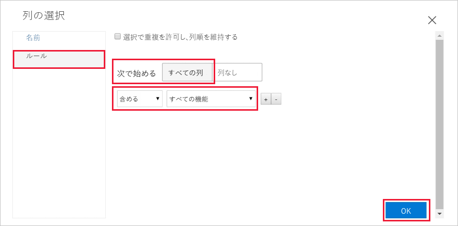
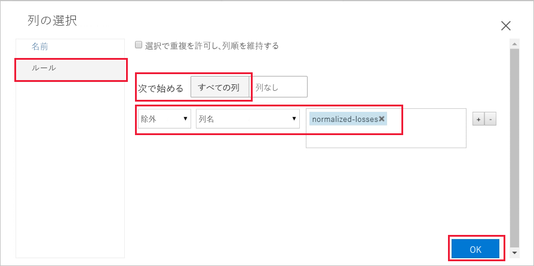
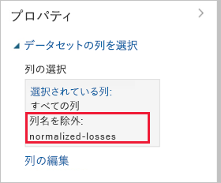
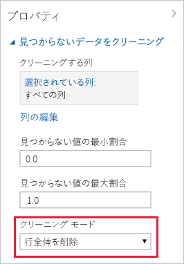

# クイック スタート:Azure Machine Learning でコードを書かずにデータを準備して視覚化する

Azure Machine Learning のドラッグ アンド ドロップ ビジュアル インターフェイス (プレビュー) でデータを準備して視覚化します。 使用するデータセットには、製造仕様、モデル仕様、技術仕様、価格などの情報を含む、さまざまな個別の自動車のエントリが含まれています。  

このクイック スタートでは、データを調査して準備します。

- データを追加してプレビューする初めての実験を作成する
- 不足している値を削除することでデータを準備する
- 実験を実行する
- 結果として得られるデータを視覚化する

機械学習を初めて学ぶ場合は、ビデオ シリーズ「[初心者向けデータ サイエンス](https://docs.microsoft.com/azure/machine-learning/studio/data-science-for-beginners-the-5-questions-data-science-answers)」をご覧になることをお勧めします。

## 前提条件

Azure サブスクリプションをお持ちでない場合は、開始する前に無料アカウントを作成してください。 [無料版または有料版の Azure Machine Learning service](https://aka.ms/AMLFree) を今日からお試しいただけます。

### ワークスペースの作成

Azure Machine Learning service ワークスペースがある場合は、[次のセクション](#start)に進みます。 ワークスペースがない場合は、ここで作成します。

[!INCLUDE [aml-create-portal](../../../includes/aml-create-in-portal.md)]

## ビジュアル インターフェイスの Web ページを開く

1. [Azure Portal](https://portal.azure.com/) でワークスペースを開きます。  

1. ワークスペースで、**[ビジュアル インターフェイス]** を選択します。  次に、**[ビジュアル インターフェイスを起動する]** を選択します。  
 
    

    新しいブラウザー ページに、インターフェイスの Web ページが開きます。  

## 初めての実験を作成する

ビジュアル インターフェイス ツールでは、予測分析モデルの作成、テスト、反復作業を支援する、視覚的な対話型の操作に対応した場所が提供されます。 データセットと分析モジュールを対話型のキャンバスにドラッグ アンド ドロップし、それらを相互に接続して "_実験_" を完成させることができます。  ここで、初めての実験を作成します。

1. 左下隅の **[Add New]\(新規追加\)** を選択します。

1. **[Blank Experiment]\(空の実験\)** を選択します。

1. 実験には既定の名前が付けられています。 このテキストを選択し、名前を "Quickstart-explore data" に変更します。 この名前は一意でなくてもかまいません。

1. 画面下部の**ミニ マップ**は、大規模な実験を表示するときに便利です。  このクイック スタートではその必要はないので、上部の矢印をクリックして最小化します。  

    

## データの追加

機械学習の実行にはまずデータが必要です。 このインターフェイスに含まれているいくつかのサンプル データセットを使用するか、多数のソースからデータをインポートすることができます。 この例では、**Automobile price data (Raw)** というサンプル データセットを使用します。 

1. 実験キャンバスの左側には、データセットとモジュールのパレットがあります。 **[Saved Datasets]\(保存されたデータセット\)** を選択し、次に **[Samples]\(サンプル\)** を選択して、利用可能なサンプル データセットを表示します。

1. **Automobile price data (raw)** データセットを選択し、キャンバスにドラッグします。

   

## Select columns

使用するデータの列を選択します。  最初にモジュールを構成して、使用可能なすべての列を表示します。

> [!TIP]
> 必要なデータまたはモジュールの名前がわかっている場合は、パレットの上部にある検索バーを使用してすばやく検索します。  このクイック スタートの残りの部分では、このショートカットを使用します。

1. 検索ボックスに「**Select**」と入力して、**Select Columns in Dataset (データセットの列を選択する)** モジュールを見つけます。

1. **Select Columns in Dataset (データセットの列を選択する)** をクリックし、キャンバスにドラッグします。 先ほど追加したデータセットの下のモジュールを削除します。

1. データセットを **Select Columns in Dataset (データセットの列を選択する)** に接続する: データセットの出力ポートをクリックし、**Select Columns in Dataset (データセットの列を選択する)** の入力ポートにドラッグした後、マウス ボタンを離します。 これで、マウスをキャンバス上でどこに移動しても、データセットとモジュールが接続されたままになります。

    > [!TIP]
    > データセットとモジュールには、小さな円で表される入力ポートと出力ポートがあります (入力ポートは上部、出力ポートは下部)。 1 つのモジュールの出力ポートを別のモジュールの入力ポートに接続するときに、実験を通じてデータのフローを作成することになります。
    >
    > モジュールの接続に問題がある場合は、接続先のノードまでドラッグしてみてください。

     

    赤色の感嘆符は、モジュールのプロパティがまだ設定されていないことを示します。 これは次に行います。
   
1. **Select Columns in Dataset (データセットの列を選択する)** モジュールを選択します。

1. キャンバスの右側にある **[Properties]\(プロパティ\)** ウィンドウで、**[Launch column selector]\(列セレクターの起動\)** を選択します。

    **[Select columns]\(列の選択\)** ダイアログで、**[ALL COLUMNS]\(すべての列\)** を選択し、**[all features]\(すべてのフィーチャー\)** を含めます。 ダイアログは次のようになります。

     

1. 右下のチェック マーク (OK) ボタンをクリックして列セレクターを閉じます。

## 実験を実行する

いつでもデータセットまたはモジュールの出力ポートをクリックすると、データ フローのその時点でデータがどのようになっているかを確認できます。  **[Visualize]\(可視化\)** オプションが無効になっている場合、最初に実験を実行する必要があります。  これは次に行います。

[!INCLUDE [aml-ui-create-training-compute](../../../includes/aml-ui-create-training-compute.md)]

コンピューティング ターゲットが使用できるようになった後、実験が実行されます。 実行が完了したら、各モジュールに緑色のチェック マークが表示されます。

## データをプレビューする

最初の実験を実行したので、次にデータを視覚化して、作業する必要がある情報についてさらに理解することができます。

1. **Select Columns in Dataset (データセットの列を選択する)** の下部にある出力ポートを選択し、**[Visualize]\(可視化\)** を選択します。

1. データ ウィンドウで別の列をクリックして、その列についての情報を表示します。  

    このデータセットでは、各行が自動車を表していて、各自動車に関連付けられている変数は列として表示されます。    このデータセット内には、205 の行と 26 の列があります。

     データの列をクリックするたびに、その列の **[Statistics]\(統計\)** 情報と **[Visualization]\(視覚化\)** の画像が左側に表示されます。  たとえば、**num-of-doors** をクリックすると、一意の値が 2 つ、不足している値が 2 つあることがわかります。  下にスクロールして 2 ドアと 4 ドアの値を表示します。

     

1. 各列をクリックしてデータセットの詳細について理解します。

## データを準備する

通常、データセットには、分析前にある程度の前処理が必要です。 さまざまな行の中に、値が不足している列があります。 モデルがデータを正しく分析するには、これらの不足値を整理する必要があります。 値が不足している行をすべて削除します。 また、不足している値の大部分は、**normalized-losses** 列にあります。したがって、モデルからこの列を完全に除外します。

> [!TIP]
> 不足している値を入力データから整理することが、ほとんどのモジュールを使用するための前提条件となっています。  

### 列を削除する

最初に、**normalized-losses** 列を完全に削除します。

1. **Select Columns in Dataset (データセットの列を選択する)** モジュールを選択します。

1. キャンバスの右側にある **[Properties]\(プロパティ\)** ウィンドウで、**[Launch column selector]\(列セレクターの起動\)** を選択します。

    * **[With rules]\(規則を使用\)** と **[ALL COLUMNS]\(すべての列\)** は選択したままにします。

    * ドロップダウンから **[Exclude]\(除外\)** と **[column names]\(列名\)** を選択し、テキスト ボックスの内側をクリックします。 「**normalized-losses**」と入力します。

    * 右下のチェック マーク (OK) ボタンをクリックして列セレクターを閉じます。

    
        
    これで、Select Columns in Dataset (データセットの列を選択する) のプロパティ ウィンドウに、**normalized-losses** 以外のデータセットのすべての列がフィルターを通過することが示されます。
        
    "**normalized-losses**" 列が除外されたことを示すプロパティ ウィンドウ。
        
    
        
    モジュールをダブルクリックして、テキストを入力すると、モジュールにコメントを追加できます。 これで、実験でモジュールがどのような処理をするのかがひとめでわかります。 

1. **Select Columns in Dataset (データセットの列を選択する)** モジュールをダブルクリックして、「Exclude normalized losses」(normalized losses を除外する) というコメントを入力します。 
    
    コメントを入力した後、モジュールの外側をクリックします。  モジュールにコメントが含まれていることを示す下向き矢印が表示されます。

1. コメントを表示するには、下向き矢印をクリックします。

    今度は、コメントを非表示にする上向きの矢印がモジュールに表示されます。
        
    

### 見つからないデータのクリーンアップ

次に、データが不足している残りの行を削除する別のモジュールを追加します。

1. 検索ボックスに「**Clean**」と入力して、**Clean Missing Data (不足データのクリーンアップ)** モジュールを見つけます。

1. **Clean Missing Data (不足データのクリーンアップ)** モジュールを実験キャンバスにドラッグして、**Select Columns in Dataset (データセットの列を選択する)** モジュールに接続します。 

1. [Properties]\(プロパティ\) ウィンドウで、**[Cleaning mode]\(整理モード\)** の **[Remove entire row]\(行全体を削除\)** を選択します。

    これらのオプションにより、**Clean Missing Data (不足データのクリーンアップ)** では値が不足している行が削除され、データが整理されます。

1. モジュールをダブルクリックして、「Remove missing value rows」(値が不足している行を削除する) というコメントを入力します。
 
    

    実験は以下のようになっているはずです。
    
    

## 結果を視覚化する

実験でモジュールに変更を加えたため、モジュール状態が "ドラフト" に変更されました。  新しい整理されたデータを視覚化するには、最初に実験をもう一度実行する必要があります。

1. 下部の **[Run]\(実行\)** を選択して実験を実行します。

    今回は、先ほど作成したコンピューティング ターゲットを再利用できます。  

1. ダイアログ内の **[Run]\(実行\)** を選択します。

   

1. 実行が完了したら、**Clean Missing Data (不足データのクリーンアップ)** モジュールを右クリックし、新しい整理されたデータを視覚化します。  

    

1. 整理されたデータ ウィンドウで別の列をクリックし、データがどのように変更されたかを確認します。  

    

    193 の行と 25 の列があります。

    **num-of-doors** をクリックすると、一意の値はまだ 2 つありますが、不足している値がは 0 であることがわかります。  

## リソースのクリーンアップ

[!INCLUDE [aml-ui-cleanup](../../../includes/aml-ui-cleanup.md)]

## 次の手順

このクイック スタートでは、次の方法について説明しました。

- データを追加してプレビューする初めての実験を作成する
- 不足している値を削除することでデータを準備する
- 結果として得られるデータを視覚化する

このデータを使用して自動車の価格を予測するチュートリアルに進みます。

> [!div class="nextstepaction"]
> [チュートリアル:ビジュアル インターフェイスで自動車価格を予測する](ui-tutorial-automobile-price-train-score.md)
