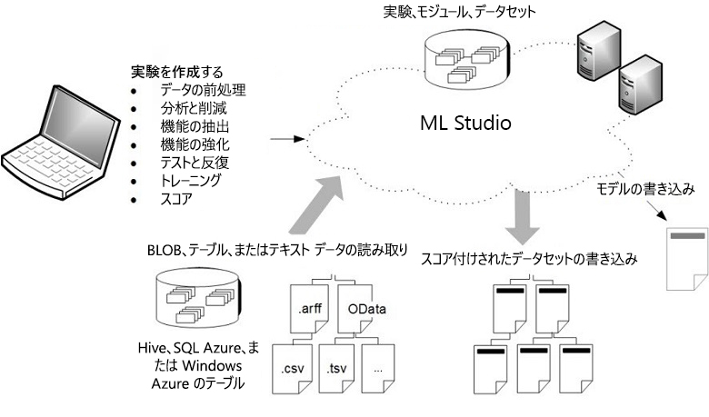

# Machine Learning Studio (クラシック) とは

[!INCLUDE [Notebook deprecation notice](../../../includes/aml-studio-notebook-notice.md)]

[!INCLUDE [Designer notice](../../../includes/designer-notice.md)]

Microsoft Azure Machine Learning Studio (クラシック) は、データを活用した予測分析ソリューションの構築、テスト、デプロイをドラッグ アンド ドロップで行うことができる、コラボレーションに対応したツールです。 Azure Machine Learning Studio (クラシック) でモデルを Web サービスとして公開すれば、カスタム アプリや BI ツール (Excel など) からそのモデルを簡単に利用することができます。

Machine Learning Studio (クラシック) があれば、最新のデータ サイエンスとクラウド リソースを活用して、独自に所有するデータを使った予測分析を実現することができます。

## Machine Learning Studio (クラシック) 対話型ワークスペース
一般的な予測分析モデルの作成では、1 種類以上のソースからデータを入手し、さまざまなデータ操作と統計関数を使用してデータを変換および分析することにより、一連の結果を生成します。 このようなモデルの作成プロセスは対話型プロセスになります。 十分にトレーニングされた有効なモデルが作成されるまで、さまざまな特徴とパラメーターを繰り返し調整します。

Azure Machine Learning Studio (クラシック) では、予測分析モデルの作成、テスト、反復作業を支援する、視覚的操作に対応した対話型ワークスペースが提供されます。 "***データセット***" と分析 "***モジュール***" を対話型のキャンバスにドラッグ アンド ドロップし、それらを相互に接続して "***実験***" を完成させ、Machine Learning Studio (クラシック) で実行できます。 モデルのさまざまな設計を試す際は、実験を編集して必要に応じて保存し、再度実行できます。 準備が整ったら、"***トレーニング実験***" を "***予測実験***" に変換します。さらに、"***Web サービス***" として発行し、第三者が利用できるようにそのモデルを公開します。

データセットとモジュールを視覚的に接続すれば予測分析モデルが完成するため、プログラミングは必要ありません。

## Machine Learning Studio (クラシック) と Azure Machine Learning の違い

[Azure Machine Learning](../overview-what-is-azure-ml.md) には、SDK と Azure Machine Learning デザイナー (プレビュー) の**両方**が用意されており、すぐにデータを準備し、機械学習モデルのトレーニングとデプロイを行うことができます。 デザイナーでは、Studio (クラシック) と同様のドラッグ アンド ドロップ操作を利用できます。 ただし、Studio (クラシック) の専用コンピューティング プラットフォームとは異なり、デザイナーではユーザー独自のコンピューティング リソースが使用され、Azure Machine Learning に完全に統合されています。

簡単な比較を次に示します。

|| Machine Learning Studio (クラシック) | Azure Machine Learning |
|---| --- | --- |
| ドラッグ アンド ドロップ インターフェイス | はい | はい - [Azure Machine Learning デザイナー (プレビュー)](../concept-designer.md) |
| 実験 | スケーラブル (10 GB トレーニング データの上限) | コンピューティング先に合わせてスケーリング |
| ドラッグ アンド ドロップ インターフェイスのモジュール | 多数 | 人気のある[モジュール](../algorithm-module-reference/module-reference.md)の初期セット|
|コンピューティング ターゲットのトレーニング| 独自のコンピューティング ターゲット、CPU のサポートのみ| Azure Machine Learning コンピューティング (GPU または CPU) と Notebook VM をサポートします。 ([他のコンピューティングは SDK でサポート](../concept-compute-target.md#train))|
|推論コンピューティング先| 独自の Web サービス形式 (カスタマイズ不可) |  Azure Kubernetes Service と AML Compute  ([他のコンピューティングは SDK でサポート](../how-to-deploy-and-where.md)) |
| ML パイプライン | サポートされていません | [パイプライン](../concept-ml-pipelines.md)がサポートされています |
| MLOps | 基本的なモデル管理とデプロイ | 構成可能なデプロイ、モデル、およびパイプラインのバージョン管理と追跡 |
| モデル形式 | 専用の形式、Studio (クラシック) のみ | トレーニング ジョブの種類に応じた標準形式 |
|自動化されたモデル トレーニングとハイパーパラメーター調整 | いいえ | まだデザイナーにはありません   ([SDK とワークスペースのランディング ページでサポート](../concept-automated-ml.md)) | 

デザイナーについては、「[チュートリアル: デザイナーを使用して自動車の価格を予測する](../tutorial-designer-automobile-price-train-score.md)

> [!NOTE]
> Studio (クラシック) で作成したモデルを Azure Machine Learning でデプロイおよび管理することはできません。 ただし、デザイナーで作成およびデプロイされたモデルは、Azure Machine Learning ワークスペースを使用して管理できます。

## Machine Learning Studio (クラシック) の概要図をダウンロードする
**Microsoft Azure Machine Learning Studio (クラシック) 機能の概要**図をダウンロードして、Machine Learning Studio (クラシック) の機能の概要を確認します。 図をタブロイド サイズ (11 x 17 インチ) で印刷し、手元に置いておくことができます。

**ここから図をダウンロード:[Microsoft Azure Machine Learning Studio (クラシック) の機能の概要](https://download.microsoft.com/download/C/4/6/C4606116-522F-428A-BE04-B6D3213E9E52/ml_studio_overview_v1.1.pdf)** 

## Studio (クラシック) 実験のコンポーネント
実験にはデータセットが含まれます。データセットからデータが分析モジュールに提供され、分析モジュールを接続することで予測分析モデルが完成します。 有効な実験に求められる具体的な条件を以下に示します。

* 実験には少なくとも 1 つのデータセットと 1 つのモジュールがある。
* データセットはモジュールにのみ接続できる。
* モジュールはデータセットにも別のモジュールにも接続できる。
* モジュールのすべての入力ポートが、何らかの形でデータ フローに接続されている。
* モジュールの必須パラメーターがすべて設定されている。

実験を最初から作成するか、既にあるサンプル実験をテンプレートとして使用してください。 詳細については、「[サンプル実験をコピーして新しい機械学習実験を作成する](sample-experiments.md)」を参照してください。

実験の作成例については、[Azure Machine Learning Studio (クラシック) での簡単な実験の作成](create-experiment.md)に関するページを参照してください。

予測分析ソリューションのより詳しいチュートリアルについては、[Azure Machine Learning Studio (クラシック) を使用した予測ソリューションの開発](tutorial-part1-credit-risk.md)に関するページを参照してください。

### データセット
データセットを Machine Learning Studio (クラシック) にアップロードすることで、これらのデータセットをモデル作成プロセスで使用できるようになります。 Machine Learning Studio (クラシック) には数多くのサンプル データセットが既に含まれているため、これらを実験で試すことができます。また、必要に応じてさらにデータセットをアップロードできます。 提供されるデータセットには以下のようなものがあります。

* **さまざまな自動車の燃費データ** - シリンダー数や馬力などによって分類された、自動車の燃費値 (MPG) です。
* **乳がんデータ** - 乳がんの診断データです。
* **森林火災データ** - ポルトガル北東地域を対象とする森林火災の規模データです。

利用可能なデータセットは、実験を作成するときにキャンバスの左側の一覧から選択できます。

Machine Learning Studio (クラシック) に含まれている一連のサンプル データセットについては、[Azure Machine Learning Studio (クラシック) でのサンプル データセットの使用](use-sample-datasets.md)に関するページを参照してください。

### モジュール
モジュールとは、データに対して実行できるアルゴリズムのことです。 Azure Machine Learning Studio (クラシック) には、データのイングレス機能からトレーニング、スコア付け、および検証プロセスに至るまでのさまざまなモジュールが用意されています。 提供されるモジュールには以下のようなものがあります。

* [ARFF への変換][convert-to-arff] - .NET のシリアル化されたデータセットを属性関係ファイル形式 (ARFF) に変換します。
* [基本統計値の計算][elementary-statistics] - 平均や標準偏差などの基本的な統計値を計算します。
* [線形回帰][linear-regression] - オンライン傾斜降下に基づく線形回帰モデルを作成します。
* [モデルのスコア付け][score-model] - トレーニングされた分類または回帰モデルをスコア付けします。

利用可能なモジュールは、実験を作成するときにキャンバスの左側の一覧から選択できます。

モジュールに一連のパラメーターが含まれている場合、これらを使用してモジュールの内部アルゴリズムを構成することができます。 モジュールのパラメーターは、キャンバスでモジュールを選択するとキャンバス右側の **[プロパティ]** ウィンドウに表示されます。 このウィンドウでパラメーターを変更することにより、モデルを微調整できます。

大規模な機械学習アルゴリズムのライブラリを利用する際のヒントについては、[Microsoft Azure Machine Learning Studio (クラシック) のアルゴリズムの選択方法](algorithm-choice.md)に関する記事を参照してください。

## 予測分析 Web サービスのデプロイ
予測分析モデルの準備が整ったら、それを Machine Learning Studio (クラシック) から Web サービスとしてデプロイすることができます。 このプロセスの詳細については、「[Azure Machine Learning Web サービスをデプロイする](deploy-a-machine-learning-web-service.md)」を参照してください。

## 次のステップ
[ステップ バイ ステップ クイック スタート](create-experiment.md)を使用し、[サンプル上に構築](sample-experiments.md)することによって、予測分析と機械学習の基礎について学習できます。

<!-- Module References -->
[convert-to-arff]: https://msdn.microsoft.com/library/azure/62d2cece-d832-4a7a-a0bd-f01f03af0960/
[elementary-statistics]: https://msdn.microsoft.com/library/azure/3086b8d4-c895-45ba-8aa9-34f0c944d4d3/
[linear-regression]: https://msdn.microsoft.com/library/azure/31960a6f-789b-4cf7-88d6-2e1152c0bd1a/
[score-model]: https://msdn.microsoft.com/library/azure/401b4f92-e724-4d5a-be81-d5b0ff9bdb33/
