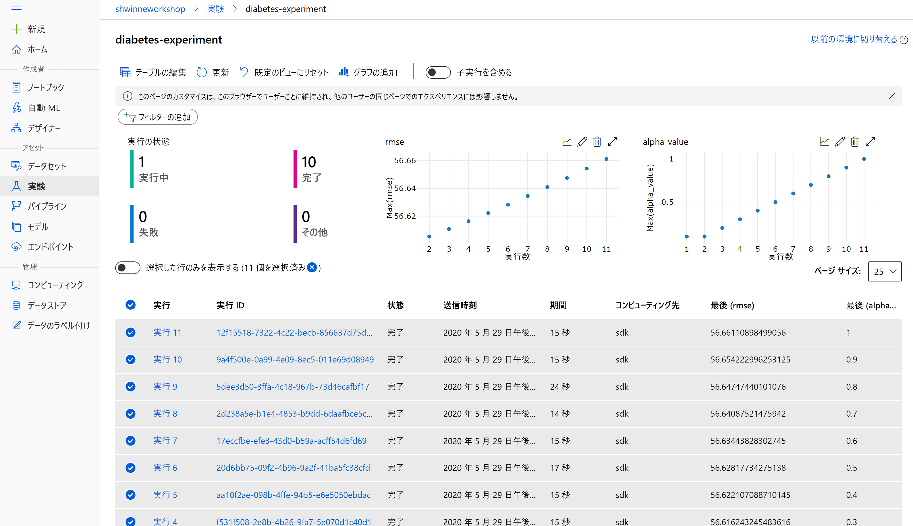

# <a name="tutorial-train-your-first-ml-model"></a>チュートリアル:最初の ML モデルをトレーニングする

[!INCLUDE [applies-to-skus](../../includes/aml-applies-to-basic-enterprise-sku.md)]

このチュートリアルは、**2 部構成のチュートリアル シリーズのパート 2 です**。 前のチュートリアルでは、[ワークスペースを作成し、開発環境を選択](tutorial-1st-experiment-sdk-setup.md)しました。 このチュートリアルでは、Azure Machine Learning の基本的な設計パターンを学習し、糖尿病データ セットに基づいて単純な scikit-learn モデルをトレーニングします。 このチュートリアルを完了すると、より複雑な実験およびワークフローの開発にスケールアップするための、SDK の実用的な知識が得られます。

このチュートリアルでは、以下のタスクについて学習します。

> [!div class="checklist"]
> * 自分のワークスペースを接続し、実験を作成する
> * データを読み込み、scikit-learn モデルをトレーニングする
> * ポータルでトレーニング結果を表示する
> * 最高のモデルを取得する

## <a name="prerequisites"></a>前提条件

唯一の前提条件は、このチュートリアルのパート 1 に従って[環境とワークスペースを設定する](tutorial-1st-experiment-sdk-setup.md)ことです。

チュートリアルのこのパートでは、パート 1 の最後で開いたサンプル Jupyter ノートブック *tutorials/create-first-ml-experiment/tutorial-1st-experiment-sdk-train.ipynb* のコードを実行します。 この記事では、ノートブック内の同じコードについて説明します。

## <a name="open-the-notebook"></a>ノートブックを開く

1. [Azure Machine Learning Studio](https://ml.azure.com/) にサインインします。

1. [パート 1](tutorial-1st-experiment-sdk-setup.md#open) に示すように、フォルダー内の **tutorial-1st-experiment-sdk-train.ipynb** を開きます。


> [!Warning]
> Jupyter インターフェイスで "*新しい*" ノートブックを作成**しないでください**。 ノートブック *tutorials/create-first-ml-experiment/tutorial-1st-experiment-sdk-train.ipynb* には、このチュートリアルに**必要なすべてのコードとデータ**が含まれています。

## <a name="connect-workspace-and-create-experiment"></a>ワークスペースを接続し、実験を作成する

> [!Important]
> 以降この記事には、ノートブックと同じ内容が記載されています。  
>
> コードを実行しながら読み進めたい方は、ここで Jupyter Notebook に切り替えてください。 
> ノートブックで単一のコード セルを実行するには、そのコード セルをクリックして **Shift + Enter** キーを押します。 または、上部のツール バーから **[すべて実行]** を選択して、ノートブック全体を実行します。

`Workspace` クラスをインポートし、`from_config().` 関数を使用して `config.json` ファイルから自分のサブスクリプション情報を読み込みます。これにより、既定で現在のディレクトリ内の JSON ファイルが検索されますが、`from_config(path="your/file/path")` を使用して、path パラメーターを指定してファイルを指すこともできます。 クラウド ノートブック サーバーでは、ファイルは自動的にルート ディレクトリに配置されます。

次のコードで追加の認証が求められる場合は、単にリンクをブラウザーに貼り付け、認証トークンを入力します。

```python
from azureml.core import Workspace
ws = Workspace.from_config()
```

次に、自分のワークスペース内に実験を作成します。 実験は、試行 (個々のモデルの実行) のコレクションを表すもう 1 つの基本的なクラウド リソースです。 このチュートリアルでは、実験を使用して実行を作成し、Azure Machine Learning Studio で自分のモデルのトレーニングを追跡します。 パラメーターには、自分のワークスペース参照と、実験の文字列名が含まれます。


```python
from azureml.core import Experiment
experiment = Experiment(workspace=ws, name="diabetes-experiment")
```

## <a name="load-data-and-prepare-for-training"></a>データを読み込み、トレーニングを準備する

このチュートリアルで使用する糖尿病データ セットは、年齢、性別、BMI などの特徴を使用して、糖尿病疾患の進行を予測します。 [Azure Open Datasets](https://azure.microsoft.com/services/open-datasets/) クラスからデータを読み込み、それを `train_test_split()` を使用してトレーニングとテストのセットに分割します。 この関数により、データが分離され、モデルのトレーニング後のテストに未知のデータが使用されるようになります。


```python
from azureml.opendatasets import Diabetes
from sklearn.model_selection import train_test_split

x_df = Diabetes.get_tabular_dataset().to_pandas_dataframe().dropna()
y_df = x_df.pop("Y")

X_train, X_test, y_train, y_test = train_test_split(x_df, y_df, test_size=0.2, random_state=66)
```

## <a name="train-a-model"></a>モデルをトレーニングする

小規模なトレーニングでは、単純な scikit-learn モデルのトレーニングをローカルで簡単に行うことができます。しかし、数十もの異なる特徴の順列とハイパーパラメーターの設定を使用して多数の繰り返しをトレーニングする場合は、どのモデルをトレーニングしたか、またそれらをどのようにトレーニングしたかについて見失いがちです。 次の設計パターンは、SDK を利用してクラウドで自分のトレーニングを簡単に追跡する方法を示しています。

さまざまなハイパーパラメーターのアルファ値を使用して、リッジ モデルをループでトレーニングするスクリプトを作成します。


```python
from sklearn.linear_model import Ridge
from sklearn.metrics import mean_squared_error
from sklearn.externals import joblib
import math

alphas = [0.1, 0.2, 0.3, 0.4, 0.5, 0.6, 0.7, 0.8, 0.9, 1.0]

for alpha in alphas:
    run = experiment.start_logging()
    run.log("alpha_value", alpha)

    model = Ridge(alpha=alpha)
    model.fit(X=X_train, y=y_train)
    y_pred = model.predict(X=X_test)
    rmse = math.sqrt(mean_squared_error(y_true=y_test, y_pred=y_pred))
    run.log("rmse", rmse)

    model_name = "model_alpha_" + str(alpha) + ".pkl"
    filename = "outputs/" + model_name

    joblib.dump(value=model, filename=filename)
    run.upload_file(name=model_name, path_or_stream=filename)
    run.complete()
```

上記のコードでは、次のことが実行されます。

1. `alphas` 配列内の各アルファ ハイパーパラメーター値に対して、実験内に新しい実行が作成されます。 アルファ値は、各実行を区別するためにログに記録されます。
1. 各実行では、リッジ モデルがインスタンス化、トレーニング、および使用されて、予測が実行されます。 実際の値と予測された値に対して平均平方二乗誤差が計算され、実行に記録されます。 この時点で、実行には、アルファ値と rmse の精度の両方についてアタッチされたメタデータが含まれています。
1. 次に、各実行のモデルがシリアル化され、実行にアップロードされます。 これにより、ポータルで実行からモデル ファイルをダウンロードすることができます。
1. 実行は、各繰り返しの終わりに `run.complete()` を呼び出すことによって完了します。

トレーニングが完了したら、`experiment` 変数を呼び出して、ポータル内の実験へのリンクを取得します。

```python
experiment
```

<table style="width:100%"><tr><th>Name</th><th>ワークスペース</th><th>レポート ページ</th><th>ドキュメント ページ</th></tr><tr><td>diabetes-experiment</td><td><自分のワークスペースの名前></td><td>Azure portal へのリンク</td><td>ドキュメントへのリンク</td></tr></table>

## <a name="view-training-results-in-portal"></a>ポータルでトレーニング結果を表示する

**Azure portal へのリンク**に従うと、メインの実験ページに移動します。 ここには、実験の個別の実行がすべて表示されます。 カスタムでログに記録された値 (この場合、`alpha_value` と `rmse`) は、各実行のフィールドになるほか、実験ページの上部にあるグラフとタイルで使用可能になります。 ログに記録されたメトリックをグラフまたはタイルに追加するには、その上にマウス ポインターを移動し、編集ボタンをクリックして、カスタムでログに記録されたメトリックを見つけます。

数百件および数千件を超える個別の実行を伴う大きな規模でモデルをトレーニングする場合、自分がトレーニングしたすべてのモデル (具体的には、それらがどのようにトレーニングされたか、そして時間の経過と共に一意のメトリックがどのように変化したか) をこのページで簡単に確認できます。



`RUN NUMBER` 列の実行番号のリンクをクリックすると、個々の実行のページに移動します。 既定の **[詳細]** タブには、各実行の詳細情報が表示されます。 **[出力]** タブに移動すると、各トレーニングの繰り返し中に実行にアップロードされたモデルの `.pkl` ファイルが表示されます。 ここでは、モデル ファイルをダウンロードすることができます。手動で再トレーニングする必要はありません。

![ポータルの実行の [詳細] ページ](./media/tutorial-1st-experiment-sdk-train/model-download.png)

## <a name="get-the-best-model"></a>最適なモデルを取得する

モデル ファイルは、ポータルで実験からダウンロードできるだけでなく、プログラムによってダウンロードすることもできます。 次のコードでは、実験内の各実行を繰り返し、ログに記録された実行メトリックと実行詳細 (run_id を含む) の両方にアクセスします。 ここでは、最適な実行 (この場合は、平均平方二乗誤差が最小の実行) を追跡します。

```python
minimum_rmse_runid = None
minimum_rmse = None

for run in experiment.get_runs():
    run_metrics = run.get_metrics()
    run_details = run.get_details()
    # each logged metric becomes a key in this returned dict
    run_rmse = run_metrics["rmse"]
    run_id = run_details["runId"]

    if minimum_rmse is None:
        minimum_rmse = run_rmse
        minimum_rmse_runid = run_id
    else:
        if run_rmse < minimum_rmse:
            minimum_rmse = run_rmse
            minimum_rmse_runid = run_id

print("Best run_id: " + minimum_rmse_runid)
print("Best run_id rmse: " + str(minimum_rmse))
```

    Best run_id: 864f5ce7-6729-405d-b457-83250da99c80
    Best run_id rmse: 57.234760283951765

実験オブジェクトと共に `Run` コンストラクターを使用して個々の実行を取得するには、最適な実行の ID を使用します。 次に、`get_file_names()` を呼び出して、この実行からダウンロード可能なすべてのファイルを表示します。 この場合、トレーニング中に実行ごとにファイルを 1 つだけアップロードしました。

```python
from azureml.core import Run
best_run = Run(experiment=experiment, run_id=minimum_rmse_runid)
print(best_run.get_file_names())
```

    ['model_alpha_0.1.pkl']

実行オブジェクトに対して `download()` を呼び出し、ダウンロードするモデル ファイル名を指定します。 この関数の既定のダウンロード先は、現在のディレクトリです。

```python
best_run.download_file(name="model_alpha_0.1.pkl")
```

## <a name="clean-up-resources"></a>リソースをクリーンアップする

Azure Machine Learning の他のチュートリアルを実行する予定の場合、このセクションを実行しないでください。

### <a name="stop-the-compute-instance"></a>コンピューティング インスタンスの停止

[!INCLUDE [aml-stop-server](../../includes/aml-stop-server.md)]

### <a name="delete-everything"></a>すべてを削除する

[!INCLUDE [aml-delete-resource-group](../../includes/aml-delete-resource-group.md)]

リソース グループは保持しつつ、いずれかのワークスペースを削除することもできます。 ワークスペースのプロパティを表示し、 **[削除]** を選択します。

## <a name="next-steps"></a>次のステップ

このチュートリアルでは、次のタスクを実行しました。

> [!div class="checklist"]
> * 自分のワークスペースを接続し、実験を作成しました
> * データを読み込み、scikit-learn モデルをトレーニングしました
> * ポータルでトレーニング結果を表示し、モデルを取得しました

Azure Machine Learning を使って[モデルをデプロイ](tutorial-deploy-models-with-aml.md)してください。
[自動化された機械学習](tutorial-auto-train-models.md)の実験を開発する方法について学習します。
