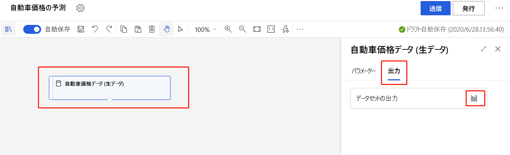
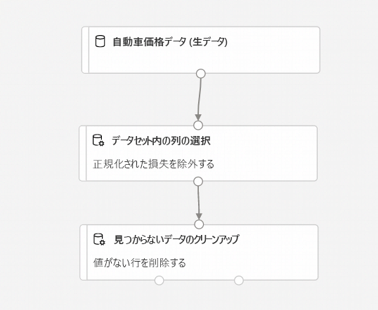
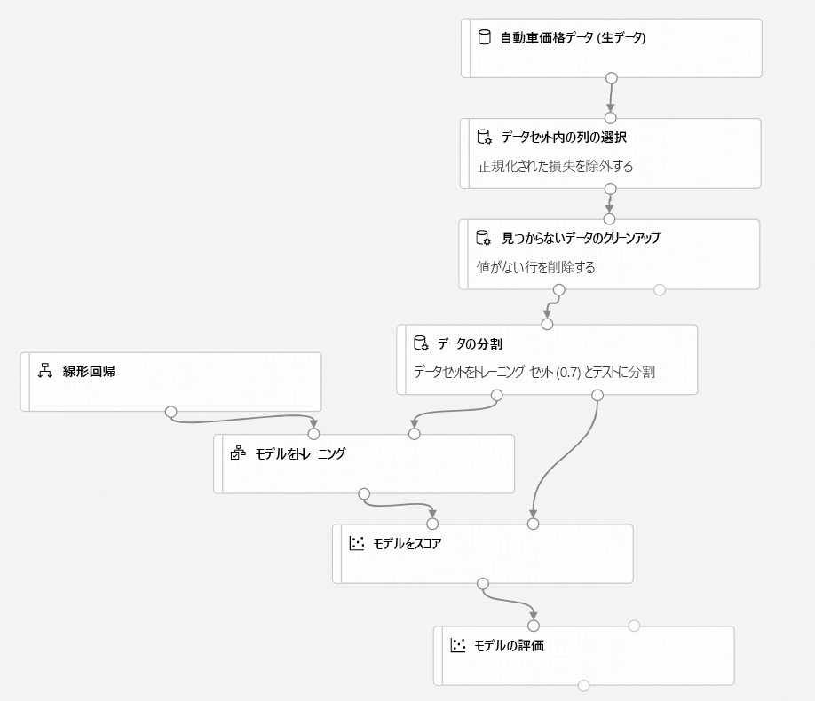
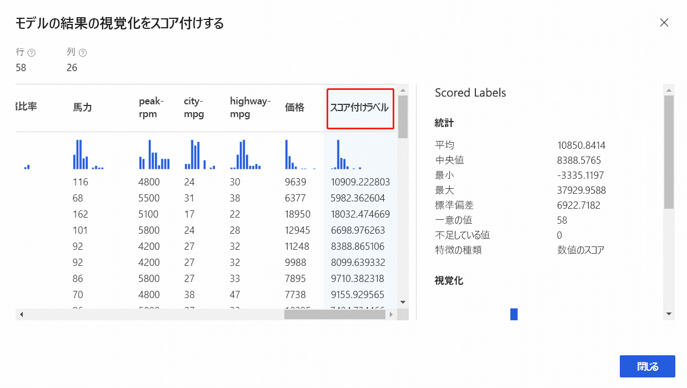

# チュートリアル:デザイナーを使用して自動車の価格を予測する (プレビュー)
[!INCLUDE [applies-to-skus](../../includes/aml-applies-to-enterprise-sku.md)]

この 2 部構成のチュートリアルでは、Azure Machine Learning のデザイナーを使用して、自動車の価格を予測する予測分析ソリューションを開発およびデプロイする方法について説明します。

チュートリアルのパート 1 で学習する内容は次のとおりです。

> [!div class="checklist"]
> * 新しいパイプラインを作成する。
> * データをインポートする。
> * データを準備する。
> * 機械学習モデルをトレーニングする。
> * 機械学習モデルを評価する。

チュートリアルの[パート 2](tutorial-designer-automobile-price-deploy.md) では、リアルタイム推論エンドポイントとしてモデルをデプロイし、送信した技術仕様に基づいて任意の自動車の価格を予測します。 

> [!NOTE]
>このチュートリアルの完成版をサンプル パイプラインとして入手できます。
>
>これを見つけるには、ワークスペースのデザイナーに移動します。 **[新しいパイプライン]** セクションで **[Sample 1 - Regression:Automobile Price Prediction(Basic)]\(サンプル 1 - 回帰: 自動車価格の予測 (Basic)\)** を選択してください。

## 新しいパイプラインを作成する

Azure Machine Learning パイプラインによって、複数の機械学習ステップとデータ処理ステップが 1 つのリソースに整理されます。 複数のプロジェクトや複数のユーザーにまたがる複雑な機械学習ワークフローをパイプラインで効率的に整理、管理、再利用することができます。

Azure Machine Learning パイプラインを作成するには、Azure Machine Learning ワークスペースが必要です。 このセクションでは、その両方のリソースを作成する方法について説明します。

### 新しいワークスペースを作成する

Azure Machine Learning ワークスペース (Enterprise Edition) がある場合は、[次のセクションに進みます](#create-the-pipeline)。

[!INCLUDE [aml-create-portal](../../includes/aml-create-in-portal-enterprise.md)]

### パイプラインを作成する

1. [ml.azure.com](https://ml.azure.com) にサインインし、使用するワークスペースを選択します。

1. **[デザイナー]** を選択します。

    

1. **[Easy-to-use prebuilt modules]\(あらかじめ構築された使いやすいモジュール\)** を選択します。

1. キャンバスの上部にある既定のパイプライン名 **Pipeline-Created-on** を選択します。 この名前を *Automobile price prediction* (自動車価格の予測) に変更します。 名前は一意でなくてもかまいません。

## データのインポート

デザイナーには、実験に利用できるいくつかのサンプル データセットが含まれています。 このチュートリアルでは、**Automobile price data (Raw)** を使用します。 

1. パイプライン キャンバスの左側には、データセットとモジュールのパレットがあります。 **[データセット]** を選択し、 **[サンプル]** セクションを見て、利用可能なサンプル データセットを確認します。

1. **Automobile price data (Raw)** データセットを選択し、キャンバスにドラッグします。

   

### データの視覚化

使用するデータセットを把握するために、データを視覚化することができます。

1. **Automobile price data (Raw)** モジュールを選択します。

1. キャンバスの右側にある [プロパティ] ウィンドウで **[出力]** を選択します。

1. グラフ アイコンを選択してデータを視覚化します。

    

1. データ ウィンドウで別の列を選択して、それぞれの情報を表示します。

    各行は自動車を表していて、各自動車に関連付けられている変数が列として表示されます。 このデータセット内には、205 の行と 26 の列があります。

## データを準備する

通常、データセットには、分析前にある程度の前処理が必要です。 データセットを検査したときに、いくつか不足値があることに気付いたかもしれません。 モデルがデータを正しく分析するには、これらの不足値を整理する必要があります。

### 列の削除

モデルをトレーニングする際は、欠損データに対処する必要があります。 このデータセットでは、**normalized-losses** 列に多数の欠損値が存在するので、その列全体をモデルから除外します。

1. パレットの上部にある検索ボックスに「**Select**」と入力し、 **[Select Columns in Dataset]\(データセットの列を選択する\)** モジュールを見つけます。

1. **[Select Columns in Dataset]\(データセットの列を選択する\)** モジュールをキャンバスにドラッグします。 データセット モジュールの下のモジュールを削除します。

1. **Automobile price data (Raw)** データセットを、 **[Select Columns in Dataset]\(データセットの列を選択する\)** モジュールに接続します。 データセットの出力ポート (キャンバス上のデータセットの下部にある小さい円) から **[Select Columns in Dataset]\(データセットの列を選択する\)** の入力ポート (モジュールの上部にある小さい円) までドラッグします。

    > [!TIP]
    > 1 つのモジュールの出力ポートを別のモジュールの入力ポートに接続するときに、パイプラインを通じてデータのフローを作成することになります。
    >

    

1. **Select Columns in Dataset (データセットの列を選択する)** モジュールを選択します。

1. キャンバスの右側にあるプロパティ ペインで **[すべての列]** を選択します。

1. **[+]** を選択し、新しいルールを追加します。

1. ドロップダウン メニューから **[Exclude]\(除外\)** と **[列名]** を選択します。
    
1. テキスト ボックスに「*normalized-losses*」と入力します。

1. 右下の **[保存]** を選択して列セレクターを閉じます。

    

1. **Select Columns in Dataset (データセットの列を選択する)** モジュールを選択します。 

1. プロパティ ペインで **[コメント]** ボックスを選択し、「*Exclude normalized losses*」と入力します。

    コメントがグラフに表示されることで、パイプラインが整理しやすくなります。

### 見つからないデータのクリーンアップ

**normalized-losses** 列を削除した後も、データセットにはまだ欠損値が存在します。 残りの欠損データは **[Clean Missing Data]\(見つからないデータのクリーンアップ\)** モジュールを使用して削除できます。

> [!TIP]
> デザイナーでは、欠損値を入力データから取り除くことが、ほとんどのモジュールを使用するための前提条件となっています。

1. 検索ボックスに「**Clean**」と入力して、 **[Clean Missing Data]\(見つからないデータのクリーンアップ\)** モジュールを見つけます。

1. **[Clean Missing Data]\(見つからないデータのクリーンアップ\)** モジュールをパイプライン キャンバスにドラッグします。 それを **[Select Columns in Dataset]\(データセットの列を選択する\)** モジュールに接続します。 

1. [プロパティ] ウィンドウで、 **[Cleaning mode]\(整理モード\)** の **[Remove entire row]\(行全体を削除\)** を選択します。

1. [プロパティ] ウィンドウの **[コメント]** ボックスに「*Remove missing value rows.* 」と入力します。 

    これでパイプラインは次のようになっているはずです。
    
    

## 機械学習モデルのトレーニング

データを処理するためのモジュールが揃ったら、トレーニング モジュールを設定することができます。

予測したい価格は数値であるため、回帰アルゴリズムを使用できます。 この例では、線形回帰モデルを使用します。

### データを分割する

データの分割は、機械学習における一般的なタスクです。 ここでは、データを 2 つの独立したデータセットに分割します。 一方のデータセットでモデルをトレーニングし、もう一方のデータセットでモデルの精度をテストします。

1. 検索ボックスに「**split data**」と入力して、 **[Split Data]\(データの分割\)** モジュールを見つけます。 **[Clean Missing Data]\(見つからないデータのクリーンアップ\)** モジュールの左側のポートを **[Split Data]\(データの分割\)** モジュールに接続します。

    > [!IMPORTANT]
    > **[Split Data]\(データの分割\)** には必ず、 **[Clean Missing Data]\(見つからないデータのクリーンアップ\)** の左側の出力ポートを接続してください。 クリーンアップされたデータは、左側のポートに格納されます。 右側のポートには、破棄されたデータが格納されます。

1. **[Split Data]\(データの分割\)** モジュールを選択します。

1. [プロパティ] ウィンドウで、 **[Fraction of rows in the first output dataset]\(最初の出力データセット内の行の割合\)** を 0.7 に設定します。

    このオプションによって、データの 70% をモデルのトレーニング、30% をテストに分割します。 70% のデータセットには、左側の出力ポートからアクセスできます。 残りのデータには、右側の出力ポートからアクセスできます。

1. [プロパティ] ウィンドウの **[コメント]** ボックスに「*Split the dataset into training set (0.7) and test set (0.3)* 」と入力します。

### モデルをトレーニングする

価格が含まれたデータセットを指定して、モデルをトレーニングします。 トレーニング データによって提示された価格と特徴との間の関係を説明するモデルがアルゴリズムによって構築されます。

1. 学習アルゴリズムを選択するには、モジュール パレットの検索ボックスをオフにします。

1. **[Machine Learning Algorithms]\(機械学習アルゴリズム\)** を展開します。
    
    このオプションによって、学習アルゴリズムの初期化に使用できるモジュールのカテゴリが複数表示されます。

1. **[Regression]\(回帰\)**  >  **[Linear Regression]\(線形回帰\)** の順に選択し、パイプライン キャンバスにドラッグします。

1. **[Train Model]\(モデルのトレーニング\)** モジュールを見つけて、パイプライン キャンバスにドラッグします。 

1. **[Linear Regression]\(線形回帰\)** モジュールの出力を **[Train Model]\(モデルのトレーニング\)** モジュールの左側の入力に接続します。

1. **[Split Data]\(データの分割\)** モジュールのトレーニング データ出力 (左側のポート) を **[Train Model]\(モデルのトレーニング\)** モジュールの右側の入力に接続します。
    
    > [!IMPORTANT]
    > **[Train Model]\(モデルのトレーニング\)** には必ず、 **[Split Data]\(データの分割\)** の左側の出力ポートを接続してください。 トレーニング セットは、左側のポートに格納されます。 右側のポートには、テスト セットが格納されます。

    

1. **Train Model** (モデルのトレーニング) モジュールを選択します。

1. [プロパティ] ウィンドウで **[列の編集]** セレクターを選択します。

1. **[Label column]\(ラベル列\)** ダイアログ ボックスのドロップダウン メニューを展開して **[列名]** を選択します。 

1. テキスト ボックスに「*price*」(価格) を入力して、モデルで予測しようとする値を指定します。

    パイプラインは次のようになっているはずです。

    ![[Train Model]\(モデルのトレーニング\) モジュールを追加した後のパイプラインの正しい構成を示すスクリーンショット。](./media/tutorial-designer-automobile-price-train-score/pipeline-train-graph.png)

## 機械学習モデルにスコア付けする

データの 70% を使用してモデルをトレーニングした後で、残りの 30% にスコアを付け、モデルの精度を確認します。

1. 検索ボックスに「*score model*」と入力して、 **[Score Model]\(モデルのスコア付け\)** モジュールを見つけます。 モジュールをパイプライン キャンバスにドラッグします。 

1. **Train Model** (モデルのトレーニング) モジュールの出力を、**Score Model** (モデルのスコア付け) の左側の入力ポートに接続します。 **Split Data** (データの分割) モジュールのテスト データの出力 (右側のポート) を、**Score Model** (モデルのスコア付け) の右側の入力ポートに接続します。

## 機械学習モデルを評価する

モデルがどの程度の精度でテスト データセットにスコア付けしたかを、 **[Evaluate Model]\(モデルの評価\)** モジュールを使用して評価します。

1. 検索ボックスに「*evaluate*」と入力して、 **[Evaluate Model]\(モデルの評価\)** モジュールを見つけます。 モジュールをパイプライン キャンバスにドラッグします。 

1. **Score Model** (モデルのスコア付け) モジュールの出力を、**Evaluate Model** (モデルの評価) の左側の入力に接続します。 

    最終的なパイプラインは次のようになっているはずです。

    

## パイプラインを実行する

[!INCLUDE [aml-ui-create-training-compute](../../includes/aml-ui-create-training-compute.md)]

### スコア付けラベルを確認する

実行が完了したら、パイプラインの実行結果を確認できます。 まず、回帰モデルによって生成された予測に注目します。

1. **[Score Model]\(モデルのスコア付け\)** モジュールを選択して、その出力を表示します。

1. プロパティ ペインで **[出力]** を選択し、グラフ アイコン () を選択すると、結果が表示されます。

    ここでは、予測された価格と、データのテストによる実際の価格を確認できます。

    

### モデルを評価する

テスト データセットに対してトレーニング済みのモデルがどの程度の精度で実行されたかを **[Evaluate Model]\(モデルの評価\)** を使用して確認します。

1. **[Evaluate Model]\(モデルの評価\)** モジュールを選択して、その出力を表示します。

1. プロパティ ペインで **[出力]** を選択し、グラフ アイコン () を選択すると、結果が表示されます。

作成したモデルに対して、以下の統計値が表示されます。

* **Mean Absolute Error** (MAE、平均絶対誤差):絶対誤差の平均。 誤差とは、予測された値と実際の値との差です。
* **Root Mean Squared Error** (RMSE、二乗平均平方根誤差):テスト データセットに対して実行した予測の二乗誤差平均の平方根です。
* **Relative Absolute Error** (相対絶対誤差):実際の値とすべての実際の値の平均との絶対差を基準にした絶対誤差の平均です。
* **Relative Squared Error** (相対二乗誤差):実際の値とすべての実際の値の平均との二乗差を基準にした二乗誤差の平均です。
* **Coefficient of Determination** (決定係数):R-2 乗値ともいいます。どの程度モデルが高い精度でデータと適合するかを示す統計指標です。

この誤差の統計情報は、それぞれ小さいほど良いとされます。 値が小さいほど、予測が実際の値により近いことを示します。 決定係数では、値が 1 (1.0) に近づくほど、予測の精度が高くなります。

## リソースをクリーンアップする

[!INCLUDE [aml-ui-cleanup](../../includes/aml-ui-cleanup.md)]

## 次のステップ

このチュートリアルのパート 1 では、以下のタスクを完了しました。

* パイプラインを作成する
* データを準備する
* モデルをトレーニングする
* モデルにスコアを付け、評価する

パート 2 では、モデルをリアルタイム エンドポイントとしてデプロイする方法を学習します。

> [!div class="nextstepaction"]
> [モデルのデプロイに進む](tutorial-designer-automobile-price-deploy.md)
