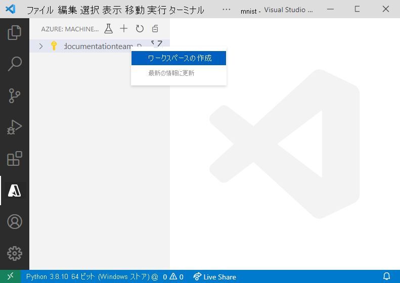
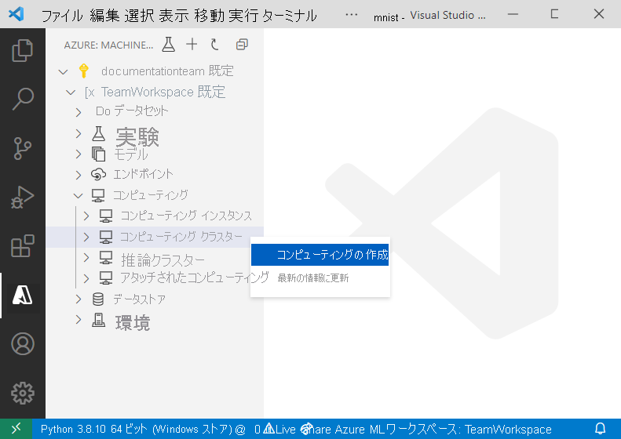

# <a name="train-and-deploy-an-image-classification-tensorflow-model-using-the-azure-machine-learning-visual-studio-code-extension"></a>Azure Machine Learning Visual Studio Code 拡張機能を使用して画像分類 TensorFlow モデルをトレーニングおよびデプロイする

TensorFlow と Azure Machine Learning Visual Studio Code 拡張機能を使用して、手書きの数字を認識する画像分類モデルをトレーニングおよびデプロイする方法について説明します。

このチュートリアルでは、以下のタスクについて学習します。

> [!div class="checklist"]
> * コードの理解
> * ワークスペースの作成
> * 実験の作成
> * コンピューティング先を構成する
> * 構成ファイルを実行する
> * モデルをトレーニングする
> * モデルを登録する
> * モデルをデプロイする

## <a name="prerequisites"></a>前提条件

- Azure のサブスクリプション。 お持ちでない場合は、[無料版または有料版の Azure Machine Learning](https://aka.ms/AMLFree) にサインアップしてお試しください。
- 軽量なクロスプラットフォーム コード エディターである [Visual Studio Code](https://code.visualstudio.com/docs/setup/setup-overview) をインストールします。
- Azure Machine Learning Studio Visual Studio Code 拡張機能。 インストール手順については、[Azure Machine Learning Visual Studio Code 拡張機能の設定に関するチュートリアル](./tutorial-setup-vscode-extension.md)を参照してください。

## <a name="understand-the-code"></a>コードの理解

このチュートリアルのコードでは、0 から 9 の手書きの数字を分類する画像分類機械学習モデルを TensorFlow を使用してトレーニングします。 それを行うには、28 ピクセル x 28 ピクセルの画像のピクセル値を入力として受け取り、10 個の確率 (分類の対象となる数字ごとに 1 つ) の一覧を出力するニューラル ネットワークを作成します。 以下は、データの体裁を示すサンプルです。  


このチュートリアルのコードを入手するには、お使いのコンピューターの任意の場所に [VS Code Tools for AI リポジトリ](https://github.com/microsoft/vscode-tools-for-ai/archive/master.zip)をダウンロードして解凍してください。

## <a name="create-a-workspace"></a>ワークスペースの作成

Azure Machine Learning でアプリケーションを作成する際に最初に行うべきことは、ワークスペースの作成です。 ワークスペースには、モデルをトレーニングするためのリソースのほか、トレーニング済みのモデル自体も含まれます。 詳細については、[ワークスペースの概要](./concept-workspace.md)に関するページを参照してください。 

1. Visual Studio Code のアクティビティ バーで、**Azure** アイコンを選択して Azure Machine Learning ビューを開きます。
1. Azure サブスクリプションを右クリックし、 **[ワークスペースの作成]** を選択します。 
    
    > [!div class="mx-imgBorder"]
    > 

1. 既定では、作成日時を含む名前が生成されます。 テキスト入力ボックスで名前を "TeamWorkspace" に変更し、**Enter** キーを押します。
1. **[Create a new resource group]\(新しいリソース グループの作成\)** を選択します。 
1. リソース グループに "TeamWorkspace-rg" という名前を付けて **Enter** キーを押します。 
1. ワークスペースの場所を選択します。 モデルをデプロイする予定の場所に最も近い場所を選択することをお勧めします。 たとえば "米国西部 2" にします。
1. ワークスペースの種類を選択するよう求められたら、 **[Basic]** を選択して Basic のワークスペースを作成します。 ワークスペースの各種プランの詳細については、[Azure Machine Learning の概要](./overview-what-is-azure-ml.md#sku)に関するページを参照してください。

この時点で、新しいワークスペースをアカウントに作成するための要求が Azure に送信されます。 数分後、ご利用のサブスクリプションのノードに新しいワークスペースが表示されます。 

## <a name="create-an-experiment"></a>実験の作成

ワークスペースに 1 つ以上の実験を作成して、個々のモデルのトレーニング実行を追跡して分析することができます。 実行は、Azure クラウド内またはお使いのローカル コンピューター上で行うことができます。

1. Visual Studio Code アクティビティ バーで、**Azure** アイコンを選択します。 Azure Machine Learning ビューが表示されます。
1. ご利用のサブスクリプションのノードを展開します。
1. **TeamWorkspace** ノードを展開します。 
1. **[実験]** ノードを右クリックします。
1. コンテキスト メニューから **[Create Experiment]\(実験の作成\)** を選択します。

    > [!div class="mx-imgBorder"]
    > 

1. 実験に「MNIST」という名前を付け、**Enter** キーを押して新しい実験を作成します。 

ワークスペースと同様、指定した構成で実験を作成するための要求が Azure に送信されます。 数分後、ワークスペースの *[実験]* ノードに新しい実験が表示されます。 

## <a name="configure-compute-targets"></a>コンピューティング先を構成する

コンピューティング先とは、スクリプトを実行してトレーニング済みのモデルをデプロイするコンピューティング リソースまたは環境のことです。 詳細については、[Azure Machine Learning のコンピューティング先に関するドキュメント](./concept-compute-target.md)を参照してください。

コンピューティング先を作成するには:

1. Visual Studio Code アクティビティ バーで、**Azure** アイコンを選択します。 Azure Machine Learning ビューが表示されます。 
1. ご利用のサブスクリプションのノードを展開します。 
1. **TeamWorkspace** ノードを展開します。 
1. ワークスペース ノードの下の **[コンピューティング]** ノードを右クリックし、 **[Create Compute]\(コンピューティングの作成)** を選択します。 

    > [!div class="mx-imgBorder"]
    > 

1. **[Azure Machine Learning コンピューティング (AmlCompute)]** を選択します。 Azure Machine Learning コンピューティングとは、マネージド コンピューティング インフラストラクチャで、これにより、ユーザーは、ワークスペース内の他のユーザーと一緒に使用できるシングルノードまたはマルチノードのコンピューティングを簡単に作成できます。
1. VM のサイズを選択します。 オプションの一覧から **[Standard_F2s_v2]** を選択します。 使用する VM のサイズは、モデルのトレーニングの所要時間に影響します。 VM サイズの詳細については、「[Azure の Linux 仮想マシンのサイズ](https://docs.microsoft.com/azure/virtual-machines/linux/sizes)」を参照してください。
1. コンピューティングに「TeamWkspc-com」という名前を付け、**Enter** キーを押してコンピューティングを作成します。

数分後、ワークスペースの *[コンピューティング]* ノードに新しいコンピューティング先が表示されます。

## <a name="create-a-run-configuration"></a>実行構成を作成する

トレーニングの実行をコンピューティング先に送信する際は、そのトレーニング ジョブの実行に必要な構成も送信します。 たとえば、トレーニングのコードを含んだスクリプトや、その実行に必要な Python の依存関係があります。

実行構成を作成するには:

1. Visual Studio Code アクティビティ バーで、**Azure** アイコンを選択します。 Azure Machine Learning ビューが表示されます。 
1. ご利用のサブスクリプションのノードを展開します。 
1. **TeamWorkspace** ノードを展開します。 
1. ワークスペース ノードの下にある **TeamWkspc-com** コンピューティング ノードを右クリックし、 **[実行構成の作成]** を選択します。

    > [!div class="mx-imgBorder"]
    > 

1. コマンド パレットのプロンプトで、実行構成に「MNIST-rc」という名前を付け、**Enter** キーを押して実行構成を作成します。
1. 次に、トレーニング ジョブの種類として **[TensorFlow Single-Node Training]\(TensorFlow 単一ノード トレーニング\)** を選択します。
1. **Enter** キーを押して、コンピューティングで実行するスクリプト ファイルを参照します。 この場合、モデルをトレーニングするためのスクリプトは、`vscode-tools-for-ai/mnist-vscode-docs-sample` ディレクトリ内にある `train.py` ファイルです。
1. 入力ボックスに次のように入力して、必要なパッケージを指定します。
    
    ```text
    pip: azureml-defaults; conda: python=3.6.2, tensorflow=1.15.0
    ```
    
    次のような内容を含む `MNIST-rc.runconfig` というファイルが VS Code に表示されます。

    ```json
    {
        "script": "train.py",
        "framework": "Python",
        "communicator": "None",
        "target": "TeamWkspc-com",
        "environment": {
            "python": {
                "userManagedDependencies": false,
                "condaDependencies": {
                    "dependencies": [
                        "python=3.6.2",
                        "tensorflow=1.15.0",
                        {
                            "pip": [
                                "azureml-defaults"
                            ]
                        }
                    ]
                }
            },
            "docker": {
                "baseImage": "mcr.microsoft.com/azureml/base:0.2.4",
                "enabled": true,
                "baseImageRegistry": {
                    "address": null,
                    "username": null,
                    "password": null
                }
            }
        },
        "nodeCount": 1,
        "history": {
            "outputCollection": true,
            "snapshotProject": false,
            "directoriesToWatch": [
                "logs"
            ]
        }
    }
    ```

1. 構成に問題がなければ、 **[表示]、[コマンド パレット]** の順に選択して、コマンド パレットを開きます。
1. コマンド パレットに次のコマンドを入力して、実行構成ファイルを保存します。

    ```text
    Azure ML: Save and Continue
    ```

*TeamWkspc-com* コンピューティング ノードに `MNIST-rc` 実行構成が追加されます。

## <a name="train-the-model"></a>モデルをトレーニングする

トレーニング プロセス中は、トレーニング データを処理し、分類の対象となる数字ごとに、データに埋め込まれたパターンを学習することによって TensorFlow モデルが作成されます。 

Azure Machine Learning 実験を実行するには:

1. Visual Studio Code アクティビティ バーで、**Azure** アイコンを選択します。 Azure Machine Learning ビューが表示されます。 
1. ご利用のサブスクリプションのノードを展開します。 
1. **[TeamWorkspace]、[実験]** ノードの順に展開します。 
1. **MNIST** 実験を右クリックします。
1. **[Run Experiment]\(実験を実行する)** を選択します。

    > [!div class="mx-imgBorder"]
    > 

1. コンピューティング先のオプションの一覧から **[TeamWkspc-com]** を選択します。
1. 次に、**MNIST-rc** 実行構成を選択します。
1. この時点で、ワークスペースで選択したコンピューティング先で実験を実行するための要求が Azure に送信されます。 このプロセスには数分かかります。 トレーニング ジョブの実行にかかる時間は、コンピューティングの種類やトレーニング データのサイズなど、いくつかの要因によって左右されます。 実験の進行状況を追跡するには、現在の実行ノードを右クリックし、 **[View Run in Azure portal]\(Azure portal で実行を表示する\)** を選択します。
1. 外部の Web サイトを開くよう要求するダイアログが表示されたら、 **[開く]** を選択します。

    > [!div class="mx-imgBorder"]
    > 

モデルのトレーニングが完了すると、実行ノードの横にある状態ラベルが "完了" に更新されます。

## <a name="register-the-model"></a>モデルを登録する

モデルのトレーニングが終わったので、次はそれをワークスペースに登録できます。 

モデルを登録するには:

1. Visual Studio Code アクティビティ バーで、**Azure** アイコンを選択します。 Azure Machine Learning ビューが表示されます。
1. ご利用のサブスクリプションのノードを展開します。 
1. **[TeamWorkspace]、[実験]、[MNIST]** ノードの順に展開します。
1. モデルのトレーニングから生成されたモデル出力を取得します。 **[Run 1]\(実行 1\)** という実行ノードを右クリックし、 **[Download outputs]\(出力のダウンロード\)** を選択します。 

    > [!div class="mx-imgBorder"]
    > 

1. ダウンロードした出力の保存先ディレクトリを選択します。 既定では、その時点で Visual Studio Code で開いているディレクトリに出力が格納されます。
1. **[モデル]** ノードを右クリックし、 **[モデルの登録]** を選択します。

    > [!div class="mx-imgBorder"]
    > 

1. モデルに「MNIST-TensorFlow-model」という名前を付けて、**Enter** キーを押します。
1. TensorFlow モデルは、複数のファイルで構成されています。 モデル パスの形式として、オプションの一覧から **Model フォルダー**を選択します。 
1. `azureml_outputs/Run_1/outputs/outputs/model` ディレクトリを選択します。

    モデルの構成を含んだファイルが Visual Studio Code に表示されます。これには、次のような内容が記述されています。

    ```json
    {
        "modelName": "MNIST-TensorFlow-model",
        "tags": {
            "": ""
        },
        "modelPath": "c:\\Dev\\vscode-tools-for-ai\\mnist-vscode-docs-sample\\azureml_outputs\\Run_1\\outputs\\outputs\\model",
        "description": ""
    }
    ```

1. その構成に問題がなければ、コマンド パレットを開き、次のコマンドを入力して保存してください。

    ```text
    Azure ML: Save and Continue
    ```

数分後、"*モデル*" ノードの下にこのモデルが表示されます。

## <a name="deploy-the-model"></a>モデルをデプロイする

Visual Studio Code では、モデルを Web サービスとして次の場所にデプロイすることができます。

+ Azure Container Instances (ACI)。
+ Azure Kubernetes Service (AKS)。

ACI コンテナーは必要に応じて作成されるので、テストするために ACI コンテナーを事前に作成する必要はありません。 ただし、AKS クラスターを事前に構成する必要があります。 デプロイ オプションの詳細については、「[Azure Machine Learning を使用してモデルをデプロイする](how-to-deploy-and-where.md)」を参照してください。

Web サービスを ACI としてデプロイするには:

1. Visual Studio Code アクティビティ バーで、**Azure** アイコンを選択します。 Azure Machine Learning ビューが表示されます。
1. ご利用のサブスクリプションのノードを展開します。 
1. **[TeamWorkspace]、[モデル]** ノードの順に展開します。 
1. **MNIST-TensorFlow-model** を右クリックし、 **[Deploy Service from Registered Model]\(登録済みモデルからサービスをデプロイする\)** を選択します。

    > [!div class="mx-imgBorder"]
    > 。

1. **[Azure Container Instances]** を選択します。
1. サービスに「mnist-tensorflow-svc」という名前を付けて、**Enter** キーを押します。
1. 入力ボックスで **Enter** キーを押し、`mnist-vscode-docs-sample` ディレクトリ内の `score.py` ファイルを参照して、コンテナーで実行するスクリプトを選択します。
1. 入力ボックスで **Enter** キーを押し、`mnist-vscode-docs-sample` ディレクトリ内の `env.yml` ファイルを参照して、スクリプトの実行に必要な依存関係を指定します。

    モデルの構成を含んだファイルが Visual Studio Code に表示されます。これには、次のような内容が記述されています。

    ```json
    {
        "name": "mnist-tensorflow-svc",
        "imageConfig": {
            "runtime": "python",
            "executionScript": "score.py",
            "dockerFile": null,
            "condaFile": "env.yml",
            "dependencies": [],
            "schemaFile": null,
            "enableGpu": false,
            "description": ""
        },
        "deploymentConfig": {
            "cpu_cores": 1,
            "memory_gb": 10,
            "tags": {
                "": ""
            },
            "description": ""
        },
        "deploymentType": "ACI",
        "modelIds": [
            "MNIST-TensorFlow-model:1"
        ]
    }
    ```
1. その構成に問題がなければ、コマンド パレットを開き、次のコマンドを入力して保存してください。

    ```text
    Azure ML: Save and Continue
    ```

この時点で、Web サービスをデプロイするための要求が Azure に送信されます。 このプロセスには数分かかります。 デプロイが完了すると、"*エンドポイント*" ノードの下に新しいサービスが表示されます。

## <a name="next-steps"></a>次のステップ

* Visual Studio Code 以外で Azure Machine Learning をトレーニングする方法のチュートリアルについては、[Azure Machine Learning を使用したモデルのトレーニングに関するチュートリアル](tutorial-train-models-with-aml.md)を参照してください。
* コードをローカルで編集、実行、およびデバッグする方法のチュートリアルについては、[Python hello-world チュートリアル](https://code.visualstudio.com/docs/Python/Python-tutorial)を参照してください。

