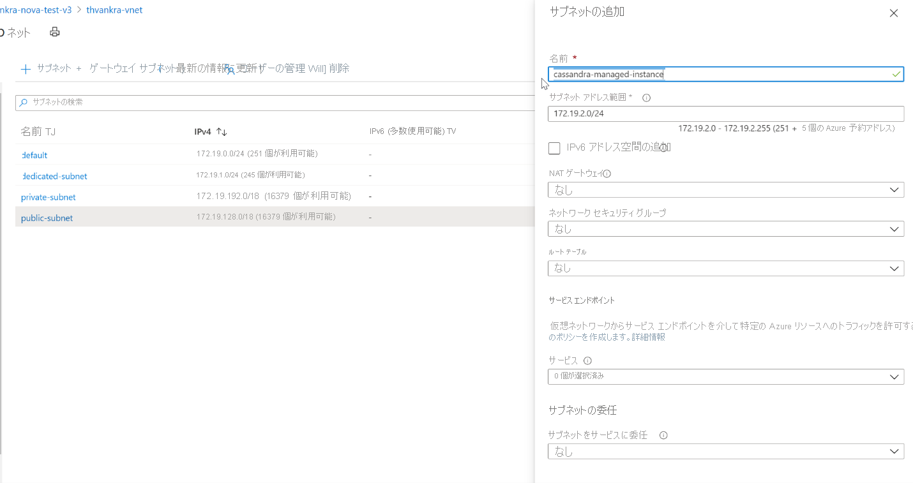

# <a name="quickstart-configure-a-hybrid-cluster-with-azure-managed-instance-for-apache-cassandra-preview"></a>クイックスタート: Azure Managed Instance for Apache Cassandra (プレビュー) を使用してハイブリッド クラスターを構成する

Azure Managed Instance for Apache Cassandra では、マネージド オープンソースの Apache Cassandra データセンターに対して、デプロイとスケーリングの自動化された操作を提供します。 このサービスは、ハイブリッド シナリオの促進と継続的保守管理の削減に役立ちます。

> [!IMPORTANT]
> Azure Managed Instance for Apache Cassandra は現在、パブリック プレビューの段階にあります。
> このプレビュー バージョンはサービス レベル アグリーメントなしで提供されています。運用環境のワークロードに使用することはお勧めできません。 特定の機能はサポート対象ではなく、機能が制限されることがあります。
> 詳しくは、[Microsoft Azure プレビューの追加使用条件](https://azure.microsoft.com/support/legal/preview-supplemental-terms/)に関するページをご覧ください。

このクイックスタートでは、Azure CLI のコマンドを使用してハイブリッド クラスターを構成する方法について説明します。 既にオンプレミスまたはセルフホステッド環境にデータセンターがある場合は、Azure Managed Instance for Apache Cassandra を使用して、そのクラスターに他のデータセンターを追加して管理することができます。

[!INCLUDE [azure-cli-prepare-your-environment.md](../../includes/azure-cli-prepare-your-environment.md)]

* この記事では、Azure CLI バージョン 2.12.1 以降が必要です。 Azure Cloud Shell を使用している場合は、最新バージョンが既にインストールされています。

* セルフホステッドまたはオンプレミス環境に接続された [Azure Virtual Network](../virtual-network/virtual-networks-overview.md)。 オンプレミス環境を Azure に接続する方法の詳細については、「[オンプレミス ネットワークの Azure への接続](/azure/architecture/reference-architectures/hybrid-networking/)」の記事を参照してください。

## <a name="configure-a-hybrid-cluster"></a><a id="create-account"></a>ハイブリッド クラスターを構成する

1. [Azure portal](https://portal.azure.com/) にサインインし、仮想ネットワーク リソースに移動します。

1. **[サブネット]** タブを開いて新しいサブネットを作成します。 **[サブネットの追加]** フォームにあるフィールドの詳細については、[仮想ネットワーク](../virtual-network/virtual-network-manage-subnet.md#add-a-subnet)に関する記事を参照してください。

   :::image type="content" source="./media/configure-hybrid-cluster/subnet.png" alt-text="仮想ネットワークに新しいサブネットを追加する。" lightbox="./media/configure-hybrid-cluster/subnet.png" border="true":::
    <!--  -->

    > [!NOTE]
    > Azure Managed Instance for Apache Cassandra をデプロイするには、インターネットへのアクセスが必要です。 インターネットへのアクセスが制限されている環境では、デプロイは失敗します。 Managed Cassandra が適切に機能するために必要な、次の重要な Azure サービスへのアクセスが VNet 内でブロックされていないことを確認します。
    > - Azure Storage
    > - Azure KeyVault
    > - Azure 仮想マシン スケール セット
    > - Azure 監視
    > - Azure Active Directory
    > - Azure Security

1. 次に Azure CLI を使用して、Cassandra Managed Instance に必要ないくつかの特殊なアクセス許可を VNet とサブネットに適用します。 `az role assignment create` コマンドを使用します。`<subscription ID>`、`<resource group name>`、`<VNet name>` は、適切な値に置き換えてください。

   ```azurecli-interactive
   az role assignment create --assignee a232010e-820c-4083-83bb-3ace5fc29d0b --role 4d97b98b-1d4f-4787-a291-c67834d212e7 --scope /subscriptions/<subscription ID>/resourceGroups/<resource group name>/providers/Microsoft.Network/virtualNetworks/<VNet name>
   ```

   > [!NOTE]
   > 前のコマンドの `assignee` 値と `role` 値は、それぞれ固定されたサービス プリンシパルとロール識別子です。

1. 次に、ハイブリッド クラスターのリソースを構成します。 既にクラスターはあるので、ここでのクラスター名は、既存のクラスターの名前を識別するための論理リソースにすぎません。 以下のスクリプトで `clusterName` および `clusterNameOverride` 変数を定義する際は、必ず既存のクラスターの名前を使用してください。 また、既存のクラスターのシード ノード、パブリック クライアント証明書 (Cassandra エンドポイントで公開キーと秘密キーを構成済みの場合)、gossip 証明書が必要となります。

   > [!NOTE]
   > 以下で指定する `delegatedManagementSubnetId` 変数の値は、上記のコマンドで指定した `--scope` の値とまったく同じです。

   ```azurecli-interactive
   resourceGroupName='MyResourceGroup'
   clusterName='cassandra-hybrid-cluster-legal-name'
   clusterNameOverride='cassandra-hybrid-cluster-illegal-name'
   location='eastus2'
   delegatedManagementSubnetId='/subscriptions/<subscription ID>/resourceGroups/<resource group name>/providers/Microsoft.Network/virtualNetworks/<VNet name>/subnets/<subnet name>'
    
   # You can override the cluster name if the original name is not legal for an Azure resource:
   # overrideClusterName='ClusterNameIllegalForAzureResource'
   # the default cassandra version will be v3.11
    
   az managed-cassandra cluster create \
      --cluster-name $clusterName \
      --resource-group $resourceGroupName \
      --location $location \
      --delegated-management-subnet-id $delegatedManagementSubnetId \
      --external-seed-nodes 10.52.221.2,10.52.221.3,10.52.221.4
      --client-certificates 'BEGIN CERTIFICATE-----\n...PEM format..\n-----END CERTIFICATE-----','BEGIN CERTIFICATE-----\n...PEM format...\n-----END CERTIFICATE-----' \
      --external-gossip-certificates 'BEGIN CERTIFICATE-----\n...PEM format 1...\n-----END CERTIFICATE-----','BEGIN CERTIFICATE-----\n...PEM format 2...\n-----END CERTIFICATE-----'
   ```

    > [!NOTE]
    > 既存のパブリック証明書と gossip 証明書の保管場所を把握しておく必要があります。 わからない場合は、`keytool -list -keystore <keystore-path> -rfc -storepass <password>` を実行して証明書を出力することができます。 

1. クラスター リソースが作成されたら、次のコマンドを実行してクラスターのセットアップの詳細を取得します。

   ```azurecli-interactive
   resourceGroupName='MyResourceGroup'
   clusterName='cassandra-hybrid-cluster'
    
   az managed-cassandra cluster show \
       --cluster-name $clusterName \
       --resource-group $resourceGroupName \
   ```

1. 前のコマンドを実行すると、マネージド インスタンス環境に関する情報が返されます。 既存のデータセンター内のノードにインストールできるよう、gossip 証明書が必要となります。 次のスクリーンショットは、前のコマンドの出力と証明書の形式を示しています。

   :::image type="content" source="./media/configure-hybrid-cluster/show-cluster.png" alt-text="クラスターから証明書の詳細を取得する。" lightbox="./media/configure-hybrid-cluster/show-cluster.png" border="true":::
    <!--  -->

1. 次に、ハイブリッド クラスターに新しいデータセンターを作成します。 変数の値は、実際のクラスターの情報に置き換えてください。

   ```azurecli-interactive
   resourceGroupName='MyResourceGroup'
   clusterName='cassandra-hybrid-cluster'
   dataCenterName='dc1'
   dataCenterLocation='eastus2'
    
   az managed-cassandra datacenter create \
       --resource-group $resourceGroupName \
       --cluster-name $clusterName \
       --data-center-name $dataCenterName \
       --data-center-location $dataCenterLocation \
       --delegated-subnet-id $delegatedManagementSubnetId \
       --node-count 9 
   ```

1. 新しいデータセンターが作成されたら、データセンターの表示コマンドを実行して、その詳細を表示します。

   ```azurecli-interactive
   resourceGroupName='MyResourceGroup'
   clusterName='cassandra-hybrid-cluster'
   dataCenterName='dc1'
    
   az managed-cassandra datacenter show \
       --resource-group $resourceGroupName \
       --cluster-name $clusterName \
       --data-center-name $dataCenterName 
   ```

1. 前のコマンドによって、新しいデータセンターのシード ノードが出力されます。 新しいデータセンターのシード ノードを *cassandra.yaml* ファイル内の既存のデータセンターの構成に追加します。 さらに、先ほど収集したマネージド インスタンスの gossip 証明書をインストールします。

   :::image type="content" source="./media/configure-hybrid-cluster/show-datacenter.png" alt-text="データセンターの詳細を取得する。" lightbox="./media/configure-hybrid-cluster/show-datacenter.png" border="true":::
    <!--  -->

    > [!NOTE]
    > さらにデータセンターを追加したい場合は、上記の手順を繰り返します。ただし必要なのはシード ノードだけです。 

1. 最後に、次の CQL クエリを使用して、各キースペースのレプリケーション戦略を更新し、クラスター全体のすべてのデータセンターを含めます。

   ```bash
   ALTER KEYSPACE "ks" WITH REPLICATION = {'class': 'NetworkTopologyStrategy', ‘on-premise-dc': 3, ‘managed-instance-dc': 3};
   ```
   さらに、パスワード テーブルも更新する必要があります。

   ```bash
    ALTER KEYSPACE "system_auth" WITH REPLICATION = {'class': 'NetworkTopologyStrategy', ‘on-premise-dc': 3, ‘managed-instance-dc': 3}
   ```

## <a name="troubleshooting"></a>トラブルシューティング

Virtual Network にアクセス許可を適用するときにエラー (例えば、"*Cannot find user or service principal in graph database for 'e5007d2c-4b13-4a74-9b6a-605d99f03501' ('e5007d2c-4b13-4a74-9b6a-605d99f03501' に対するユーザーまたはサービス プリンシパルがグラフ データベース内で見つかりません)* " など) が発生した場合は、Azure portal から同じアクセス許可を手動で適用できます。 ポータルからアクセス許可を適用するには、既存の仮想ネットワークの **[アクセス制御 (IAM)]** ペインにアクセスし、"Azure Cosmos DB" のロール割り当てを "ネットワーク管理者" ロールに追加します。 "Azure Cosmos DB" を検索したときに 2 つのエントリが表示される場合は、次の図に示すように両方のエントリを追加します。 

   :::image type="content" source="./media/create-cluster-cli/apply-permissions.png" alt-text="アクセス許可を適用する" lightbox="./media/create-cluster-cli/apply-permissions.png" border="true":::

> [!NOTE] 
> Azure Cosmos DB のロールの割り当ては、デプロイの目的にのみ使用されます。 Azure Managed Instance for Apache Cassandra には、Azure Cosmos DB に対するバックエンドの依存関係はありません。  

## <a name="clean-up-resources"></a>リソースをクリーンアップする

このマネージド インスタンス クラスターを引き続き使用しない場合は、次の手順でそれを削除します。

1. Azure portal の左側にあるメニューで、 **[リソース グループ]** を選択します。
1. 一覧から、このクイック スタートで作成したリソース グループを選択します。
1. リソース グループの **[概要]** ペインで、 **[リソース グループの削除]** を選択します。
3. 次のウィンドウで、削除するリソース グループの名前を入力し、**[削除]** を選択します。

## <a name="next-steps"></a>次のステップ

このクイックスタートでは、Azure CLI と Azure Managed Instance for Apache Cassandra を使用してハイブリッド クラスターを作成する方法を説明しました。 これで、クラスターの操作を開始できます。

> [!div class="nextstepaction"]
> [Azure CLI を利用して Azure Managed Instance for Apache Cassandra リソースを管理する](manage-resources-cli.md)
