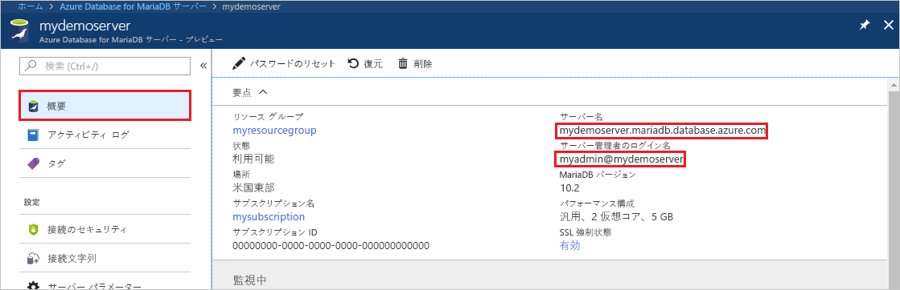
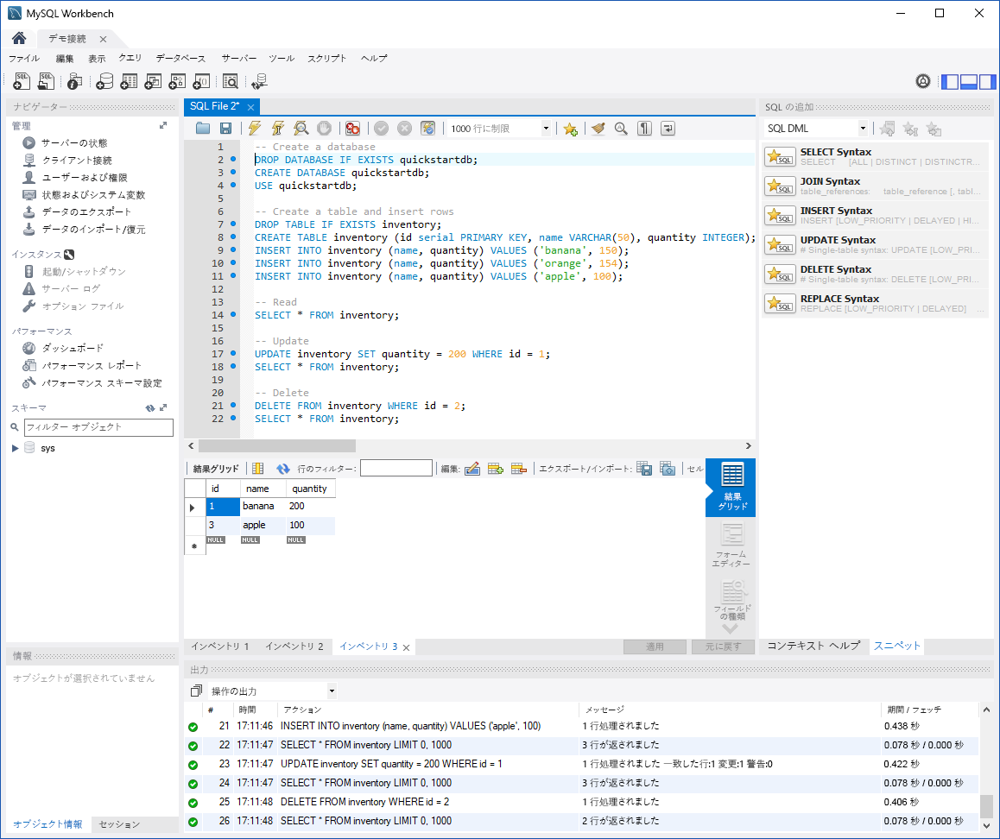

# <a name="azure-database-for-mariadb-use-mysql-workbench-to-connect-and-query-data"></a>Azure Database for MariaDB: MySQL Workbench を使った接続とデータの照会

このクイック スタートでは、MySQL Workbench を使用して Azure Database for MariaDB インスタンスに接続する方法を紹介します。 

## <a name="prerequisites"></a>前提条件

このクイック スタートでは、次のいずれかのガイドで作成されたリソースを出発点として使用します。

- [Azure portal を使用した Azure Database for MariaDB サーバーの作成](./quickstart-create-mariadb-server-database-using-azure-portal.md)
- [Azure CLI を使用して Azure Database for MariaDB サーバーを作成する](./quickstart-create-mariadb-server-database-using-azure-cli.md)

## <a name="install-mysql-workbench"></a>MySQL Workbench のインストール

[MySQL Workbench](https://dev.mysql.com/downloads/workbench/) をダウンロードしてコンピューターにインストールします。

## <a name="get-connection-information"></a>接続情報の取得

Azure Database for MariaDB インスタンスに接続するために必要な接続情報を取得します。 完全修飾サーバー名とサインイン資格情報が必要です。

1. [Azure Portal](https://portal.azure.com/) にサインインします。

2. Azure portal の左側のメニューで、**[すべてのリソース]** を選択します。 作成したサーバーを検索します (**mydemoserver** など)。

3. サーバー名を選択します。

4. サーバーの **[概要]** ページで、**[サーバー名]** と **[サーバー管理者ログイン名]** の値を書き留めます。 パスワードを忘れた場合も、このページでパスワードをリセットすることができます。

 

## <a name="connect-to-the-server-by-using-mysql-workbench"></a>MySQL Workbench を使用したサーバーへの接続

MySQL Workbench を使用して Azure Database for MariaDB サーバーに接続するには、次の手順に従います。

1.  お使いのコンピューターで MySQL Workbench を開きます。 

2.  **[Setup New Connection]\(新しい接続の設定\)** ダイアログ ボックスの **[Parameters]\(パラメーター\)** タブに次の情報を入力します。

    | Setting | 推奨値 | フィールドの説明 |
    |---|---|---|
    |   接続名 | **Demo connection** | この接続のラベルを指定します。 |
    | 接続方法 | **Standard (TCP/IP)** | Standard (TCP/IP) で十分です。 |
    | ホスト名 | *サーバー名* | Azure Database for MariaDB インスタンスを作成するときに使用したサーバー名の値を指定します。 この例におけるサーバーは、**mydemoserver.mariadb.database.azure.com** です。 例で示されているように、完全修飾ドメイン名 (\*.mariadb.database.azure.com) を使用します。 サーバー名を覚えていない場合は、前のセクションの手順に従って接続情報を取得してください。  |
    | ポート | **3306** | Azure Database for MariaDB に接続するときは、常にポート 3306 を使用します。 |
    | ユーザー名 |  *サーバー管理者ログイン名* | Azure Database for MariaDB インスタンスを作成するときに使用したサーバー管理者のログイン ユーザー名を入力します。 この例のユーザー名は **myadmin@mydemoserver** です。 サーバー管理者のログイン名を覚えていない場合は、前のセクションの手順に従って接続情報を取得してください。 形式は *username@servername* です。
    | パスワード | *<お使いのパスワード>* | パスワードを保存するには、**[Store in Vault]\(コンテナーに保存\)** を選択します。 |

    

3.   すべてのパラメーターが正しく構成されていることを確認するために、**[Test Connection]\(接続のテスト\)** を選択します。 

4.   **[OK]** を選択して接続を保存します。 

5.   **[MySQL Connections]\(MySQL 接続\)** で、目的のサーバーに対応するタイルを選択します。 接続が確立されるまで待ちます。

    新しい SQL タブが開き、クエリを入力できる空白のエディターが表示されます。
    
    > [!NOTE]
    > 既定では、SSL 接続のセキュリティは必須であり、Azure Database for MariaDB サーバーに適用されます。 通常、MySQL ワークベンチがサーバーに接続するために、SSL 証明書の追加構成は必要ありませんが、SSL CA 証明書と MySQL Workbench のバインドをお勧めします。 SSL を無効にする必要がある場合は、Azure portal で、サーバーの概要ページにあるメニューから **[接続のセキュリティ]** を選択してください。 **[SSL 接続を強制する]** で **[無効]** を選択します。

## <a name="create-table-and-insert-read-update-and-delete-data"></a>テーブルを作成し、データを挿入、読み取り、更新、削除する

1. いくつかのサンプル データを示すために、以下のサンプル SQL コードをコピーして空の SQL タブのページに貼り付けます。

    このコードでは、**quickstartdb** という名前の空のデータベースを作成し、 **inventory** という名前のサンプル テーブルを作成します。 このコードは、いくつかの行を挿入した後、行を読み取ります。 次に、更新ステートメントによってデータを変更し、行を再度読み取ります。 最後に、1 つの行を削除した後、行を再度読み取ります。
    
    ```sql
    -- Create a database
    -- DROP DATABASE IF EXISTS quickstartdb;
    CREATE DATABASE quickstartdb;
    USE quickstartdb;
    
    -- Create a table and insert rows
    DROP TABLE IF EXISTS inventory;
    CREATE TABLE inventory (id serial PRIMARY KEY, name VARCHAR(50), quantity INTEGER);
    INSERT INTO inventory (name, quantity) VALUES ('banana', 150);
    INSERT INTO inventory (name, quantity) VALUES ('orange', 154);
    INSERT INTO inventory (name, quantity) VALUES ('apple', 100);
    
    -- Read
    SELECT * FROM inventory;
    
    -- Update
    UPDATE inventory SET quantity = 200 WHERE id = 1;
    SELECT * FROM inventory;
    
    -- Delete
    DELETE FROM inventory WHERE id = 2;
    SELECT * FROM inventory;
    ```

    このスクリーンショットは、MySQL Workbench に表示された SQL コードとその実行後の出力の例を示しています。
    
    

2. サンプル SQL コードを実行するには、**[SQL File]\(SQL ファイル\)** タブのツールバーにある稲妻アイコンをクリックします。
3. ページ中央の **[結果グリッド]** セクションの 3 つのタブに結果が表示されていることに注目してください。 
4. ページの下部にある **[Output]\(出力\)** リストに注目してください。 各コマンドの状態が表示されています。 

このクイック スタートでは、MySQL Workbench を使用して Azure Database for MariaDB に接続し、SQL 言語を使用してデータを照会しました。

<!--
## Next steps
> [!div class="nextstepaction"]
> [Migrate your database using Export and Import](./concepts-migrate-import-export.md)
-->
