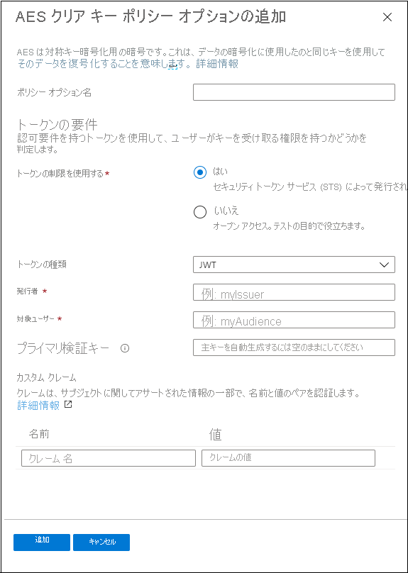

# クイック スタート:ポータルを使用してコンテンツを暗号化する

[!INCLUDE [media services api v3 logo](./includes/v3-hr.md)]

Azure Media Services を使用すると、メディアがコンピューターから離れてから、保存、処理、配信されるまでの全過程をセキュリティ保護できます。 Media Services では、Advanced Encryption Standard (AES-128) または主要な 3 つのデジタル著作権管理 (DRM) システム コンテンツを配信できます。 Media Services では、承認されたクライアントに AES キーと DRM (PlayReady、Widevine、FairPlay) ライセンスを配信するためのサービスも提供しています。 
 
ストリームで暗号化オプションを指定するには (該当する場合)、**ストリーミング ポリシー** を使用し、それをストリーミング ロケーターに関連付けます。 コンテンツ キー (対象の **資産** へのアクセスをセキュリティで保護する) をエンド クライアントに配信する方法を構成するには、**コンテンツ キー ポリシー** を作成します。 構成が指定されたキーをクライアントに配信するために満たす必要がある要件 (制限) をコンテンツ キー ポリシーに設定する必要があります。 

> [!NOTE]
> コンテンツ キー ポリシーは、クリアなストリーミングまたはダウンロードには必要ありません。

プレーヤーがストリームを要求すると、Media Services は指定されたキーを使用して、AES クリア キーまたは DRM 暗号化によってコンテンツを動的に暗号化します。 ストリームの暗号化を解除するために、プレーヤーは Media Services のキー配信サービスまたは指定したキー配信サービスからキーを要求します。 ユーザーによるキーの取得が承認されているかどうかを判断するために、サービスは、キーに指定された **コンテンツ キー ポリシー** を評価します。

このクイックスタートでは、資産のストリーミング時に資産に適用する暗号化を指定するコンテンツ キー ポリシーの作成方法について示します。 また、このクイックスタートでは、資産に構成済みの暗号化を設定する方法についても説明します。

### 推奨される事前読み取り

* [動的暗号化とキー デリバリー](drm-content-protection-concept.md)
* [ストリーミング ロケーター](stream-streaming-locators-concept.md)
* [ストリーミング ポリシー](stream-streaming-policy-concept.md)
* [コンテンツ キー ポリシー](drm-content-key-policy-concept.md)

## 前提条件

[Azure portal での資産の管理](asset-create-asset-upload-portal-quickstart.md)に関するページの説明に従って、コンテンツをアップロードし、処理します

## コンテンツ キー ポリシーを作成する

コンテンツ キー (対象の **資産** へのアクセスをセキュリティで保護する) をエンド クライアントに配信する方法を構成するには、**コンテンツ キー ポリシー** を作成します。

1. [Azure Portal](https://portal.azure.com/) にサインインします。
1. お使いの Media Services アカウントを見つけてクリックします。
1. **[Content key policies (new)]\(コンテンツ キー ポリシー (新規)\)** を選択します。
1. ウィンドウの上部にある **[+ Add content key policy]\(+ コンテンツ キー ポリシーの追加\)** を押します。 

**[Create a content key policy]\(コンテンツ キー ポリシーの作成\)** ウィンドウが表示されます。 このウィンドウで、暗号化オプションを選択します。 デジタル著作権管理 (DRM)、Advanced Encryption Standard (AES)、またはその両方を選択して、対象のメディアを保護することを選択できます。  

DRM オプションの 1 つを選択する場合でも、AES-128 クリア キー オプションを選択する場合でも、制限を構成する方法を指定することをお勧めします。 オープンまたはトークン制限を選択できます。 詳細については、「[コンテンツ アクセスの制御](drm-content-protection-concept.md#controlling-content-access)」を参照してください。

### DRM コンテンツ キーを追加する

Microsoft PlayReady、Google Widevine、または Apple FairPlay を使用してコンテンツを保護することを選択できます。 ライセンス デリバリーのそれぞれの種類で、暗号化された形式の資格情報に基づいてコンテンツ キーが確認されます。

#### ライセンス テンプレート

ライセンス テンプレートの詳細については、以下を参照してください。

* [Google Widevine ライセンス テンプレート](drm-widevine-license-template-concept.md)

    > [!NOTE]
    > 値のない "{}" だけの空のライセンス テンプレートを作成できます。 すると、ライセンス テンプレートが既定値で作成されます。 ほとんどの場合、既定値で問題ありません。
* [Apple FairPlay ライセンスの要件と構成](drm-fairplay-license-overview.md)
* [PlayReady ライセンス テンプレート](drm-playready-license-template-concept.md)

### AES クリア キーを追加する

対象のコンテンツに AES-128 クリア キー暗号化を追加することもできます。 コンテンツ キーは、暗号化されていない形式でクライアントに送信されます。

## 資産のストリーミング ロケーターを作成する

1. お使いの Media Services アカウントを見つけてクリックします。
1. **[資産 (新規)]** を選択します。
1. 資産の一覧で、暗号化する資産を選択します。  
1. 選択した資産の **[Streaming locator]\(ストリーミング ロケーター\)** セクションで、 **[Add a streaming locator]\(+ ストリーミング ロケーターの追加\)** を押します。 
1. 構成した **コンテンツ キー ポリシー** に適した **ストリーミング ポリシー** を選択します。

    「[ストリーミング ポリシー](stream-streaming-policy-concept.md)」トピックでは、どのストリーミング ポリシーがどのコンテンツ キー ポリシーと一致するかについて詳しく説明しています。
1. 適切なストリーミング ポリシーを選択したら、ドロップダウン リストからコンテンツ キー ポリシーを選択できます。
1. **[追加]** を押して、ストリーミング ロケーターを対象の資産に追加します。

    これにより資産が発行され、ストリーミング URL が生成されます。

## リソースをクリーンアップする

これから他のクイックスタートに取り組む場合は、作成したリソースをそのまま残しておく必要があります。 それ以外の場合は、Azure portal にアクセスして、ご利用のリソース グループに移動し、このクイックスタートで使用したリソース グループを選択して、それらのリソースをすべて削除してください。

## 次のステップ

[資産を管理する](asset-create-asset-upload-portal-quickstart.md)
