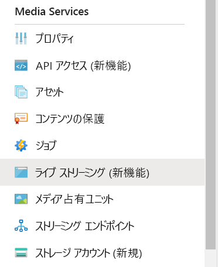
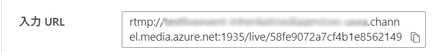

# OBS を使用して Azure Media Services のライブ ストリームを作成する

[!INCLUDE [media services api v3 logo](./includes/v3-hr.md)]

このクイックスタートでは、Azure portal を使用して Media Services ライブ イベントを、また、Open Broadcasting Studio (OBS) を使用してブロードキャストを作成する方法について説明します。 ここでは、Azure サブスクリプションを所有し、かつ Azure Media Services アカウントを作成済みであることを前提としています。

このクイックスタートで取り上げる内容は次のとおりです。

- OBS でオンプレミス エンコーダーを設定する。
- ライブ ストリームを設定する。
- ライブ ストリームの出力を設定する。
- 既定のストリーミング エンドポイントを実行する。
- Azure Media Player を使用してライブ ストリームとオンデマンド出力を表示する。

## 前提条件

Azure サブスクリプションをお持ちでない場合は、開始する前に [無料アカウント](https://azure.microsoft.com/free/) を作成してください。

## Azure portal にサインインする

Web ブラウザーを開き、[Microsoft Azure portal](https://portal.azure.com/) にアクセスします。 資格情報を入力してポータルにサインインします。 既定のビューはサービス ダッシュボードです。

## OBS を使用してオンプレミス エンコーダーを設定する

1. [Open Broadcaster Software の Web サイト](https://obsproject.com/)で、お使いのオペレーティング システム向けの OBS をダウンロードしてインストールします。
1. アプリケーションを起動し、開いたままにします。

## 既定のストリーミング エンドポイントを実行する

1. Media Services リストで **[ストリーミング エンドポイント]** を選択します。

   ![[ストリーミング エンドポイント] メニュー項目。](media/live-events-obs-quickstart/streaming-endpoints.png)
1. 既定のストリーミング エンドポイントの状態が "停止" であれば、それを選択します。 そのエンドポイントのページが表示されます。
1. **[スタート]** を選択します。

   ![ストリーミング エンドポイントの [開始] ボタン。](media/live-events-obs-quickstart/start.png)

## Azure Media Services のライブ ストリームを設定する

1. ポータル内の Azure Media Services アカウントに移動し、 **[Media Services]** リストから **[ライブ ストリーミング (新機能)]** を選択します。

   
1. **[ライブ イベントの追加]** を選択して新しいライブ ストリーミング イベントを作成します。

   ![[ライブ イベントの追加] アイコン。](media/live-events-obs-quickstart/add-live-event.png)
1. **[ライブ イベント名]** ボックスに新しいイベントの名前を入力します (例: *TestLiveEvent*)。

   ![[ライブ イベント名] ボックス。](media/live-events-obs-quickstart/live-event-name.png)
1. **[説明]** ボックスにイベントの説明 (省略可) を入力します。
1. **[パススルー - クラウド エンコードなし]** を選択します。

   ![[クラウド エンコード] オプション。](media/live-events-obs-quickstart/cloud-encoding.png)
1. **[RTMP]** オプションを選択します。
1. ライブ イベントの準備が完了する前に課金されないように、 **[ライブ イベントの開始]** で **[いいえ]** オプションが選択されていることを確認します (課金はライブ イベントが開始されたときに開始されます)。

   ![[ライブ イベントの開始] オプション。](media/live-events-obs-quickstart/start-live-event-no.png)
1. **[確認と作成]** ボタンを選択して設定を確認します。
1. **[作成]** ボタンを選択してライブ イベントを作成します。 その後、元のライブ イベント リストが表示されます。
1. 作成したライブ イベントへのリンクを選択します。 イベントが停止していることに注目します。
1. このページをブラウザーで開いたままにします。 これは後で使用します。

## OBS Studio を使用してライブ ストリームを設定する

OBS は既定のシーンで開始しますが、入力は選択されていません。

   

### ビデオ ソースを追加する

1. **[ソース]** パネルで **追加** アイコンを選択して新しいソース デバイスを選択します。 **[ソース]** メニューが開きます。

1. ソース デバイスのメニューから **[映像キャプチャ デバイス]** を選択します。 **[ソースを作成/選択]** メニューが開きます。

   ![ビデオ デバイスが選択された状態の OBS の [ソース] メニュー。](media/live-events-obs-quickstart/live-event-obs-video-device-menu.png)

1. **[既存を追加]** オプション ボタンを選択し、 **[OK]** を選択します。 **[映像キャプチャ デバイスのプロパティ]** メニューが開きます。

   ![[既存を追加] が選択された状態の OBS の新しいビデオ ソース メニュー。](media/live-events-obs-quickstart/live-event-obs-new-video-source.png)

1. **[デバイス]** ドロップダウン リストから、自分のブロードキャストに使用するビデオ入力を選択します。 ここでは残りの設定をそのままにして、 **[OK]** を選択します。 入力ソースが **[ソース]** パネルに追加され、ビデオ入力が **[プレビュー]** 領域に表示されます。

   

### オーディオ ソースを追加する

1. **[ソース]** パネルで **追加** アイコンを選択して新しいソース デバイスを選択します。 ソース デバイスのメニューが開きます。

1. ソース デバイスのメニューから **[音声入力キャプチャ]** を選択します。 **[ソースを作成/選択]** メニューが開きます。

   ![オーディオ デバイスが選択された状態の OBS の [ソース] メニュー。](media/live-events-obs-quickstart/live-event-obs-audio-device-menu.png)

1. **[既存を追加]** オプション ボタンを選択し、 **[OK]** を選択します。 **[音声入力キャプチャのプロパティ]** メニューが開きます。

   ![[既存を追加] が選択された状態の OBS のオーディオ ソース。](media/live-events-obs-quickstart/live-event-obs-new-audio-source.png)

1. **[デバイス]** ドロップダウン リストから、自分のブロードキャストに使用するオーディオ キャプチャ デバイスを選択します。 ここでは残りの設定をそのままにして、[OK] を選択します。 オーディオ キャプチャ デバイスが [音声ミキサー] パネルに追加されます。

   

### OBS でストリーミングと詳細なエンコード設定を設定する

次の手順では、ブラウザーで Azure Media Services に戻り、入力 URL をコピーして出力設定に入力します。

1. ポータルの Azure Media Services ページで、 **[開始]** を選択してライブ ストリーム イベントを開始します (この時点で課金が開始されます)。

   ![[開始] アイコン。](media/live-events-obs-quickstart/start.png)
1. **[RTMP]** トグルを **[RTMPS]** に設定します。
1. **[入力 URL]** ボックスの URL をクリップボードにコピーします。

   

1. OBS アプリケーションに切り替えます。

1. **[コントロール]** パネルの **[設定]** ボタンを選択します。 [設定] オプションが開きます。

   ![[設定] が選択された状態の OBS の [コントロール] パネル。](media/live-events-obs-quickstart/live-event-obs-settings.png)

1. **[設定]** メニューで **[配信]** を選択します。

1. **[サービス]** ドロップダウン リストで [すべてのサービスを表示] を選択し、 **[カスタム]** を選択します。

1. クリップボードにコピーした RTMPS URL を **[サーバー]** フィールドに貼り付けます。

1. **[ストリーム キー]** フィールドに何かを入力します。  何でもかまいませんが、値を入力する必要があります。

    

1. **[設定]** メニューで **[出力]** を選択します。

1. ページの上部にある **[出力モード]** ドロップダウンを選択し、 **[詳細設定]** を選択して使用可能なすべてのエンコーダー設定にアクセスします。

1. **[配信]** タブを選択してエンコーダーを設定します。

1. システムに適したエンコーダーを選択します。  ハードウェアで GPU アクセラレーションがサポートされている場合は、NVIDIA **NVENC** H.264 または Intel **QuickSync** H.264 を選択します。 サポートされている GPU がシステムにない場合は、**X264** ソフトウェア エンコーダー オプションを選択します。

#### X264 エンコーダーの設定

1. **X264** エンコード オプションを選択した場合は、 **[Rescale Output]\(出力を再スケーリングする\)** ボックスをオンにします。 1920 x 1080 (Media Services で Premium ライブ イベントを使用している場合) または 1280x720 (Standard (720P) ライブ イベントを使用している場合) を選択します。  パススルー ライブ イベントを使用している場合は、使用可能な任意の解像度を選択できます。

1. **[ビットレート]** を 1,500 kbps から 4,000 kbps までの任意の値に設定します。 720P Standard エンコード ライブ イベントを使用している場合は、2,500 Kbps にすることをお勧めします。 1080P Premium ライブ イベントを使用している場合は、4,000 Kbps にすることをお勧めします。 目的の品質設定を実現するために、ネットワーク上で使用可能な CPU 能力と帯域幅に基づいてビットレートを調整することができます。

1. **[キーフレーム間隔]** フィールドに「*2*」と入力します。 この値で、キー フレームの間隔が 2 秒に設定されます。これにより、Media Services から HLS または DASH を介して配信されるフラグメントの最終的なサイズが制御されます。 キー フレームの間隔を 4 秒より長く設定しないでください。  ブロードキャスト時の待機時間が長い場合は、常に再確認するか、アプリケーション ユーザー対し、この値を常に 2 秒に設定するように通知する必要があります。 待機時間の短いライブ配信を実現しようとする場合は、この値を 1 秒まで低く設定することができます。

1. 省略可能: [CPU 使用のプリセット] を **veryfast** に設定し、いくつかの実験を行って、ローカル CPU が、十分なオーバーヘッドでビットレートとプリセットの組み合わせに対応できるかどうかを確認します。 ライブ ストリーミング中に発生する問題を回避するために、平均 CPU が80% を超える結果になる設定は避けるようにしてください。 品質を向上するには、CPU の制限に達するまで **faster** と **fast** のプリセット設定でテストできます。

   

1. 残りの設定をそのままにして、 **[OK]** を選択します。

#### Nvidia NVENC エンコーダーの設定

1. **NVENC** GPU エンコード オプションを選択している場合は、 **[Rescale Output]\(出力を再スケーリングする\)** ボックスをオンにし、1920x1080 (Media Services で Premium ライブ イベントを使用している場合) または 1280x720 (Standard (720P) ライブ イベントを使用している場合) を選択します。 パススルー ライブ イベントを使用している場合は、使用可能な任意の解像度を選択できます。

1. **[レート制御]** を、一定のビットレートのレート制御を表す CBR に設定します。

1. **[ビットレート]** を 1,500 kbps から 4,000 kbps までの任意の値に設定します。 720P Standard エンコード ライブ イベントを使用している場合は、2,500 Kbps にすることをお勧めします。 1080P Premium ライブ イベントを使用している場合は、4,000 Kbps にすることをお勧めします。 目的の品質設定を実現するために、ネットワーク上で使用可能な CPU 能力と帯域幅に基づいてこれを調整することができます。

1. 上記の X264 オプションの下に示すように、 **[キーフレーム間隔]** を 2 秒に設定します。 4 秒は超えないようにしてください。これによってライブ ブロードキャストの待機時間に大きな影響を与える可能性があるためです。

1. ローカル コンピューターの CPU 速度に応じて、 **[プリセット]** を [Low-Latency]、[Low-Latency Performance]、または [Low-Latency Quality] に設定します。 これらの設定を試して、お使いのハードウェアでの品質と CPU 使用率の最適なバランスを実現してください。

1. より強力なハードウェア構成を使用している場合は、 **[プロファイル]** を "main" または "high" に設定します。

1. **[Look-ahead]** はオフのままにします。 非常に強力なコンピューターを使用している場合は、これをオンにすることができます。

1. **[心理視覚チューニング]** はオフのままにします。 非常に強力なコンピューターを使用している場合は、これをオンにすることができます。

1. **[GPU]** を 0 に設定して、割り当てる GPU が自動的に決定されるようにします。 必要に応じて、GPU の使用量を制限できます。

1. **[最大 B フレーム]** を 2 に設定します。

   

#### Intel QuickSync エンコーダーの設定

1. Intel **QuickSync** GPU エンコード オプションを選択している場合は、 **[Rescale Output]\(出力を再スケーリングする\)** ボックスをオンにし、1920x1080 (Media Services で Premium ライブ イベントを使用している場合) または 1280x720 (Standard (720P) ライブ イベントを使用している場合) を選択します。 パススルー ライブ イベントを使用している場合は、使用可能な任意の解像度を選択できます。

1. **[ターゲットの使用法]** を "balanced" に設定するか、CPU と GPU の合計負荷に基づいて必要に応じて調整します。 必要に応じて調整し、実験を行って、お使いのハードウェアで実現できる品質で、平均での最大 CPU 使用率 80% を達成します。 より制限のあるハードウェアを使用している場合、パフォーマンスの問題が発生していれば、"fast" または "very fast"にしてテストしてください。

1. より強力なハードウェア構成を使用している場合は、 **[プロファイル]** を "main" または "high" に設定します。

1. 上記の X264 オプションの下に示されているように、 **[キーフレーム間隔]** を 2 秒に設定します。 4 秒は超えないようにしてください。これによってライブ ブロードキャストの待機時間に大きな影響を与える可能性があるためです。

1. **[レート制御]** を、一定のビットレートのレート制御を表す CBR に設定します。

1. **[ビットレート]** を 1,500 から 4,000 kbps までの任意の値に設定します。  720P Standard エンコード ライブ イベントを使用している場合は、2,500 Kbps にすることをお勧めします。 1080P Premium ライブ イベントを使用している場合は、4,000 Kbps にすることをお勧めします。 目的の品質設定を実現するために、ネットワーク上で使用可能な CPU 能力と帯域幅に基づいてこれを調整することができます。

1. **[Latency]\(待機時間\)** を "low" に設定します。

1. **[B フレーム]** を 2 に設定します。

1. **[Subjective Video Enhancements]\(主観的なビデオの機能強化\)** はオフのままにしておきます。

   

### 音声設定を設定する

次の手順では、音声エンコードの設定を調整します。

1. Settings\(設定\) で 出力 -> 音声 タブを選択します。

1. [トラック 1] の **[音声ビットレート]** を 128 Kbps に設定します。

   ![OBS の [音声ビットレート] 設定。](media/live-events-obs-quickstart/live-event-obs-audio-output-panel.png)

1. Settings\(設定\) で 音声 タブを選択します。

1. **[サンプリング レート]** を 44.1 kHz に設定します。

   ![OBS の音声の [サンプリング レート] 設定。](media/live-events-obs-quickstart/live-event-obs-audio-sample-rate-settings.png)

### ストリーミングを開始する

1. **[コントロール]** パネルで **[配信開始]** をクリックします。

    ![OBS の [配信開始] ボタン。](media/live-events-obs-quickstart/live-event-obs-start-streaming.png)

2. ブラウザーで Azure Media Services のライブ イベント画面に切り替えて、 **[Reload Player]\(プレーヤーを再度読み込む\)** リンクをクリックします。 これで、プレビュー プレーヤーにストリームが表示されます。

## 出力を設定する

ここでは出力を設定し、ライブ ストリームのレコーディングを保存できるようにします。  

> [!NOTE]
> この出力をストリーム配信するには、ストリーミング エンドポイントが実行されている必要があります。 この後の「[既定のストリーミング エンドポイントを実行する](#run-the-default-streaming-endpoint)」セクションを参照してください。

1. **出力** ビデオ ビューアーの下にある **[Create outputs]\(出力の作成\)** リンクを選択します。
1. 必要に応じて、 **[名前]** ボックスで出力の名前を編集して、後で見つけやすいよう、わかりやすい名前に変更します。

   ![[出力名] ボックス。](media/live-events-wirecast-quickstart/output-name.png)
1. この時点では、その他のボックスはすべてそのままにします。
1. **[次へ]** を選択してストリーミング ロケーターを追加します。
1. 必要に応じて、ロケーターの名前をわかりやすい名前に変更します。

   
1. この画面上の他の内容はすべて、そのままにしておきます。
1. **［作成］** を選択します

## Azure Media Player を使用して出力配信を再生する

1. **出力** ビデオ プレーヤーの下にあるストリーミング URL をコピーします。
1. Web ブラウザーで、[Azure Media Player のデモ](https://ampdemo.azureedge.net/azuremediaplayer.html)を開きます。
1. Azure Media Player の **[URL]** ボックスにストリーミング URL を貼り付けます。
1. **[Update Player]\(プレーヤーの更新\)** ボタンを選択します。
1. ビデオの **再生** アイコンを選択すると、ライブ ストリームが表示されます。

## 配信を停止する

十分な量のコンテンツをストリーム配信したと思ったら、配信を停止します。

1. ポータルで **[停止]** を選択します。

1. OBS で、 **[コントロール]** パネルの **[配信停止]** ボタンを選択します。 これで OBS からの配信が停止します。

## Azure Media Player を使用してオンデマンド出力を再生する

ストリーミング エンドポイントが実行されている間は、作成した出力をオンデマンド ストリーミングに使用できます。

1. Media Services リストに移動し、 **[資産]** を選択します。
1. 先ほど作成したイベント出力を探し、その資産へのリンクを選択します。 資産の出力ページが表示されます。
1. 資産のビデオ プレーヤーの下にあるストリーミング URL をコピーします。
1. ブラウザーで Azure Media Player に戻り、ストリーミング URL を [URL] ボックスに貼り付けます。
1. **[Update Player]\(プレーヤーの更新\)** を選択します。
1. ビデオの **再生** アイコンを選択すると、オンデマンド資産が表示されます。

## リソースをクリーンアップする

> [!IMPORTANT]
> サービスを停止してください。 このクイックスタートの手順が完了したら、ライブ イベントとストリーミング エンドポイントを必ず停止してください。そうしないと、実行したままの時間分について課金されることになります。 ライブ イベントを停止するには、「[配信を停止する](#stop-the-broadcast)」の手順 2 と 3 を参照してください。

ストリーミング エンドポイントを停止するには、次の手順を実行します。

1. Media Services リストから **[ストリーミング エンドポイント]** を選択します。
2. 先ほど開始した既定のストリーミング エンドポイントを選択します。 エンドポイントのページが表示されます。
3. **[停止]** を選択します。

> [!TIP]
> このイベントの資産を保持する必要がない場合は、ストレージに対する課金が発生しないように必ず資産を削除してください。

## 次のステップ

> [!div class="nextstepaction"]
> [Media Services のライブ イベントとライブ出力](./live-event-outputs-concept.md)
