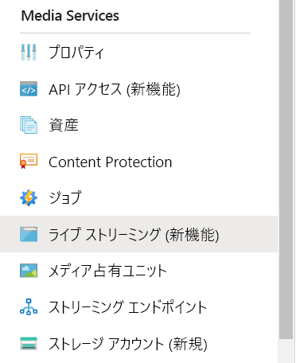
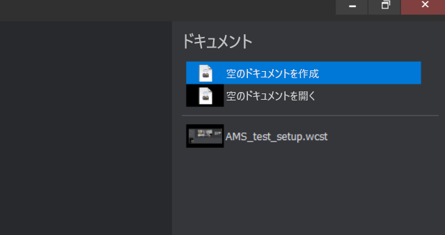
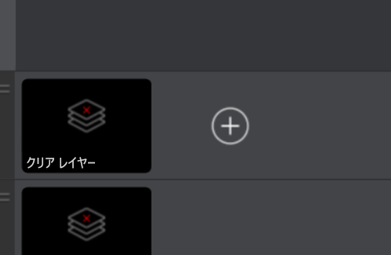
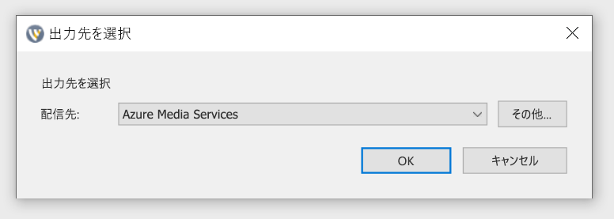
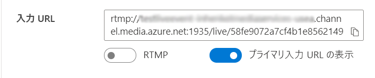
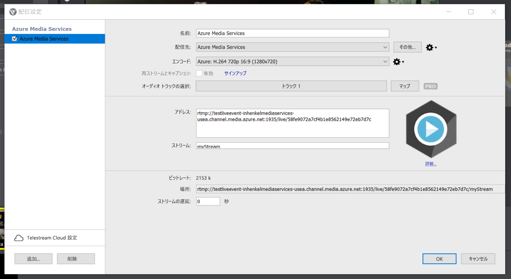
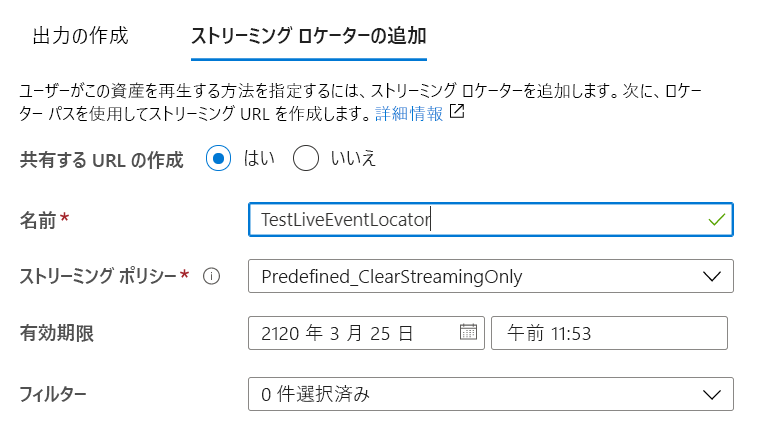
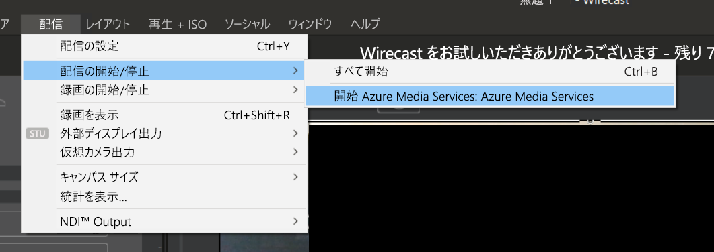

# Azure Media Services のライブ ストリームを作成する

このクイックスタートでは、Azure portal と Telestream Wirecast を使用して Azure Media Services のライブ ストリームを作成する方法について説明します。 ここでは、Azure サブスクリプションを所有し、かつ Azure Media Services アカウントを作成済みであることを前提としています。

Azure サブスクリプションをお持ちでない場合は、開始する前に [無料アカウント](https://azure.microsoft.com/free/) を作成してください。

## Azure portal にサインインする

Web ブラウザーを開き、[Microsoft Azure portal](https://portal.azure.com/) にアクセスします。 資格情報を入力してポータルにサインインします。 既定のビューはサービス ダッシュボードです。

このクイックスタートで取り上げる内容は次のとおりです。

- 無料試用版の Telestream Wirecast でオンプレミスのエンコーダーを設定する。
- ライブ ストリームを設定する。
- ライブ ストリームの出力を設定する。
- 既定のストリーミング エンドポイントを実行する。
- Azure Media Player を使用してライブ ストリームとオンデマンド出力を表示する。

わかりやすくするために、Wirecast、パススルー クラウド エンコーディング、RTMP では Azure Media Services のエンコーディング プリセットを使用します。

## Wirecast を使用してオンプレミスのエンコーダーを設定する

1. ご使用のオペレーティング システムに対応した Wirecast を [Telestream の Web サイト](https://www.telestream.net)からダウンロードしてインストールします。
1. アプリケーションを起動し、任意のメール アドレスを使用して製品登録を行います。 アプリケーションは開いたままにします。
1. 受信した電子メールで、自分のメール アドレスを確認します。 これでアプリケーションの無料試用が開始されます。
1. 推奨:開いているアプリケーション画面でビデオ チュートリアルを参照してください。

## Azure Media Services のライブ ストリームを設定する

1. ポータル内の Azure Media Services アカウントに移動し、 **[Media Services]** リストから **[ライブ ストリーミング (新機能)]** を選択します。

   
1. **[ライブ イベントの追加]** を選択して新しいライブ ストリーミング イベントを作成します。

   ![[ライブ イベントの追加] アイコン](media/live-events-wirecast-quickstart/add-live-event.png)
1. **[ライブ イベント名]** ボックスに新しいイベントの名前を入力します (例: *TestLiveEvent*)。

   ![[ライブ イベント名] ボックス](media/live-events-wirecast-quickstart/live-event-name.png)
1. **[説明]** ボックスにイベントの説明 (省略可) を入力します。
1. **[パススルー - クラウド エンコードなし]** を選択します。

   ![[クラウド エンコード] オプション](media/live-events-wirecast-quickstart/cloud-encoding.png)
1. **[RTMP]** オプションを選択します。
1. ライブ イベントの準備が完了する前に課金されないように、 **[ライブ イベントの開始]** で **[いいえ]** オプションが選択されていることを確認します (課金はライブ イベントが開始されたときに開始されます)。

   ![[ライブ イベントの開始] オプション](media/live-events-wirecast-quickstart/start-live-event-no.png)
1. **[確認と作成]** ボタンを選択して設定を確認します。
1. **[作成]** ボタンを選択してライブ イベントを作成します。 その後、元のライブ イベント リストが表示されます。
1. 先ほど作成したライブ イベントへのリンクを選択します。 イベントが停止していることに注目します。
1. このページをブラウザーで開いたままにします。 これは後で使用します。

## Wirecast Studio を使用してライブ ストリームを設定する

1. Wirecast アプリケーションで、メイン メニューから **[Create Empty Document]\(空のドキュメントの作成\)** を選択し、 **[Continue]\(続行\)** を選択します。

   
1. **Wirecast のレイヤー**領域で、最初のレイヤーにマウス ポインターを合わせます。  表示された **[Add]\(追加\)** アイコンを選択し、ストリーム配信するビデオ入力を選択します。

   

   **[Master Layer 1]\(マスター レイヤー 1\)** ダイアログ ボックスが表示されます。
1. メニューから **[Video Capture]\(ビデオ キャプチャ\)** を選択し、使用したいカメラを選択します。

   

   カメラからのビューがプレビュー領域に表示されます。
1. **Wirecast のレイヤー**領域で、2 つ目のレイヤーにマウス ポインターを合わせます。 表示された **[Add]\(追加\)** アイコンを選択し、ストリーム配信するオーディオ入力を選択します。 **[Master Layer 2]\(マスター レイヤー 2\)** ダイアログ ボックスが表示されます。
1. メニューから **[Audio capture]\(オーディオ キャプチャ\)** を選択し、使用したいオーディオ入力を選択します。

   
1. メイン メニューから **[Output settings]\(出力設定\)** を選択します。 **[Select an Output Destination]\(出力先を選択\)** ダイアログ ボックスが表示されます。
1. **[Destination]\(出力先\)** ドロップダウン リストから **[Azure Media Services]** を選択します。 Azure Media Services の出力設定は、その "*ほとんど*" が自動入力されます。

   

次の手順では、ブラウザーで Azure Media Services に戻り、入力 URL をコピーして出力設定に入力します。

1. ポータルの Azure Media Services ページで、 **[開始]** を選択してライブ ストリーム イベントを開始します (この時点で課金が開始されます)。

   ![[開始] アイコン](media/live-events-wirecast-quickstart/start.png)
2. **セキュリティ保護またはセキュリティ保護なし**のトグルを、 **[セキュリティ保護なし]** に設定します。 これでプロトコルが RTMPS ではなく RTMP に設定されます。
3. **[入力 URL]** ボックスの URL をクリップボードにコピーします。

   
4. Wirecast アプリケーションに切り替えて、出力設定の **[Address]\(アドレス\)** ボックスに**入力 URL** を貼り付けます。

   
5. **[OK]** を選択します。

## 出力を設定する

ここでは出力を設定し、ライブ ストリームのレコーディングを保存できるようにします。  

> [!NOTE]
> この出力をストリーム配信するには、ストリーミング エンドポイントが実行されている必要があります。 この後の「[既定のストリーミング エンドポイントを実行する](#run-the-default-streaming-endpoint)」セクションを参照してください。

1. **出力**ビデオ ビューアーの下にある **[Create outputs]\(出力の作成\)** リンクを選択します。
1. 必要に応じて、 **[名前]** ボックスで出力の名前を編集して、後で見つけやすいよう、わかりやすい名前に変更します。
   
   ![[出力名] ボックス](media/live-events-wirecast-quickstart/output-name.png)
1. この時点では、その他のボックスはすべてそのままにします。
1. **[次へ]** を選択してストリーミング ロケーターを追加します。
1. 必要に応じて、ロケーターの名前をわかりやすい名前に変更します。
   
   
1. この画面上の他の内容はすべて、そのままにしておきます。
1. **［作成］** を選択します

## 配信を開始する

1. Wirecast のメイン メニューから、 **[出力]**  >  **[Start / Stop broadcasting]\(配信の開始/停止\)**  >  **[Start Azure Media Services: Azure Media Services]\(Azure Media Services の開始: Azure Media Services\)** の順に選択します。

   

   ストリームがライブ イベントに送信されると、Azure Media Services のライブ イベント ページにあるビデオ プレーヤーに Wirecast の**ライブ** ウィンドウが表示されます。

1. プレビュー ウィンドウの **[Go]\(開始\)** ボタンを選択して、Wirecast のレイヤー用に選択したビデオとオーディオの配信を開始します。

   ![Wirecast の [Go]\(開始\) ボタン](media/live-events-wirecast-quickstart/go-button.png)

   > [!TIP]
   > エラーが発生した場合は、プレーヤーの上にある **[Reload player]\(プレーヤーを再度読み込む\)** リンクを選択して、プレーヤーを再度読み込んでみてください。

## 既定のストリーミング エンドポイントを実行する

1. Media Services リストで **[ストリーミング エンドポイント]** を選択します。

   ![[ストリーミング エンドポイント] メニュー項目](media/live-events-wirecast-quickstart/streaming-endpoints.png)
1. 既定のストリーミング エンドポイントの状態が "停止" であれば、それを選択します。 そのエンドポイントのページが表示されます。
1. **[スタート]** を選択します。
   
   ![ストリーミング エンドポイントの [開始] ボタン](media/live-events-wirecast-quickstart/start.png)

## Azure Media Player を使用して出力配信を再生する

1. **出力**ビデオ プレーヤーの下にあるストリーミング URL をコピーします。
1. Web ブラウザーで、[Azure Media Player のデモ](https://ampdemo.azureedge.net/azuremediaplayer.html)を開きます。
1. Azure Media Player の **[URL]** ボックスにストリーミング URL を貼り付けます。
1. **[Update Player]\(プレーヤーの更新\)** ボタンを選択します。
1. ビデオの**再生**アイコンを選択すると、ライブ ストリームが表示されます。

## 配信を停止する

十分な量のコンテンツをストリーム配信したと思ったら、配信を停止します。

1. Wirecast の **[Broadcast]\(配信\)** ボタンを選択します。 これで Wirecast からの配信が停止します。
1. ポータルで **[停止]** を選択します。 ライブ ストリームが停止されるという警告メッセージが表示されますが、この時点で出力はオンデマンド資産になります。
1. 警告メッセージで **[停止]** を選択します。 ライブ ストリームが利用できなくなったため、Azure Media Player でエラーが表示されます。

## Azure Media Player を使用してオンデマンド出力を再生する

ストリーミング エンドポイントが実行されている間は、作成した出力をオンデマンド ストリーミングに使用できます。

1. Media Services リストに移動し、 **[資産]** を選択します。
1. 先ほど作成したイベント出力を探し、その資産へのリンクを選択します。 資産の出力ページが表示されます。
1. 資産のビデオ プレーヤーの下にあるストリーミング URL をコピーします。
1. ブラウザーで Azure Media Player に戻り、ストリーミング URL を [URL] ボックスに貼り付けます。
1. **[Update Player]\(プレーヤーの更新\)** を選択します。
1. ビデオの**再生**アイコンを選択すると、オンデマンド資産が表示されます。

## リソースをクリーンアップする

> [!IMPORTANT]
> サービスを停止してください。 このクイックスタートの手順が完了したら、ライブ イベントとストリーミング エンドポイントを必ず停止してください。そうしないと、実行したままの時間分について課金されることになります。 ライブ イベントを停止するには、「[配信を停止する](#stop-the-broadcast)」の手順 2 と 3 を参照してください。

ストリーミング エンドポイントを停止するには、次の手順を実行します。

1. Media Services リストから **[ストリーミング エンドポイント]** を選択します。
2. 先ほど開始した既定のストリーミング エンドポイントを選択します。 エンドポイントのページが表示されます。
3. **[停止]** を選択します。

> [!TIP]
> このイベントの資産を保持する必要がない場合は、ストレージに対する課金が発生しないように必ず資産を削除してください。

## 次のステップ
> [!div class="nextstepaction"]
> [Media Services のライブ イベントとライブ出力](./live-events-outputs-concept.md)
