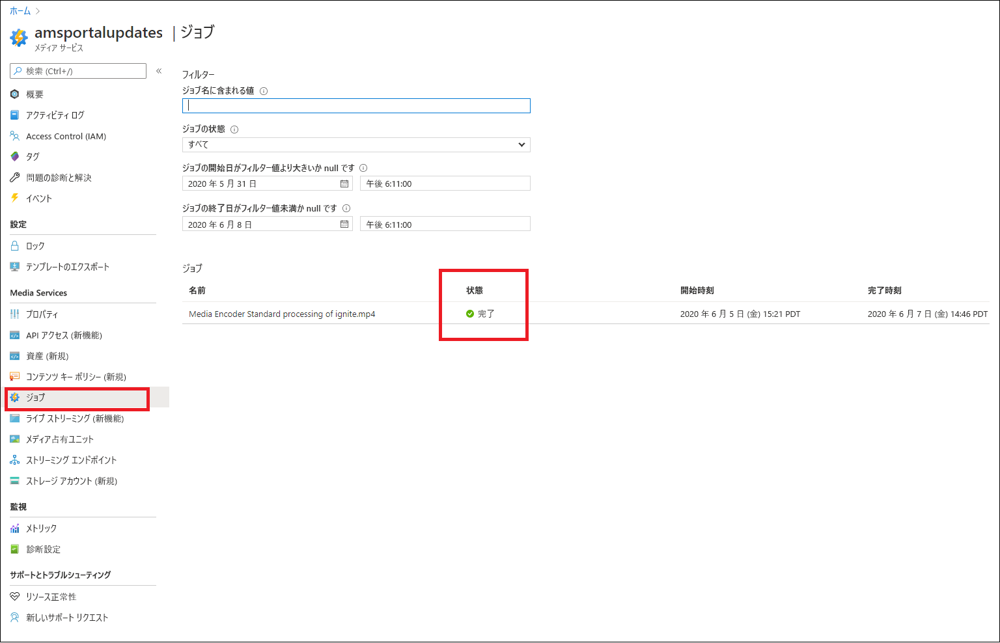
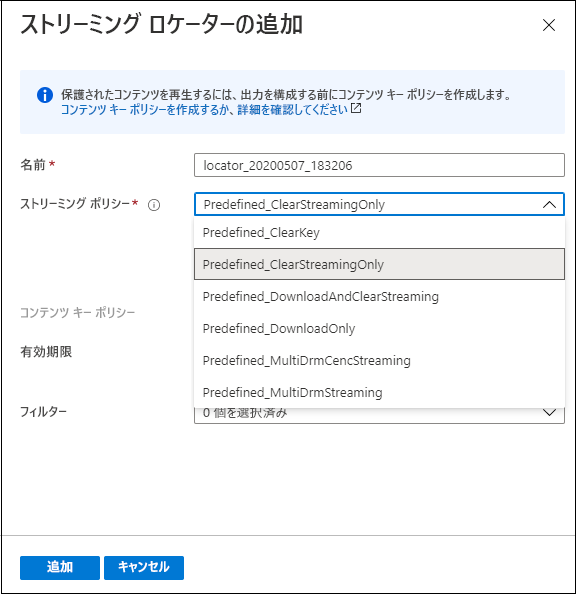

# クイック スタート:ポータルでコンテンツをアップロード、エンコード、およびストリーム配信する

[!INCLUDE [media services api v3 logo](./includes/v3-hr.md)]

このクイックスタートでは、Azure portal で Azure Media Services を使用してコンテンツをアップロード、エンコード、およびストリーム配信する方法を示します。
  
## 概要

* Azure でメディア コンテンツの管理、暗号化、エンコード、分析、およびストリーミングを開始するには、Media Services アカウントを作成し、高品質のデジタル メディア ファイルを **資産** にアップロードする必要があります。 
    
    > [!NOTE]
    > ビデオが以前に Media Services v3 API を使用して Media Services アカウントにアップロードされていた場合、またはコンテンツがライブ出力に基づいて生成された場合、Azure portal に **[エンコード]** 、 **[分析]** 、または **[暗号化]** ボタンは表示されません。 これらのタスクを実行するには、Media Services v3 API シリーズを使用してください。

    次の項目を確認してください。 

  * [クラウドのアップロードとストレージ](storage-account-concept.md)
  * [アセットの概念](assets-concept.md)
* 高品質のデジタル メディア ファイルを資産 (入力資産) にアップロードしたら、それを処理 (エンコードまたは分析) できます。 処理されたコンテンツは別の資産 (出力資産) に渡されます。 
    * アップロードしたファイルを、さまざまなブラウザーおよびデバイスで再生できる形式に[エンコード](encoding-concept.md)します。
    * アップロードしたファイルを[分析](analyzing-video-audio-files-concept.md)します。 

        現在、Azure portal を使用して、TTML および WebVTT クローズド キャプション ファイルを生成することができます。 これらの形式のファイルを使用して、聴覚障がいを持つユーザーがオーディオ ファイルとビデオ ファイルにアクセスできるようにします。 また、コンテンツからキーワードを抽出することもできます。

        ビデオおよびオーディオ ファイルから分析情報を抽出できるリッチなエクスペリエンスを実現するには、Media Services v3 プリセットを使用します (「[チュートリアル: Media Services v3 を使用してビデオを分析する](analyze-videos-tutorial-with-api.md)」を参照してください)。  より詳細な分析情報が必要な場合は [Video Indexer](../video-indexer/index.yml) を直接使用します。    
* コンテンツが処理されると、メディア コンテンツをクライアント プレーヤーに配信できます。 出力資産内のビデオをクライアントが再生できるようにするには、**ストリーミング ロケーター** を作成する必要があります。 **ストリーミング ロケーター** を作成するときは、**ストリーミング ポリシー** を指定する必要があります。 **ストリーミング ポリシー** を使用して、**ストリーミング ロケーター** のためのストリーミング プロトコルと暗号化オプション (該当する場合) を定義できます。
    
    レビュー:

    * [ストリーミング ロケーター](streaming-locators-concept.md)
    * [ストリーミング ポリシー](streaming-policy-concept.md)
    * [パッケージとデリバリー](dynamic-packaging-overview.md)
    * [フィルター](filters-concept.md)
* Advanced Encryption Standard (AES-128) または次の 3 つの主要な DRM システムのいずれかを使用して暗号化することにより、コンテンツを保護できます: コンテンツを配信できます。 コンテンツ保護を構成する方法については、[Azure portal を使用したコンテンツの暗号化](encrypt-content-quickstart.md)に関するクイックスタートに説明されています。
        
## 前提条件

[!INCLUDE [quickstarts-free-trial-note](../../../includes/quickstarts-free-trial-note.md)]

[Media Services アカウントを作成する](create-account-howto.md)

## アップロード

1. [Azure Portal](https://portal.azure.com/) にサインインします。
1. お使いの Media Services アカウントを見つけてクリックします。
1. **[資産 (新規)]** を選択します。
1. ウィンドウの上部にある **[アップロード]** を押します。 
1. アップロードするファイルをドラッグ アンド ドロップするか、参照します。

対象の資産ウィンドウに移動すると、新しい資産が一覧に追加されていることがわかります。

![Azure portal のスクリーンショット。[資産 (新規)] を選択して開いた [資産] ウィンドウと、[アップロード] ボタンを選択して追加した新しい資産が表示されています。](./media/manage-assets-quickstart/upload.png)

## エンコード

1. **[資産 (新規)]** を選択します。
1. (前の手順で追加した) 新しい資産を選択します。
1. ウィンドウの上部にある **[エンコード]** をクリックします。

    このボタンを押すと、エンコード ジョブが開始されます。 正常に完了すると、エンコードされたコンテンツを含む出力資産が生成されます。

対象の資産ウィンドウに移動すると、出力資産が一覧に追加されていることがわかります。

![Azure portal の [資産] ウィンドウのスクリーンショット。ignite.mp4 Media Encoded Standard encoded という資産が資産一覧に追加されています。](./media/manage-assets-quickstart/encode.png)

## ジョブの進行状況を監視する

ジョブの状態を表示するには、 **[ジョブ]** に移動します。 ジョブには通常、予定、Queued (処理待ち)、処理中、Finished (終了) (最終状態) という状態があります。 ジョブでエラーが発生すると、エラー状態になります。

## 発行およびストリーム配信

資産を発行するには、ストリーミング ロケーターを対象の資産に追加する必要があります。

### ストリーミング ロケーター 

1. **[Streaming locator]\(ストリーミング ロケーター\)** セクションで、 **[Add a streaming locator]\(+ ストリーミング ロケーターの追加\)** を押します。
    これにより資産が発行され、ストリーミング URL が生成されます。

    > [!NOTE]
    > ストリームを暗号化する場合は、コンテンツキー ポリシーを作成し、ストリーミング ロケーターに設定する必要があります。 詳細については、[Azure portal を使用したコンテンツの暗号化](encrypt-content-quickstart.md)に関するページを参照してください。
1. **[Add streaming locator]\(ストリーミング ロケーターの追加\)** ウィンドウで、定義済みのストリーミング ポリシーの 1 つを選択します。 詳細については、「[ストリーミング ポリシー](streaming-policy-concept.md)」を参照してください

    

資産が発行されたら、ポータルで直接ストリーム配信することができます。 

![[再生]](./media/manage-assets-quickstart/publish.png)

または、ストリーミング URL をコピーし、クライアント プレーヤーで使用します。

> [!NOTE]
> [ストリーミング エンドポイント](streaming-endpoint-concept.md)が実行されていることを確認します。 Media Service アカウントを初めて作成すると、既定のストリーミング エンドポイントが作成されます。これは停止状態になっているため、コンテンツをストリーム配信する前に開始する必要があります。 ストリーミング エンドポイントが実行状態にある場合にのみ課金されます。

## リソースをクリーンアップする

これから他のクイックスタートに取り組む場合は、作成したリソースをそのまま残しておく必要があります。 それ以外の場合は、Azure portal にアクセスして、ご利用のリソース グループに移動し、このクイックスタートで使用したリソース グループを選択して、それらのリソースをすべて削除してください。

## 次のステップ

[ポータルを使用してコンテンツを暗号化する](encrypt-content-quickstart.md)
