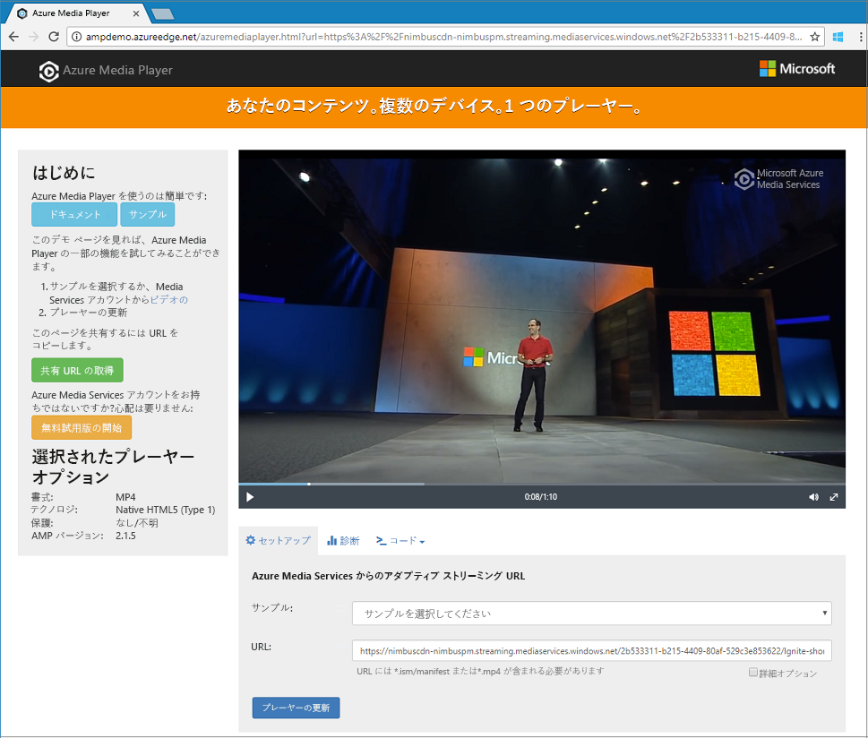

# <a name="quickstart-stream-video-files---net"></a>クイック スタート: 動画ファイルをストリーム配信する - .NET

> [!NOTE]
> Azure Media Services の最新バージョンはプレビュー段階であり、v3 と呼ばれることがあります。 v3 API を使い始めるには、このクイック スタートの説明に従って、新しい Azure Media Services アカウントを作成する必要があります。 

このクイック スタートは、Azure Media Services を使うとさまざまなブラウザーおよびデバイスへの動画のストリーム配信を簡単に始められることを示します。 このトピックのサンプルでは、HTTPS URL を使用してアクセスできるようにするコンテンツをエンコードします。 

このクイック スタートを最後まで行うと、動画をストリーム配信できるようになります。  



[!INCLUDE [quickstarts-free-trial-note](../../../includes/quickstarts-free-trial-note.md)]

## <a name="prerequisites"></a>前提条件

Visual Studio がインストールされていない場合は、[Visual Studio Community 2017](https://www.visualstudio.com/thank-you-downloading-visual-studio/?sku=Community&rel=15) を入手できます。

## <a name="download-the-sample"></a>サンプルのダウンロード

次のコマンドを使って、ストリーム配信の .NET サンプルが含まれる GitHub リポジトリを、お使いのコンピューターに複製します。  

 ```bash
 git clone http://github.com/Azure-Samples/media-services-v3-dotnet-quickstarts.git
 ```

サンプルは、[EncodeAndStreamFiles](https://github.com/Azure-Samples/media-services-v3-dotnet-quickstarts/tree/master/AMSV3Quickstarts/EncodeAndStreamFiles) フォルダーにあります。

サンプルは、次のアクションを実行します。

1. 変換を作成します (最初に、指定された変換が存在するかどうかを確認します)。 
2. エンコード ジョブの出力として使用される出力アセットを作成します。
3. HTTPS の URL に基づいてジョブの入力を作成します。
4. 前に作成された入力と出力を使用してエンコード ジョブを送信します。
5. ジョブの状態を確認します。
6. StreamingLocator を作成します。
7. ストリーミング URL を作成します。

サンプル内の各関数の機能について詳しくは、[このソース ファイル](https://github.com/Azure-Samples/media-services-v3-dotnet-quickstarts/blob/master/AMSV3Quickstarts/EncodeAndStreamFiles/Program.cs)のコードを調べて、コメントを参照してください。

## <a name="log-in-to-azure"></a>Azure にログインする

[Azure Portal](http://portal.azure.com) にログインします。

[!INCLUDE [cloud-shell-try-it.md](../../../includes/cloud-shell-try-it.md)]

[!INCLUDE [media-services-cli-create-v3-account-include](../../../includes/media-services-cli-create-v3-account-include.md)]

[!INCLUDE [media-services-v3-cli-access-api-include](../../../includes/media-services-v3-cli-access-api-include.md)]

## <a name="run-the-sample-app"></a>サンプル アプリを実行する

アプリを実行すると、別のプロトコルでビデオを再生するために使用できる URL が表示されます。 

1. Ctrl + F5 キーを押して、*EncodeAndStreamFiles* アプリケーションを実行します。
2. Apple の **HLS** プロトコル (末尾が *manifest(format=m3u8-aapl)*) を選び、コンソールからストリーム配信 URL をコピーします。


サンプルの[ソース コード](https://github.com/Azure-Samples/media-services-v3-dotnet-quickstarts/blob/master/AMSV3Quickstarts/EncodeAndStreamFiles/Program.cs)では、URL の作成方法を確認できます。 URL を作成するには、ストリーミング エンドポイントのホスト名とストリーミング ロケーター パスを連結する必要があります。  

## <a name="test-with-azure-media-player"></a>Azure Media Player でテストする

ストリーム配信をテストするため、この記事では Azure Media Player を使います。 

> [!NOTE]
> プレーヤーが HTTPS サイトでホストされている場合は、忘れずに URL を "https" に更新してください。

1. Web ブラウザーを開いて、[https://aka.ms/azuremediaplayer/](https://aka.ms/azuremediaplayer/) にアクセスします。
2. **[URL:]** ボックスに、アプリケーションを実行したときに取得したストリーム配信 URL 値のいずれかを貼り付けます。 
3. **[Update Player]\(プレーヤーの更新\)** をクリックします。

Azure Media Player はテストには使用できますが、運用環境では使わないでください。 

## <a name="clean-up-resources"></a>リソースのクリーンアップ

このクイック スタートで作成した Media Services アカウントとストレージ アカウントも含め、リソース グループ内のどのリソースも必要なくなった場合は、リソース グループを削除します。 **CloudShell** ツールを使うことができます。

**CloudShell** で、次のコマンドを実行します。

```azurecli-interactive
az group delete --name amsResourceGroup
```

## <a name="examine-the-code"></a>コードを確認する

サンプル内の各関数の機能について詳しくは、[このソース ファイル](https://github.com/Azure-Samples/media-services-v3-dotnet-quickstarts/blob/master/AMSV3Quickstarts/EncodeAndStreamFiles/Program.cs)のコードを調べて、コメントを参照してください。

[ファイルのアップロード、エンコード、ストリーム配信](stream-files-tutorial-with-api.md)に関するチュートリアルでは、より高度なストリーム配信の例と詳しい説明が提供されています。 

## <a name="multithreading"></a>マルチスレッド

Azure Media Services v3 SDK は、スレッドセーフではありません。 マルチスレッド アプリケーションで使うときは、スレッドごとに新しい AzureMediaServicesClient オブジェクトを生成する必要があります。

## <a name="next-steps"></a>次の手順

> [!div class="nextstepaction"]
> [チュートリアル: ファイルのアップロード、エンコード、ストリーム配信](stream-files-tutorial-with-api.md)
