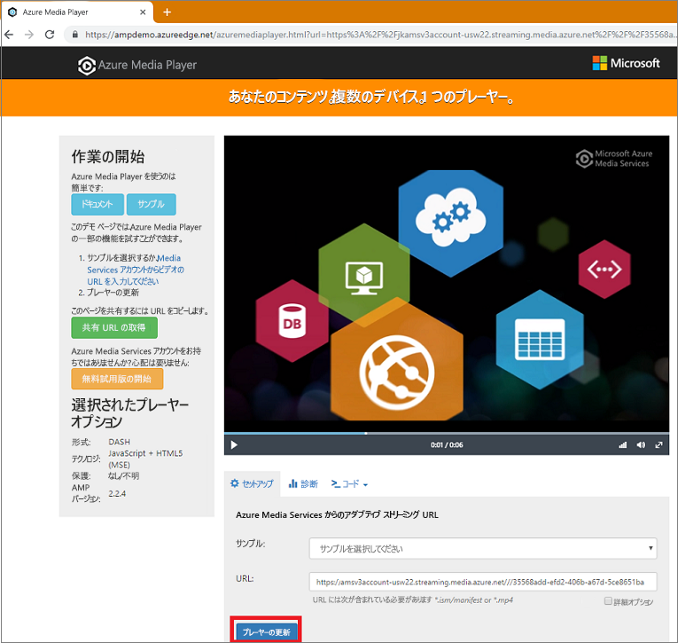

# <a name="how-to-encode-and-stream-video-files-with-nodejs"></a>Node.JS を使用してビデオ ファイルをエンコードし、ストリーム配信する方法

[!INCLUDE [media services api v3 logo](./includes/v3-hr.md)]

このクイック スタートでは、Azure Media Services を利用すると、さまざまなブラウザーおよびデバイスを対象とした動画のエンコードとストリーム配信の開始がいかに容易であるかを示します。 HTTPS URL、SAS URL、または Azure Blob Storage 内に存在するファイルへのパスを使って入力ビデオ ファイルを指定できます。

このクイックスタートを終えると、次の知識が得られます。

- Node.JS を使用してエンコードする方法
- Node.JS を使用してストリーム配信する方法
- Node.JS を使用して HTTPS URL からファイルをアップロードする方法
- Node.JS を使用して HLS または DASH クライアント プレーヤーを使用する方法

この記事のサンプルでは、HTTPS URL を使用してアクセスできるようにするコンテンツをエンコードします。 現在、AMS v3では、HTTPS URLを介したチャンク転送のエンコーディングはサポートされていません。



[!INCLUDE [quickstarts-free-trial-note](../../../includes/quickstarts-free-trial-note.md)]

## <a name="prerequisites"></a>前提条件

- [Node.js](https://nodejs.org/en/download/)
- [Media Services アカウントを作成する](./create-account-howto.md)<br/>Media Services アカウント名、ストレージ名、およびリソース名として使用した値を覚えておいてください。
- 「[Azure CLI で Azure Media Services API にアクセスする](./access-api-howto.md)」の手順に従い、資格情報を保存します。 API にアクセスするために必要となります。
- Node.js クライアント SDK の使い方を把握するために、あらかじめ [Node.js を使用した構成と接続](./configure-connect-nodejs-howto.md)の攻略ガイドを参照しておいてください。

## <a name="download-and-configure-the-sample"></a>サンプルをダウンロードして構成する

次のコマンドを使って、ストリーム配信の Node.js サンプルが含まれる GitHub リポジトリを、お使いのマシンに複製します。  

 ```bash
 git clone https://github.com/Azure-Samples/media-services-v3-node-tutorials.git
 ```

サンプルは、[StreamFilesSample](https://github.com/Azure-Samples/media-services-v3-node-tutorials/tree/master/AMSv3Samples/StreamFilesSample) フォルダーにあります。

ダウンロードしたプロジェクトの [index.ts](https://github.com/Azure-Samples/media-services-v3-node-tutorials/blob/master/AMSv3Samples/StreamFilesSample/index.ts) を開きます。 [API へのアクセス](./access-api-howto.md)に関するページから取得した値と資格情報でルート フォルダー内の *sample.env* ファイルを更新します。 *sample.env* ファイルの名前を *.env* (拡張子のみ) に変更します。

サンプルは、次のアクションを実行します。

1. [コンテンツに対応したエンコードのプリセット](./content-aware-encoding.md)を使用して **変換** を作成します。 最初に、指定した変換が存在するかどうかが確認されます。
1. エンコード **ジョブ** の出力を格納する際に使用される出力 **アセット** を作成します
1. Storage Blob SDK を使用して、必要に応じてローカル ファイルをアップロードします
1. アップロードしたファイルまたは HTTPS URL に基づく **ジョブ** の入力を作成します
1. 前に作成した入力と出力を使用してエンコード **ジョブ** を送信します
1. ジョブの状態を確認します
1. エンコード ジョブの出力をローカル フォルダーにダウンロードします
1. プレーヤーで使用する **ストリーミング ロケーター** を作成します
1. HLS と DASH のストリーミング URL を作成します
1. プレーヤー アプリケーション (Azure Media Player) でコンテンツを再生します

## <a name="run-the-sample"></a>サンプルを実行する

1. このアプリケーションは、エンコードされたファイルをダウンロードします。 出力ファイルを保存するフォルダーを作成し、[index.ts](https://github.com/Azure-Samples/media-services-v3-node-tutorials/blob/master/AMSv3Samples/StreamFilesSample/index.js#L59) ファイル内の **outputFolder** 変数の値を更新します。 既定では "Temp" に設定されています。
1. **コマンド プロンプト** を開いて、サンプルのディレクトリに移動します。
1. AMSv3Samples フォルダーに移動します。

    ```bash
    cd AMSv3Samples
    ```

1. *packages.json* ファイルで使用されているパッケージをインストールします。

    ```bash
    npm install 
    ```

1. *StreamFilesSample* フォルダーに移動します。

    ```bash
    cd StreamFilesSample
    ```

1. *AMSv3Samples* フォルダーから Visual Studio Code を起動します ( *.vscode* フォルダーと *tsconfig.json* ファイルが格納されているフォルダーから起動するために必要)。

    ```bash
    cd ..
    code .
    ```

*StreamFilesSample* のフォルダーを開き、Visual Studio Code エディターで *index.ts* ファイルを開きます。
*index.ts* ファイルで F5 キーを押してデバッガーを起動します。

## <a name="test-with-azure-media-player"></a>Azure Media Player でテストする

Azure Media Player を使用してストリームをテストします。 Shaka プレーヤー、HLS.js、Dash.js など、HLS または DASH に準拠している任意のプレーヤーを使用することもできます。

サンプルで生成されたリンクをクリックすると、あらかじめ読み込まれた DASH マニフェストで AMP プレーヤーを起動できるはずです。

> [!NOTE]
> プレーヤーが HTTPS サイトでホストされている場合は、忘れずに URL を "https" に更新してください。

1. Web ブラウザーを開いて、[https://aka.ms/azuremediaplayer/](https://aka.ms/azuremediaplayer/) にアクセスします。
2. アプリケーションを実行した際に取得したいずれかのストリーミング URL 値を **[URL]** ボックスに貼り付けます。この URL は、HLS、Dash、Smooth のいずれかの形式で貼り付けることができます。ご使用のデバイスで再生できるよう、Azure Media Player が自動的に適切なストリーミング プロトコルに切り替わります。
3. **[Update Player]\(プレーヤーの更新\)** をクリックします。

Azure Media Player はテストには使用できますが、運用環境では使わないでください。

## <a name="clean-up-resources"></a>リソースをクリーンアップする

このチュートリアルで作成した Media Services アカウントとストレージ アカウントも含め、リソース グループ内のどのリソースも必要なくなった場合は、リソース グループを削除します。

次の CLI コマンドを実行します。

```azurecli
az group delete --name amsResourceGroup
```

## <a name="more-developer-documentation-for-nodejs-on-azure"></a>Azure での Node.js に関するその他の開発者向けドキュメント

- [JavaScript および Node.js 開発者向けの Azure](/azure/developer/javascript/)
- [@azure/azure-sdk-for-js GitHub リポジトリにおける Media Services のソース コード](https://github.com/Azure/azure-sdk-for-js/tree/master/sdk/mediaservices/arm-mediaservices)
- [Node.js 開発者向けの Azure パッケージのドキュメント](/javascript/api/overview/azure/)

## <a name="see-also"></a>関連項目

- [ジョブ エラー コード](/rest/api/media/jobs/get#joberrorcode)。
- [npm install @azure/arm-mediaservices](https://www.npmjs.com/package/@azure/arm-mediaservices)
- [JavaScript および Node.js 開発者向けの Azure](/azure/developer/javascript/)
- [@azure/azure-sdk-for-js リポジトリにおける Media Services のソース コード](https://github.com/Azure/azure-sdk-for-js/tree/master/sdk/mediaservices/arm-mediaservices)

## <a name="next-steps"></a>次のステップ

> [Media Services の概念](concepts-overview.md)
