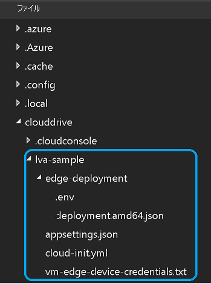

# <a name="tutorial-continuous-video-recording-to-the-cloud-and-playback-from-the-cloud"></a>チュートリアル:クラウドでの継続的なビデオ記録と再生

このチュートリアルでは、Azure Live Video Analytics on Azure IoT Edge を使用して、クラウドへの[継続的なビデオ記録](continuous-video-recording-concept.md) (CVR) を実行し、Azure Media Services を使用してそのビデオの任意の部分をストリーム配信する方法について説明します。 この機能は、安全性やコンプライアンスなどのシナリオで、カメラから撮影した映像のアーカイブを数日または数週間保持する必要がある場合に便利です。 

このチュートリアルでは、次のことについて説明します。

> [!div class="checklist"]
> * 関連リソースを設定する。
> * CVR を実行するコードを確認する。
> * サンプル コードを実行する。
> * 結果を確認し、ビデオを表示する。

[!INCLUDE [quickstarts-free-trial-note](../../../includes/quickstarts-free-trial-note.md)]

## <a name="suggested-pre-reading"></a>先に読んでおくことが推奨される記事  

始める前に、以下の記事をお読みください。

* [IoT Edge の Live Video Analytics (プレビュー)](overview.md)
* [Live Video Analytics on IoT Edge の用語](terminology.md)
* [メディア グラフの概念](media-graph-concept.md) 
* [継続的なビデオ記録のシナリオ](continuous-video-recording-concept.md)

## <a name="prerequisites"></a>前提条件

このチュートリアルの前提条件は次のとおりです。

* [Visual Studio Code](https://code.visualstudio.com/)。[Azure IoT Tools](https://marketplace.visualstudio.com/items?itemName=vsciot-vscode.azure-iot-tools) および [C#](https://marketplace.visualstudio.com/items?itemName=ms-dotnettools.csharp) 拡張機能と共に開発用マシンにインストールされている必要があります。

    > [!TIP]
    > Docker のインストールを求められる場合があります。 このメッセージは無視してください。
* 開発マシンにインストールされた [.NET Core 3.1 SDK](https://dotnet.microsoft.com/download/dotnet-core/thank-you/sdk-3.1.201-windows-x64-installer)。
* [Live Video Analytics リソース設定スクリプト](https://github.com/Azure/live-video-analytics/tree/master/edge/setup)の完了。

これらの手順を完了すると、以下の関連する Azure リソースが Azure サブスクリプションにデプロイされます。

* Azure IoT Hub
* Azure ストレージ アカウント
* Azure Media Services アカウント
* Azure 上の Linux VM ([IoT Edge ランタイム](../../iot-edge/how-to-install-iot-edge.md)がインストール済み)

> [!TIP]
> 作成された Azure リソースで問題が発生した場合は、 **[トラブルシューティング ガイド](troubleshoot-how-to.md#common-error-resolutions)** を参照して、よく発生する問題を解決してください。

## <a name="concepts"></a>概念

[メディア グラフの概念](media-graph-concept.md)に関するページで説明されているように、メディア グラフでは次のことを定義できます。

- メディアのキャプチャ元。
- それが処理される方法。
- 結果の配信先。 
 
 CVR を実現するには、RTSP 対応カメラからビデオをキャプチャし、それを [Azure Media Services 資産](terminology.md#asset)に継続的に記録する必要があります。 次の図は、そのメディア グラフをグラフィカルに表したものです。

> [!div class="mx-imgBorder"]
> :::image type="content" source="./media/continuous-video-recording-tutorial/continuous-video-recording-overview.svg" alt-text="メディア グラフ":::

このチュートリアルでは、[Live555 Media Server](https://github.com/Azure/live-video-analytics/tree/master/utilities/rtspsim-live555) を使用して構築された 1 つのエッジ モジュールを使用して、RTSP カメラをシミュレートします。 メディア グラフ内で [RTSP ソース](media-graph-concept.md#rtsp-source) ノードを使用してライブ フィードを取得し、そのビデオを[資産シンク ノード](media-graph-concept.md#asset-sink)に送信します。これにより、ビデオが資産に記録されます。 このチュートリアルで使用するビデオは、[幹線道路の交差点のサンプル ビデオ](https://lvamedia.blob.core.windows.net/public/camera-300s.mkv)です。
<iframe src="https://www.microsoft.com/en-us/videoplayer/embed/RE4LTY4" width="640" height="320" allowFullScreen="true" frameBorder="0"></iframe>
> [!VIDEO https://www.microsoft.com/en-us/videoplayer/embed/RE4LTY4]

## <a name="set-up-your-development-environment"></a>開発環境を設定する

開始する前に、[前提条件](#prerequisites)の 3 番目の条件が完了していることを確認してください。 リソース設定スクリプトが完了したら、中かっこを選択してフォルダー構造を展開します。 ~/clouddrive/lva-sample ディレクトリに、いくつかのファイルが作成されていることがわかります。



このチュートリアルで注目するのは、次のファイルです。

* **~/clouddrive/lva-sample/edge-deployment/.env**:Visual Studio Code がエッジ デバイスにモジュールをデプロイする際に使用するプロパティが格納されています。
* **~/clouddrive/lva-sample/appsettings.json**:サンプル コードを実行するために、Visual Studio Code によって使用されます。

これらのファイルは、以下の手順で必要になります。

1. GitHub リンク https://github.com/Azure-Samples/live-video-analytics-iot-edge-csharp からリポジトリをクローンします。
1. Visual Studio Code を起動して、リポジトリをダウンロードしたフォルダーを開きます。
1. Visual Studio Code で、src/cloud-to-device-console-app フォルダーに移動し、**appsettings.json** という名前のファイルを作成します。 このファイルには、プログラムを実行するために必要な設定が格納されています。
1. ~/clouddrive/lva-sample/appsettings.json ファイルの内容をコピーします。 このテキストは次のようになっています。
    ```
    {  
        "IoThubConnectionString" : "HostName=xxx.azure-devices.net;SharedAccessKeyName=iothubowner;SharedAccessKey=XXX",  
        "deviceId" : "lva-sample-device",  
        "moduleId" : "lvaEdge"  
    }
    ```
    IoT Hub 接続文字列を使用すると、Visual Studio Code を使用して Azure IoT Hub 経由でエッジ モジュールにコマンドを送信できます。
    
1. 次に、src/edge フォルダーに移動して、 **.env** という名前のファイルを作成します。
1. ~/clouddrive/lva-sample/edge-deployment/.env ファイルの内容をコピーします。 このテキストは次のようになっています。

    ```
    SUBSCRIPTION_ID="<Subscription ID>"  
    RESOURCE_GROUP="<Resource Group>"  
    AMS_ACCOUNT="<AMS Account ID>"  
    IOTHUB_CONNECTION_STRING="HostName=xxx.azure-devices.net;SharedAccessKeyName=iothubowner;SharedAccessKey=xxx"  
    AAD_TENANT_ID="<AAD Tenant ID>"  
    AAD_SERVICE_PRINCIPAL_ID="<AAD SERVICE_PRINCIPAL ID>"  
    AAD_SERVICE_PRINCIPAL_SECRET="<AAD SERVICE_PRINCIPAL ID>"  
    VIDEO_INPUT_FOLDER_ON_DEVICE="/home/lvaedgeuser/samples/input"  
    VIDEO_OUTPUT_FOLDER_ON_DEVICE="/var/media"  
    APPDATA_FOLDER_ON_DEVICE="/var/local/mediaservices"
    CONTAINER_REGISTRY_USERNAME_myacr="<your container registry username>"  
    CONTAINER_REGISTRY_PASSWORD_myacr="<your container registry username>"      
    ```

## <a name="examine-the-sample-files"></a>サンプル ファイルを詳しく調べる

Visual Studio Code で、src/edge/deployment.template.json を開きます。 このテンプレートでは、エッジ デバイス (Azure Linux VM) にデプロイするエッジ モジュールを定義します。 **modules** セクションには、次の名前の 2 つのエントリがあります。

* **lvaEdge**:これは Live Video Analytics on IoT Edge モジュールです。
* **rtspsim**:これは RTSP シミュレーターです。

次に、src/cloud-to-device-console-app フォルダーに移動します。 ここでは、作成した appsettings.json ファイルと、他のいくつかのファイルを確認できます。

* **c2d-console-app.csproj**:Visual Studio Code 用のプロジェクト ファイルです。
* **operations.json**:このファイルには、実行できるさまざまな操作がリストされています。
* **Program.cs** サンプル プログラム コードです。これは次のことを実行します。
    * アプリ設定を読み込みます。
    * Live Video Analytics on IoT Edge モジュールによって公開されているダイレクト メソッドを呼び出します。 このモジュールを使用して、その[ダイレクト メソッド](direct-methods.md)を呼び出すことで、ライブ ビデオ ストリームを分析できます。
    * プログラムからの出力を **[ターミナル]** ウィンドウで、またモジュールによって生成されたイベントを **[出力]** ウィンドウで詳しく調べることができるように一時停止します。
    * ダイレクト メソッドを呼び出して、リソースをクリーンアップします。

## <a name="generate-and-deploy-the-iot-edge-deployment-manifest"></a>IoT Edge の配置マニフェストを生成してデプロイする 

エッジ デバイスにデプロイされるモジュールとそれらのモジュールの構成設定は、配置マニフェストによって定義されます。 マニフェストをテンプレート ファイルから生成して、エッジ デバイスにデプロイするには、次の手順に従います。

1. Visual Studio Code を起動します。
1. 左下隅の **[Azure IoT Hub]** ペインの横にある **[その他のアクション]** アイコンを選択して、IoTHub 接続文字列を設定します。 src/cloud-to-device-console-app/appsettings.json ファイルからその文字列をコピーします。 

    
    > [!NOTE]
    > IoT ハブに使用する組み込みのエンドポイント情報を入力するよう求められる場合があります。 この情報を入手するには、Azure portal で IoT ハブに移動し、左側のナビゲーション ペインで **[組み込みのエンドポイント]** オプションを探します。 それをクリックし、 **[イベント ハブ互換エンドポイント]** セクションの **[イベント ハブ互換エンドポイント]** を探します。 ボックス内のテキストをコピーして使用します。 エンドポイントは次のようになります。  
        ```
        Endpoint=sb://iothub-ns-xxx.servicebus.windows.net/;SharedAccessKeyName=iothubowner;SharedAccessKey=XXX;EntityPath=<IoT Hub name>
        ```

1. src/edge/deployment.template.json ファイルを右クリックし、 **[Generate IoT Edge Deployment Manifest]\(IoT Edge 配置マニフェストの生成\)** を選択します。 Visual Studio Code は、.env ファイルの値を使用して、配置テンプレート ファイル内で見つかった変数を置き換えます。 このアクションにより、**deployment.amd64.json** という名前のマニフェスト ファイルが src/edge/config フォルダーに作成されます。

   
1. src/edge/config/deployment.amd64.json ファイルを右クリックし、 **[Create Deployment for Single Device]\(単一デバイスのデプロイの作成\)** を選択します。

   
1. その後、**IoT Hub デバイスを選択する** ように求められます。 ドロップダウン リストから lva-sample-device を選択します。
1. 30 秒ほど経過したら、左下のセクションで Azure IoT Hub を更新します。 エッジ デバイスに次のモジュールがデプロイされたことがわかります。
    * Live Video Analytics on IoT Edge (モジュール名 **lvaEdge**)
    * RTSP シミュレーター (モジュール名: **rtspsim**)
 
    

## <a name="prepare-to-monitor-the-modules"></a>モジュールの監視の準備をする 

Live Video Analytics on IoT Edge モジュールを使用して、ライブ ビデオ ストリームを記録すると、IoT Hub にイベントが送信されます。 それらのイベントを確認するには、次の手順に従います。

1. Visual Studio Code の [エクスプローラー] ペインを開き、左下隅にある **[Azure IoT Hub]** を探します。
1. **[デバイス]** ノードを展開します。
1. lva-sample-device ファイルを右クリックし、 **[組み込みイベント エンドポイントの監視を開始します]** を選択します。

    

    > [!NOTE]
    > IoT ハブに使用する組み込みのエンドポイント情報を入力するよう求められる場合があります。 この情報を入手するには、Azure portal で IoT ハブに移動し、左側のナビゲーション ペインで **[組み込みのエンドポイント]** オプションを探します。 それをクリックし、 **[イベント ハブ互換エンドポイント]** セクションの **[イベント ハブ互換エンドポイント]** を探します。 ボックス内のテキストをコピーして使用します。 エンドポイントは次のようになります。  
        ```
        Endpoint=sb://iothub-ns-xxx.servicebus.windows.net/;SharedAccessKeyName=iothubowner;SharedAccessKey=XXX;EntityPath=<IoT Hub name>
        ```

## <a name="run-the-program"></a>プログラムの実行 

1. Visual Studio Code で **[拡張機能]** タブを開き (または Ctrl + Shift + X キーを押し)、Azure IoT Hub を検索します。
1. マウスの右ボタンをクリックし、 **[拡張機能の設定]** を選択します。

    > [!div class="mx-imgBorder"]
    > :::image type="content" source="./media/run-program/extensions-tab.png" alt-text="拡張機能の設定":::
1. [Show Verbose Message]\(詳細メッセージの表示\) を検索して有効にします。

    > [!div class="mx-imgBorder"]
    > :::image type="content" source="./media/run-program/show-verbose-message.png" alt-text="詳細メッセージの表示":::
1. src/cloud-to-device-console-app/operations.js に移動します。
1. **GraphTopologySet** ノードで、次を編集します。

    `"topologyUrl" : "https://raw.githubusercontent.com/Azure/live-video-analytics/master/MediaGraph/topologies/cvr-asset/2.0/topology.json" `
1. 次に、**GraphInstanceSet** および **GraphTopologyDelete** のノードで、**topologyName** の値が、前のグラフ トポロジの **name** プロパティの値と一致していることを確認します。

    `"topologyName" : "CVRToAMSAsset"`  
1. ブラウザーでその[トポロジ](https://raw.githubusercontent.com/Azure/live-video-analytics/master/MediaGraph/topologies/cvr-asset/2.0/topology.json)を開き、assetNamePattern を確認します。 資産の名前を確実に一意にするために、operations.json ファイル内でグラフ インスタンスの名前を (既定値の "Sample-Graph-1" から) 変更することをお勧めします。

    `"assetNamePattern": "sampleAsset-${System.GraphTopologyName}-${System.GraphInstanceName}"`    
1. F5 キーを押して、デバッグ セッションを開始します。 **[ターミナル]** ウィンドウにいくつかのメッセージが出力されます。
1. operations.json ファイルは、GraphTopologyList および GraphInstanceList の呼び出しで開始されます。 前回のクイックスタートまたはチュートリアルの後に、リソースをクリーンアップした場合は、このアクションによって空のリストが返された後、一時停止して、以下のように **Enter** キーの入力待ち状態になります。

    ```
    --------------------------------------------------------------------------
    Executing operation GraphTopologyList
    -----------------------  Request: GraphTopologyList  --------------------------------------------------
    {
      "@apiVersion": "2.0"
    }
    ---------------  Response: GraphTopologyList - Status: 200  ---------------
    {
      "value": []
    }
    --------------------------------------------------------------------------
    Executing operation WaitForInput
    Press Enter to continue
    ```

1. **[ターミナル]** ウィンドウで **Enter** キーを押すと、次に示す一連のダイレクト メソッド呼び出しが実行されます。
   * 前の topologyUrl を使用した GraphTopologySet の呼び出し
   * 次の本文を使用した GraphInstanceSet の呼び出し
     
     ```
     {
       "@apiVersion": "2.0",
       "name": "Sample-Graph-1",
       "properties": {
         "topologyName": "CVRToAMSAsset",
         "description": "Sample graph description",
         "parameters": [
           {
             "name": "rtspUrl",
             "value": "rtsp://rtspsim:554/media/camera-300s.mkv"
           },
           {
             "name": "rtspUserName",
             "value": "testuser"
           },
           {
             "name": "rtspPassword",
             "value": "testpassword"
           }
         ]
       }
     }
     ```
   * グラフ インスタンスを起動し、ビデオのフローを開始する GraphInstanceActivate の呼び出し
   * グラフ インスタンスが実行状態であることを表示する GraphInstanceList の 2 回目の呼び出し 
1. **[ターミナル]** ウィンドウの出力が、今度は **[続行するには Enter キーを押してください]** というプロンプトで一時停止状態となります。 この時点では **Enter** キーは押さないでください。 上へスクロールして、呼び出したダイレクト メソッドの JSON 応答のペイロードを確認します。
1. ここで Visual Studio Code の **[出力]** ウィンドウに切り替えると、Live Video Analytics on IoT Edge モジュールによって IoT Hub に送信されたメッセージが表示されます。

   これらのメッセージについては、次のセクションで説明します。
1. 引き続きグラフ インスタンスが実行され、ビデオが記録されます。 RTSP シミュレーターによって、ソース ビデオがループ処理され続けます。 記録を停止するには、 **[ターミナル]** ウィンドウに戻って **Enter** キーを押します。 次の一連の呼び出しが行われて、リソースがクリーンアップされます。

   * グラフ インスタンスを非アクティブ化する GraphInstanceDeactivate の呼び出し。
   * インスタンスを削除する GraphInstanceDelete の呼び出し。
   * トポロジを削除する GraphTopologyDelete の呼び出し。
   * リストが空になったことを示す GraphTopologyList の最後の呼び出し。

## <a name="interpret-the-results"></a>結果を解釈する 

メディア グラフを実行すると、Live Video Analytics on IoT Edge モジュールによって、特定の診断および操作イベントが IoT Edge ハブに送信されます。 これらのイベントは Visual Studio Code の **出力** ウィンドウに表示されるメッセージです。 それらには、body セクションと applicationProperties セクションが存在します。 これらのセクションが表す内容については、「[IoT Hub メッセージを作成し、読み取る](../../iot-hub/iot-hub-devguide-messages-construct.md)」を参照してください。

次のメッセージ内のアプリケーションのプロパティと body の内容は、Live Video Analytics モジュールによって定義されています。

## <a name="diagnostics-events"></a>診断イベント 

### <a name="mediasession-established-event"></a>MediaSession Established イベント

グラフ インスタンスがアクティブ化されると、RTSP ソース ノードは、rtspsim モジュールで実行されている RTSP サーバーへの接続を試みます。 成功した場合、このイベントが出力されます。

```
[IoTHubMonitor] [9:42:18 AM] Message received from [lvaedgesample/lvaEdge]:
{
  "body": {
    "sdp": "SDP:\nv=0\r\no=- 1586450538111534 1 IN IP4 XXX.XX.XX.XX\r\ns=Matroska video+audio+(optional)subtitles, streamed by the LIVE555 Media Server\r\ni=media/camera-300s.mkv\r\nt=0 0\r\na=tool:LIVE555 Streaming Media v2020.03.06\r\na=type:broadcast\r\na=control:*\r\na=range:npt=0-300.000\r\na=x-qt-text-nam:Matroska video+audio+(optional)subtitles, streamed by the LIVE555 Media Server\r\na=x-qt-text-inf:media/camera-300s.mkv\r\nm=video 0 RTP/AVP 96\r\nc=IN IP4 0.0.0.0\r\nb=AS:500\r\na=rtpmap:96 H264/90000\r\na=fmtp:96 packetization-mode=1;profile-level-id=4D0029;sprop-parameter-sets=XXXXXXXXXXXXXXXXXXXXXX\r\na=control:track1\r\n"
  },
  "applicationProperties": {
    "dataVersion": "1.0",
    "topic": "/subscriptions/{subscriptionID}/resourceGroups/{name}/providers/microsoft.media/mediaservices/hubname",
    "subject": "/graphInstances/Sample-Graph-1/sources/rtspSource",
    "eventType": "Microsoft.Media.MediaGraph.Diagnostics.MediaSessionEstablished",
    "eventTime": "2020-04-09T09:42:18.1280000Z"
  }
}
```

* メッセージは診断イベント (MediaSessionEstablished) です。 これは、RTSP ソース ノード (subject) によって RTSP シミュレーターとの接続が確立され、(シミュレートされた) ライブ フィードの受信が開始されたことを示します。
* applicationProperties の subject セクションが、メッセージの生成元となったグラフ トポロジ内のノードを参照しています。 このケースでは、RTSP ソース ノードからメッセージが生成されています。
* applicationProperties の eventType セクションには、これが Diagnostics イベントであることが示されています。
* eventTime セクションにはイベントの発生時刻が示されています。
* body セクションには、診断イベントに関するデータ (このケースでは [SDP](https://en.wikipedia.org/wiki/Session_Description_Protocol) の詳細) が含まれています。

## <a name="operational-events"></a>操作イベント 

### <a name="recordingstarted-event"></a>RecordingStarted イベント

資産シンク ノードがビデオの記録を開始すると、種類が **Microsoft.Media.Graph.Operational.RecordingStarted** のこのイベントが出力されます。

```
[IoTHubMonitor] [9:42:38 AM] Message received from [lva-sample-device/lvaEdge]:
{
  "body": {
    "outputType": "assetName",
    "outputLocation": "sampleAsset-CVRToAMSAsset-Sample-Graph-1"
  },
  "applicationProperties": {
    "topic": "/subscriptions/{subscriptionID}/resourceGroups/{resource-group-name}/providers/microsoft.media/mediaservices/{ams-account-name}",
    "subject": "/graphInstances/Sample-Graph-1/sinks/assetSink",
    "eventType": "Microsoft.Media.Graph.Operational.RecordingStarted",
    "eventTime": "2020-04-09T09:42:38.1280000Z",
    "dataVersion": "1.0"
  }
}
```

applicationProperties の subject セクションが、このメッセージの生成元となったグラフ内の資産シンク ノードを参照しています。

body セクションには、出力場所に関する情報が含まれています。 このケースでは、ビデオが記録される Azure Media Services 資産の名前です。 この値を書き留めておきます。

### <a name="recordingavailable-event"></a>RecordingAvailable イベント

名前が示すように、RecordingStarted イベントは記録が開始されると送信されますが、ビデオ データがまだ資産にアップロードされていない可能性があります。 資産シンク ノードがビデオ データを資産にアップロードすると、種類が **Microsoft.Media.Graph.Operational.RecordingAvailable** のこのイベントが出力されます。

```
[IoTHubMonitor] [[9:43:38 AM] Message received from [lva-sample-device/lvaEdge]:
{
  "body": {
    "outputType": "assetName",
    "outputLocation": "sampleAsset-CVRToAMSAsset-Sample-Graph-1"
  },
  "applicationProperties": {
    "topic": "/subscriptions/{subscriptionID}/resourceGroups/{resource-group-name}/providers/microsoft.media/mediaservices/{ams-account-name}",
    "subject": "/graphInstances/Sample-Graph-1/sinks/assetSink",
    "eventType": "Microsoft.Media.Graph.Operational.RecordingAvailable",
    "eventTime": "2020-04-09T09:43:38.1280000Z",
    "dataVersion": "1.0"
  }
}
```

このイベントは、プレーヤーまたはクライアントがビデオの再生を開始するのに十分なデータが資産に書き込まれたことを示します。

applicationProperties の subject セクションが、このメッセージの生成元となったグラフ内の AssetSink ノードを参照しています。

body セクションには、出力場所に関する情報が含まれています。 このケースでは、ビデオが記録される Azure Media Services 資産の名前です。

### <a name="recordingstopped-event"></a>RecordingStopped イベント

グラフ インスタンスを非アクティブ化すると、資産シンク ノードは資産へのビデオの記録を停止します。 それにより、種類が **Microsoft.Media.Graph.Operational.RecordingStopped** のこのイベントが出力されます。

```
[IoTHubMonitor] [11:33:31 PM] Message received from [lva-sample-device/lvaEdge]:
{
  "body": {
    "outputType": "assetName",
    "outputLocation": "sampleAsset-CVRToAMSAsset-Sample-Graph-1"
  },
  "applicationProperties": {
    "topic": "/subscriptions/{subscriptionID}/resourceGroups/{resource-group-name}/providers/microsoft.media/mediaservices/{ams-account-name}",
    "subject": "/graphInstances/Sample-Graph-1/sinks/assetSink",
    "eventType": "Microsoft.Media.Graph.Operational.RecordingStopped",
    "eventTime": "2020-04-10T11:33:31.051Z",
    "dataVersion": "1.0"
  }
}
```

このイベントは、記録が停止したことを示します。

applicationProperties の subject セクションが、このメッセージの生成元となったグラフ内の AssetSink ノードを参照しています。

body セクションには、出力場所に関する情報が含まれています。このケースでは、ビデオが記録される Azure Media Service 資産の名前です。

## <a name="media-services-asset"></a>Media Services 資産  

メディア グラフによって作成された Media Services 資産を確認するには、Azure portal にログインし、ビデオを表示します。

1. Web ブラウザーを開き、[Azure portal](https://portal.azure.com/) に移動します。 資格情報を入力してポータルにサインインします。 既定のビューはサービス ダッシュボードです。
1. ご自分のサブスクリプション内のリソースの中からお使いの Media Services アカウントを見つけ、アカウント ペインを開きます。
1. **[Media Services]** の一覧で、 **[資産]** を選択します。

    
1. SampleAsset-CVRToAMSAsset-Sample-Graph-1 という名前の資産が表示されます。 これは、グラフ トポロジ ファイル内で選択されている名前付けパターンです。
1. 資産を選択します。
1. 資産の詳細ページで、 **[ストリーミング URL]** テキスト ボックスの下の **[新規作成]** を選択します。

    

1. 開いたウィザードで、既定のオプションをそのまま使用し、 **[追加]** を選択します。 詳細については、「[ビデオ再生](video-playback-concept.md)」を参照してください。

    > [!TIP]
    > [ストリーミング エンドポイントが実行されている](../latest/streaming-endpoint-concept.md)ことを確認します。
1. プレーヤーでビデオを読み込む必要があります。 **[再生]** を選択して、それを表示します。

> [!NOTE]
> このビデオのソースはカメラ フィードをシミュレートしたコンテナーだったため、ビデオのタイム スタンプは、グラフ インスタンスをアクティブ化した時点と、非アクティブ化した時点に関連付けられています。 複数日の記録を閲覧し、そのアーカイブの一部を表示する方法については、「[数日間の記録の再生](playback-multi-day-recordings-tutorial.md)」チュートリアルを参照してください。 そのチュートリアルでは、画面に表示されているビデオのタイム スタンプを確認することもできます。

## <a name="clean-up-resources"></a>リソースをクリーンアップする

他のチュートリアルに取り組む場合は、作成したリソースをそのまま残します。 それ以外の場合は、Azure portal にアクセスして、ご利用のリソース グループに移動し、このチュートリアルで使用したリソース グループを選択して、それらのリソース グループを削除してください。

## <a name="next-steps"></a>次のステップ

* RTSP シミュレーターを使用する代わりに、RTSP をサポートする [IP カメラ](https://en.wikipedia.org/wiki/IP_camera)を使用します。 RTSP をサポートする IP カメラを検索するには、[ONVIF 準拠製品のページ](https://www.onvif.org/conformant-products/)でプロファイル G、S、または T に準拠しているデバイスを検索します。
* AMD64 または X64 Linux デバイスを使用します (Azure Linux VM を使用するのではなく)。 このデバイスは、IP カメラと同じネットワーク内にある必要があります。 [Linux への Azure IoT Edge ランタイムのインストール](../../iot-edge/how-to-install-iot-edge.md)に関するページの手順に従います。 「[初めての IoT Edge モジュールを Linux 仮想デバイスにデプロイする](../../iot-edge/quickstart-linux.md)」クイックスタートの手順に従って、Azure IoT Hub にデバイスを登録します。