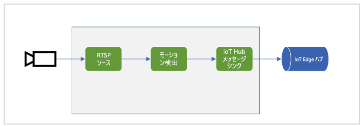

# <a name="quickstart-detect-motion-and-emit-events"></a>クイック スタート:モーションの検出とイベントの生成

このクイックスタートでは、Live Video Analytics on IoT Edge の基本的な操作手順について説明します。 IoT Edge デバイスとして Azure VM を使用すると共に、シミュレートしたライブ ビデオ ストリームを使用します。 セットアップ手順の完了後、メディア グラフを通じて、シミュレートされたライブ ビデオ ストリームを実行できます。そのストリーム内のあらゆるモーションがメディア グラフによって検出およびレポートされます。 次の図は、そのメディア グラフをグラフィカルに表したものです。

 

この記事は、C# で作成された[サンプル コード](https://github.com/Azure-Samples/live-video-analytics-iot-edge-csharp)を基にしています。

## <a name="prerequisites"></a>前提条件

* アクティブなサブスクリプションが含まれる Azure アカウント。 まだお持ちでない場合は、[無料のアカウントを作成してください](https://azure.microsoft.com/free/?WT.mc_id=A261C142F)。
* [Visual Studio Code](https://code.visualstudio.com/) と次の拡張機能:
    * [Azure IoT Tools](https://marketplace.visualstudio.com/items?itemName=vsciot-vscode.azure-iot-tools)
    * [C#](https://marketplace.visualstudio.com/items?itemName=ms-dotnettools.csharp)
* [.NET Core 3.1 SDK](https://dotnet.microsoft.com/download/dotnet-core/3.1)。 

> [!TIP]
> Azure IoT Tools 拡張機能のインストール中に Docker のインストールを求められる場合があります。 このメッセージは無視してかまいません。

## <a name="set-up-azure-resources"></a>Azure リソースの設定

このチュートリアルでは、次の Azure リソースが必要です。

* IoT Hub
* ストレージ アカウント
* Azure Media Services アカウント
* Azure 上の Linux VM ([IoT Edge ランタイム](../../iot-edge/how-to-install-iot-edge-linux.md)がインストール済み)

このクイックスタートでは、[Live Video Analytics リソース セットアップ スクリプト](https://github.com/Azure/live-video-analytics/tree/master/edge/setup)を使用して、ご利用の Azure サブスクリプションに必要なリソースをデプロイすることをお勧めします。 これを行うには、次のステップに従います。

1. [Azure Cloud Shell](https://shell.azure.com) を開きます。
1. Cloud Shell の初回使用時には、ストレージ アカウントと Microsoft Azure Files 共有を作成するためのサブスクリプションの選択を求められます。 **[ストレージの作成]** を選択して、Cloud Shell のセッション情報用のストレージ アカウントを作成します。 このストレージ アカウントは、Azure Media Services アカウントで使用するためにスクリプトによって作成されるアカウントとは別のものです。
1. Cloud Shell ウィンドウの左側にあるドロップダウン メニューから **[Bash]** をご利用の環境として選択します。

    

1. 次のコマンドを実行します。

```
bash -c "$(curl -sL https://aka.ms/lva-edge/setup-resources-for-samples)"
```

スクリプトが正常に終了すれば、必要なすべてのリソースがご利用のサブスクリプションに表示されます。

1. スクリプトが完了したら、中かっこを選択してフォルダー構造を展開します。 *~/clouddrive/lva-sample* ディレクトリに、いくつかのファイルがあるのを確認できます。 このクイックスタートで注目するのは、次のものです。

     * ***~/clouddrive/lva-sample/edge-deployment/.env*** - このファイルには、Visual Studio Code がエッジ デバイスにモジュールをデプロイする際に使用するプロパティが格納されています。
     * ***~/clouddrive/lva-sample/appsetting.json*** - Visual Studio Code は、このファイルを使用してサンプル コードを実行します。
     
これらのファイルは、次のセクションで Visual Studio Code に開発環境を設定するときに必要になります。 差し当たりローカル ファイルとしてコピーしておいてください。

 

## <a name="set-up-your-development-environment"></a>開発環境を設定する

1. 次の場所からリポジトリをクローンします: https://github.com/Azure-Samples/live-video-analytics-iot-edge-csharp 。
1. Visual Studio Code で、リポジトリをダウンロードしたフォルダーを開きます。
1. Visual Studio Code で、*src/cloud-to-device-console-app* フォルダーに移動します。 そこにファイルを作成し、*appsettings.json* という名前を付けます。 このファイルには、プログラムを実行するために必要な設定が格納されます。
1. このクイックスタートで前に生成した *~/clouddrive/lva-sample/appsettings.json* ファイルの内容をコピーします。

    テキストは次の出力のようになります。

```
{  
    "IoThubConnectionString" : "HostName=xxx.azure-devices.net;SharedAccessKeyName=iothubowner;SharedAccessKey=XXX",  
    "deviceId" : "lva-sample-device",  
    "moduleId" : "lvaEdge"  
}
```
5. *src/edge* フォルダーに移動し、 *.env* という名前のファイルを作成します。
1. */clouddrive/lva-sample/edge-deployment/.env* ファイルの内容をコピーします。 テキストは次のコードのようになります。

```
SUBSCRIPTION_ID="<Subscription ID>"  
RESOURCE_GROUP="<Resource Group>"  
AMS_ACCOUNT="<AMS Account ID>"  
IOTHUB_CONNECTION_STRING="HostName=xxx.azure-devices.net;SharedAccessKeyName=iothubowner;SharedAccessKey=xxx"  
AAD_TENANT_ID="<AAD Tenant ID>"  
AAD_SERVICE_PRINCIPAL_ID="<AAD SERVICE_PRINCIPAL ID>"  
AAD_SERVICE_PRINCIPAL_SECRET="<AAD SERVICE_PRINCIPAL ID>"  
INPUT_VIDEO_FOLDER_ON_DEVICE="/home/lvaadmin/samples/input"  
OUTPUT_VIDEO_FOLDER_ON_DEVICE="/var/media"
APPDATA_FOLDER_ON_DEVICE="/var/local/mediaservices"
CONTAINER_REGISTRY_USERNAME_myacr="<your container registry username>"  
CONTAINER_REGISTRY_PASSWORD_myacr="<your container registry password>"      
```

## <a name="examine-the-sample-files"></a>サンプル ファイルを詳しく調べる

1. Visual Studio Code で、*src/edge* に移動します。 *.env* ファイルと、いくつかの展開テンプレート ファイルがあります。

    展開テンプレートは、エッジ デバイスの配置マニフェストを参照します。マニフェストでは、一部のプロパティに変数が使用されています。 それらの変数の値が *.env* ファイルに格納されています。
1. *src/cloud-to-device-console-app* フォルダーに移動します。 ここには、*appsettings.json* ファイルと、他にいくつかのファイルがあります。

    * ***c2d-console-app.csproj*** - Visual Studio Code のプロジェクト ファイルです。
    * ***operations.json*** - プログラムで実行する操作のリストです。
    * ***Program.cs*** - サンプル プログラム コードです。 このコードによって以下が行われます。
    
      * アプリ設定を読み込みます。
      * Live Video Analytics on IoT Edge モジュールによって公開されているダイレクト メソッドを呼び出します。 このモジュールを使用し、その[ダイレクト メソッド](direct-methods.md)を呼び出すことで、ライブ ビデオ ストリームを分析できます。
      * 一時停止することで、プログラムの出力を **[ターミナル]** ウィンドウで調べたり、モジュールによって生成されたイベントを **[出力]** ウィンドウで調べたりできます。
      * ダイレクト メソッドを呼び出して、リソースをクリーンアップします。   

## <a name="generate-and-deploy-the-deployment-manifest"></a>配置マニフェストを生成してデプロイする

エッジ デバイスにデプロイされるモジュールは、配置マニフェストによって定義されます。 また、これらのモジュールの構成設定も定義されます。 

マニフェストをテンプレート ファイルから生成して、エッジ デバイスにデプロイするには、これらの手順に従います。

1. Visual Studio Code を開きます。
1. **[Azure IoT Hub]** ペインの横にある **[その他のアクション]** アイコンを選択して、IoT Hub 接続文字列を設定します。 この文字列は、*src/cloud-to-device-console-app/appsettings.json* ファイルからコピーすることができます。 

    

1. **src/edge/deployment.template.json** を右クリックして、 **[Generate IoT Edge deployment manifest]\(IoT Edge 配置マニフェストの生成\)** を選択します。

    

    このアクションによって、*deployment.amd64.json* という名前のマニフェスト ファイルが *src/edge/config* フォルダーに作成されます。
1. **src/edge/config/deployment.amd64.json** を右クリックして、 **[Create Deployment for Single Device]\(単一デバイスのデプロイの作成\)** を選択し、エッジ デバイスの名前を選択します。

    

1. IoT Hub デバイスを選択するように求めるメッセージが表示されたら、ドロップダウン メニューから **[lva-sample-device]** を選択します。
1. 約 30 秒後に、ウィンドウの左下隅で Azure IoT Hub を最新の情報に更新します。 エッジ デバイスには、次のデプロイ済みモジュールが表示されます。

    * Live Video Analytics on IoT Edge (モジュール名 `lvaEdge`)
    * リアルタイム ストリーミング プロトコル (RTSP) シミュレーター (モジュール名 `rtspsim`)

RTSP シミュレーター モジュールは、[Live Video Analytics リソース セットアップ スクリプト](https://github.com/Azure/live-video-analytics/tree/master/edge/setup)の実行時にエッジ デバイスにコピーされたビデオ ファイルを使用して、ライブ ビデオ ストリームをシミュレートします。 

> [!NOTE]
> セットアップ スクリプトによってプロビジョニングされたものではなく、独自のエッジ デバイスを使用している場合は、エッジ デバイスにアクセスし、**管理者権限**で次のコマンドを実行して、このクイックスタートで使用するサンプル ビデオ ファイルをプルして保存します。  

```
mkdir /home/lvaadmin/samples      
mkdir /home/lvaadmin/samples/input    
curl https://lvamedia.blob.core.windows.net/public/camera-300s.mkv > /home/lvaadmin/samples/input/camera-300s.mkv  
chown -R lvaadmin /home/lvaadmin/samples/  
```
この段階でモジュールはデプロイされていますが、メディア グラフはアクティブになっていません。

## <a name="prepare-to-monitor-events"></a>イベントの監視の準備をする

Live Video Analytics on IoT Edge モジュールを使用して、受信したライブ ビデオ ストリーム内で動きを検出し、イベントを IoT ハブに送信します。 それらのイベントを確認するには、次の手順に従います。

1. Visual Studio Code の [エクスプローラー] ペインを開き、左下隅にある [Azure IoT Hub] を探します。
1. **[デバイス]** ノードを展開します。
1. **[lva-sample-device]** を右クリックし、 **[Start Monitoring Built-in Event Endpoint]\(組み込みイベント エンドポイントの監視を開始する\)** を選択します。

    

## <a name="run-the-sample-program"></a>サンプル プログラムを実行する

サンプル コードを実行するには、これらの手順に従います。

1. Visual Studio Code で、*src/cloud-to-device-console-app/operations.json* に移動します。
1. **GraphTopologySet** ノードで、次の値が表示されていることを確認します。

    `"topologyUrl" : "https://raw.githubusercontent.com/Azure/live-video-analytics/master/MediaGraph/topologies/motion-detection/topology.json"`
1. **GraphInstanceSet** および **GraphTopologyDelete** ノードで、`topologyName` の値が、グラフ トポロジの `name` プロパティの値と一致していることを確認します。

    `"topologyName" : "MotionDetection"`
    
1. F5 キーを押して、デバッグ セッションを開始します。 **[ターミナル]** ウィンドウに、いくつかのメッセージが表示されます。
1. *operations.json* ファイルは、`GraphTopologyList` および `GraphInstanceList` の呼び出しから始まります。 前回のクイックスタートを終了した後にリソースをクリーンアップしている場合は、このプロセスにより空のリストが返されてから、一時停止します。 続行するには、Enter キーを押します。

```
--------------------------------------------------------------------------
Executing operation GraphTopologyList
-----------------------  Request: GraphTopologyList  --------------------------------------------------
{
    "@apiVersion": "1.0"
}
---------------  Response: GraphTopologyList - Status: 200  ---------------
{
    "value": []
}
--------------------------------------------------------------------------
Executing operation WaitForInput
Press Enter to continue
```

**[ターミナル]** ウィンドウに、次の一連のダイレクト メソッド呼び出しが表示されます。
 * 前の `topologyUrl` を使用する `GraphTopologySet` の呼び出し
 * 次の本文を使用する `GraphInstanceSet` の呼び出し。
     
```
{
  "@apiVersion": "1.0",
  "name": "Sample-Graph",
  "properties": {
    "topologyName": "MotionDetection",
    "description": "Sample graph description",
    "parameters": [
      {
        "name": "rtspUrl",
        "value": "rtsp://rtspsim:554/media/camera-300s.mkv"
      },
      {
        "name": "rtspUserName",
        "value": "testuser"
      },
      {
        "name": "rtspPassword",
        "value": "testpassword"
      }
    ]
  }
}
```
     
 * グラフ インスタンスとビデオのフローを開始する `GraphInstanceActivate` の呼び出し
 * グラフ インスタンスが実行状態であることを示す `GraphInstanceList` の 2 回目の呼び出し
6. **[ターミナル]** ウィンドウの出力は `Press Enter to continue` で一時停止します。 Enter キーはまだ押さないでください。 上へスクロールして、呼び出したダイレクト メソッドの JSON 応答のペイロードを確認します。
1. Visual Studio Code の **[出力]** ウィンドウに切り替えます。 Live Video Analytics on IoT Edge モジュールから IoT ハブに送信されているメッセージが表示されます。 このクイックスタートの次のセクションでは、これらのメッセージについて説明します。
1. メディア グラフは引き続き実行され、結果が出力されます。 RTSP シミュレーターによって、ソース ビデオがループ処理され続けます。 メディア グラフを停止するには、 **[ターミナル]** ウィンドウに戻り、Enter キーを押します。 

    次の一連の呼び出しによって、リソースがクリーンアップされます。
     * `GraphInstanceDeactivate` の呼び出しによって、グラフ インスタンスが非アクティブ化されます。
     * `GraphInstanceDelete` の呼び出しによって、インスタンスが削除されます。
     * `GraphTopologyDelete` の呼び出しによって、トポロジが削除されます。
     * `GraphTopologyList` の最後の呼び出しによって、リストが空であることが示されます。

## <a name="interpret-results"></a>結果を解釈する

メディア グラフを実行すると、モーション検出プロセッサ ノードの結果が IoT Hub シンク ノードを介して IoT バブに渡されます。 Visual Studio Code の **[出力]** ウィンドウに表示されるメッセージには、`body` セクションと `applicationProperties` セクションが含まれています。 詳細については、「[IoT Hub メッセージを作成し、読み取る](../../iot-hub/iot-hub-devguide-messages-construct.md)」を参照してください。

次のメッセージ内のアプリケーションのプロパティと body の内容は、Live Video Analytics モジュールによって定義されています。

### <a name="mediasessionestablished-event"></a>MediaSessionEstablished イベント

メディア グラフがインスタンス化されると、RTSP ソース ノードは、rtspsim-live555 コンテナーで実行されている RTSP サーバーへの接続を試みます。 接続に成功すると、次のイベントが出力されます。

```
[IoTHubMonitor] [9:42:18 AM] Message received from [lvaedgesample/lvaEdge]:  
{  
"body": {
"sdp": "SDP:\nv=0\r\no=- 1586450538111534 1 IN IP4 xxx.xxx.xxx.xxx\r\ns=Matroska video+audio+(optional)subtitles, streamed by the LIVE555 Media Server\r\ni=media/camera-300s.mkv\r\nt=0 0\r\na=tool:LIVE555 Streaming Media v2020.03.06\r\na=type:broadcast\r\na=control:*\r\na=range:npt=0-300.000\r\na=x-qt-text-nam:Matroska video+audio+(optional)subtitles, streamed by the LIVE555 Media Server\r\na=x-qt-text-inf:media/camera-300s.mkv\r\nm=video 0 RTP/AVP 96\r\nc=IN IP4 0.0.0.0\r\nb=AS:500\r\na=rtpmap:96 H264/90000\r\na=fmtp:96 packetization-mode=1;profile-level-id=4D0029;sprop-parameter-sets={SPS}\r\na=control:track1\r\n"  
},  
"applicationProperties": {  
    "dataVersion": "1.0",  
    "topic": "/subscriptions/{subscriptionID}/resourceGroups/{name}/providers/microsoft.media/mediaservices/hubname",  
    "subject": "/graphInstances/GRAPHINSTANCENAMEHERE/sources/rtspSource",  
    "eventType": "Microsoft.Media.MediaGraph.Diagnostics.MediaSessionEstablished",  
    "eventTime": "2020-04-09T16:42:18.1280000Z"  
    }  
}
```

前の出力は、次のような内容を表します。 
* このメッセージは、診断イベント `MediaSessionEstablished` です。 これは、RTSP ソース ノード (subject) が RTSP シミュレーターと接続され、(シミュレートされた) ライブ フィードの受信を開始したことを示します。
* `applicationProperties` 内の `subject` は、メッセージの生成元となった、グラフ トポロジ内のノードを参照しています。 このケースでは、RTSP ソース ノードからメッセージが生成されます。
* `applicationProperties` 内の `eventType` は、このイベントが診断イベントであることを示しています。
* `eventTime` の値は、イベントの発生時刻を示しています。
* `body` セクションには、診断イベントに関するデータが含まれています。 このケースでは、データは[セッション記述プロトコル (SDP)](https://en.wikipedia.org/wiki/Session_Description_Protocol) の詳細で構成されています。


### <a name="motiondetection-event"></a>MotionDetection イベント

モーションが検出されると、Live Video Analytics on IoT Edge モジュールから推論イベントが送信されます。 `type` は、これがモーション検出プロセッサからの結果であることを示す `motion` に設定されています。 `eventTime` の値は、モーションが発生した時刻 (UTC) を示しています。 

このメッセージの例を次に示します。

```
  {  
  "body": {  
    "timestamp": 142843967343090,
    "inferences": [  
      {  
        "type": "motion",  
        "motion": {  
          "box": {  
            "l": 0.573222,  
            "t": 0.492537,  
            "w": 0.141667,  
            "h": 0.074074  
          }  
        }  
      }  
    ]  
  },  
  "applicationProperties": {  
    "topic": "/subscriptions/{subscriptionID}/resourceGroups/{name}/providers/microsoft.media/mediaservices/hubname",  
    "subject": "/graphInstances/GRAPHINSTANCENAME/processors/md",  
    "eventType": "Microsoft.Media.Graph.Analytics.Inference",  
    "eventTime": "2020-04-17T20:26:32.7010000Z",
    "dataVersion": "1.0"  
  }  
}  
```

次の点に注意してください。 

* `applicationProperties` 内の `subject` は、メッセージの生成元となった、メディア グラフ内のノードを参照しています。 このケースでは、メッセージはモーション検出プロセッサ ノードから生成されています。
* `applicationProperties` 内の `eventType` は、このイベントが分析イベントであることを示しています。
* `eventTime` 値は、イベントが発生した時刻です。
* `body` 値は、分析イベントに関するデータです。 このケースでは、イベントは推論イベントであるため、本文には `timestamp` および `inferences` のデータが含まれています。
* `inferences` のデータは、`type` が `motion` であることを示しています。 ここには `motion` イベントに関する追加データが含まれています。
* `box` セクションには、移動するオブジェクトを囲む境界ボックスの座標が格納されます。 これらの値は、ビデオの幅と高さ (ピクセル単位) で正規化されます (例: 幅 1920、高さ 1080)。

    ```
    l - distance from left of image
    t - distance from top of image
    w - width of bounding box
    h - height of bounding box
    ```
    
## <a name="clean-up-resources"></a>リソースをクリーンアップする

他のクイックスタートに取り組む場合は、作成したリソースをそのまま残しておきます。 それ以外の場合は、Azure portal で、ご利用のリソース グループに移動し、このクイックスタートを実行したリソース グループを選択して、そのリソースをすべて削除してください。

## <a name="next-steps"></a>次のステップ

ライブ ビデオ フィードでのオブジェクトの検出など、他のクイックスタートを実行します。        
