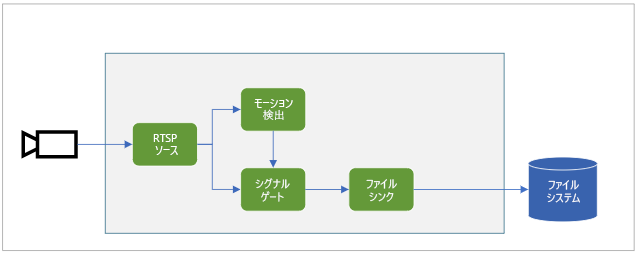

# <a name="quickstart-detect-motion-and-record-video-on-edge-devices"></a>クイック スタート:モーションの検出とエッジ デバイス上でのビデオの記録
 
このクイックスタートでは、Live Video Analytics on IoT Edge を使用して、(シミュレートされた) IP カメラからのライブ ビデオ フィードを分析する方法について説明します。 ここでは、なんらかの動きがあるかどうかを検出し、ある場合には、MP4 ビデオ クリップをエッジ デバイス上のローカル ファイル システムに記録する方法を示します。 このクイックスタートでは、IoT Edge デバイスとして Azure VM を使用するほか、シミュレートされたライブ ビデオ ストリームも使用します。 

この記事は、C# で作成されたサンプル コードを基にしています。 これは、クイックスタート「[モーションの検出とイベントの生成](detect-motion-emit-events-quickstart.md)」に基づいています。 

## <a name="prerequisites"></a>前提条件

* アクティブなサブスクリプションが含まれる Azure アカウント。 まだお持ちでない場合は、[無料のアカウントを作成してください](https://azure.microsoft.com/free/?WT.mc_id=A261C142F)。
* [Visual Studio Code](https://code.visualstudio.com/) と次の拡張機能。
    * [Azure IoT Tools](https://marketplace.visualstudio.com/items?itemName=vsciot-vscode.azure-iot-tools)
    * [C#](https://marketplace.visualstudio.com/items?itemName=ms-dotnettools.csharp)
* [.NET Core 3.1 SDK](https://dotnet.microsoft.com/download/dotnet-core/3.1)。
* クイックスタート「[モーションの検出とイベントの生成](detect-motion-emit-events-quickstart.md)」を完了していない場合は、これらの手順を実行してください。
     1. [Azure リソースの設定](detect-motion-emit-events-quickstart.md#set-up-azure-resources)
     1. [開発環境を設定する](detect-motion-emit-events-quickstart.md#set-up-your-development-environment)
     1. [IoT Edge の配置マニフェストを生成してデプロイする](detect-motion-emit-events-quickstart.md#generate-and-deploy-the-deployment-manifest)
     1. [イベントの監視の準備をする](detect-motion-emit-events-quickstart.md#prepare-to-monitor-events)

> [!TIP]
> Azure IoT Tools をインストールするときに、Docker のインストールを求められる場合があります。 このメッセージは無視してかまいません。

## <a name="review-the-sample-video"></a>サンプル ビデオを確認する
このクイックスタートの Azure リソースを設定する際に、駐車場の短いビデオが、IoT Edge デバイスとして使用される Azure の Linux VM にコピーされます。 このビデオ ファイルは、このチュートリアルのライブ ストリームをシミュレートするために使用されます。

[VLC メディア プレーヤー](https://www.videolan.org/vlc/)などのアプリケーションを起動し、Ctrl キーを押しながら N キーを押して、[このリンク](https://lvamedia.blob.core.windows.net/public/lots_015.mkv)を駐車場ビデオに貼り付けて再生を開始します。 だいたい 5 秒の地点で、白の車が駐車場を通って移動します。

次の手順を完了すると、Live Video Analytics on IoT Edge を使用してその車の動きが検出され、5 秒のマークあたりから始まるビデオ クリップが録画されます。

## <a name="overview"></a>概要



上の図は、このクイックスタートでのシグナルの流れを示しています。 [エッジ モジュール](https://github.com/Azure/live-video-analytics/tree/master/utilities/rtspsim-live555)は、リアルタイム ストリーミング プロトコル (RTSP) サーバーをホストする IP カメラをシミュレートします。 [RTSP ソース](media-graph-concept.md#rtsp-source) ノードは、このサーバーからビデオ フィードをプルし、[モーション検出プロセッサ](media-graph-concept.md#motion-detection-processor) ノードにビデオ フレームを送信します。 RTSP ソースは、同じビデオ フレームを[シグナル ゲート プロセッサ](media-graph-concept.md#signal-gate-processor) ノードに送信します。このノードは、イベントによってトリガーされるまで閉じたままになっています。

モーション検出プロセッサは、ビデオでモーションを検出すると、イベントをシグナル ゲート プロセッサ ノードに送信してトリガーします。 ゲートは、構成されている期間開いて、[ファイル シンク](media-graph-concept.md#file-sink) ノードにビデオ フレームを送信します。 このシンク ノードは、エッジ デバイスのローカル ファイル システムに、ビデオを MP4 ファイルとして記録します。 ファイルは、構成した場所に保存されます。

このクイックスタートでは次の作業を行います。

1. メディア グラフを作成してデプロイする。
1. 結果を解釈する。
1. リソースをクリーンアップする。

## <a name="examine-and-edit-the-sample-files"></a>サンプル ファイルを調べて編集する
このクイックスタートの前提条件の一環として、サンプル コードがフォルダーにダウンロードされています。 サンプル コードを確認して編集するには、これらの手順に従います。

1. Visual Studio Code で、*src/edge* に移動します。 *.env* ファイルと、いくつかの展開テンプレート ファイルがあります。

    展開テンプレートは、エッジ デバイスの配置マニフェストを参照します。マニフェストでは、一部のプロパティに変数が使用されています。 *.env* ファイルには、それらの変数の値が格納されています。
1. *src/cloud-to-device-console-app* フォルダーに移動します。 ここには、*appsettings.json* ファイルと、他にいくつかのファイルがあります。
    * ***c2d-console-app.csproj*** - Visual Studio Code のプロジェクト ファイルです。
    * ***operations.json*** - プログラムで実行する操作のリストです。
    * ***Program.cs*** - サンプル プログラム コードです。 このコードによって以下が行われます。

        * アプリ設定を読み込みます。
        * Live Video Analytics on IoT Edge モジュールによって公開されているダイレクト メソッドを呼び出します。 このモジュールを使用し、その[ダイレクト メソッド](direct-methods.md)を呼び出すことで、ライブ ビデオ ストリームを分析できます。 
        * 一時停止することで、プログラムからの出力を **[ターミナル]** ウィンドウで調べたり、モジュールによって生成されたイベントを **[出力]** ウィンドウで調べたりできます。
        * ダイレクト メソッドを呼び出して、リソースをクリーンアップします。

1. *operations.json* ファイルを編集します。
    * グラフ トポロジへのリンクを変更します。

        `"topologyUrl" : "https://raw.githubusercontent.com/Azure/live-video-analytics/master/MediaGraph/topologies/evr-motion-files/topology.json"`
    * `GraphInstanceSet` で、前のリンクの値と一致するようにグラフ トポロジの名前を編集します。
    
      `"topologyName" : "EVRToFilesOnMotionDetection"`

    * ビデオ ファイルを指すように RTSP URL を編集します。

        `"value": "rtsp://rtspsim:554/media/lots_015.mkv"`

    * `GraphTopologyDelete` で、名前を編集します。

        `"name": "EVRToFilesOnMotionDetection"`

## <a name="review---check-the-modules-status"></a>レビュー - モジュールの状態を確認する

「[IoT Edge の配置マニフェストを生成してデプロイする](detect-motion-emit-events-quickstart.md#generate-and-deploy-the-deployment-manifest)」の手順で、Visual Studio Code で **AZURE IOT HUB** の下にある **lva-sample-device** ノード (左下のセクション内) を展開します。 次のモジュールがデプロイされていることを確認できます。

* **lvaEdge** という名前の Live Video Analytics モジュール
* **rtspsim** モジュール。ライブ ビデオ フィードのソースとして機能する RTSP サーバーをシミュレートします

  


## <a name="review---prepare-for-monitoring-events"></a>レビュー - イベントを監視するための準備をする
「[イベントを監視するための準備をする](detect-motion-emit-events-quickstart.md#prepare-to-monitor-events)」手順が完了していることを確認します。


## <a name="run-the-sample-program"></a>サンプル プログラムを実行する

1. F5 キーを押して、デバッグ セッションを開始します。 **[ターミナル]** ウィンドウに、いくつかのメッセージが出力されます。
1. *operations.json* コードにより、ダイレクト メソッド `GraphTopologyList` および `GraphInstanceList` が呼び出されます。 前回のクイックスタート後にリソースをクリーンアップしている場合は、このプロセスにより空のリストが返されてから、一時停止します。 Enter キーを押します。

    ```
    --------------------------------------------------------------------------
    Executing operation GraphTopologyList
    -----------------------  Request: GraphTopologyList  --------------------------------------------------
    {
      "@apiVersion": "1.0"
    }
    ---------------  Response: GraphTopologyList - Status: 200  ---------------
    {
      "value": []
    }
    --------------------------------------------------------------------------
    Executing operation WaitForInput
    Press Enter to continue
    ```

    **[ターミナル]** ウィンドウに、次の一連のダイレクト メソッド呼び出しが表示されます。

     * `topologyUrl` を使用する `GraphTopologySet` の呼び出し 
     * 次の本文を使用する `GraphInstanceSet` の呼び出し。

         ```
         {
           "@apiVersion": "1.0",
           "name": "Sample-Graph",
           "properties": {
             "topologyName": "EVRToFilesOnMotionDetection",
             "description": "Sample graph description",
             "parameters": [
               {
                 "name": "rtspUrl",
                 "value": "rtsp://rtspsim:554/media/lots_015.mkv"
               },
               {
                 "name": "rtspUserName",
                 "value": "testuser"
               },
               {
                 "name": "rtspPassword",
                 "value": "testpassword"
               }
             ]
           }
         }
         ```
     * グラフ インスタンスとビデオのフローを開始する `GraphInstanceActivate` の呼び出し
     * グラフ インスタンスが実行状態であることを示す `GraphInstanceList` の 2 回目の呼び出し
1. **[ターミナル]** ウィンドウの出力は `Press Enter to continue` で一時停止します。 Enter キーはまだ押さないでください。 上へスクロールして、呼び出したダイレクト メソッドの JSON 応答のペイロードを確認します。
1. Visual Studio Code の **[出力]** ウィンドウに切り替えます。 Live Video Analytics on IoT Edge モジュールから IoT ハブに送信されているメッセージが表示されます。 このクイックスタートの次のセクションでは、これらのメッセージについて説明します。

1. メディア グラフは引き続き実行され、結果が出力されます。 RTSP シミュレーターによって、ソース ビデオがループ処理され続けます。 メディア グラフを停止するには、 **[ターミナル]** ウィンドウに戻り、Enter キーを押します。 

    次の一連の呼び出しによって、リソースがクリーンアップされます。
     * `GraphInstanceDeactivate` の呼び出しによって、グラフ インスタンスが非アクティブ化されます。
     * `GraphInstanceDelete` の呼び出しによって、インスタンスが削除されます。
     * `GraphTopologyDelete` の呼び出しによって、トポロジが削除されます。
     * `GraphTopologyList` の最後の呼び出しによって、リストが空になっていることが示されます。

## <a name="interpret-results"></a>結果を解釈する 
メディア グラフを実行すると、モーション検出プロセッサ ノードの結果が IoT Hub シンク ノードを介して IoT バブに渡されます。 Visual Studio Code の **[出力]** ウィンドウに表示されるメッセージには、`body` セクションと `applicationProperties` セクションが含まれています。 詳細については、「[IoT Hub メッセージを作成し、読み取る](../../iot-hub/iot-hub-devguide-messages-construct.md)」を参照してください。

次のメッセージ内のアプリケーションのプロパティと body の内容は、Live Video Analytics モジュールによって定義されています。

### <a name="mediasessionestablished-event"></a>MediaSessionEstablished イベント

メディア グラフがインスタンス化されると、RTSP ソース ノードは、rtspsim-live555 コンテナーで実行されている RTSP サーバーへの接続を試みます。 接続に成功すると、次のイベントが出力されます。

```
[IoTHubMonitor] [05:37:21 AM] Message received from [lva-sample-device/lvaEdge]:
{  
"body": {
"sdp": "SDP:\nv=0\r\no=- 1586450538111534 1 IN IP4 xxx.xxx.xxx.xxx\r\ns=Matroska video+audio+(optional)subtitles, streamed by the LIVE555 Media Server\r\ni=media/camera-300s.mkv\r\nt=0 0\r\na=tool:LIVE555 Streaming Media v2020.03.06\r\na=type:broadcast\r\na=control:*\r\na=range:npt=0-300.000\r\na=x-qt-text-nam:Matroska video+audio+(optional)subtitles, streamed by the LIVE555 Media Server\r\na=x-qt-text-inf:media/camera-300s.mkv\r\nm=video 0 RTP/AVP 96\r\nc=IN IP4 0.0.0.0\r\nb=AS:500\r\na=rtpmap:96 H264/90000\r\na=fmtp:96 packetization-mode=1;profile-level-id=4D0029;sprop-parameter-sets={SPS}\r\na=control:track1\r\n"  
},  
"applicationProperties": {  
    "dataVersion": "1.0",  
    "topic": "/subscriptions/{subscriptionID}/resourceGroups/{name}/providers/microsoft.media/mediaservices/hubname",  
    "subject": "/graphInstances/Sample-Graph-1/sources/rtspSource",  
    "eventType": "Microsoft.Media.MediaGraph.Diagnostics.MediaSessionEstablished",  
    "eventTime": "2020-05-21T05:37:21.398Z",
    }  
}
```

前の出力は、次のような内容を表します。 

* このメッセージは、診断イベント `MediaSessionEstablished` です。 これは、RTSP ソース ノード (subject) が RTSP シミュレーターとの接続を確立し、(シミュレートされた) ライブ フィードの受信を開始したことを示します。
* `applicationProperties` 内の `subject` は、メッセージの生成元となった、グラフ トポロジ内のノードを参照しています。 このケースでは、RTSP ソース ノードからメッセージが生成されます。
* `applicationProperties` 内の `eventType` は、このイベントが診断イベントであることを示しています。
* `eventTime` 値は、イベントが発生した時刻です。
* `body` セクションには、診断イベントに関するデータが含まれています。 このケースでは、データは[セッション記述プロトコル (SDP)](https://en.wikipedia.org/wiki/Session_Description_Protocol) の詳細で構成されています。

### <a name="recordingstarted-event"></a>RecordingStarted イベント

モーションが検出されると、シグナル ゲート プロセッサ ノードがアクティブになり、メディア グラフのファイル シンク ノードが MP4 ファイルの書き込みを開始します。 ファイル シンク ノードは、操作イベントを送信します。 `type` は、これがモーション検出プロセッサからの結果であることを示す `motion` に設定されています。 `eventTime` 値は、モーションが発生した UTC 時刻です。 このプロセスの詳細については、このクイックスタートの「[概要](#overview)」セクションを参照してください。

このメッセージの例を次に示します。

```
[IoTHubMonitor] [05:37:27 AM] Message received from [lva-sample-device/lvaEdge]:
{
  "body": {
    "outputType": "filePath",
    "outputLocation": "/var/media/sampleFilesFromEVR-filesinkOutput-20200521T053726Z.mp4"
  },
  "applicationProperties": {
    "topic": "/subscriptions/{subscriptionID}/resourceGroups/{name}/providers/microsoft.media/mediaservices/hubname",  
    "subject": "/graphInstances/Sample-Graph-1/sinks/fileSink",
    "eventType": "Microsoft.Media.Graph.Operational.RecordingStarted",
    "eventTime": "2020-05-21T05:37:27.713Z",
    "dataVersion": "1.0"
  }
}
```

前のメッセージは、次のような内容を表します。 

* `applicationProperties` 内の `subject` は、メッセージの生成元となった、メディア グラフ内のノードを参照しています。 このケースでは、メッセージはファイル シンク ノードから生成されています。
* `applicationProperties` 内の `eventType` は、このイベントが操作であることを示しています。
* `eventTime` 値は、イベントが発生した時刻です。 この時刻は、`MediaSessionEstablished` の後、ビデオのフローが開始されて 5 から 6 秒後です。 この時刻は、駐車場へと[車が移動を開始した](#review-the-sample-video)時点 (5 から 6 秒あたりのマーク) に対応しています。
* `body` セクションには、操作イベントに関するデータが含まれています。 このケースでは、データは `outputType` および `outputLocation` で構成されます。
* `outputType` 変数は、この情報がファイル パスに関するものであることを示しています。
* `outputLocation` 値は、エッジ モジュール内の MP4 ファイルの場所です。

### <a name="recordingstopped-and-recordingavailable-events"></a>RecordingStopped イベントと RecordingAvailable イベント

[グラフ トポロジ](https://github.com/Azure/live-video-analytics/blob/master/MediaGraph/topologies/evr-motion-files/topology.json)でシグナル ゲート プロセッサ ノードのプロパティを確認すると、アクティブ化の時間が 5 秒に設定されていることがわかります。 `RecordingStarted` イベントを受信してから約 5 秒後に、次のイベントを取得します。

* `RecordingStopped` イベント。記録が停止したことを示します。
* `RecordingAvailable` イベント。MP4 ファイルを表示に使用できるようになったことを示します。

この 2 つのイベントは、通常、数秒以上間隔を開けずに出力されます。

## <a name="play-the-mp4-clip"></a>MP4 クリップを再生する

MP4 ファイルは、OUTPUT_VIDEO_FOLDER_ON_DEVICE キーを使用して *.env* ファイルで構成したエッジ デバイス上のディレクトリに書き込まれます。 既定値を使用している場合、結果は */home/lvaadmin/samples/output/* フォルダーに配置されます。

MP4 クリップを再生するには、次のようにします。

1. リソース グループに移動して VM を見つけ、Azure Bastion を使用して接続します。

    
    
    

1. [Azure リソースを設定](detect-motion-emit-events-quickstart.md#set-up-azure-resources)したときに生成された資格情報を使用して、サインインします。 
1. コマンド プロンプトで、関連するディレクトリに移動します。 既定の場所は、 */home/lvaadmin/samples/output* です。 MP4 ファイルがこのディレクトリで見つかります。

     

1. [Secure Copy (SCP)](../../virtual-machines/linux/copy-files-to-linux-vm-using-scp.md) を使用して、このファイルをローカル コンピューターにコピーします。 
1. [VLC メディア プレーヤー](https://www.videolan.org/vlc/)またはその他の MP4 プレーヤーを使用して、ファイルを再生します。

## <a name="clean-up-resources"></a>リソースをクリーンアップする

他のクイックスタートに取り組む場合は、作成したリソースをそのまま残しておきます。 それ以外の場合は、Azure portal で、ご利用のリソース グループに移動し、このクイックスタートを実行したリソース グループを選択して、そのリソースをすべて削除してください。

## <a name="next-steps"></a>次のステップ

* [自分のモデルを使用した Live Video Analytics の実行](use-your-model-quickstart.md)に関するクイックスタートに従って、AI をライブ ビデオ フィードに適用します。
* 上級ユーザー向けのその他の課題を確認します。

    * RTSP シミュレーターを使用する代わりに、RTSP をサポートする [IP カメラ](https://en.wikipedia.org/wiki/IP_camera)を使用します。 RTSP をサポートする IP カメラは、[ONVIF 準拠製品](https://www.onvif.org/conformant-products)のページで見つけることができます。 プロファイル G、S、または T に準拠しているデバイスを探します。
    * Azure では、Linux VM を使用するのではなく、AMD64 または x64 Linux デバイスを使用します。 このデバイスは、IP カメラと同じネットワーク内にある必要があります。 [Linux への Azure IoT Edge ランタイムのインストール](../../iot-edge/how-to-install-iot-edge-linux.md)に関するページの手順に従います。 次に、「[初めての IoT Edge モジュールを Linux 仮想デバイスにデプロイする](../../iot-edge/quickstart-linux.md)」の手順に従って、デバイスを Azure IoT Hub に登録します。
