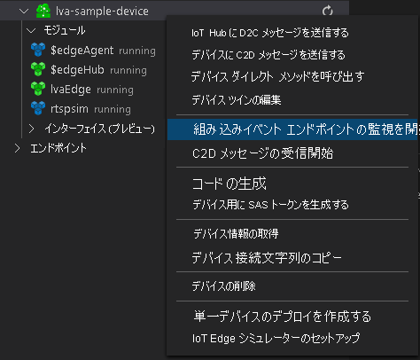
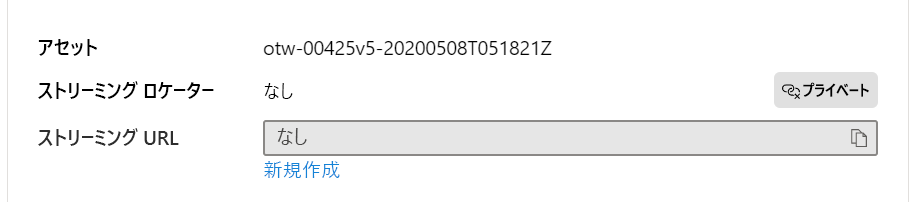

# <a name="quickstart-detect-motion-record-video-to-media-services"></a>クイック スタート:モーションの検出、Media Services へのビデオの記録

この記事では、Live Video Analytics on IoT Edge を使用して[イベントベースの記録](event-based-video-recording-concept.md)を行う手順について説明します。 IoT Edge デバイスとして Azure 上の Linux VM を使用すると共に、シミュレートしたライブ ビデオ ストリームを使用します。 このビデオ ストリームで、動くオブジェクトが存在するかどうかが分析されます。 動きが検出されると、イベントが Azure IoT Hub に送信され、ビデオ ストリームの関連する部分が Azure Media Services に資産として記録されます。

この記事は、[「はじめに」のクイックスタート](get-started-detect-motion-emit-events-quickstart.md)を基礎にしています。

## <a name="prerequisites"></a>前提条件

* アクティブなサブスクリプションが含まれる Azure アカウント。 [無料でアカウントを作成できます](https://azure.microsoft.com/free/?WT.mc_id=A261C142F)。
  > [!NOTE]
  > サービス プリンシパルを作成するためのアクセス許可を与えられた Azure サブスクリプションが必要です (**owner role** には、そのアクセス許可があります)。 適切なアクセス許可がない場合は、適切なアクセス許可をアカウント管理者に申請してください。 
* [Visual Studio Code](https://code.visualstudio.com/)。[Azure IoT Tools 拡張機能](https://marketplace.visualstudio.com/items?itemName=vsciot-vscode.azure-iot-tools)と共にマシンにインストールされている必要があります。
* [「はじめに」のクイックスタート](get-started-detect-motion-emit-events-quickstart.md)をまだ完了していない場合は、次の手順に従ってください。
    * [Azure リソースの設定](get-started-detect-motion-emit-events-quickstart.md#set-up-azure-resources)
    * [モジュールをデプロイする](get-started-detect-motion-emit-events-quickstart.md#deploy-modules-on-your-edge-device)
    * [Visual Studio Code を構成する](get-started-detect-motion-emit-events-quickstart.md#configure-the-azure-iot-tools-extension)
    > [!TIP]
    > 作成された Azure リソースで問題が発生した場合は、 **[トラブルシューティング ガイド](troubleshoot-how-to.md#common-error-resolutions)** を参照して、よく発生する問題を解決してください。
## <a name="review-the-sample-video"></a>サンプル ビデオを確認する

Azure リソースを設定する上記の手順の一部として、駐車場の (短い) ビデオが、IoT Edge デバイスとして使用されている Azure の Linux VM にコピーされます。 このビデオ ファイルは、このチュートリアルのライブ ストリームをシミュレートするために使用されます。

[VLC プレーヤー](https://www.videolan.org/vlc/)などのアプリケーションを使用してこれを起動し、`Ctrl+N` を押して[駐車場のビデオ サンプル](https://lvamedia.blob.core.windows.net/public/lots_015.mkv) リンクを貼り付けると再生を開始できます。 だいたい 5 秒の地点で、白の車が駐車場を通って移動します。
> [!VIDEO https://www.microsoft.com/en-us/videoplayer/embed/RE4LUbN]

次の手順を完了すると、Live Video Analytics on IoT Edge を使用してその車の動きを検出し、その 5 秒の地点前後で始まるビデオ クリップが録画されます。 次の図は、フロー全体を視覚的に表したものです。

> [!div class="mx-imgBorder"]
> :::image type="content" source="./media/quickstarts/topology.svg" alt-text="モーション イベントに基づいた資産へのイベントベースのビデオ記録":::

## <a name="use-direct-method-calls"></a>ダイレクト メソッドの呼び出しを使用する

ライブ ビデオ ストリームの分析は、モジュールを使用し、ダイレクト メソッドを呼び出すことによって行うことができます。 モジュールに用意されているすべてのダイレクト メソッドについては、[Live Video Analytics on IoT Edge のダイレクト メソッド](direct-methods.md)に関するページをご覧ください。 

1. Visual Studio Code で **[拡張機能]** タブを開き (または Ctrl + Shift + X キーを押し)、Azure IoT Hub を検索します。
1. マウスの右ボタンをクリックし、 **[拡張機能の設定]** を選択します。

    > [!div class="mx-imgBorder"]
    > :::image type="content" source="./media/run-program/extensions-tab.png" alt-text="拡張機能の設定":::
1. [Show Verbose Message]\(詳細メッセージの表示\) を検索して有効にします。

    > [!div class="mx-imgBorder"]
    > :::image type="content" source="./media/run-program/show-verbose-message.png" alt-text="詳細メッセージの表示":::

### <a name="invoke-graphtopologylist"></a>GraphTopologyList を呼び出す
このステップにより、モジュール内のすべての[グラフ トポロジ](media-graph-concept.md#media-graph-topologies-and-instances)が列挙されます。

1. "lvaEdge" モジュールを右クリックし、コンテキスト メニューから [Invoke Module Direct Method]\(モジュールのダイレクト メソッドを呼び出す\) を選択します。
1. Visual Studio Code ウィンドウの上部中央にエディット ボックスがポップアップ表示されます。 エディット ボックスに「GraphTopologyList」と入力して、Enter キーを押します。
1. さらに、次の JSON ペイロードをコピーしてエディット ボックスに貼り付け、Enter キーを押します。
    
```
{
    "@apiVersion" : "2.0"
}
```

数秒すると、次の応答と共に Visual Studio Code の出力ウィンドウがポップアップ表示されます。
    
```
[DirectMethod] Invoking Direct Method [GraphTopologyList] to [lva-sample-device/lvaEdge] ...
[DirectMethod] Response from [lva-sample-device/lvaEdge]:
{
  "status": 200,
  "payload": {
    "value": []
  }
}
```
    
上記は想定内の応答です。まだグラフ トポロジが作成されていないためです。

### <a name="invoke-graphtopologyset"></a>GraphTopologySet を呼び出す

GraphTopologyList を呼び出したときと同じ手順で、次の JSON をペイロードに使用して GraphTopologySet を呼び出せば、[グラフ トポロジ](media-graph-concept.md#media-graph-topologies-and-instances)を設定できます。 "EVRtoAssetsOnMotionDetection" という名前のグラフ トポロジを作成します。

```
{
    "@apiVersion": "2.0",
    "name": "EVRtoAssetsOnMotionDetection",
    "properties": {
      "description": "Event-based video recording to Assets based on motion events",
      "parameters": [
        {
            "name": "rtspUserName",
            "type": "String",
            "description": "rtsp source user name.",
            "default": "dummyUserName"
        },
        {
            "name": "rtspPassword",
            "type": "String",
            "description": "rtsp source password.",
            "default" : "dummyPassword"
        },
        {
            "name": "rtspUrl",
            "type": "String",
            "description": "rtsp Url"
        },
        {
            "name": "motionSensitivity",
            "type": "String",
            "description": "motion detection sensitivity",
            "default" : "medium"
        },
        {
            "name": "hubSinkOutputName",
            "type": "String",
            "description": "hub sink output name",
            "default" : "iothubsinkoutput"
        }                              
    ],         

      "sources": [
        {
          "@type": "#Microsoft.Media.MediaGraphRtspSource",
          "name": "rtspSource",
          "endpoint": {
            "@type": "#Microsoft.Media.MediaGraphUnsecuredEndpoint",
            "url": "${rtspUrl}",
            "credentials": {
              "@type": "#Microsoft.Media.MediaGraphUsernamePasswordCredentials",
              "username": "${rtspUserName}",
              "password": "${rtspPassword}"
            }
          }
        }
      ],
      "processors": [
        {
          "@type": "#Microsoft.Media.MediaGraphMotionDetectionProcessor",
          "name": "motionDetection",
          "sensitivity": "${motionSensitivity}",
          "inputs": [
            {
              "nodeName": "rtspSource"
            }
          ]
        },
        {
          "@type": "#Microsoft.Media.MediaGraphSignalGateProcessor",
          "name": "signalGateProcessor",
          "inputs": [
            {
              "nodeName": "motionDetection"
            },
            {
              "nodeName": "rtspSource"
            }
          ],
          "activationEvaluationWindow": "PT1S",
          "activationSignalOffset": "PT0S",
          "minimumActivationTime": "PT30S",
          "maximumActivationTime": "PT30S"
        }
      ],
      "sinks": [
        {
          "@type": "#Microsoft.Media.MediaGraphAssetSink",
          "name": "assetSink",
          "assetNamePattern": "sampleAssetFromEVR-LVAEdge-${System.DateTime}",
          "segmentLength": "PT0M30S",
          "localMediaCacheMaximumSizeMiB": "2048",
          "localMediaCachePath": "/var/lib/azuremediaservices/tmp/",
          "inputs": [
            {
              "nodeName": "signalGateProcessor"
            }
          ]
        },
        {
          "@type": "#Microsoft.Media.MediaGraphIoTHubMessageSink",
          "name": "hubSink",
          "hubOutputName": "${hubSinkOutputName}",
          "inputs": [
            {
              "nodeName": "motionDetection"
            }
          ]
        }
      ]
    }
}
```

上記の JSON ペイロードを使用した場合、5 つのパラメーター (うち 4 つは既定値) を定義するグラフ トポロジが作成されます。 トポロジには、1 つのソース ノード ([RTSP ソース](media-graph-concept.md#rtsp-source))、2 つのプロセッサ ノード ([モーション検出プロセッサ](media-graph-concept.md#motion-detection-processor)と[シグナル ゲート プロセッサ](media-graph-concept.md#signal-gate-processor)、2 つのシンク ノード (IoT Hub シンクと[資産シンク](media-graph-concept.md#asset-sink)) があります。 トポロジの視覚的な表現を上に示します。

数秒すると、**出力** ウィンドウに次の応答が表示されます。

```
[DirectMethod] Invoking Direct Method [GraphTopologySet] to [lva-sample-device/lvaEdge] ...
[DirectMethod] Response from [lva-sample-device/lvaEdge]:
{
  "status": 201,
  "payload": {
    "systemData": {
      "createdAt": "2020-05-12T22:05:31.603Z",
      "lastModifiedAt&quot;: &quot;2020-05-12T22:05:31.603Z"
    },
    "name": "EVRtoAssetsOnMotionDetection",
    "properties": {
      "description": "Event-based video recording to assets based on motion events",
      "parameters": [
        {
          "name": "rtspUserName",
          "type": "String",
          "description": "rtsp source user name.",
          "default&quot;: &quot;dummyUserName"
        },
        {
          "name": "rtspPassword",
          "type": "String",
          "description": "rtsp source password.",
          "default&quot;: &quot;dummyPassword"
        },
        {
          "name": "rtspUrl",
          "type": "String",
          "description&quot;: &quot;rtsp Url"
        },
        {
          "name": "motionSensitivity",
          "type": "String",
          "description": "motion detection sensitivity",
          "default&quot;: &quot;medium"
        },
        {
          "name": "hubSinkOutputName",
          "type": "String",
          "description": "hub sink output name",
          "default&quot;: &quot;iothubsinkoutput"
        }
      ],
      "sources": [
        {
          "@type": "#Microsoft.Media.MediaGraphRtspSource",
          "name": "rtspSource",
          "transport": "Tcp",
          "endpoint": {
            "@type": "#Microsoft.Media.MediaGraphUnsecuredEndpoint",
            "url": "${rtspUrl}",
            "credentials": {
              "@type": "#Microsoft.Media.MediaGraphUsernamePasswordCredentials",
              "username": "${rtspUserName}",
              "password&quot;: &quot;${rtspPassword}"
            }
          }
        }
      ],
      "processors": [
        {
          "@type": "#Microsoft.Media.MediaGraphMotionDetectionProcessor",
          "sensitivity": "${motionSensitivity}",
          "name": "motionDetection",
          "inputs": [
            {
              "nodeName": "rtspSource",
              "outputSelectors": []
            }
          ]
        },
        {
          "@type": "#Microsoft.Media.MediaGraphSignalGateProcessor",
          "activationEvaluationWindow": "PT1S",
          "activationSignalOffset": "PT0S",
          "minimumActivationTime": "PT30S",
          "maximumActivationTime": "PT30S",
          "name": "signalGateProcessor",
          "inputs": [
            {
              "nodeName": "motionDetection",
              "outputSelectors": []
            },
            {
              "nodeName": "rtspSource",
              "outputSelectors": []
            }
          ]
        }
      ],
      "sinks": [
        {
          "@type": "#Microsoft.Media.MediaGraphAssetSink",
          "localMediaCachePath": "/var/lib/azuremediaservices/tmp/",
          "localMediaCacheMaximumSizeMiB": "2048",
          "segmentLength": "PT0M30S",
          "assetNamePattern": "sampleAssetFromEVR-LVAEdge-${System.DateTime}",
          "name": "assetSink",
          "inputs": [
            {
              "nodeName": "signalGateProcessor",
              "outputSelectors": []
            }
          ]
        },
        {
          "@type": "#Microsoft.Media.MediaGraphIoTHubMessageSink",
          "hubOutputName": "${hubSinkOutputName}",
          "name": "hubSink",
          "inputs": [
            {
              "nodeName": "motionDetection",
              "outputSelectors": []
            }
          ]
        }
      ]
    }
  }
}
```

返された状態は 201 で、新しいグラフ トポロジが作成されたことを意味します。 次の手順として、次のダイレクト メソッドを試してみてください。

* 再度 GraphTopologySet を呼び出します。返される状態コードが 200 であることを確認してください。 状態コード 200 は、既存のグラフ トポロジが正常に更新されたことを意味します。
* 説明文字列を変えて再度 GraphTopologySet を呼び出します。 応答の状態コードは 200 で、説明が新しい値に更新されたことを確認してください。
* 前のセクションで取り上げた GraphTopologyList を呼び出します。今度は、返されたペイロードに "EVRtoAssetsOnMotionDetection" グラフ トポロジが表示されていることを確認します。

### <a name="invoke-graphtopologyget"></a>GraphTopologyGet を呼び出す

今度は、次のペイロードで GraphTopologyGet を呼び出します。
```

{
    "@apiVersion" : "2.0",
    "name&quot; : &quot;EVRtoAssetsOnMotionDetection"
}
```

数秒すると、次の応答が出力ウィンドウに表示されます。

```
[DirectMethod] Invoking Direct Method [GraphTopologyGet] to [lva-sample-device/lvaEdge] ...
[DirectMethod] Response from [lva-sample-device/lvaEdge]:
{
  "status": 200,
  "payload": {
    "systemData": {
      "createdAt": "2020-05-12T22:05:31.603Z",
      "lastModifiedAt&quot;: &quot;2020-05-12T22:05:31.603Z"
    },
    "name": "EVRtoAssetsOnMotionDetection",
    "properties": {
      "description": "Event-based video recording to Assets based on motion events",
      "parameters": [
        {
          "name": "rtspUserName",
          "type": "String",
          "description": "rtsp source user name.",
          "default&quot;: &quot;dummyUserName"
        },
        {
          "name": "rtspPassword",
          "type": "String",
          "description": "rtsp source password.",
          "default&quot;: &quot;dummyPassword"
        },
        {
          "name": "rtspUrl",
          "type": "String",
          "description&quot;: &quot;rtsp Url"
        },
        {
          "name": "motionSensitivity",
          "type": "String",
          "description": "motion detection sensitivity",
          "default&quot;: &quot;medium"
        },
        {
          "name": "hubSinkOutputName",
          "type": "String",
          "description": "hub sink output name",
          "default&quot;: &quot;iothubsinkoutput"
        }
      ],
      "sources": [
        {
          "@type": "#Microsoft.Media.MediaGraphRtspSource",
          "name": "rtspSource",
          "transport": "Tcp",
          "endpoint": {
            "@type": "#Microsoft.Media.MediaGraphUnsecuredEndpoint",
            "url": "${rtspUrl}",
            "credentials": {
              "@type": "#Microsoft.Media.MediaGraphUsernamePasswordCredentials",
              "username": "${rtspUserName}",
              "password&quot;: &quot;${rtspPassword}"
            }
          }
        }
      ],
      "processors": [
        {
          "@type": "#Microsoft.Media.MediaGraphMotionDetectionProcessor",
          "sensitivity": "${motionSensitivity}",
          "name": "motionDetection",
          "inputs": [
            {
              "nodeName": "rtspSource",
              "outputSelectors": []
            }
          ]
        },
        {
          "@type": "#Microsoft.Media.MediaGraphSignalGateProcessor",
          "activationEvaluationWindow": "PT1S",
          "activationSignalOffset": "PT0S",
          "minimumActivationTime": "PT30S",
          "maximumActivationTime": "PT30S",
          "name": "signalGateProcessor",
          "inputs": [
            {
              "nodeName": "motionDetection",
              "outputSelectors": []
            },
            {
              "nodeName": "rtspSource",
              "outputSelectors": []
            }
          ]
        }
      ],
      "sinks": [
        {
          "@type": "#Microsoft.Media.MediaGraphAssetSink",
          "localMediaCachePath": "/var/lib/azuremediaservices/tmp/",
          "localMediaCacheMaximumSizeMiB": "2048",
          "segmentLength": "PT0M30S",
          "assetNamePattern": "sampleAssetFromEVR-LVAEdge-${System.DateTime}",
          "name": "assetSink",
          "inputs": [
            {
              "nodeName": "signalGateProcessor",
              "outputSelectors": []
            }
          ]
        },
        {
          "@type": "#Microsoft.Media.MediaGraphIoTHubMessageSink",
          "hubOutputName": "${hubSinkOutputName}",
          "name": "hubSink",
          "inputs": [
            {
              "nodeName": "motionDetection",
              "outputSelectors": []
            }
          ]
        }
      ]
    }
  }
}
```

応答のペイロードで、次のプロパティに注目してください。

* 状態コードが 200 です。これは成功を意味します。
* ペイロードに "created" と "lastModified" のタイムスタンプが存在します。

### <a name="invoke-graphinstanceset"></a>GraphInstanceSet を呼び出す

次に、前出のグラフ トポロジを参照するグラフ インスタンスを作成します。 [こちら](media-graph-concept.md#media-graph-topologies-and-instances)の説明にあるように、グラフ インスタンスを使用すると、同じグラフ トポロジを持つさまざまなカメラからのライブ ビデオ ストリームを分析することができます。

今度は、次のペイロードで GraphInstanceSet ダイレクト メソッドを呼び出します。

```
{
    "@apiVersion" : "2.0",
    "name" : "Sample-Graph-2",
    "properties" : {
        "topologyName" : "EVRtoAssetsOnMotionDetection",
        "description" : "Sample graph description",
        "parameters" : [
            { "name" : "rtspUrl", "value" : "rtsp://rtspsim:554/media/lots_015.mkv" }
        ]
    }
}
```

次のことを考慮してください。

* 上記のペイロードには、作成する必要があるグラフ インスタンスのグラフ トポロジ名 (EVRtoAssetsOnMotionDetection) が指定されています。
* このペイロードには、"rtspUrl" パラメーターの値が含まれています。このパラメーターには、トポロジのペイロードで既定値が設定されていませんでした。

数秒すると、次の応答が出力ウィンドウに表示されます。

```
[DirectMethod] Invoking Direct Method [GraphInstanceSet] to [lva-sample-device/lvaEdge] ...
[DirectMethod] Response from [lva-sample-device/lvaEdge]:
{
  "status": 201,
  "payload": {
    "systemData": {
      "createdAt": "2020-05-12T23:30:20.666Z",
      "lastModifiedAt&quot;: &quot;2020-05-12T23:30:20.666Z"
    },
    "name": "Sample-Graph-2",
    "properties": {
      "state": "Inactive",
      "description": "Sample graph description",
      "topologyName": "EVRtoAssetsOnMotionDetection",
      "parameters": [
        {
          "name": "rtspUrl",
          "value&quot;: &quot;rtsp://rtspsim:554/media/lots_015.mkv"
        }
      ]
    }
  }
}
```

応答のペイロードで、次のプロパティに注目してください。

* 状態コードが 201 です。これは新しいインスタンスが作成されたことを意味します。
* 状態が "Inactive" になっています。グラフ インスタンスは作成されたものの、アクティブ化されていないことがわかります。 詳細については、[メディア グラフの状態](media-graph-concept.md)に関するセクションを参照してください。

次の手順として、次のダイレクト メソッドを試してみてください。

* 同じペイロードで再度 GraphInstanceSet を呼び出します。返される状態コードが、今度は 200 になっていることに注目してください。
* 異なる説明で再度 Invoke GraphInstanceSet を呼び出します。応答のペイロードを見ると、説明が更新されていることがわかります。これはグラフ インスタンスが正常に更新されたことを意味します。
* 名前を "Sample-Graph-3" に変えて GraphInstanceSet を呼び出し、応答のペイロードを観察します。 新しいグラフ インスタンスが作成されている (状態コードが 201 である) ことに注目してください。 クイックスタートを終えたら、このような重複するインスタンスをクリーンアップしてください。

### <a name="prepare-for-monitoring-events"></a>イベントを監視するための準備をする

作成したメディア グラフでは、モーション検出プロセッサ ノードを使用してモーションを検出し、そのようなイベントが IoT Hub に中継されます。 このようなイベントを監視するための準備をするには、次の手順に従います。

1. Visual Studio Code の [エクスプローラー] ペインを開いて、左下隅の Azure IoT Hub を探します。
1. [Devices] ノードを展開します。
1. [lva-sample-device] を右クリックし、[Start Monitoring Built-in Event Monitoring]\(組み込みイベント モニタリングの監視を開始する\) オプションを選択します

    
    
    > [!NOTE]
    > IoT ハブに使用する組み込みのエンドポイント情報を入力するよう求められる場合があります。 この情報を入手するには、Azure portal で IoT ハブに移動し、左側のナビゲーション ペインで **[組み込みのエンドポイント]** オプションを探します。 それをクリックし、 **[イベント ハブ互換エンドポイント]** セクションの **[イベント ハブ互換エンドポイント]** を探します。 ボックス内のテキストをコピーして使用します。 エンドポイントは次のようになります。  
        ```
        Endpoint=sb://iothub-ns-xxx.servicebus.windows.net/;SharedAccessKeyName=iothubowner;SharedAccessKey=XXX;EntityPath=<IoT Hub name>
        ```
    数秒すると、出力ウィンドウに次のメッセージが表示されます。

```
[IoTHubMonitor] Start monitoring message arrived in built-in endpoint for all devices ...
[IoTHubMonitor] Created partition receiver [0] for consumerGroup [$Default]
[IoTHubMonitor] Created partition receiver [1] for consumerGroup [$Default]
[IoTHubMonitor] Created partition receiver [2] for consumerGroup [$Default]
[IoTHubMonitor] Created partition receiver [3] for consumerGroup [$Default]
```

### <a name="invoke-graphinstanceactivate"></a>GraphInstanceActivate を呼び出す

今度は、グラフ インスタンスをアクティブにします。グラフ インスタンスをアクティブにすることで、モジュールを使用したライブ ビデオのフローが開始されます。 次のペイロードでダイレクト メソッド GraphInstanceActivate を呼び出します。

```
{
    "@apiVersion" : "2.0",
    "name" : "Sample-Graph-2"
}
```

数秒すると、次の応答が出力ウィンドウに表示されます。

```
[DirectMethod] Invoking Direct Method [GraphInstanceActivate] to [lva-sample-device/lvaEdge] ...
[DirectMethod] Response from [lva-sample-device/lvaEdge]:
{
  "status": 200,
  "payload": null
}
```

応答のペイロードにある状態コード 200 は、グラフ インスタンスが正常にアクティブ化されたことを意味します。

### <a name="invoke-graphinstanceget"></a>GraphInstanceGet を呼び出す

今度は、次のペイロードで GraphInstanceGet ダイレクト メソッドを呼び出します。

```
{
    "@apiVersion" : "2.0",
    "name&quot; : &quot;Sample-Graph-2"
}
```

数秒すると、次の応答が出力ウィンドウに表示されます。

```
[DirectMethod] Invoking Direct Method [GraphInstanceGet] to [lva-sample-device/lvaEdge] ...
[DirectMethod] Response from [lva-sample-device/lvaEdge]:
{
  "status": 200,
  "payload": {
    "systemData": {
      "createdAt": "2020-05-12T23:30:20.666Z",
      "lastModifiedAt&quot;: &quot;2020-05-12T23:30:20.666Z"
    },
    "name": "Sample-Graph-2",
    "properties": {
      "state": "Active",
      "description": "Sample graph description",
      "topologyName": "EVRtoAssetsOnMotionDetection",
      "parameters": [
        {
          "name": "rtspUrl",
          "value&quot;: &quot;rtsp://rtspsim:554/media/lots_015.mkv"
        }
      ]
    }
  }
}
```

応答のペイロードで、次のプロパティに注目してください。

* 状態コードが 200 です。これは成功を意味します。
* 状態が "Active" になり、グラフ インスタンスが "Active" 状態になったことがわかります。

## <a name="observe-results"></a>結果を観察する

先ほど作成してアクティブにしたグラフ インスタンスは、モーション検出プロセッサ ノードを使用して、受信したライブ ビデオ ストリーム内から動きを検出し、IoT Hub シンクにイベントを送信します。 それらのイベントは IoT Hub に中継されて、観察できる状態になります。 出力ウィンドウに次のメッセージが表示されます。

```
[IoTHubMonitor] [4:33:04 PM] Message received from [lva-sample-device/lvaEdge]:
{
  "body": {
    "sdp&quot;: &quot;SDP:\nv=0\r\no=- 1589326384077235 1 IN IP4 XXX.XX.XX.XXX\r\ns=Matroska video+audio+(optional)subtitles, streamed by the LIVE555 Media Server\r\ni=media/lots_015.mkv\r\nt=0 0\r\na=tool:LIVE555 Streaming Media v2020.04.12\r\na=type:broadcast\r\na=control:*\r\na=range:npt=0-73.000\r\na=x-qt-text-nam:Matroska video+audio+(optional)subtitles, streamed by the LIVE555 Media Server\r\na=x-qt-text-inf:media/lots_015.mkv\r\nm=video 0 RTP/AVP 96\r\nc=IN IP4 0.0.0.0\r\nb=AS:500\r\na=rtpmap:96 H264/90000\r\na=fmtp:96 packetization-mode=1;profile-level-id=640028;sprop-parameter-sets=XXXXXXXXXXXXXXXXXXXXXXXXXXXXXXXXXXX\r\na=control:track1\r\n"
  },
  "applicationProperties": {
    "topic": "/subscriptions/{subscriptionId}/resourceGroups/{resourceGroupName}/providers/microsoft.media/mediaservices/{amsAccountName}",
    "subject": "/graphInstances/Sample-Graph-2/sources/rtspSource",
    "eventType": "Microsoft.Media.Graph.Diagnostics.MediaSessionEstablished",
    "eventTime": "2020-05-12T23:33:04.077Z",
    "dataVersion": "1.0"
  }
}
[IoTHubMonitor] [4:33:09 PM] Message received from [lva-sample-device/lvaEdge]:
{
  "body": {
    "timestamp": 143039375044290,
    "inferences": [
      {
        "type": "motion",
        "motion": {
          "box": {
            "l": 0.48954,
            "t": 0.140741,
            "w": 0.075,
            "h": 0.058824
          }
        }
      }
    ]
  },
  "applicationProperties": {
    "topic": "/subscriptions/{subscriptionId}/resourceGroups/{resourceGroupName}/providers/microsoft.media/mediaservices/{amsAccountName}",
    "subject": "/graphInstances/Sample-Graph-2/processors/md",
    "eventType": "Microsoft.Media.Graph.Analytics.Inference",
    "eventTime": "2020-05-12T23:33:09.381Z",
    "dataVersion&quot;: &quot;1.0"
  }
}
```

上のメッセージに関して、次のプロパティに注意してください。

* 各メッセージに "body" セクションと "applicationProperties" セクションが存在します。 これらのセクションが表す内容については、「[IoT Hub メッセージを作成し、読み取る](../../iot-hub/iot-hub-devguide-messages-construct.md)」の記事を参照してください。
* 最初のメッセージは Diagnostics イベントです。MediaSessionEstablished は、RTSP ソース ノード (subject) が RTSP シミュレーターとの接続を確立し、(シミュレートされた) ライブ フィードの受信を開始できたことを示します。
* applicationProperties の "subject" が、メッセージの生成元となったグラフ トポロジ内のノードを参照しています。 このケースでは、RTSP ソース ノードからメッセージが生成されています。
* applicationProperties の "eventType" には Diagnostics イベントであることが示されています。
* イベントの発生時刻が "eventTime" に示されています。
* 診断イベントに関するデータは "body" に含まれています。これは [SDP](https://en.wikipedia.org/wiki/Session_Description_Protocol) メッセージです。
* 2 番目のメッセージは Analytics イベントです。 それが MediaSessionEstablished メッセージの約 5 秒後に送信されていることを確認できます。これはビデオの開始から、車が駐車場を通過するまでの待ち時間に相当します。
* applicationProperties の "subject" が、このメッセージの生成元となったグラフ内のモーション検出プロセッサ ノードを参照しています。
* このイベントは Inference イベントであるため、body には "timestamp" データと "inferences" データが存在します。
* "inferences" セクションを見ると、"type" が "motion" であること、また、"motion" イベントについての詳しいデータが存在することがわかります。

次に表示されるメッセージは以下のとおりです。

```
[IoTHubMonitor] [4:33:10 PM] Message received from [lva-sample-device/lvaEdge]:
{
  "body": {
    "outputType": "assetName",
    "outputLocation&quot;: &quot;sampleAssetFromEVR-LVAEdge-20200512T233309Z"
  },
  "applicationProperties": {
    "topic": "/subscriptions/{subscriptionId}/resourceGroups/{resourceGroupName}/providers/microsoft.media/mediaservices/{amsAccountName}",
    "subject": "/graphInstances/Sample-Graph-2/sinks/assetSink",
    "eventType": "Microsoft.Media.Graph.Operational.RecordingStarted",
    "eventTime": "2020-05-12T23:33:10.392Z",
    "dataVersion&quot;: &quot;1.0"
  }
}
```

* 3 番目のメッセージは Operational イベントです。 それがモーション検出メッセージのほぼ直後に送信され、記録を開始するトリガーとして動作していることを確認できます。
* applicationProperties の "subject" が、このメッセージの生成元となったグラフ内の資産シンク ノードを参照しています。
* body には、出力場所に関する情報が含まれています。この例では、ビデオが記録される Azure Media Service 資産の名前です。 この値を書き留めてください。後ほど、このクイックスタートで使用します。

トポロジでは、シグナル ゲート プロセッサ ノードのアクティブ化の時間が 30 秒に構成されています。つまり、このグラフ トポロジでは約 30 秒分のビデオが資産に記録されます。 ビデオが記録されている間、推論イベントがモーション検出プロセッサ ノードで継続的に生成され、出力ウィンドウに表示されます。 しばらくすると、次のメッセージが表示されます。

```
[IoTHubMonitor] [4:33:31 PM] Message received from [lva-sample-device/lvaEdge]:
{
  "body": {
    "outputType": "assetName",
    "outputLocation&quot;: &quot;sampleAssetFromEVR-LVAEdge-20200512T233309Z"
  },
  "applicationProperties": {
    "topic": "/subscriptions/{subscriptionId}/resourceGroups/{resourceGroupName}/providers/microsoft.media/mediaservices/{amsAccountName}",
    "subject": "/graphInstances/Sample-Graph-2/sinks/assetSink",
    "eventType": "Microsoft.Media.Graph.Operational.RecordingAvailable",
    "eventTime": "2020-05-12T23:33:31.051Z",
    "dataVersion&quot;: &quot;1.0"
  }
}
```

* このメッセージも Operational イベントです。 イベント RecordingAvailable は、プレーヤーまたはクライアントがビデオの再生を開始するのに十分なデータが資産に書き込まれたことを示します。
* applicationProperties の "subject" が、このメッセージの生成元となったグラフ内の資産シンク ノードを参照しています。
* body には、出力場所に関する情報が含まれています。この例では、ビデオが記録される Azure Media Service 資産の名前です。

グラフ インスタンスの実行を継続すると、このメッセージが表示されます。

```
[IoTHubMonitor] [4:33:40 PM] Message received from [lva-sample-device/lvaEdge]:
{
  "body": {
    "outputType": "assetName",
    "outputLocation&quot;: &quot;sampleAssetFromEVR-LVAEdge-20200512T233309Z"
  },
  "applicationProperties": {
    "topic": "/subscriptions/{subscriptionId}/resourceGroups/{resourceGroupName}/providers/microsoft.media/mediaservices/{amsAccountName}",
    "subject": "/graphInstances/Sample-Graph-2/sinks/assetSink",
    "eventType": "Microsoft.Media.Graph.Operational.RecordingStopped",
    "eventTime": "2020-05-12T23:33:40.014Z",
    "dataVersion&quot;: &quot;1.0"
  }
}
```

* このメッセージも Operational イベントです。 イベント RecordingStopped は、記録が停止したことを示します。
* RecordingStarted イベントから約 30 秒が経過していることに注意してください。これは、シグナル ゲート プロセッサ ノードのアクティブ化時間の値と一致します。
* applicationProperties の "subject" が、このメッセージの生成元となったグラフ内の資産シンク ノードを参照しています。
* body には、出力場所に関する情報が含まれています。この例では、ビデオが記録される Azure Media Service 資産の名前です。

グラフ インスタンスの実行を継続すると、RTSP シミュレーターがビデオ ファイルの最後に到達し、停止または切断されます。 その後、RTSP ソース ノードがシミュレーターに再接続され、プロセスが繰り返されます。
    
## <a name="invoke-additional-direct-method-calls-to-clean-up"></a>その他のダイレクト メソッド呼び出しを呼び出してクリーンアップする

ダイレクト メソッドを呼び出して、グラフ インスタンスをまず非アクティブ化し、その後削除します。

### <a name="invoke-graphinstancedeactivate"></a>GraphInstanceDeactivate を呼び出す

次のペイロードで GraphInstanceDeactivate ダイレクト メソッドを呼び出します。

```
{
    "@apiVersion" : "2.0",
    "name&quot; : &quot;Sample-Graph-2"
}
```

数秒すると、次の応答が出力ウィンドウに表示されます。

```
[DirectMethod] Invoking Direct Method [GraphInstanceDeactivate] to [lva-sample-device/lvaEdge] ...
[DirectMethod] Response from [lva-sample-device/lvaEdge]:
{
  "status": 200,
  "payload": null
}
```

状態コード 200 は、グラフ インスタンスが正常に非アクティブ化されたことを意味します。

次の手順を試してみましょう。

* 前のセクションで触れた GraphInstanceGet を呼び出して、"state" の値を観察します。

### <a name="invoke-graphinstancedelete"></a>GraphInstanceDelete を呼び出す

次のペイロードでダイレクト メソッド GraphInstanceDelete を呼び出します。

```
{
    "@apiVersion" : "2.0",
    "name&quot; : &quot;Sample-Graph-2"
}
```

数秒すると、次の応答が出力ウィンドウに表示されます。

```
[DirectMethod] Invoking Direct Method [GraphInstanceDelete] to [lva-sample-device/lvaEdge] ...
[DirectMethod] Response from [lva-sample-device/lvaEdge]:
{
  "status": 200,
  "payload": null
}
```

応答の状態コード 200 は、グラフ インスタンスが正常に削除されたことを意味します。

### <a name="invoke-graphtopologydelete"></a>GraphTopologyDelete を呼び出す

次のペイロードで GraphTopologyDelete ダイレクト メソッドを呼び出します。

```
{
    "@apiVersion" : "2.0",
    "name&quot; : &quot;EVRtoAssetsOnMotionDetection"
}
```

数秒すると、次の応答が出力ウィンドウに表示されます。

```
[DirectMethod] Invoking Direct Method [GraphTopologyDelete] to [lva-sample-device/lvaEdge] ...
[DirectMethod] Response from [lva-sample-device/lvaEdge]:
{
  "status": 200,
  "payload": null
}
```

状態コード 200 は、MediaGraph トポロジが正常に削除されたことを意味します。

次の手順として、次のダイレクト メソッドを試してみてください。

* GraphTopologyList を呼び出し、モジュールにグラフ トポロジが存在しないことを確認します。
* GraphTopologyList と同じペイロードで GraphInstanceList を呼び出し、グラフ インスタンスが一切列挙されないことを確認します。

## <a name="playing-back-the-recorded-video"></a>記録されたビデオを再生する

次に、Azure portal を使用して、記録したビデオを再生できます。

1. [Azure portal](https://portal.azure.com/) にログインし、検索ボックスに「Media Services」と入力します。
1. Azure Media Services アカウントを見つけて開きます。
1. Media Services の一覧で [アセット] エントリを見つけて選択します。

    ![Media Services の一覧の [アセット] エントリ](./media/quickstarts/asset-entity.png)
1. このクイックスタートで初めて Azure Media Services を使用する場合は、このクイックスタートから生成された資産のみが一覧表示され、最も古いものを選択できます。
1. それ以外の場合は、上の Operational イベントで outputLocation として示されていた資産の名前を使用します。
1. 開いた詳細ページで、[ストリーミング URL] ボックスのすぐ下にある [新規作成] リンクをクリックします。

    
1. [ストリーミング ロケーターの追加] のウィンドウが開いたら、既定値をそのまま使用し、下部にある [追加] をクリックします。
1. [資産の詳細] ページで、ビデオ プレーヤーにビデオの最初のフレームまで読み込まれているので、[再生] ボタンをクリックすることができます。 ビデオのうち、駐車場で車が動いている部分が表示されることを確認します。

    ![[再生]](./media/quickstarts/asset-playback.png)

> [!NOTE]
> シミュレートされたライブ ビデオはグラフをアクティブにすると開始されるため、時刻の値は関係せず、このプレーヤーのショートカットで時刻の値は公開されません。 タイムスタンプを表示する方法については、継続的なビデオの記録と再生に関するチュートリアルで説明しています。

## <a name="clean-up-resources"></a>リソースをクリーンアップする

今後このアプリケーションを使う予定がなければ、このクイックスタートで作成したリソースを削除してください。

## <a name="next-steps"></a>次のステップ

* Live Video Analytics on IoT Edge の[ダイレクト メソッド](direct-methods.md)をプログラムによって呼び出す方法を学習します。
* 診断メッセージについて詳しく学習します。    
