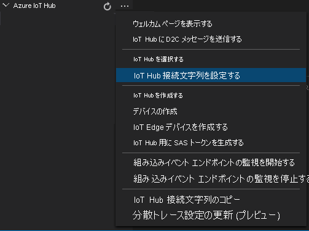
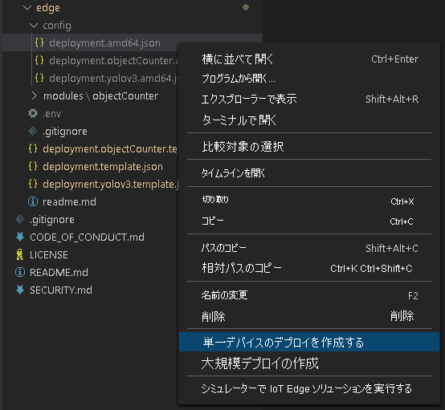

エッジ デバイスにデプロイされるモジュールは、配置マニフェストによって定義されます。 また、これらのモジュールの構成設定も定義されます。 

マニフェストをテンプレート ファイルから生成して、エッジ デバイスにデプロイするには、これらの手順に従います。

1. Visual Studio Code を開きます。
1. **[Azure IoT Hub]** ペインの横にある **[その他のアクション]** アイコンを選択して、IoT Hub 接続文字列を設定します。 この文字列は、*src/cloud-to-device-console-app/appsettings.json* ファイルからコピーすることができます。 

    

> [!NOTE]
> IoT ハブに使用する組み込みのエンドポイント情報を入力するよう求められる場合があります。 この情報を入手するには、Azure portal で IoT ハブに移動し、左側のナビゲーション ペインで **[組み込みのエンドポイント]** オプションを探します。 それをクリックし、 **[イベント ハブ互換エンドポイント]** セクションの **[イベント ハブ互換エンドポイント]** を探します。 ボックス内のテキストをコピーして使用します。 エンドポイントは次のようになります。  
    ```
    Endpoint=sb://iothub-ns-xxx.servicebus.windows.net/;SharedAccessKeyName=iothubowner;SharedAccessKey=XXX;EntityPath=<IoT Hub name>
    ```

1. **src/edge/deployment.template.json** を右クリックして、 **[Generate IoT Edge deployment manifest]\(IoT Edge 配置マニフェストの生成\)** を選択します。

    

    このアクションによって、*deployment.amd64.json* という名前のマニフェスト ファイルが *src/edge/config* フォルダーに作成されます。
1. **src/edge/config/deployment.amd64.json** を右クリックして、 **[Create Deployment for Single Device]\(単一デバイスのデプロイの作成\)** を選択し、エッジ デバイスの名前を選択します。

    

1. IoT Hub デバイスを選択するように求めるメッセージが表示されたら、ドロップダウン メニューから **[lva-sample-device]** を選択します。
1. 約 30 秒後に、ウィンドウの左下隅で Azure IoT Hub を最新の情報に更新します。 エッジ デバイスには、次のデプロイ済みモジュールが表示されます。

    * Live Video Analytics on IoT Edge (モジュール名 `lvaEdge`)
    * リアルタイム ストリーミング プロトコル (RTSP) シミュレーター (モジュール名 `rtspsim`)

RTSP シミュレーター モジュールは、[Live Video Analytics リソース セットアップ スクリプト](https://github.com/Azure/live-video-analytics/tree/master/edge/setup)の実行時にエッジ デバイスにコピーされたビデオ ファイルを使用して、ライブ ビデオ ストリームをシミュレートします。 

> [!NOTE]
> セットアップ スクリプトによってプロビジョニングされたものではなく、独自のエッジ デバイスを使用している場合は、エッジ デバイスにアクセスし、**管理者権限** で次のコマンドを実行して、このクイックスタートで使用するサンプル ビデオ ファイルをプルして保存します。  

```
mkdir /home/lvaedgeuser/samples      
mkdir /home/lvaedgeuser/samples/input    
curl https://lvamedia.blob.core.windows.net/public/camera-300s.mkv > /home/lvaedgeuser/samples/input/camera-300s.mkv  
chown -R lvalvaedgeuser:localusergroup /home/lvaedgeuser/samples/  
```
この段階でモジュールはデプロイされていますが、メディア グラフはアクティブになっていません。
