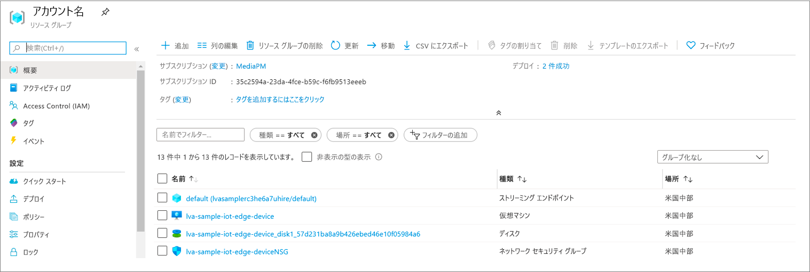

MP4 ファイルは、VIDEO_OUTPUT_FOLDER_ON_DEVICE キーを使用して *.env* ファイルで構成したエッジ デバイス上のディレクトリに書き込まれます。 既定値を使用している場合、結果は */var/media/* フォルダーに配置されます。

MP4 クリップを再生するには、次のようにします。

1. リソース グループに移動して VM を見つけ、Azure Bastion を使用して接続します。

    
    
    
1. [Azure リソースを設定](../../../detect-motion-emit-events-quickstart.md#set-up-azure-resources)したときに生成された資格情報を使用して、サインインします。 
1. コマンド プロンプトで、関連するディレクトリに移動します。 既定の場所は */var/media* です。 MP4 ファイルがこのディレクトリで見つかります。

     

1. [Secure Copy (SCP)](../../../../../virtual-machines/linux/copy-files-to-linux-vm-using-scp.md) を使用して、このファイルをローカル コンピューターにコピーします。 
1. [VLC メディア プレーヤー](https://www.videolan.org/vlc/)またはその他の MP4 プレーヤーを使用して、ファイルを再生します。
