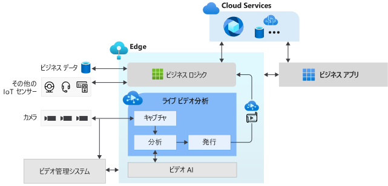

# Live Video Analytics on IoT Edge とは (プレビュー)

Live Video Analytics on IoT Edge は、エッジとクラウドにまたがるインテリジェントなビデオ アプリケーションを構築するためのプラットフォームを提供します。 このプラットフォームは、ライブ ビデオをキャプチャ、録画、分析する機能のほか、その結果 (ビデオやビデオ分析) を Azure サービス (クラウドやエッジ) に発行する機能を備えています。 このプラットフォームは、ビデオ分析を使用して IoT ソリューションを強化するために使用できます。 Live Video Analytics on IoT Edge 機能は、他の Azure IoT Edge モジュール (Stream Analytics on IoT Edge、Cognitive Services on IoT Edge など) や、クラウドの Azure サービス (Media Services、イベント ハブ、Cognitive Services など) と組み合わせて、強力なハイブリッド (たとえばエッジ + クラウド) アプリケーションを構築できます。

Live Video Analytics on IoT Edge は、拡張可能なプラットフォームとして設計されており、さまざまなビデオ分析エッジ モジュール (Cognitive Services コンテナーや、オープンソースの機械学習モデルまたは独自のデータでトレーニングしたカスタム モデルを使用して自分で構築したカスタム エッジ モジュールなど) を接続できます。それらを使用して、ライブ ビデオ パイプラインを構築および実行する複雑さを気にすることなく、ライブ ビデオを分析できます。

## IoT ソリューション開発の高速化 

ビデオ分析を他の IoT センサーからの信号やビジネス データと組み合わせる IoT ソリューションは、ビジネス上の意思決定の自動化または半自動化に役立ち、生産性を高めます。 Live Video Analytics on IoT Edge では、このようなソリューションをより迅速に構築できます。 ビジネスに固有のビデオ分析モジュールとロジックの構築に専念でき、ビデオ パイプラインの管理と実行の複雑さは、プラットフォームによって隠されます。

Live Video Analytics on IoT Edge を使用すると、既存の[ビデオ管理システム (VMS)](https://en.wikipedia.org/wiki/Video_management_system) で引き続き [CCTV カメラ](https://en.wikipedia.org/wiki/Closed-circuit_television_camera)を使用し、独立したビデオ分析アプリを構築できます。 Live Video Analytics on IoT Edge を、Computer Vision SDK およびツールキットと組み合わせて使用することで、最先端の IoT ソリューションを構築できます。 以下の図は、これを示しています。

## サポートされている環境

Linux x86-64 および ARM64 環境がサポートされています。
> [!NOTE]
> ARM64 デバイスのサポートは、ビルド `1.0.4` 以降で利用できます。
> ARM64 デバイスでの Azure IoT Edge ランタイムの実行のサポートは、[パブリック プレビュー](https://azure.microsoft.com/support/legal/preview-supplemental-terms/)中です。

## はじめに

以下の概念に関する記事を読み、ライブ ビデオ フィードでモーション検出を実行するクイックスタートを試してみてください。

### 概念

* [メディア グラフ](media-graph-concept.md)
* [ビデオ録画](video-recording-concept.md)
* [ビデオ再生](video-playback-concept.md)
* [継続的なビデオ記録](continuous-video-recording-concept.md)
* [イベントベースのビデオ記録](event-based-video-recording-concept.md)
* [ビデオ記録を行わない Live Video Analytics](analyze-live-video-concept.md)

## 次のステップ

* [クイックスタート: 独自のモデルでの Live Video Analytics の実行](use-your-model-quickstart.md)に関する記事に従って、ライブ ビデオ フィードでモーション検出を実行する方法について確認します。
* [用語](terminology.md)を確認します
* [Live Video Analytics のオープン ソース資料](https://github.com/Azure/live-video-analytics)を調べます

