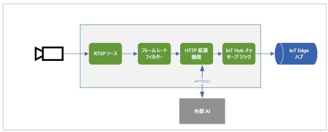

# <a name="quickstart-analyze-live-video-by-using-your-own-model"></a>クイック スタート:独自のモデルを使用してライブ ビデオを分析する

このクイックスタートでは、Live Video Analytics on IoT Edge を使用して、(シミュレートされた) IP カメラからのライブ ビデオ フィードを分析する方法について説明します。 コンピューター ビジョン モデルを適用して、オブジェクトを検出する方法を確認します。 ライブ ビデオ フィード内のフレームのサブセットが、推論サービスに送信されます。 その結果が IoT Edge Hub に送信されます。 

このクイックスタートでは、IoT Edge デバイスとして Azure VM を使用し、シミュレートされたライブ ビデオ ストリームも使用します。 これは、C# で記述されたサンプル コードに基づいており、クイックスタート「[モーションの検出とイベントの生成](detect-motion-emit-events-quickstart.md)」を基に構築されています。 

## <a name="prerequisites"></a>前提条件

* アクティブなサブスクリプションが含まれる Azure アカウント。 まだお持ちでない場合は、[無料のアカウントを作成してください](https://azure.microsoft.com/free/?WT.mc_id=A261C142F)。
* [Visual Studio Code](https://code.visualstudio.com/) と次の拡張機能。
    * [Azure IoT Tools](https://marketplace.visualstudio.com/items?itemName=vsciot-vscode.azure-iot-tools)
    * [C#](https://marketplace.visualstudio.com/items?itemName=ms-dotnettools.csharp)
* [.NET Core 3.1 SDK](https://dotnet.microsoft.com/download/dotnet-core/3.1)。
* クイックスタート「[モーションの検出とイベントの生成](detect-motion-emit-events-quickstart.md)」を完了していない場合は、必ず [Azure リソースを設定](detect-motion-emit-events-quickstart.md#set-up-azure-resources)してください。

> [!TIP]
> Azure IoT Tools をインストールするときに、Docker のインストールを求められる場合があります。 このメッセージは無視してかまいません。

## <a name="review-the-sample-video"></a>サンプル ビデオを確認する
Azure リソースを設定する際に、高速道路のトラフィックの短いビデオが、IoT Edge デバイスとして使用している、Azure の Linux VM にコピーされます。 このクイックスタートでは、このビデオ ファイルを使用してライブ ストリームをシミュレートします。

[VLC メディア プレーヤー](https://www.videolan.org/vlc/)などのアプリケーションを開きます。 Ctrl キーを押しながら N キーを押し、リンクを[ビデオ](https://lvamedia.blob.core.windows.net/public/camera-300s.mkv)に貼り付けて、再生を開始します。 高速道路のトラフィック内を移動する多くの車両の映像が表示されます。

このクイックスタートでは、Live Video Analytics on IoT Edge を使用して、車両や人物などのオブジェクトを検出します。 関連付けられている推論イベントを IoT Edge Hub に発行します。

## <a name="overview"></a>概要



この図は、このクイックスタートでのシグナルの流れを示しています。 [エッジ モジュール](https://github.com/Azure/live-video-analytics/tree/master/utilities/rtspsim-live555)は、リアルタイム ストリーミング プロトコル (RTSP) サーバーをホストする IP カメラをシミュレートします。 [RTSP ソース](media-graph-concept.md#rtsp-source) ノードは、このサーバーからビデオ フィードをプルし、[フレーム レート フィルター プロセッサ](media-graph-concept.md#frame-rate-filter-processor) ノードにビデオ フレームを送信します。 このプロセッサは、[HTTP 拡張プロセッサ](media-graph-concept.md#http-extension-processor) ノードに到達するビデオ ストリームのフレーム レートを制限します。 

HTTP 拡張ノードは、プロキシの役割を果たします。 ビデオ フレームを、指定した画像の種類に変換します。 次に、その画像を、HTTP エンドポイントの背後で AI モデルを実行する別のエッジ モジュールに、REST 経由で転送します。 この例では、そのエッジ モジュールは、さまざまな種類のオブジェクトを検出できる [YOLOv3](https://github.com/Azure/live-video-analytics/tree/master/utilities/video-analysis/yolov3-onnx) モデルを使用して構築されています。 HTTP 拡張プロセッサ ノードは、検出結果を収集し、イベントを [IoT Hub シンク](media-graph-concept.md#iot-hub-message-sink) ノードに発行します。 次に、このノードはこれらのイベントを [IoT Edge Hub](../../iot-edge/iot-edge-glossary.md#iot-edge-hub) に送信します。

このクイックスタートでは次の作業を行います。

1. メディア グラフを作成してデプロイする。
1. 結果を解釈する。
1. リソースをクリーンアップする。


## <a name="create-and-deploy-the-media-graph"></a>メディア グラフを作成してデプロイする
    
### <a name="examine-and-edit-the-sample-files"></a>サンプル ファイルを調べて編集する

前提条件の一環として、サンプル コードをフォルダーにダウンロードしてあります。 サンプル ファイルを確認して編集するには、これらの手順に従います。

1. Visual Studio Code で、*src/edge* に移動します。 *.env* ファイルと、いくつかの展開テンプレート ファイルがあります。

    展開テンプレートは、エッジ デバイスの配置マニフェストを参照しています。 そこには、いくつかのプレースホルダー値が含まれています。 *.env* ファイルには、それらの変数の値が格納されています。

1. *src/cloud-to-device-console-app* フォルダーに移動します。 ここには、*appsettings.json* ファイルと、他にいくつかのファイルがあります。

    * ***c2d-console-app.csproj*** - Visual Studio Code のプロジェクト ファイルです。
    * ***operations.json*** - プログラムで実行する操作のリストです。
    * ***Program.cs*** - サンプル プログラム コードです。 このコードによって以下が行われます。

        * アプリ設定を読み込みます。
        * Live Video Analytics on IoT Edge モジュールによって公開されているダイレクト メソッドを呼び出します。 このモジュールを使用し、その[ダイレクト メソッド](direct-methods.md)を呼び出すことで、ライブ ビデオ ストリームを分析できます。
        * プログラムの出力を **[ターミナル]** ウィンドウで調べたり、モジュールによって生成されたイベントを **[出力]** ウィンドウで調べたりできるように、一時停止します。
        * ダイレクト メソッドを呼び出して、リソースをクリーンアップします。


1. *operations.json* ファイルを編集します。
    * グラフ トポロジへのリンクを変更します。

        `"topologyUrl" : "https://raw.githubusercontent.com/Azure/live-video-analytics/master/MediaGraph/topologies/httpExtension/topology.json"`

    * `GraphInstanceSet` で、前のリンクの値と一致するようにグラフ トポロジの名前を編集します。

      `"topologyName" : "InferencingWithHttpExtension"`

    * `GraphTopologyDelete` で、名前を編集します。

      `"name": "InferencingWithHttpExtension"`

### <a name="generate-and-deploy-the-iot-edge-deployment-manifest"></a>IoT Edge の配置マニフェストを生成してデプロイする

1. *src/edge/ deployment.yolov3.template.json* ファイルを右クリックし、 **[Generate IoT Edge Deployment Manifest]\(IoT Edge 配置マニフェストの生成\)** を選択します。

      

    *deployment.yolov3.amd64.json* マニフェスト ファイルが *src/edge/config* フォルダーに作成されます。

1. クイックスタート「[モーションの検出とイベントの生成](detect-motion-emit-events-quickstart.md)」を完了している場合は、この手順をスキップしてください。 

    それ以外の場合は、左下隅の **[Azure IoT Hub]** ペインの近くにある **[その他のアクション]** アイコンを選択して、 **[Set IoT Hub Connection String]\(IoT Hub 接続文字列の設定\)** を選択します。 この文字列は、*appsettings.json* ファイルからコピーできます。 または、Visual Studio Code 内で適切な IoT ハブが構成されていることを確認するには、[[Select IoT hub]\(IoT ハブの選択\) コマンド](https://github.com/Microsoft/vscode-azure-iot-toolkit/wiki/Select-IoT-Hub)を使用します。
    
    

1. *src/edge/config/deployment.yolov3.amd64.json* を右クリックし、 **[Create Deployment for Single Device]\(単一デバイスのデプロイの作成\)** を選択します。 

    

1. IoT Hub デバイスを選択するように求めるメッセージが表示されたら、 **[lva-sample-device]** を選択します。
1. 約 30 秒後に、ウィンドウの左下隅で Azure IoT Hub を最新の情報に更新します。 エッジ デバイスには、次のデプロイ済みモジュールが表示されます。

    * **lvaEdge** という名前の Live Video Analytics モジュール
    * **rtspsim** モジュール。RTSP サーバーをシミュレートし、ライブ ビデオ フィードのソースとして機能します
    * **yolov3** モジュール。これは、コンピューター ビジョンを画像に適用し、オブジェクトの種類のクラスを複数返す YOLOv3 オブジェクト検出モデルです
 
      

### <a name="prepare-to-monitor-events"></a>イベントの監視の準備をする

Live Video Analytics デバイスを右クリックし、 **[組み込みイベント エンドポイントの監視を開始する]** を選択します。 この手順は、Visual Studio Code の **[出力]** ウィンドウで、IoT Hub イベントを監視するために必要です。 

 

### <a name="run-the-sample-program"></a>サンプル プログラムを実行する

1. デバッグ セッションを開始するには、F5 キーを押します。 **[ターミナル]** ウィンドウにメッセージが出力されるのを確認できます。
1. *operations.json* コードは、ダイレクト メソッド `GraphTopologyList` および `GraphInstanceList` の呼び出しから始まります。 前回のクイックスタートを完了した後にリソースをクリーンアップしている場合は、このプロセスにより空のリストが返されてから、一時停止します。 続行するには、Enter キーを押します。

   ```
   --------------------------------------------------------------------------
   Executing operation GraphTopologyList
   -----------------------  Request: GraphTopologyList  --------------------------------------------------
   {
   "@apiVersion": "1.0"
   }
   ---------------  Response: GraphTopologyList - Status: 200  ---------------
   {
   "value": []
   }
   --------------------------------------------------------------------------
   Executing operation WaitForInput
   Press Enter to continue
   ```

    **[ターミナル]** ウィンドウに、次の一連のダイレクト メソッド呼び出しが表示されます。

     * 前の `topologyUrl` を使用する `GraphTopologySet` の呼び出し
     * 次の本文を使用する `GraphInstanceSet` の呼び出し。

         ```
         {
           "@apiVersion": "1.0",
           "name": "Sample-Graph-1",
           "properties": {
             "topologyName": "InferencingWithHttpExtension",
             "description": "Sample graph description",
             "parameters": [
               {
                 "name": "rtspUrl",
                 "value": "rtsp://rtspsim:554/media/camera-300s.mkv"
               },
               {
                 "name": "rtspUserName",
                 "value": "testuser"
               },
               {
                 "name": "rtspPassword",
                 "value": "testpassword"
               }
             ]
           }
         }
         ```

     * グラフ インスタンスとビデオのフローを開始する `GraphInstanceActivate` の呼び出し
     * グラフ インスタンスが実行状態であることを示す `GraphInstanceList` の 2 回目の呼び出し
1. **[ターミナル]** ウィンドウの出力は `Press Enter to continue` プロンプトで一時停止します。 Enter キーはまだ押さないでください。 上へスクロールして、呼び出したダイレクト メソッドの JSON 応答のペイロードを確認します。
1. Visual Studio Code の **[出力]** ウィンドウに切り替えます。 Live Video Analytics on IoT Edge モジュールから IoT ハブに送信されているメッセージが表示されます。 このクイックスタートの次のセクションでは、これらのメッセージについて説明します。
1. メディア グラフは引き続き実行され、結果が出力されます。 RTSP シミュレーターによって、ソース ビデオがループ処理され続けます。 メディア グラフを停止するには、 **[ターミナル]** ウィンドウに戻り、Enter キーを押します。 

    次の一連の呼び出しによって、リソースがクリーンアップされます。
      * `GraphInstanceDeactivate` の呼び出しによって、グラフ インスタンスが非アクティブ化されます。
      * `GraphInstanceDelete` の呼び出しによって、インスタンスが削除されます。
      * `GraphTopologyDelete` の呼び出しによって、トポロジが削除されます。
      * `GraphTopologyList` の最後の呼び出しによって、リストが空であることが示されます。

## <a name="interpret-results"></a>結果を解釈する

メディア グラフを実行すると、HTTP 拡張プロセッサ ノードから IoT Hub シンク ノードを介して IoT ハブに結果が渡されます。 **[出力]** ウィンドウに表示されるメッセージには、`body` セクションと `applicationProperties` セクションが含まれています。 詳細については、「[IoT Hub メッセージを作成し、読み取る](https://docs.microsoft.com/azure/iot-hub/iot-hub-devguide-messages-construct)」を参照してください。

次のメッセージ内のアプリケーションのプロパティと body の内容は、Live Video Analytics モジュールによって定義されています。 

### <a name="mediasessionestablished-event"></a>MediaSessionEstablished イベント

メディア グラフがインスタンス化されると、RTSP ソース ノードは、rtspsim-live555 コンテナーで実行されている RTSP サーバーへの接続を試みます。 接続に成功すると、次のイベントが出力されます。 イベントの種類は `Microsoft.Media.MediaGraph.Diagnostics.MediaSessionEstablished` です。

```
[IoTHubMonitor] [9:42:18 AM] Message received from [lvaedgesample/lvaEdge]:
{
  "body": {
    "sdp": "SDP:\nv=0\r\no=- 1586450538111534 1 IN IP4 nnn.nn.0.6\r\ns=Matroska video+audio+(optional)subtitles, streamed by the LIVE555 Media Server\r\ni=media/camera-300s.mkv\r\nt=0 0\r\na=tool:LIVE555 Streaming Media v2020.03.06\r\na=type:broadcast\r\na=control:*\r\na=range:npt=0-300.000\r\na=x-qt-text-nam:Matroska video+audio+(optional)subtitles, streamed by the LIVE555 Media Server\r\na=x-qt-text-inf:media/camera-300s.mkv\r\nm=video 0 RTP/AVP 96\r\nc=IN IP4 0.0.0.0\r\nb=AS:500\r\na=rtpmap:96 H264/90000\r\na=fmtp:96 packetization-mode=1;profile-level-id=4D0029;sprop-parameter-sets=Z00AKeKQCgC3YC3AQEBpB4kRUA==,aO48gA==\r\na=control:track1\r\n"
  },
  "applicationProperties": {
    "dataVersion": "1.0",
    "topic": "/subscriptions/{subscriptionID}/resourceGroups/{name}/providers/microsoft.media/mediaservices/hubname",
    "subject": "/graphInstances/GRAPHINSTANCENAMEHERE/sources/rtspSource",
    "eventType": "Microsoft.Media.MediaGraph.Diagnostics.MediaSessionEstablished",
    "eventTime": "2020-04-09T16:42:18.1280000Z"
  }
}
```

このメッセージでは、以下の詳細に注目します。

* このメッセージは、診断イベントです。 `MediaSessionEstablished` は、RTSP ソース ノード (subject) が RTSP シミュレーターと接続され、(シミュレートされた) ライブ フィードの受信を開始したことを示します。
* `applicationProperties` 内の `subject` は、メッセージがメディア グラフの RTSP ソース ノードから生成されたことを示しています。
* `applicationProperties` 内の `eventType` は、このイベントが診断イベントであることを示しています。
* `eventTime` はイベントの発生時刻を示しています。
* `body` には、診断イベントに関するデータが含まれています。 このケースでは、データは[セッション記述プロトコル (SDP)](https://en.wikipedia.org/wiki/Session_Description_Protocol) の詳細で構成されています。

### <a name="inference-event"></a>推論イベント

HTTP 拡張プロセッサ ノードは、yolov3 モジュールから推論の結果を受け取ります。 次に、IoT Hub シンク ノードを介して、推論イベントとして結果を出力します。 

これらのイベントの種類は `entity` に設定されており、それが車やトラックなどのエンティティであることを示しています。 `eventTime` の値は、オブジェクトが検出された UTC 時刻です。 

次の例では、同じビデオ フレーム内で、信頼度のレベルが異なる 2 台の車が検出されています。

```
[IoTHubMonitor] [11:37:17 PM] Message received from [lva-sample-device/lvaEdge]:
{
  "body": {
    "inferences": [
      {
        "entity": {
          "box": {
            "h": 0.0344108157687717,
            "l": 0.5756940841674805,
            "t": 0.5929375966389974,
            "w": 0.04484643936157227
          },
          "tag": {
            "confidence": 0.8714089393615723,
            "value": "car"
          }
        },
        "type": "entity"
      },
      {
        "entity": {
          "box": {
            "h": 0.03960910373263889,
            "l": 0.2750667095184326,
            "t": 0.6102327558729383,
            "w": 0.031027007102966308
          },
          "tag": {
            "confidence": 0.7042660713195801,
            "value": "car"
          }
        },
        "type": "entity"
      }
    ]
  },
  "applicationProperties": {
    "topic": "/subscriptions/{subscriptionID}/resourceGroups/{name}/providers/microsoft.media/mediaservices/hubname",
    "subject": "/graphInstances/GRAPHINSTANCENAMEHERE/processors/inferenceClient",
    "eventType": "Microsoft.Media.Graph.Analytics.Inference",
    "eventTime": "2020-04-23T06:37:16.097Z"
  }
}
```

メッセージでは、次の詳細に注目します。

* `applicationProperties` 内の `subject` は、メッセージの生成元となった、グラフ トポロジ内のノードを参照しています。 
* `applicationProperties` 内の `eventType` は、このイベントが分析イベントであることを示しています。
* `eventTime` 値は、イベントが発生した時刻です。
* `body` セクションには、分析イベントに関するデータが含まれています。 このケースでは、イベントは推論イベントであるため、本文には `inferences` データが含まれています。
* `inferences` セクションは、`type` が `entity` であることを示しています。 このセクションには、エンティティに関する追加のデータが含まれています。

## <a name="clean-up-resources"></a>リソースをクリーンアップする

他のクイックスタートに取り組む場合は、作成したリソースをそのまま残しておきます。 それ以外の場合は、Azure portal にアクセスして、ご利用のリソース グループに移動し、このクイックスタートを実行したリソース グループを選択して、そのリソースをすべて削除してください。

## <a name="next-steps"></a>次のステップ

上級ユーザー向けのその他の課題を確認します。

* RTSP シミュレーターを使用する代わりに、RTSP をサポートする [IP カメラ](https://en.wikipedia.org/wiki/IP_camera)を使用します。 RTSP をサポートする IP カメラは、[ONVIF 準拠製品](https://www.onvif.org/conformant-products/)のページで検索できます。 プロファイル G、S、または T に準拠しているデバイスを探します。
* Azure Linux VM ではなく、AMD64 または x64 Linux デバイスを使用してください。 このデバイスは、IP カメラと同じネットワーク内にある必要があります。 [Linux への Azure IoT Edge ランタイムのインストール](https://docs.microsoft.com/azure/iot-edge/how-to-install-iot-edge-linux)に関するページの手順を参照できます。 次に、「[初めての IoT Edge モジュールを Linux 仮想デバイスにデプロイする](https://docs.microsoft.com/azure/iot-edge/quickstart-linux)」の手順に従って、デバイスを Azure IoT Hub に登録します。

