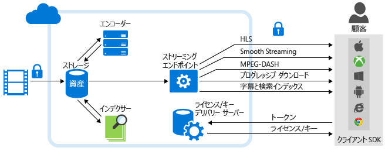

<properties
	pageTitle="Azure Media Services Analytics の概要 | Microsoft Azure"
	description="Azure Media Services では、Media Analytics のパブリック プレビュー (エンタープライズ規模での音声およびコンピューター ビジョン サービス、コンプライアンス、セキュリティ、およびグローバル展開をまとめたもの) を提供しています。Azure Media Analytics サービスは、Azure Media Services の基本的なプラットフォーム コンポーネントを使用して構築されているので、1 日目からいつでも規模に応じてメディアを処理することができます。"
	services="media-services"
	documentationCenter=""
	authors="juliako"
	manager="erikre"
	editor=""/>

<tags
	ms.service="media-services"
	ms.workload="media"
	ms.tgt_pltfrm="na"
	ms.devlang="dotnet"
	ms.topic="article"
	ms.date="09/14/2016"   
	ms.author="milanga;juliako;johndeu"/>

# Azure Media Services Analytics の概要 | Microsoft Azure

##Overview

従業員のトレーニング、お客様への対応、およびビジネス機能のドキュメント化で優先的に利用するメディアとしてビデオを取り入れる組織や企業が増えています。クラウド コンピューティングでは、このような大量のメディア ファイルの格納、ストリーミング、およびアクセスを効果的に行うことができます。しかし、所有するビデオのコンテンツ ライブラリが増大するにつれて、組織や企業は、対象ユーザーとのより意味のある個別化した対話を実現し、ビジネスを次のレベルに進めることができるよう、ビデオから新しい洞察を抽出するための効果的な手段も同様に準備する必要があります。

この市場で高まるニーズに対応するために、Azure Media Services には Media Analytics が用意されています。これは、組織と企業がビデオ ファイルから意思決定の基となる洞察を簡単に得られるようにする、(エンタープライズ向けの規模、コンプライアンス、セキュリティ、グローバルな展開で使用できる) 音声コンポーネントと視覚コンポーネントのコレクションです。Azure Media Analytics サービスは、Azure Media Services の基本的なプラットフォーム コンポーネントを使用して構築されているので、1 日目からいつでも規模に応じてメディアを処理することができます。

Azure Media Analytics を使用することで、開発者は、限定された規模でビデオ用のビジョン機能の使用を迅速に開始し、この高度な機能を、ボットやアプリケーションに取り込むことができます。Azure Media Analytics は、エンタープライズ環境での使用を目的として構築されており、大規模な組織で必要とされる本格的なスケール、コンプライアンス、セキュリティ、グローバル展開に対応します。

次の図には、**Media Analytics** のほか、Media Services プラットフォームの他の主要な部分が示されています。Media Analytics のメディア プロセッサによって MP4 ファイルまたは JSON ファイルが生成されることに注意してください。メディア プロセッサによって MP4 ファイルが生成された場合は、そのファイルのプログレッシブ ダウンロードが可能です。メディア プロセッサによって JSON ファイルが生成された場合は、そのファイルを Azure Blob Storage からダウンロードできます。

## Azure Media Analytics サービス

- **インデクサー** - Azure Media Indexer では、コンテンツを検索可能にすると共に、クローズド キャプション トラックを生成することができます。Azure Media Services では、**Azure Media Indexer 2 プレビュー**をリリースしました。インデックス作成が速くなり、サポートする言語が増えています。英語、スペイン語、フランス語、ドイツ語、イタリア語、中国語、ポルトガル語、アラビア語などがサポートされています。詳細な情報と例については、[Azure Media Indexer 2 を使用したビデオの処理](media-services-process-content-with-indexer2.md)に関するページを参照してください。
 
- **Hyperlapse** - Microsoft Hyperlapse は、Microsoft Research (MSR) での 20 年にわたるコンピューター ビジョン研究の成果として生まれたものです。ビデオ安定化と低速撮影を組み合わせて、長いフォーム コンテンツから、利用可能な美しいビデオをすばやく作成できます。低速撮影のほか、Hyperlapse では携帯電話やビデオ カメラを使用して撮影したブレのあるビデオから安定したビデオを作成することもできます。詳細と例については、「[Azure Media Hyperlapse を使用する Hyperlapse メディア ファイル](media-services-hyperlapse-content.md)」を参照してください。
 
- **モーション検出** - このサービスを使用することで、ひな形の背景を持つビデオでモーションを検出することができます。これは、監視ビデオ フィードで監視カメラによって検出された移動イベントに誤検出がないかどうかを確認する必要がある顧客にとって理想的なサービスです。詳細と例については、[Azure Media Analytics でのモーション検出](media-services-motion-detection.md)に関するページを参照してください。
 
- **顔の検出と顔の感情** - このサービスを使用すると、人の顔と感情を検出できます (喜び、悲しみ、驚き、怒り、軽蔑、恐れ、嫌悪、無関心/はっきりしない、など)。これは、イベントに参加している人の反応を収集し分析するなど、以下に説明するいくつかの業界アプリケーションに有用です。詳細と例については、[Azure Media Analytics での顔と感情の検出](media-services-face-and-emotion-detection.md)に関するページを参照してください。
 
- **ビデオ要約** - ビデオ要約では、ソース ビデオから興味深いスニペットが自動的に選択されるので、長いビデオの要約を簡単に作成することができます。これは、長いビデオにおいて予定されている内容の概要をすばやく提供する場合に便利です。詳細と例については、「[Azure Media Video Thumbnails を使用してビデオ要約を作成する](media-services-video-summarization.md)」を参照してください。

- **光学式文字認識** - Azure Media Analytics OCR (光学式文字認識) では、ビデオ ファイル内のテキスト コンテンツを編集かつ検索可能なデジタル テキストに変換できます。これにより、メディアのビデオ信号から有意なメタデータを自動的に抽出することができます。
 
- **スケーラブルな顔編集** - **Azure Media Redactor** は、クラウドでスケーラブルな顔編集を提供する Azure Media Analytics MP です。顔編集では、ビデオを編集して選択した個人の顔をぼかすことができます。顔編集サービスは、公共の安全やニュース媒体などに使用していただけます。複数人の顔を含んでいる映像の場合、顔編集を手作業で行うと数分の映像でも数時間かかりますが、このサービスを使えば数ステップの簡単な手順で完了します。詳細については、[こちらの記事](media-services-face-redaction.md)をご覧ください。

 
## 一般的なシナリオ

業種を超えて組織および企業は、Azure Media Analytics を使用することで、ビデオから新しい洞察を収集してさらに個別化した対象ユーザーおよび従業員のエンゲージメントを作成すると共に、大量のビデオ コンテンツを効果的に管理することができます。以下にいくつかのシナリオを紹介します。

- **コール センター** - ソーシャル メディアが登場しても、顧客サービス トランザクションの大部分は引き続きカスタマー コール センターによって支えられています。この音声データには顧客に関する豊富な情報がエンコードされています。これらの情報を分析すれば、製品のロードマップを向上させることができるほか、コール センターの従業員をトレーニングし高い顧客満足度を達成することができます。Azure Media Indexer を使用することで、顧客はテキストを抽出して検索インデックスとダッシュボードを構築し、最も一般的な苦情、苦情発生の原因、およびその他の関連するデータを取り巻くインテリジェンスを抽出することができます。

- **ユーザー生成のコンテンツ モデレート** - 新しい報道発信源から警察まで、多くの組織に一般向けのポータルがあり、そこでビデオや画像などの UGC メディアを受け入れています。コンテンツの量は、予期しないイベントが原因で急上昇することがあります。これらのシナリオで、コンテンツが適切かどうかを手動で効果的に確認することは不可能に近いと言えます。顧客は、コンテンツ モデレート サービスを利用して、適切なコンテンツに的を絞ることができます。

- **監視** - IP カメラの増加に伴い、監視ビデオが急増しています。監視ビデオを手動で確認するとなると、時間がかかり、ヒューマン エラーが発生しやすくなります。Azure Media Analytics では、派生物を確認、管理、および作成するプロセスをより簡単にするために、モーション検出、顔検出、Hyperlapse など、いくつかのコンポーネントを用意しています。

## Media Services Analytics のメディア プロセッサ 

ここでは、Media Services Analytics のすべてのメディア プロセッサ (MP) を紹介し、.NET または REST を使用して MP オブジェクトを取得する方法について説明します。

### MP 名

- Azure Media Indexer 2 プレビュー
- Azure Media Indexer
- Azure Media Hyperlapse
- Azure Media Face Detector
- Azure Media Motion Detector
- Azure Media Video Thumbnails
- Azure Media OCR

### .NET

次の関数は、指定された MP 名のいずれかを取得し、MP オブジェクトを返します。

    static IMediaProcessor GetLatestMediaProcessorByName(string mediaProcessorName)
    {
        var processor = _context.MediaProcessors
            .Where(p => p.Name == mediaProcessorName)
            .ToList()
            .OrderBy(p => new Version(p.Version))
            .LastOrDefault();

        if (processor == null)
            throw new ArgumentException(string.Format("Unknown media processor",
                                                       mediaProcessorName));

        return processor;
    }

## REST ()

要求:

	GET https://media.windows.net/api/MediaProcessors()?$filter=Name%20eq%20'Azure%20Media%20OCR' HTTP/1.1
	DataServiceVersion: 1.0;NetFx
	MaxDataServiceVersion: 3.0;NetFx
	Accept: application/json
	Accept-Charset: UTF-8
	User-Agent: Microsoft ADO.NET Data Services
	Authorization: Bearer <token>
	x-ms-version: 2.12
	Host: media.windows.net
	
応答:
		
	. . .
	
	{  
	   "odata.metadata":"https://media.windows.net/api/$metadata#MediaProcessors",
	   "value":[  
	      {  
	         "Id":"nb:mpid:UUID:074c3899-d9fb-448f-9ae1-4ebcbe633056",
	         "Description":"Azure Media OCR",
	         "Name":"Azure Media OCR",
	         "Sku":"",
	         "Vendor":"Microsoft",
	         "Version":"1.1"
	      }
	   ]
	}

##デモ

[Azure Media Analytics デモ](http://azuremedialabs.azurewebsites.net/demos/Analytics.html)

##次のステップ

Media Services のラーニング パスを確認します。

[AZURE.INCLUDE [media-services-learning-paths-include](../../includes/media-services-learning-paths-include.md)]

##フィードバックの提供

[AZURE.INCLUDE [media-services-user-voice-include](../../includes/media-services-user-voice-include.md)]

##関連記事

[Media Services Analytics のお知らせ](https://azure.microsoft.com/blog/introducing-azure-media-analytics/)
  

<!-- Images -->

[overview]: ./media/media-services-video-on-demand-workflow/media-services-video-on-demand.png

<!---HONumber=AcomDC_0921_2016-->