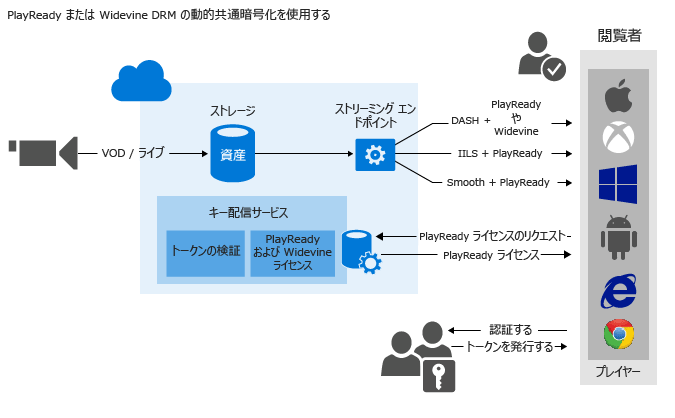
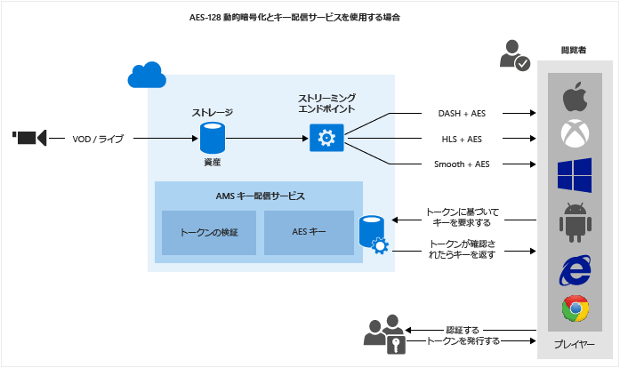

<properties 
	pageTitle="コンテンツ保護の概要 | Microsoft Azure" 
	description="この記事では、Media Services でのコンテンツ保護の概要について説明します。" 
	services="media-services" 
	documentationCenter="" 
	authors="Juliako" 
	manager="erikre" 
	editor=""/>

<tags 
	ms.service="media-services" 
	ms.workload="media" 
	ms.tgt_pltfrm="na" 
	ms.devlang="na" 
	ms.topic="article" 
	ms.date="09/19/2016" 
	ms.author="juliako"/>

#コンテンツ保護の概要

Microsoft Azure Media Services を使用すると、メディアがコンピューターから離れてから、保存、処理、配信されるまでのセキュリティ保護が可能になります。Media Services では、Advanced Encryption Standard (AES) (128 ビット暗号化キーを使用) と、PlayReady や Widevine DRM を使用する共通暗号化 (CENC) 使用して、動的に暗号化したコンテンツを配信できます。Media Services では、承認されたクライアントに AES キーと PlayReady ライセンスを配信するためのサービスも提供しています。[Axinom](http://www.axinom.com/press/ibc-axinom-drm-6/)、[EZDRM](http://ezdrm.com/)、[castLabs](http://castlabs.com/company/partners/azure/) の各 AMS パートナーを使用して、Widevine ライセンスを提供することもできます。

- 次に、"PlayReady と Widevine DRM の動的共通暗号化" ワークフローの説明図を示します。詳細については、「[PlayReady DRM の動的暗号化とライセンス提供サービスの使用](media-services-protect-with-drm.md)」を参照してください。

- 次に、"AES-128 動的暗号化" ワークフローの説明図を示します。詳細については、「[AES-128 動的暗号化とキー配信サービスの使用](media-services-protect-with-aes128.md)」を参照してください。

>[AZURE.NOTE]動的暗号化を使用するには、暗号化されたコンテンツのストリーミング元となるストリーミング エンドポイントに、少なくとも 1 つのストリーミング予約ユニットが必要です。

##資産暗号化オプション

アップロードするコンテンツの種類に応じて、Media Services によって提供されるさまざまな暗号化オプションから選択できます。

###なし

暗号化は使用されません。これが既定値です。このオプションを使用した場合、送信経路上とストレージ内のいずれにおいてもコンテンツが保護されません。

プログレッシブ ダウンロードを使用して MP4 を配信する場合は、このオプションを使用してコンテンツをアップロードします。

###StorageEncrypted

**StorageEncrypted** で AES 256 ビット暗号化を使用してクリア コンテンツをローカルに暗号化し、それを Azure Storage にアップロードすると、コンテンツが保存時に暗号化された状態で格納されます。ストレージの暗号化で保護された資産は、エンコーディングの前に自動的に暗号化が解除され、暗号化されたファイル システムに置かれます。その後、新しい出力資産として再度アップロードする前に必要に応じて再度暗号化されます。ストレージの暗号化の主な使用事例としては、高品質の入力メディア ファイルをディスクに保存するときに強力な暗号化を使用してセキュリティを保護する場合が挙げられます。

ストレージで暗号化された資産を配信するためには、資産の配信ポリシーを構成して、コンテンツの配信方法を Media Services に指示する必要があります。資産をストリーミングするには、ストリーミング サーバーでストレージ暗号化を解除し、指定された配信ポリシー (AES、共通暗号化、暗号化なしなど) を使用してコンテンツをストリーミングする必要があります。

####実装の詳細

AMS の記憶域暗号化は、ファイル全体に **AES-CTR** モードの暗号化を適用します。AES-CTR モードは、任意の長さのデータを暗号化できるブロック暗号です。埋め込みの必要はありません。AES アルゴリズムを使用してカウンター ブロックを暗号化し、AES の出力と、暗号化または復号化するデータの排他論理和をとるという演算です。使用されるカウンター ブロックを構築するには、InitializationVector の値をカウンター値のバイト 0 から 7 にコピーし、カウンター値のバイト 8 から 15 はゼロに設定します。16 バイトのカウンター ブロックのうち、バイト 8 から 15 (つまり、下位バイト) は単純な符号なし 64 ビット整数として使用されます。それ以降に処理されるデータのブロックごとに 1 ずつ増分され、ネットワーク バイト順は維持されます。整数が最大値 (0xFFFFFFFFFFFFFFFF) に達すると、増分によってゼロにリセットされます (バイト 8 から 15)。残りの 64 ビットのカウンター (バイト 0 から 7) には影響がありません。AES-CTR モード暗号化のセキュリティを維持するには、指定された KID の InitializationVector 値をファイルごとに一意にする必要があります。また、ファイルの長さを 2^64 ブロック未満にする必要があります。これによって、カウンター値が特定のキーに再利用されないようにすることができます。CTR モードの詳細については、[こちらの wiki ページ](https://en.wikipedia.org/wiki/Block_cipher_mode_of_operation#CTR) ("InitializationVector" ではなく "Nonce" という用語を使用する wiki 記事) を参照してください。

基本のアルゴリズムの機能を確認するには、次のメソッドの AMS .NET 実装を確認します。

- [ApplyEncryptionTransform](https://github.com/Azure/azure-sdk-for-media-services/blob/dev/src/net/Client/Common/Common.BlobTransfer/BlobTransferBase.cs)
- [AesCtr](https://github.com/Azure/azure-sdk-for-media-services/blob/dev/src/net/Client/Common/Common.FileEncryption/FileEncryptionTransform.cs)

###CommonEncryptionProtected

共通暗号化を使用してコンテンツを暗号化する場合 (または暗号化済みのコンテンツをアップロードする場合) は、**CommonEncryptionProtected** を使用します。PlayReady と Widevine はいずれも共通暗号化 (CENC) 仕様に従って暗号化されているので、AMS でサポートされます。

###EnvelopeEncryptionProtected

**EnvelopeEncryptionProtected** を使用するのは、AES (Advanced Encryption Standard) で暗号化された HLS (HTTP ライブ ストリーミング) を保護または (既に保護されている HLS を) アップロードする場合です。AES で既に暗号化された HLS をアップロードする場合、HLS は Transform Manager によって暗号化されている必要があることに注意してください。

##動的な暗号化

Microsoft Azure Media Services では、Advanced Encryption Standard (AES) (128 ビット暗号化キーを使用) と PlayReady または Widevine DRM を使用して動的に暗号化したコンテンツを配信できます。

現時点では、以下のストリーミング形式を暗号化できます。HLS、MPEG DASH、およびスムーズ ストリーミング。HDS 形式のストリーミングやプログレッシブ ダウンロードは暗号化できません。

Media Services で資産を暗号化する場合は、暗号化キー (CommonEncryption か EnvelopeEncryption) を資産に関連付ける必要があります。また、キーの承認ポリシーを構成する必要があります。

資産の配信ポリシーを構成する必要もあります。ストレージで暗号化された資産をストリーミングする場合は、資産の配信ポリシーを構成して、資産の配信方法を指定する必要があります。

プレーヤーがストリームを要求すると、Media Services は指定されたキーを使用して、AES か共通暗号化でコンテンツを動的に暗号化します。ストリームの暗号化を解除するには、プレーヤーはキー配信サービスからキーを要求します。ユーザーのキーの取得が承認されているかどうかを判断するために、サービスはキーに指定した承認ポリシーを評価します。

>[AZURE.NOTE]動的暗号化を活用するには、暗号化されたコンテンツの配信元となるストリーミング エンドポイントのオンデマンド ストリーミング ユニットを 1 つ以上取得する必要があります。詳細については、「[Media Services の規模の設定方法](media-services-portal-manage-streaming-endpoints.md)」を参照してください。

##ライセンスとキーの配信サービス

Media Services は、承認されたクライアントに DRM (PlayReady と Widevine) ライセンスと AES クリア キーを配信するためのサービスを提供しています。Azure クラシック ポータル、REST API、または Media Services SDK for .NET を使用して、ライセンスとキーの承認および認証ポリシーを構成できます。

ポータルを使用している場合、構成できるのは 1 つの AES ポリシー (AES で暗号化されたすべてのコンテンツに適用されます) および 1 つの PlayReady ポリシー (PlayReady で暗号化されたすべてのコンテンツに適用されます) であることに注意してください。さらに詳細に構成を制御したい場合は、Media Services SDK for .NET を使用してください。

##DRM ライセンス

###PlayReady ライセンス

Media Services には PlayReady ライセンスを提供するサービスが用意されています。エンド ユーザーのプレーヤー (Silverlight など) は、PlayReady で保護されたコンテンツを再生しようとする際に、ライセンス配信サービスにライセンス取得要求を送信します。ライセンス サービスはその要求を承認した後、ライセンスを発行します。このライセンスはクライアントに送信され、指定されたコンテンツの暗号化解除と再生に用いられます。

ライセンスには、保護されたコンテンツをユーザーが再生しようとしたときに PlayReady DRM ランタイムが適用する権限や制限が含まれます。Media Services は、PlayReady ライセンスの構成用 API を備えています。詳細については、「[Media Services PlayReady ライセンス テンプレートの概要](media-services-playready-license-template-overview.md)」を参照してください。

###Widevine ライセンス

AMS では、Widevine DRM で暗号化された MPEG DASH を配信することもできます。PlayReady と Widevine はいずれも共通暗号化 (CENC) 仕様に従って暗号化されます。[AMS .NET SDK](https://www.nuget.org/packages/windowsazure.mediaservices/) (バージョン 3.5.1 以降) または REST API を使用して、Widevine を使用するように AssetDeliveryConfiguration を構成できます。

Media Services .NET SDK バージョン 3.5.2 以降、Media Services を使用すると [Widevine ライセンス テンプレート](media-services-widevine-license-template-overview.md)を構成し、Widevine ライセンスを取得できます。[Axinom](http://www.axinom.com/press/ibc-axinom-drm-6/)、[EZDRM](http://ezdrm.com/)、[castLabs](http://castlabs.com/company/partners/azure/) の各 AMS パートナーを使用して、Widevine ライセンスを提供することもできます。

##トークン制限

コンテンツ キー承認ポリシーには、1 つまたは複数の承認制限 (オープンまたはトークン制限) を指定できます。トークン制限ポリシーには、STS (セキュリティ トークン サービス) によって発行されたトークンを含める必要があります。Media Services では、Simple Web Tokens (SWT) 形式と JSON Web Token (JWT) 形式のトークンがサポートされます。Media Services では、Secure Token Services は提供されません。トークンを発行するには、カスタム STS を作成するか、Microsoft Azure ACS を活用できます。STS は、トークン、トークンの制限の構成で指定した、指定されたキーと問題要求で署名を作成するように構成する必要があります。トークンが有効であり、なおかつトークンに含まれる要求とキー (またはライセンス) に対して構成されている要求とが一致した場合、Media Services キー配信サービスは、キー (またはライセンス) をクライアントに返します。

トークン制限ポリシーを構成する際は、プライマリ検証キー、発行者、対象ユーザーの各パラメーターを指定する必要があります。プライマリ検証キーには、トークンの署名に使用されたキーが含まれ、発行者は、トークンを発行するセキュリティ トークン サービスです。対象ユーザー (スコープとも呼ばれる) には、トークンの目的、またはトークンがアクセスを承認するリソースが記述されます。Media Services キー配信サービスでは、トークン内のこれらの値がテンプレート内の値と一致することが検証されます。

##一般的なシナリオ

###ストレージ内のコンテンツ保護、動的に暗号化されたストリーミング メディアの配信、AMS キー/ライセンス配信サービスの使用

1. 高品質な中間ファイルを資産に取り出します。ストレージ暗号化オプションを資産に適用します。
2. ストリーミング エンドポイントを構成します。
1. アダプティブ ビットレート MP4 セットにエンコードします。ストレージ暗号化オプションを出力資産に適用します。
1. 再生中に動的に暗号化する資産の、暗号化コンテンツ キーを作成します。
2. コンテンツ キー承認ポリシーを構成します。
1. 資産配信ポリシーを構成します (動的パッケージと動的暗号化で使用)。
1. OnDemand ロケーターを作成して資産を発行します。
1. 公開済みコンテンツをストリーミングします。

詳細については、「[Protect with AES (AES を使用した保護)](media-services-protect-with-aes128.md)」と「[Protect with PlayReady and/or Widevine (PlayReady や Widevine を使用した保護)](media-services-protect-with-drm.md)」を参照してください。

###Media Service キーとライセンス配信サービスを自分の暗号化とストリーミング サービスで使用する

詳細については、「[How to integrate Azure PlayReady License service with your own encryptor/streaming server (Azure PlayReady ライセンス サービスと個人の暗号化/ストリーミング サーバーを統合する方法)](http://mingfeiy.com/integrate-azure-playready-license-service-encryptorstreaming-server)」をご覧ください。

###パートナーと統合する

[castLabs を使用して Azure Media Services に DRM ライセンスを配信する](media-services-castlabs-integration.md)

##Media Services のラーニング パス

[AZURE.INCLUDE [media-services-learning-paths-include](../../includes/media-services-learning-paths-include.md)]

##フィードバックの提供

[AZURE.INCLUDE [media-services-user-voice-include](../../includes/media-services-user-voice-include.md)]

##関連リンク

[Announcing PlayReady as a service and AES dynamic encryption with Azure Media Services (Azure Media Services でのサービスと AES 動的暗号化としての PlayReady の発表)](http://mingfeiy.com/playready)

[Azure Media Services PlayReady license delivery pricing explained (Azure Media Services PlayReady のライセンス配信料金の説明)](http://mingfeiy.com/playready-pricing-explained-in-azure-media-services)

[How to debug for AES encrypted stream in Azure Media Services (Azure Media Services で AES 暗号化ストリームをデバッグする方法)](http://mingfeiy.com/debug-aes-encrypted-stream-azure-media-services)

[JWT トークンの承認](http://www.gtrifonov.com/2015/01/03/jwt-token-authentication-in-azure-media-services-and-dynamic-encryption/)

[Azure Media Services OWIN MVC ベースのアプリを Azure Active Directory と統合し、JWT 要求に基づいてコンテンツ キーの配信を制限する](http://www.gtrifonov.com/2015/01/24/mvc-owin-azure-media-services-ad-integration/)

[Azure ACS を使用してトークンを発行する](http://mingfeiy.com/acs-with-key-services)。

[content-protection]: ./media/media-services-content-protection-overview/media-services-content-protection.png

<!---HONumber=AcomDC_0921_2016-->