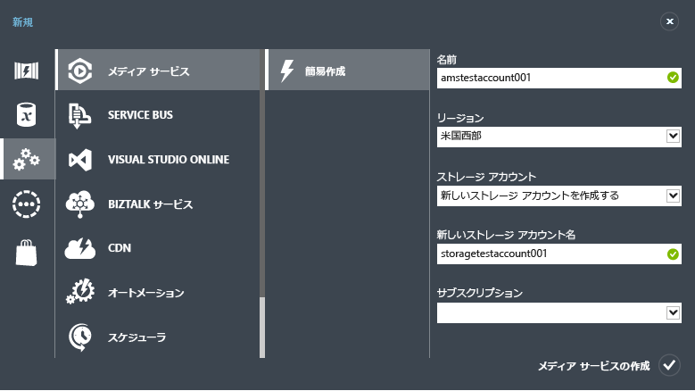

<properties
	pageTitle="Media Services アカウントの作成 | Microsoft Azure"
	description="Azure で新しい Azure Media Services アカウントを作成する方法について説明します。"
	services="media-services"
	documentationCenter=""
	authors="Juliako"
	manager="erikre"
	editor=""/>

<tags
	ms.service="media-services"
	ms.workload="media"
	ms.tgt_pltfrm="na"
	ms.devlang="na"
	ms.topic="get-started-article"
	ms.date="09/26/2016"
	ms.author="juliako"/>

# Azure Media Services アカウントの作成

> [AZURE.SELECTOR]
- [ポータル](media-services-create-account.md)
- [PowerShell](media-services-manage-with-powershell.md)
- [REST ()](http://msdn.microsoft.com/library/azure/dn194267.aspx)

> [AZURE.NOTE] このチュートリアルを完了するには、Azure アカウントが必要です。詳細については、[Azure の無料試用版サイト](/pricing/free-trial/?WT.mc_id=A261C142F)を参照してください。
 
Azure クラシック ポータルには、Azure Media Services アカウントをすばやく作成する方法が用意されています。アカウントを使用して Media Services にアクセスすると、Azure でメディア コンテンツを保存、暗号化、エンコード、管理、およびストリーミングすることができます。Media Services アカウントを作成するときは、同時に Media Services アカウントと同じリージョンにストレージ アカウントも作成して関連付けます (または既存のストレージ アカウントを使用します)。

この記事では、簡易作成の方法を使って新しい Media Services アカウントを作成し、それをストレージ アカウントに関連付ける方法について説明します。

## 概念

Media Services にアクセスするには、関連付けられた次の 2 つのアカウントが必要です。

-   **Media Services アカウント**。アカウントを使用して、Azure で利用可能なクラウド ベースの Media Services にアクセスできます。Media Services アカウントには実際のメディア コンテンツは保存されません。代わりに、メディア コンテンツに関するメタデータおよびメディア処理ジョブがアカウントに保存されます。アカウントを作成するときに、利用可能な Media Services リージョンを選択します。選択したリージョンに、アカウントのメタデータ レコードを保存するデータ センターが配置されます。

	利用可能な Media Services (AMS) リージョンには、北ヨーロッパ、西ヨーロッパ、米国西部、米国東部、東南アジア、東アジア、西日本、東日本があります。Media Services は、アフィニティ グループを使用しません。
	
	現在、AMS は、ブラジル南部、インド西部、ブラジル南部およびインド中部のデータ センターでも利用できるようになりました。Azure クラシック ポータルを使用して、[Media Services アカウントを作成](media-services-create-account.md#create-a-media-services-account-using-quick-create)し、さまざまなタスクを実行できるようになりました ([ここ](https://azure.microsoft.com/documentation/services/media-services/)を参照)。ただし、これらのデータ センターでは Live Encoding は有効ではありません。また、これらのデータ センターで、すべての種類のエンコード予約ユニットを使用できるわけではありません。
	
	- ブラジル南部: Standard および Basic エンコード予約ユニットのみ使用可能
	- インド西部、インド南部およびインド中部: Basic エンコード予約ユニットのみ使用可能

-   **関連付けられたストレージ アカウント**。ストレージ アカウントは、Media Services アカウントに関連付けられた Azure ストレージ アカウントです。ストレージ アカウントにはメディア ファイルの BLOB ストレージが用意されます。また、Media Services アカウントと同じリージョンに配置する必要があります。Media Services アカウントを作成するときに、同じリージョンにある既存のストレージ アカウントを選択することも、同じリージョンに新しいストレージ アカウントを作成することもできます。メディア サービス アカウントを削除しても、関連付けられたストレージ アカウントにある BLOB は削除されません。

## 簡易作成による Media Services アカウントの作成

1. [Azure クラシック ポータル][]で、**[新規]**、**[メディア サービス]**、**[簡易作成]** の順にクリックします。

2. **[名前]** ボックスに新しいアカウントの名前を入力します。Media Services アカウント名に使用できる文字は、小文字または数字のみで、空白を含めることはできません。長さは 3 ～ 24 文字です。

3. **[リージョン]** ボックスで、Media Services アカウントのメタデータ レコードを保存するリージョンを選択します。ドロップダウン リストには利用可能な Media Services リージョンのみが表示されます。

4. **[ストレージ アカウント]** ボックスで、Media Services アカウントのメディア コンテンツの BLOB ストレージとなるストレージ アカウントを選択します。Media Services アカウントと同じリージョンにある既存のストレージ アカウントを選択することも、新しいストレージ アカウントを作成することもできます。新しいストレージ アカウントは同じリージョンに作成されます。

5. 新しいストレージ アカウントを作成した場合は、**[新しいストレージ アカウント名]** ボックスにストレージ アカウントの名前を入力します。ストレージ アカウントの命名規則は、Media Services アカウントと同じです。

6. フォームの下部にある **[簡易作成]** をクリックします。

処理の状態はウィンドウの下部にあるメッセージ領域で監視できます。

アカウントの作成に成功すると、ステータスが [アクティブ] に変化します。**[メディア サービス]** ページが開き、新しいアカウントが表示されます。

ページ下部に **[キーの管理]** ボタンが表示されます。このボタンをクリックすると、Media Services アカウント名、プライマリ キー、セカンダリ キーがページに表示されます。Media Services アカウントにプログラムからアクセスするには、アカウント名とプライマリ キーの情報が必要です。

![[Media Services] ページ](./media/media-services-create-account/wams-mediaservices-page.png)

アカウント名をダブルクリックすると、既定で **[クイック スタート]** ページが表示されます。このページでは、ポータルの別のページでも実行できる管理タスクをいくつか実行できます。たとえば、ビデオ ファイルのアップロードは、このページから実行することも、**[コンテンツ]** ページから実行することもできます。

さらに、Azure Media Services SDK を使用して、ビデオのアップロード、エンコード、および発行を実行するコードを表示することもできます。**[コードを記述]** にあるリンクをクリックして、コードをコピーし、それをアプリケーションで使用できます。

##Media Services のラーニング パス

[AZURE.INCLUDE [media-services-learning-paths-include](../../includes/media-services-learning-paths-include.md)]

##フィードバックの提供

[AZURE.INCLUDE [media-services-user-voice-include](../../includes/media-services-user-voice-include.md)]

## 次のステップ

- [.NET SDK を使用してビデオ オン デマンド (VoD) を配信する](media-services-dotnet-get-started.md)

- [.NET SDK を使用して、シングル ビットレートからマルチ ビットレート ストリーミングへのライブ エンコーディングを実行するチャネルを作成する](media-services-dotnet-creating-live-encoder-enabled-channel.md)

<!-- Reusable paths. -->

<!-- Anchors. -->
  [Concepts]: #concepts
  [Before you begin]: #begin
  [How to: Create a Media Services account using Quick Create]: #quick

<!-- URLs. -->
  [Web Platform Installer]: http://go.microsoft.com/fwlink/?linkid=255386

  [Azure クラシック ポータル]: http://manage.windowsazure.com/

<!---HONumber=AcomDC_0928_2016-->