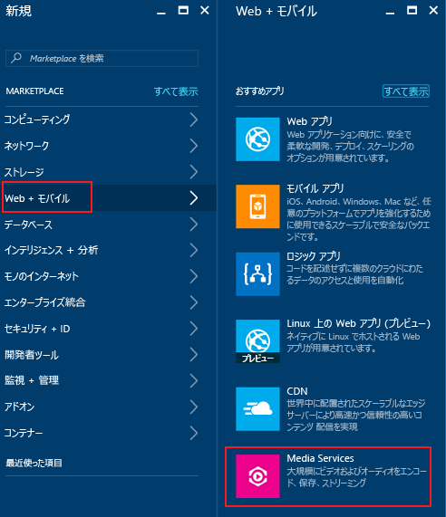
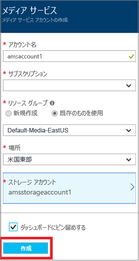
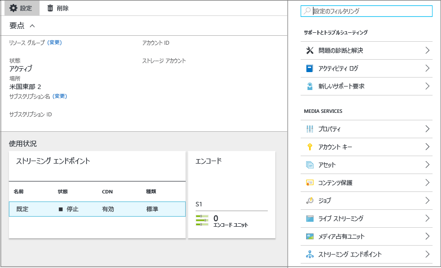
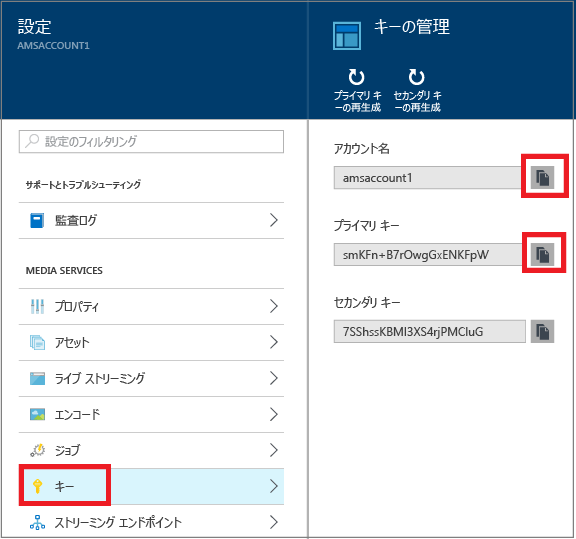

# Azure Portal を使用した Azure Media Services アカウントの作成
> [!div class="op_single_selector"]
> * [ポータル](media-services-portal-create-account.md)
> * [PowerShell](media-services-manage-with-powershell.md)
> * [REST ()](https://docs.microsoft.com/rest/api/media/mediaservice)
> 
> [!NOTE]
> このチュートリアルを完了するには、Azure アカウントが必要です。 詳細については、 [Azure の無料試用版サイト](https://azure.microsoft.com/pricing/free-trial/)を参照してください。 
> 
> 

Azure Portal には、Azure Media Services (AMS) アカウントをすばやく作成する方法が用意されています。 アカウントを使用して Media Services にアクセスすると、Azure でメディア コンテンツを保存、暗号化、エンコード、管理、およびストリーミングすることができます。 Media Services アカウントを作成するときは、同時に Media Services アカウントと同じリージョンにストレージ アカウントも作成して関連付けます (または既存のストレージ アカウントを使用します)。

この記事では、いくつかの一般的な概念について説明し、Azure Portal で Media Services アカウントを作成する方法を示します。

## 概念
Media Services にアクセスするには、関連付けられた次の&2; つのアカウントが必要です。

* Media Services アカウント。 アカウントを使用して、Azure で利用可能なクラウド ベースの Media Services にアクセスできます。 Media Services アカウントには実際のメディア コンテンツは保存されません。 代わりに、メディア コンテンツに関するメタデータおよびメディア処理ジョブがアカウントに保存されます。 アカウントを作成するときに、利用可能な Media Services リージョンを選択します。 選択したリージョンに、アカウントのメタデータ レコードを保存するデータ センターが配置されます。
  
    利用可能な Media Services (AMS) リージョンには、北ヨーロッパ、西ヨーロッパ、米国西部、米国東部、東南アジア、東アジア、西日本、東日本があります。 Media Services は、アフィニティ グループを使用しません。
  
    AMS は、現在、ブラジル南部、インド西部、インド南部、およびインド中部のデータ センターでも利用可能です。 Azure Portal を使用して Media Services アカウントを作成し、ここで示すさまざまなタスクを実行できるようになりました。 ただし、これらのデータ センターでは Live Encoding は有効ではありません。 また、これらのデータ センターで、すべての種類のエンコード予約ユニットを使用できるわけではありません。
  
  * ブラジル南部: Standard および Basic エンコード予約ユニットのみ使用可能です。
  * インド西部、インド南部: 
* Azure ストレージ アカウント。 ストレージ アカウントは、Media Services アカウントと同じリージョンに配置する必要があります。 Media Services アカウントを作成するときに、同じリージョンにある既存のストレージ アカウントを選択することも、同じリージョンに新しいストレージ アカウントを作成することもできます。 メディア サービス アカウントを削除しても、関連付けられたストレージ アカウントにある BLOB は削除されません。

## AMS アカウントの作成
このセクションでは、AMS アカウントを作成する方法について説明します。

1. [Azure ポータル](https://portal.azure.com/)にログインします。
2. **[+新規]** > **[Web + モバイル]** > **[Media Services]** の順にクリックします。
   
    
3. **[CREATE MEDIA SERVICES ACCOUNT (Media Services アカウントの作成)]** に必要な値を入力します。
   
    
   
   1. **[アカウント名]** に新しい AMS アカウントの名前を入力します。 Media Services アカウント名に使用できる文字は、小文字または数字のみで、空白を含めることはできません。長さは 3 文字から 24 文字です。
   2. [サブスクリプション] ボックスで、アクセス権のある別の Azure サブスクリプションを選択します。
   3. **[リソース グループ]**ボックスで、新規または既存のリソースを選択します。  リソース グループとは、ライフサイクル、アクセス許可、ポリシーを共有するリソースの集まりです。 [こちら](../azure-resource-manager/resource-group-overview.md#resource-groups)を参照してください。
   4. **[場所]** ボックスで、この Media Services アカウントのメディアとメタデータのレコードを保存するリージョンを選択します。 このリージョンでメディアの処理とストリーミングが行われます。 ドロップダウン リストのボックスには、利用可能な Media Services リージョンのみが表示されます。 
   5. **[ストレージ アカウント]**ボックスで、Media Services アカウントのメディア コンテンツの BLOB ストレージとなるストレージ アカウントを選択します。 Media Services アカウントと同じリージョンにある既存のストレージ アカウントを選択することも、ストレージ アカウントを作成することもできます。 新しいストレージ アカウントは同じリージョンに作成されます。 ストレージ アカウントの命名規則は、Media Services アカウントと同じです。
      
       ストレージの詳細については、 [こちら](../storage/storage-introduction.md)を参照してください。
   6. **[ダッシュボードにピン留めする]** チェック ボックスをオンにして、アカウントのデプロイの進行状況を確認します。
4. フォームの下部にある **[作成]** をクリックします。
   
    アカウントが正常に作成されると、概要ページが読み込まれます。 ストリーミング エンドポイントのテーブルで、アカウントには既定のストリーミング エンドポイントが**停止**状態で示されます。 

    >[!NOTE]
    >AMS アカウントの作成時に、**既定**のストリーミング エンドポイントが自分のアカウントに追加され、**停止**状態になっています。 コンテンツのストリーミングを開始し、ダイナミック パッケージと動的暗号化を活用するには、コンテンツのストリーミング元のストリーミング エンドポイントが**実行中**状態である必要があります。 
   
    
   
    AMS アカウントを管理するには (ビデオのアップロード、資産のエンコード、ジョブの進行の監視など)、 **[設定]** ウィンドウを使用します。

## Manage Keys
Media Services アカウントにプログラムからアクセスするには、アカウント名とプライマリ キーの情報が必要です。

1. Azure ポータルで、自分のアカウントを選択します。 
   
    **[設定]** ウィンドウが右側に表示されます。 
2. **[設定]** ウィンドウで、**[キー]** を選択します。 
   
    **[キーの管理]** ウィンドウに、アカウント名、プライマリ キー、セカンダリ キーが表示されます。 
3. コピー ボタンをクリックして値をコピーします。
   
    

## 次のステップ
これで、ファイルを AMS アカウントにアップロードできるようになりました。 詳細については、 [ファイルのアップロード](media-services-portal-upload-files.md)に関するページを参照してください。

## Media Services のラーニング パス
[!INCLUDE [media-services-learning-paths-include](../../includes/media-services-learning-paths-include.md)]

## フィードバックの提供
[!INCLUDE [media-services-user-voice-include](../../includes/media-services-user-voice-include.md)]

